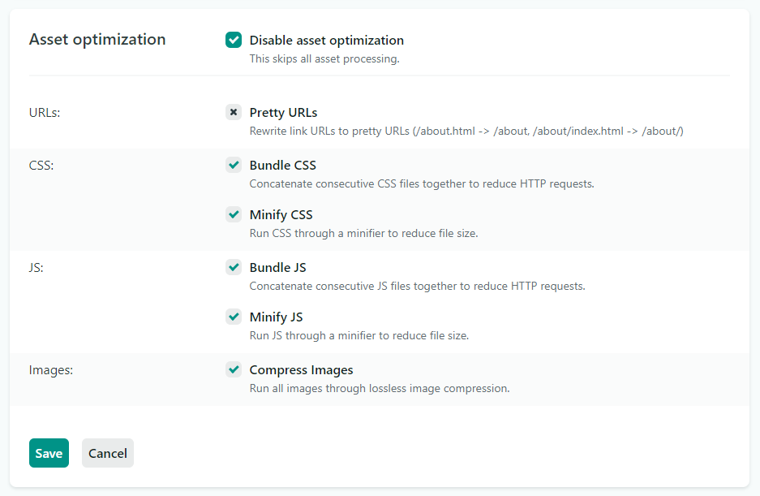

## Introduction

This guide will show you how to remove the trailing slash on sites built with Gatsby Cloud and deployed to Netlify.

### Remove trailing slash

In some cases, sites deployed to Netlify will automatically perform `301` redirects from paths without a trailing slash to paths with a trailing slash, e.g.:

`https://<example-gatsby-site>.netlify.app/page-2` to
`https://<example-gatsby-site>.netlify.app/page-2/`.

To prevent this redirect, you will need to update your Asset Optimization settings in Netlify to the following settings:

- Check **Disable asset optimization**.
- Disable Pretty URLs.
- Enable the remainder of the options.

