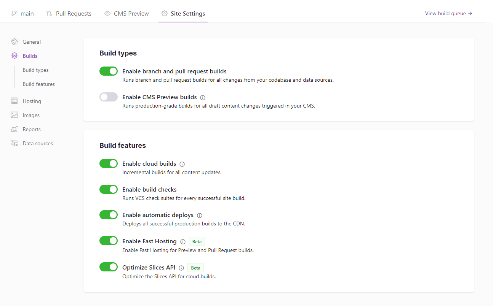

[Incremental Builds](/blog/2020-04-22-announcing-incremental-builds/) helps build your site faster. The [Slice API](/docs/reference/built-in-components/gatsby-slice) pushes your build speeds even further for common UI components. Learn how to use the Slice API in our [How-to doc](/docs/how-to/performance/using-slices).

## Cloud Optimizations

When using Slices, Gatsby Cloud can optimize your builds even further. You can take advantage of these optimzations by enabling the checkbox in your Build Features settings.

By knowing which pieces of your site to build and host, Gatsby Cloud can increase build times on Slice changes by up to 90%.

These optimizations for Slices requires [Unified Hosting](/docs/how-to/cloud/unified-hosting).
