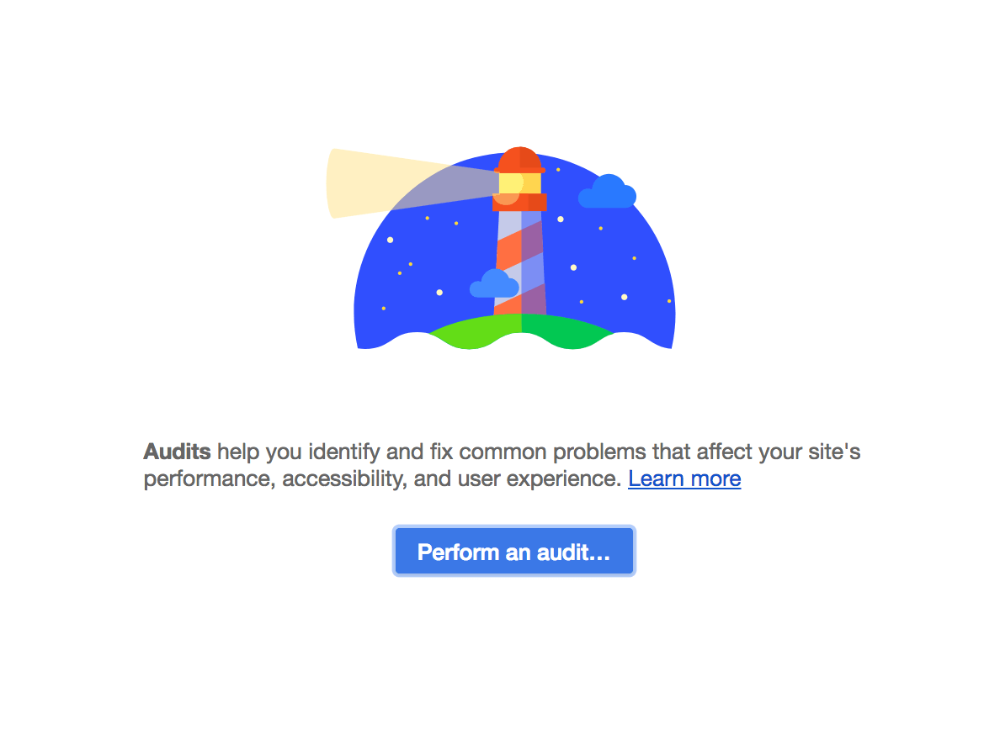
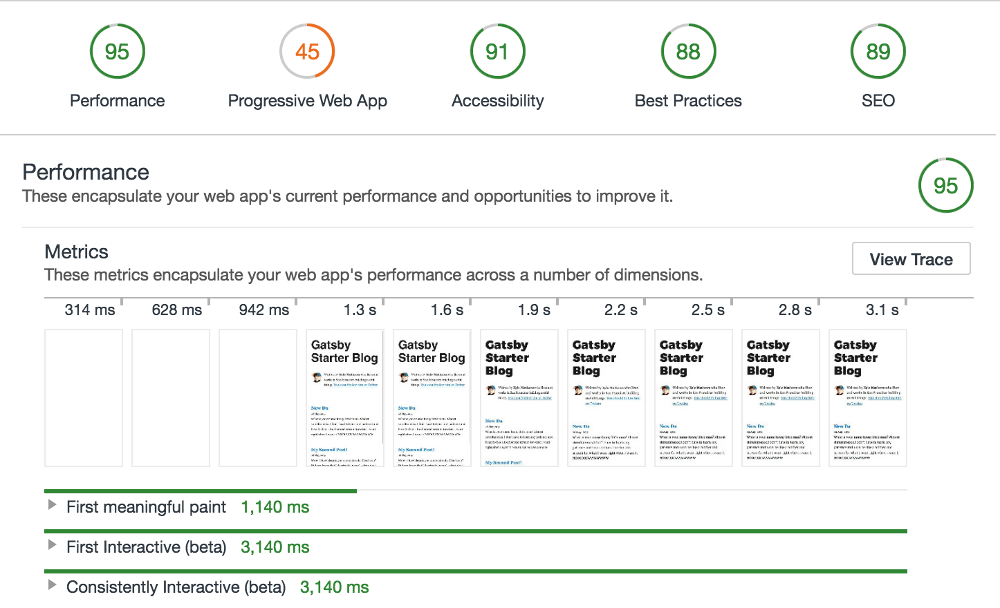
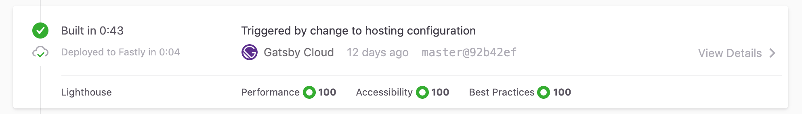

Quoting from the [Lighthouse website](https://developers.google.com/web/tools/lighthouse/):

> Lighthouse is an open-source, automated tool for improving the quality of web pages. You can run it against any web page, public or requiring authentication. It has audits for performance, accessibility, progressive web apps (PWAs), and more.

Lighthouse is included in Chrome DevTools. Running its audit -- and then addressing the errors it finds and implementing the improvements it suggests -- is a great way to prepare your site to go live. It helps give you confidence that your site is as fast and accessible as possible.

If you haven't yet, you need to create a production build of your Gatsby site. The Gatsby development server is optimized for making development fast, but the site that it generates, while closely resembling a production version of the site, isn't as optimized.

## Create a production build

1. Stop the development server (if it's still running) and run:

```shell
gatsby build
```

> 💡 This does a production build of your site and outputs the built static files into the `public` directory.

2. View the production site locally. Run:

```shell
gatsby serve
```

Once this starts, you can now view your site at `http://localhost:9000`.

## Run a Lighthouse audit

Now run your first Lighthouse test.

1. Open the site in Chrome (if you didn't already do so) and then open up the Chrome DevTools. (Lighthouse is also available for Firefox from [Firefox Add-ons](https://addons.mozilla.org/en-GB/firefox/addon/google-lighthouse/). )

2. Click on the "Audits" tab, this may be a "Lighthouse" tab depending on which version you are using. You should see a screen that looks like:



3. Choose whether to audit on Mobile or Desktop and then click "Generate Report". You will also see a list of all available audits that you can choose to run for this report. Once the audit starts it'll take around a minute depending on the site speed and which audits were selected. When that is complete, you should see results that look like this:



## Using Gatsby Cloud

If you use [Gatsby Cloud](https://www.gatsbyjs.com/cloud), a Lighthouse audit runs automatically every time your site builds. In Cloud, every code commit to GitHub triggers a build, allowing you to see any shifts in your scores and what code changes caused them.



## Next steps

As you can see, Gatsby's performance is excellent out of the box but we're missing some things for PWA, Accessibility, Best Practices, and SEO that will improve your scores (and in the process make your site much more friendly to visitors and search engines).

To improve your scores further, see the links below:

- [Add a manifest file](/docs/how-to/performance/add-a-manifest-file/)
- [Add offline support](/docs/how-to/performance/add-offline-support-with-a-service-worker/)
- [Add page metadata](/docs/add-page-metadata/)
