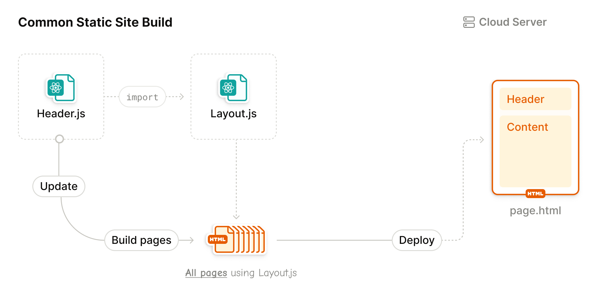
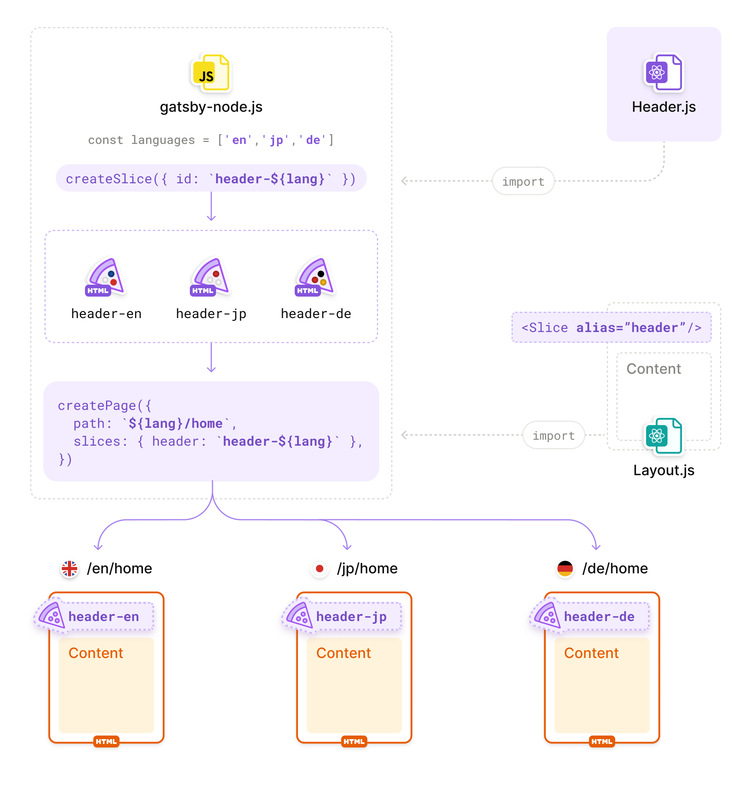

> Support for the Gatsby Slice API was added in `gatsby@5.0.0`.

To further the improvements seen by [Incremental Builds](/blog/2020-04-22-announcing-incremental-builds/), Gatsby includes the [Slice API](/docs/reference/built-in-components/gatsby-slice) that allows you to split pages into individual parts.

By using the `<Slice>` React component in combination with the [`createSlice`](/docs/reference/config-files/actions/#createSlice) API for common UI features, Gatsby will be able to build and deploy individual pieces of your site that had content changes, not just entire pages. In today's frameworks, when you re-order the header content, the entire site needs to be rebuilt. However, if the header was created as a Slice component, the new header content only need to be built once and all pages will pull the new header when it's needed.

The `<Slice>` React component is also referred to as "Slice placeholder". The React component you pass to `createSlice` via its `component` key is also referred to as "Slice component".

## Faster builds in Gatsby Cloud

With the introduction of Incremental Builds, Gatsby Cloud has been able to reduce build times signficantly by only building the pages that changed. With Slices, we've seen improvements in build time by up to 20%. With [Gatsby Cloud Enterprise](/pricing), however, your Slice component changes can build up to 90% faster. By knowing the intricate details of your site and the Slices within it, Gatsby Cloud can build and deploy the exact pieces needed to get your site updated with the latest content.

## Using Slices in your site

For this example, let's use the same scenario as described above - a large site that has a shared header. You'll use this component as your Slice component.

```javascript:title=src/layouts/default-layout.jsx
import { Header, Footer } from "../components"

export const DefaultLayout = ({ children, headerClassName }) => {
  return (
    <div>
      <Header className={headerClassName} />
      {content}
      <Footer />
    </div>
  )
}
```

When a `Header` change is issued, this what a build looks like:



### Using the Slice component in `gatsby-node`

You can create a Slice by using the [`createSlice`](/docs/reference/config-files/actions/#createSlice) action from the [`createPages`](/docs/reference/config-files/gatsby-node/#createPages) API in your `gatsby-node`. Pass the previously created Slice component via the `component` key and give the Slice component a unique `id`.

```javascript:title=gatsby-node.js
exports.createPages = async ({ actions }) => {
  actions.createSlice({
    id: `header`,
    component: require.resolve(`./src/components/header.js`),
  })
}
```

Now that you have a `header` Slice component created, let's go use it!

### Using the Slice placeholder

Now you need to convert the `DefaultLayout` component to actually use the new Slice component you created. By importing the `<Slice />` React component from `gatsby` and placing the Slice placeholder inside `<DefaultLayout />`, you can use the previously created `Header` Slice component.

```diff
+import { Slice } from "gatsby"
-import { Header, Footer } from "../components"
+import { Footer } from "../components"

export const DefaultLayout = ({ children, headerClassName }) => {
  return (
    <div className={styles.defaultLayout} />
-     <Header className={headerClassName} />
+     <Slice alias="header" className={headerClassName} />
      {content}
      <Footer />
    </div>
  )
}
```

After a successful `gatsby build`, you should see a list of `Slices` that were built for your site. We've created a Slice!

Now, when a `Header` change is issued, this what a build looks like:


### Using `sliceContext`

Similar to the context that can be passed to pages in [`createPages`](/docs/reference/config-files/gatsby-node/#createPages), [`createSlice`](/docs/reference/config-files/actions/#createSlice) can also pass context to individual slice components.

```javascript:title=gatsby-node.js
exports.createPages = async ({ actions }) => {
  actions.createSlice({
    id: `header`,
    context: {
      jokeOfTheDay: `What's blue and not heavy? Light blue.`,
    },
    component: require.resolve(`./src/components/header.js`),
  })
}
```

The data passed to `context` here will be handed down to the `Header` Slice component with the key `sliceContext`.

```javascript:title=src/components/header.jsx
// highlight-next-line
const Header = ({ className, sliceContext }) => {
  return (
    <div className={className}>
      <Link to="/">Home</Link>
      // highlight-next-line
      <Link to="/jokes">{sliceContext.jokeOfTheDay}</Link>
    </div>
  )
}

export default Header
```

### Querying Data

Data can be queried the same way you can run queries within pages. These are called "slice queries" (as opposed to [page queries](/docs/how-to/querying-data/page-query)).

In this example, let's say you want to pull all header items from your CMS.

```js:title=src/components/header.jsx
const Header = ({ data }) => {
  return (
    <div>
      {data.allHeaderItems.nodes.map(headerItem = (
        // highlight-next-line
        <Link to={headerItem.path}>{headerItem.text}</Link>
      ))}
    </div>
  )
}

export default Header

export const query = graphql`
  query {
    allHeaderItems {
      nodes {
        path
        text
      }
    }
  }
`
```

When Gatsby builds, this query will be ran and passed to `Header` within the `data` prop, just like [page queries](/docs/how-to/querying-data/page-query).

Slice queries can also accept parameters from the `context` passed to `createSlice`.

```js:title=src/components/header.jsx
export const query = graphql`
  // highlight-next-line
  query ($title: String) {
    // highlight-next-line
    myField(title: {eq: $title}) {
      id
      title
    }
  }
`
```

### Using Aliases

There will be times where a single Slice will either need to be handed different context or swapped entirely depending on which page it's being rendered on.

This is where you can utilize the `alias` prop that is given to the `<Slice>` placeholder. When you converted the `<Header>` component to a Slice component, you created the Slice component with an `id` of `header`, but passed that value to the `alias` prop of the `<Slice>` placeholder. Why is there a difference in key names?

An `alias` is not a 1-to-1 mapping of string-to-slice. When you create a page using [`createPages`](/docs/reference/config-files/gatsby-node/#createPages), you can pass a key-value map of alias-to-id to tell Gatsby which Slice component to use throughout the page.

One common use case for this is localization. It's common to iterate over languages to create a page for each one. You can create a Slice for each language by passing `context`. The `id` that a Slice component is created with will be passed to [`createPage`](/docs/reference/config-files/actions/#createPage) to tell each page which Slice component to use.

In this example, you create a Slice component of `<Header>` for each supported language. When you create each page, Gatsby will tell the page which `header` to use based on the language of the page Gatsby is creating.

```javascript:title=gatsby-node.js
const SUPPORTED_LANGUAGES = ['en', 'jp', 'de']

exports.createPages = async ({ actions }) => {
  // create a slice with a unique ID for each language
  SUPPORTED_LANGUAGES.forEach(language => {
    actions.createSlice({
      // highlight-next-line
      id: `header-${language}`,
      context: { language },
      component: require.resolve(`./src/components/header.js`),
    })
  })

  // Query for all pages
  const pagesResult = await graphql('...')

  // Create a page for each page node + language
  pagesResult.data.edges.forEach(({ node }) => {
    SUPPORTED_LANGUAGES.forEach(language => {
      createPage({
        path: node.path,
        // a page component that utilizes DefaultLayout
        component: require.resolve(`./src/templates/page.js`),
        context: {
          pagePath: node.path,
          language,
        },
        slices: {
          // Any time `<Slice alias="header">` is seen on this page,
          // use the `header-${language}` id
          // highlight-next-line
          'header': `header-${language}`
        }
      })
    })
  })
}
```

To better visualize how aliases are working in this case, check out this diagram:



## Testing Slices

As explained in the [Unit Testing guide](/docs/how-to/testing/unit-testing/#mocking-gatsby) you'll want to mock the `gatsby` module, including the Slice placeholder. With this configuration the Slice placeholder will be replaced with a `<div>` that has the `alias` mapped to the custom data attribute called `data-test-slice-alias`.

## Additional Resources

- [Gatsby Slice API Reference](/docs/reference/built-in-components/gatsby-slice/)
- [Using Gatsby Slice API with TypeScript](/docs/how-to/custom-configuration/typescript/#gatsby-slice-api)
- [Enable Slices API Optimizations](/docs/how-to/cloud/slices-optimization/)
