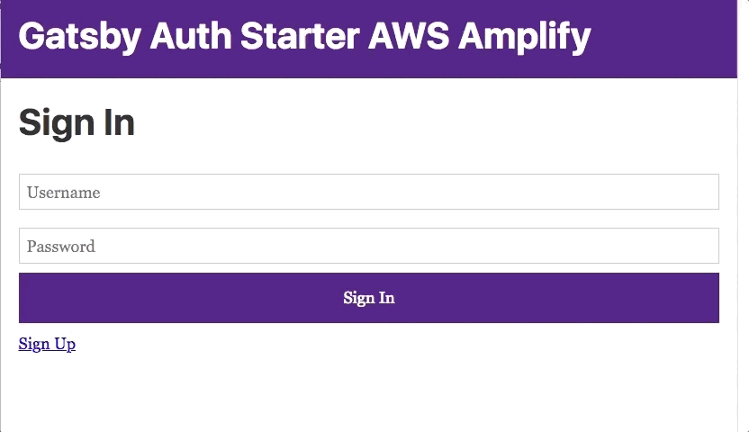
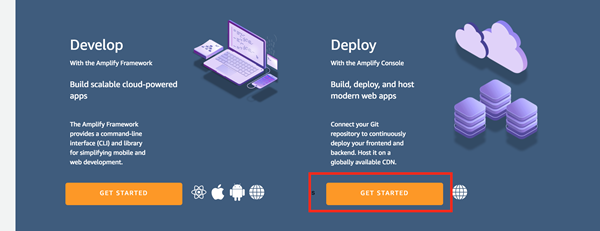
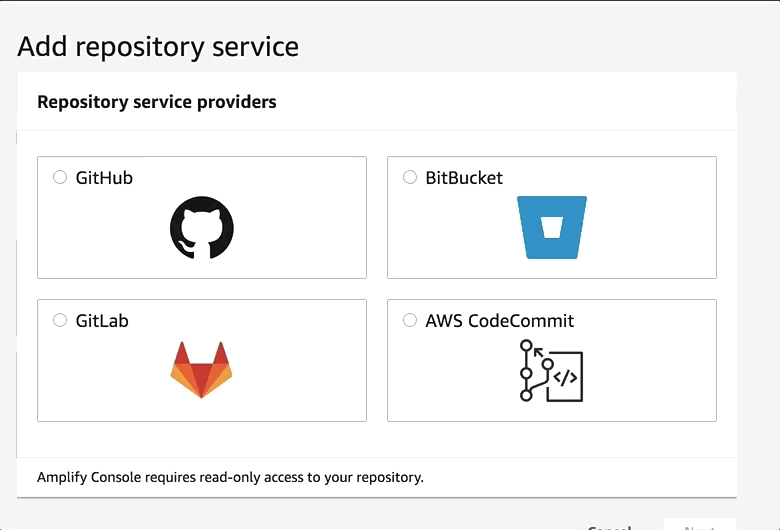

In this guide you'll walk through how to deploy and host your Gatsby site using the [AWS Amplify Console](https://console.amplify.aws).

AWS Amplify is a combination of client library, CLI toolchain, and a Console for continuous deployment and hosting. The Amplify CLI and library allow developers to get up & running with full-stack cloud-powered applications with features like authentication, storage, serverless GraphQL or REST APIs, analytics, Lambda functions, & more. The Amplify Console provides continuous deployment and hosting for modern web apps (single page apps and static site generators). Continuous deployment allows developers to deploy updates to their web app on every code commit to their Git repository. Hosting includes features such as globally available CDNs, easy custom domain setup + HTTPS, feature branch deployments, and password protection.

## Pre-requisites

1. [Sign up for an AWS Account](https://portal.aws.amazon.com/billing/signup?redirect_url=https%3A%2F%2Faws.amazon.com%2Fregistration-confirmation). There are no upfront charges or any term commitments to create an AWS account and signing up gives you immediate access to the AWS Free Tier

2. This guide assumes that you have set up a Gatsby project. If you need to set up a project, start with the [Gatsby Auth starter with AWS Amplify](https://github.com/dabit3/gatsby-auth-starter-aws-amplify) then come back. The starter implements a basic authentication flow for signing up signing in users as well as protected client side routing.

## Deployment

1. Log in to the [AWS Amplify Console](https://console.aws.amazon.com/amplify/home) and choose Get Started under Deploy.
   

2. Connect a branch from your GitHub, Bitbucket, GitLab, or AWS CodeCommit repository. Connecting your repository allows Amplify to deploy updates on every code commit to a branch.
   

3. Accept the default build settings. Give the Amplify Console permission to deploy backend resources with your frontend with a service role. This allows the Console to detect changes to both your backend and frontend on every code commit and make updates. If you do not have a service role follow the prompts to create one, then come back to the console and pick it from the dropdown.
   

4. Review your changes and then choose **Save and deploy**. The Amplify Console will pull code from your repository, build changes to the backend and frontend, and deploy your build artifacts at `https://master.unique-id.amplifyapp.com`. Bonus: Screenshots of your app on different devices to find layout issues 🔥
   

## References:

- [Publishing Your Next Gatsby Site to AWS With AWS Amplify](/blog/2018-08-24-gatsby-aws-hosting/)
- If you want more control over hosting on AWS you can also [deploy your Gatsby.js Site to AWS S3](/docs/how-to/previews-deploys-hosting/deploying-to-s3-cloudfront/).

### More resources

Jason Lengstorf and Nader Dabit livestream building a site & deploying with AWS Amplify:

https://youtu.be/i9HG8CV-_dQ
