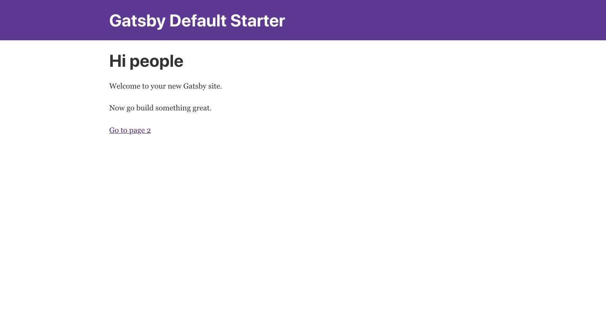

This guide walks through how to deploy and host your next Gatsby site on [Netlify](https://www.netlify.com/).

Netlify is an excellent option for deploying Gatsby sites. Netlify is a unified
platform that automates your code to create performant, easily maintainable
sites and web apps. They provide continuous deployment (Git-triggered builds);
an intelligent, global CDN; full DNS (including custom domains); automated
HTTPS; asset acceleration; and a lot more.

Their free tier includes unlimited personal and commercial projects, HTTPS,
continuous deployment from public or private repos, and more.

## Hosting setup

There are two ways you can host your site:

1.) [Git repository setup](#git-repository-setup)

2.) [Upload site folder](#upload-site-folder)

### Git repository setup

Netlify currently has built in support for [GitHub](https://github.com/), [GitLab](https://about.gitlab.com/) and [Bitbucket](https://bitbucket.org/). This approach allows you to roll back to past versions of the website whenever you want. You also gain the ability to redeploy the site by pushing the code to the respective repository, with no need to manually rebuild and upload every time you make changes. Your repository can be private or public.

Now, login to Netlify and you will see a `New site from git` button at the top right corner of the screen. Click on it and connect with the same git provider that you used to host your website and authorize Netlify to use your account. Choose your website repository and it will take you to deploy settings with the below options.

- Branch to deploy: You can specify a branch to monitor. When you push to that particular branch, only then will Netlify build and deploy the site. The default is `master`.
- Build Command: You can specify the command you want Netlify to run when you push to the above branch. The default is `npm run build`.
- Publish directory: You can specify which folder Netlify should use to host the website, e.g., public, dist, build. The default is `public`.
- Advanced build settings: If the site needs environment variables to build, you can specify them by clicking on `Show advanced` and then the `New Variable` button.

Click on the `Deploy site` button and Netlify will start the build and deploy process you have specified. You can go to the `Deploys` tab and see the process unfold in the `Deploy log`. After a few moments, it will give you the live site URL, e.g., `random-name.netlify.com`.

#### Continuous deployment

Now that your site is connected to your repository, Netlify will deploy the site and publish it whenever you push to your Git repo. Continuous deployment is only possible when using a Git repository.

### Upload site folder

There is also the option to upload your site to Netlify without using git.

For the [production build](/docs/glossary#build), you will need to run the `gatsby build` command; Gatsby will generate the production site in the `public` folder. During the build process CSS, JavaScript, HTML, and images will be optimized and placed into this folder.

```shell
gatsby build
```

Once the build is complete, you are ready to upload your site to Netlify. Go to [Netlify](https://app.netlify.com/) and login or sign up using any method. After a successful login, you will see the message shown below:

```text
    Want to deploy a new site without connecting to Git?
          Drag and drop your site folder here
```

To start the deploy process, you need only drag and drop the `public` folder over the above area on the Netlify website. Netlify will create a new site with a random name, then start uploading and hosting the application files. After a few moments, it will give you a live site URL e.g. `random-name.netlify.com`.



## Domain setup

From the site `Overview`, you can go to `Domain Settings`. By adding a custom domain and setting the `CNAME` record as the Netlify project URL in your DNS provider settings, you should be able to see the Netlify project at your domain URL.

<CloudCallout>
  For automatic setup of builds that are deployed straight to Netlify:
</CloudCallout>

## Other resources

- [A Step-by-Step Guide: Gatsby on Netlify](https://www.netlify.com/blog/2016/02/24/a-step-by-step-guide-gatsby-on-netlify/)
- More [blog posts on Gatsby + Netlify](/blog/tags/netlify)
- [Gatsby Netlify CMS](/plugins/gatsby-plugin-netlify-cms)
- [Gatsby + Netlify CMS Starter](https://github.com/netlify-templates/gatsby-starter-netlify-cms)
