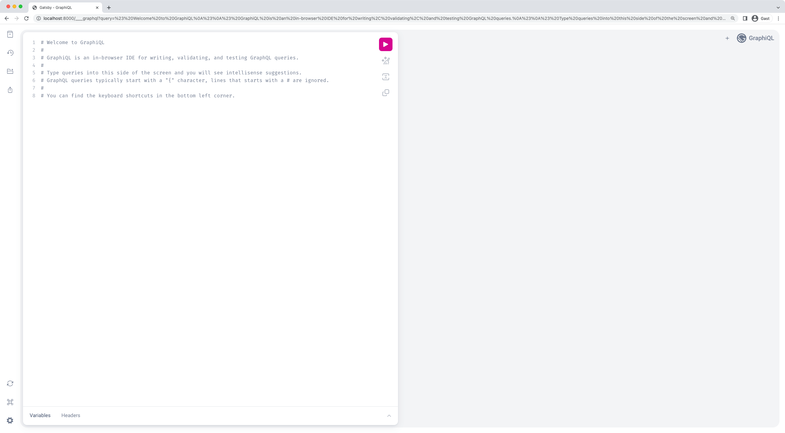
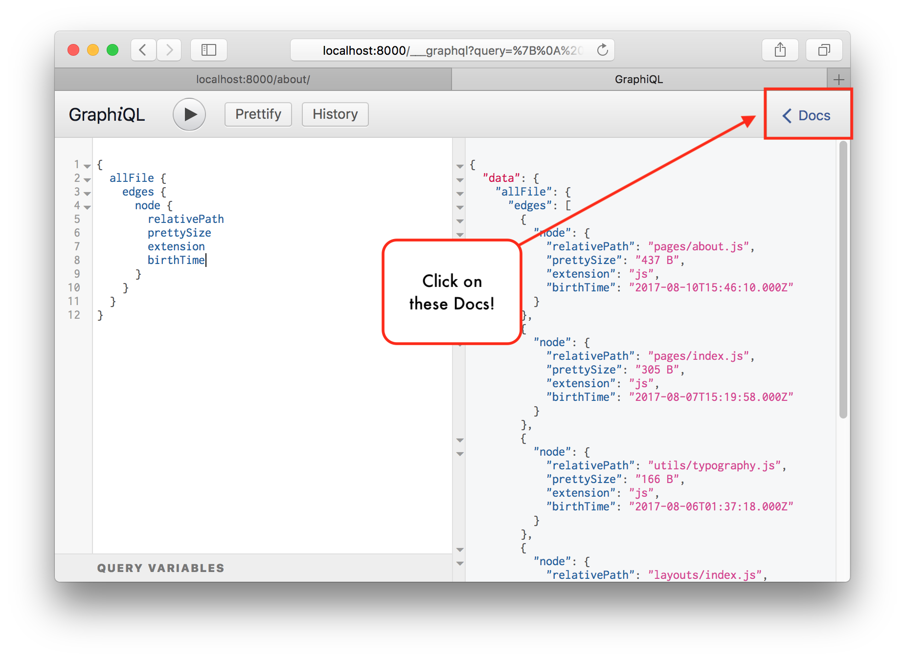

In this guide, you'll be learning to use something called **GraphiQL**, a tool that helps you structure GraphQL queries correctly. You can learn more about it in the [GraphiQL README](https://github.com/graphql/graphiql/tree/main/packages/graphiql).

## What is GraphiQL?

GraphiQL is the GraphQL integrated development environment (IDE). It's a powerful (and all-around awesome) tool you'll use often while building Gatsby websites. It offers syntax highlighting, intellisense autocompletion, automatic documentation, and much more.

Use GraphiQL to interactively build your page and static queries.

## How to use GraphiQL

When the development server is running for one of your Gatsby sites, open GraphiQL at `http://localhost:8000/___graphql` to see the interface:



The UI is divided into three pieces:

- The left sidebar has buttons to open plugin panes and change settings
- The left side is where you write your queries
- The right side is where the results of your queries will be displayed

The left sidebar has a top and bottom section. The top has buttons for the documentation explorer, history, query explorer, and query exporter. The bottom sidebar buttons allow you to refetch the schema, see the keyboard shortcuts, and change settings.

In the middle section, below the welcome comment, begin typing:

```graphql
query {

}
```

Now inside the curly braces press <kbd>Ctrl + Space</kbd> (or use <kbd>Shift + Space</kbd> as an alternate keyboard shortcut) to bring up the autocomplete window. Build out a query like this:

```graphql
query {
  site {
    siteMetadata {
      title
    }
  }
}
```

You can now press the "Execute" button (looks like a "Play" button) or press <kbd>Ctrl + Enter</kbd> to run the GraphQL query.

Make sure to check out the GraphiQL docs in the upper left-hand corner of the IDE. It's easy to miss them, but they're worth visiting!



### Example video of using GraphiQL

In the video below watch a person use GraphiQL to build out a query, both with autocompletation in the query editor and with the GraphQL explorer plugin in the sidebar. The GraphQL exporter plugin is also used to automatically create a static query.

<iframe
  width="560"
  height="315"
  src="https://www.youtube-nocookie.com/embed/kIauoqkdDXQ"
  title="YouTube video player"
  frameborder="0"
  allow="accelerometer; autoplay; clipboard-write; encrypted-media; gyroscope; picture-in-picture"
  allowfullscreen
></iframe>

## Enable Refresh Content Button

The environment variable `ENABLE_GATSBY_REFRESH_ENDPOINT` enables a "Refresh Data" button which allows you to refresh the sourced content. See [Refreshing Content](/docs/refreshing-content/).

## Other resources

- See [Tutorial Part 4: Query for Data with GraphQL](/docs/tutorial/getting-started/part-4/#use-graphiql-to-explore-the-data-layer-and-write-graphql-queries) for a more complete example of using GraphiQL
- See the [README for GraphiQL](https://github.com/graphql/graphiql/tree/main/packages/graphiql)
