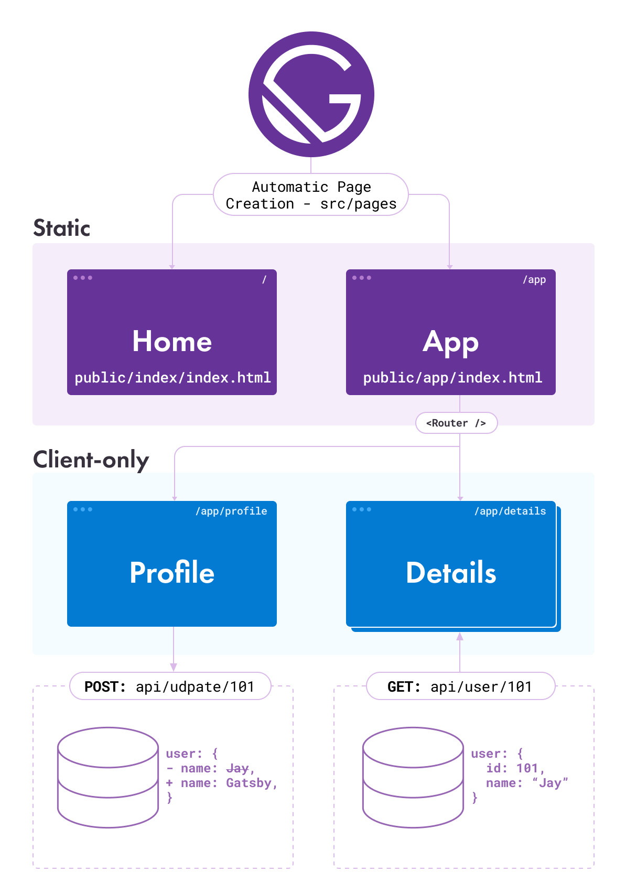

Often you want to create a site with client-only portions, which allows you to gate them by authentication or load different content based on URL parameters.

## Understanding client-only routes

A classic example would be a site that has a landing page, various marketing pages, a login page, and then an app section for logged-in users. The logged-in section doesn't need to be server rendered as all data will be loaded live from your API after the user logs in. So it makes sense to make this portion of your site client-only.

Client-only routes will exist on the client only and will not correspond to `index.html` files in an app's built assets in the `/public` directory. If you'd like site users to be able to visit client routes directly, you need to [set up your site to handle those routes](#handling-client-only-routes-with-gatsby) appropriately. Or, if you have control over the configuration of the file server yourself, you can [set up the server](#configuring-and-handling-client-only-routes-on-a-server) to handle these routes.

A sample site might be set up like this:



Gatsby converts components in the `pages` folder into static HTML files for the Home page and the App page. A `<Router />` is added to the App page so that the profile and details components can be rendered from the App page; they don't have static assets built for them because they exist only on the client. The profile page can `POST` data about a user back to an API, and the details page can dynamically load data about a user with a specific id from an API.

## Handling client-only routes with Gatsby

Gatsby uses [@reach/router](https://reach.tech/router/) under the hood so we'll use it to set up client-only routes within our app.

You first need to set up routes on a page that is built by Gatsby. You can see the routes added to `src/pages/app/[...].js` in the code example below:

```jsx:title=src/pages/app/[...].js
import React from "react"
import { Router } from "@reach/router" // highlight-line
import Layout from "../components/Layout"
import Profile from "../components/Profile"
import Details from "../components/Details"
import Login from "../components/Login"
import Default from "../components/Default"

const App = () => {
  return (
    <Layout>
      // highlight-start
      <Router basepath="/app">
        <Profile path="/profile" />
        <Details path="/details" />
        <Login path="/login" />
        <Default path="/" />
      </Router>
      // highlight-end
    </Layout>
  )
}

export default App
```

Briefly, when a page loads, Reach Router looks at the `path` prop of each component nested under `<Router />`, and chooses _one_ to render that best matches `window.location` (you can learn more about how routing works from the [@reach/router documentation](https://reach.tech/router/api/Router)). In the case of the `/app/profile` path, the `Profile` component will be rendered, as its prefix matches the base path of `/app`, and the remaining part is identical to the child's path.

### Adjusting routes to account for authenticated users

With [authentication set up](/docs/how-to/adding-common-features/building-a-site-with-authentication) on your site, you can create a component like a `<PrivateRoute/>` to extend the example above and gate content:

```jsx:title=src/pages/app/[...].js
import React from "react"
import { Router } from "@reach/router"
import Layout from "../components/Layout"
import Profile from "../components/Profile"
import Details from "../components/Details"
import Login from "../components/Login"
import Default from "../components/Default"
import PrivateRoute from "../components/PrivateRoute" // highlight-line

const App = () => {
  return (
    <Layout>
      <Router basepath="/app">
        // highlight-start
        <PrivateRoute path="/profile" component={Profile} />
        <PrivateRoute path="/details" component={Details} />
        // highlight-end
        <Login path="/login" />
        <Default path="/" />
      </Router>
    </Layout>
  )
}

export default App
```

The `<PrivateRoute />` component would look something like this one (taken from the [Authentication Tutorial](/tutorial/authentication-tutorial/#controlling-private-routes), which implements this behavior):

```jsx:title=src/components/PrivateRoute.js
import React from "react"
import { navigate } from "gatsby"
import { isLoggedIn } from "../services/auth"

const PrivateRoute = ({ component: Component, location, ...rest }) => {
  if (!isLoggedIn() && location.pathname !== `/app/login`) {
    navigate("/app/login")
    return null
  }

  return <Component {...rest} />
}

export default PrivateRoute
```

> Tip: For applications with complex routing, you may want to override Gatsby's default scroll behavior with the [shouldUpdateScroll](/docs/reference/config-files/gatsby-browser/#shouldUpdateScroll) Browser API.

## How to configure your hosting service to handle client-only routes

Site hosting software and services need some help in order to serve client-only routes correctly. Most Gatsby pages have a corresponding html file that the server responds with when a user visits the page e.g. visiting `/blog/my-blog-post/` makes the server respond with `/blog/my-blog-post/index.html`. But client-only routes like `/app/why-gatsby-is-awesome/` don't have a corresponding html file. The server needs to be configured to know to serve `/app/[...]/index.html` instead.

Popular hosting services like Gatsby Cloud, Netlify, and Vercel have plugins that automatically configure hosting to handle client-only routes.

- [Gatsby Cloud](https://www.gatsbyjs.com/plugins/gatsby-plugin-gatsby-cloud/?=cloud)
- [Netlify](https://www.gatsbyjs.com/plugins/gatsby-plugin-netlify/?=netlif)
- Vercel automatically adds its Gatsby plugin.

### Self-hosting with NGINX and Apache

Your server configuration should handle `GET` requests to `/app/*` e.g. `/app/why-gatsby-is-awesome` with `/app/[...]/index.html` and let the client handle the rendering of the route with the matching path. It is important to note that the response code should be a **200** (an OK) and not a **301** (a redirect). This can be done with NGINX using [`try_files`](https://docs.nginx.com/nginx/admin-guide/web-server/serving-static-content/#trying-several-options), or an [equivalent directive](https://serverfault.com/questions/290784/what-is-apaches-equivalent-of-nginxs-try-files) if using Apache.

## Additional resources

- [Gatsby repo "simple auth" example](https://github.com/gatsbyjs/gatsby/blob/master/examples/simple-auth/) - a demo implementing user authentication and restricted client-only routes
- [Live version of the "simple auth" example](https://simple-auth.netlify.app/)
- [The Gatsby store](https://github.com/gatsbyjs/store.gatsbyjs.org) which also implements an authenticated flow
