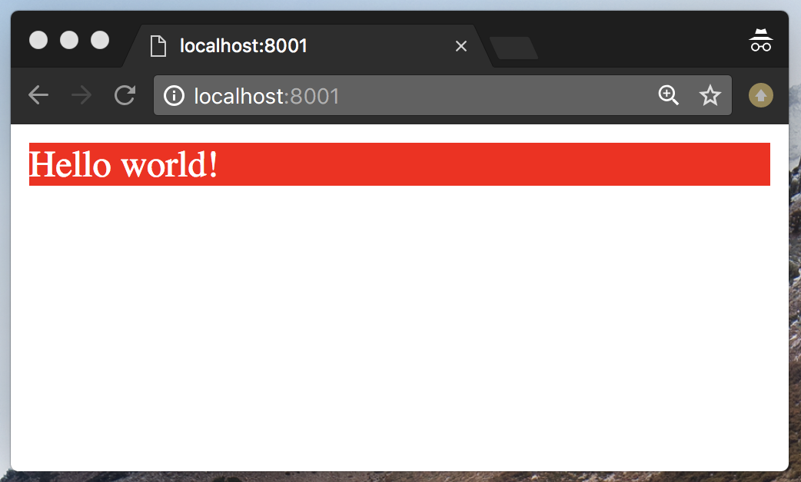
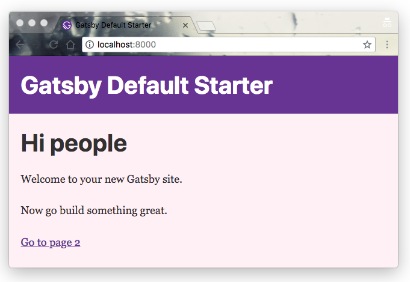

Traditionally, websites are styled using global CSS files.

Globally-scoped CSS rules are declared in external `.css` stylesheets, and [CSS specificity](https://developer.mozilla.org/en-US/docs/Web/CSS/Specificity) and [the Cascade](https://developer.mozilla.org/en-US/docs/Web/CSS/Cascade) determine how styles are applied.

## Adding global styles with a layout component

The best way to add global styles is with a [shared layout component](/docs/tutorial/getting-started/part-2/#create-a-reusable-layout-component). This layout component is used for things that are shared throughout the site, including styles, header components, and other common items.

> **NOTE:** This pattern is implemented by default in [the default starter](https://github.com/gatsbyjs/gatsby-starter-default/blob/063978d59f74103da45d5880a61ebd2e77798e3c/src/components/layout.js#L13).

To create a shared layout with global styles, start by creating a new Gatsby site with the [hello world starter](https://github.com/gatsbyjs/gatsby-starter-hello-world).

```shell
gatsby new global-styles https://github.com/gatsbyjs/gatsby-starter-hello-world
```

Open your new site in your code editor and create a new directory at `/src/components`. Inside, create two new files:

```diff
  global-styles/
  └───src/
      └───components/
+     │   │─  layout.js
+     │   └─  layout.css
      │
      └───pages/
          └─  index.js
```

Inside `src/components/layout.css`, add some global styles:

```css:title=src/components/layout.css
div {
  background: red;
  color: white;
}
```

In `src/components/layout.js`, include the stylesheet and export a layout component:

```jsx:title=src/components/layout.js
import React from "react"
import "./layout.css"

export default function Layout({ children }) {
  return <div>{children}</div>
}
```

Finally, update `src/pages/index.js` to use the new layout component:

```jsx:title=src/pages/index.js
import React from "react"
import Layout from "../components/layout"

export default function Home() {
  return <Layout>Hello world!</Layout>
}
```

Run `npm run develop` and you’ll see the global styles applied.



## Adding global styles without a layout component

In some cases, using a shared layout component is not desirable. In these cases, you can include a global stylesheet using `gatsby-browser.js`.

> **NOTE:** This approach does _not_ work with CSS-in-JS. Use shared components to share styles in CSS-in-JS.

First, open a new terminal window and run the following commands to create a new default Gatsby site and start the development server:

```shell
gatsby new global-style-tutorial https://github.com/gatsbyjs/gatsby-starter-default
cd global-style-tutorial
npm run develop
```

Second, create a CSS file and define any styles you wish. An example:

```css:title=src/styles/global.css
html {
  background-color: peachpuff;
}

a {
  color: rebeccapurple;
}
```

Then, include the stylesheet in your site's `gatsby-browser.js` file.

> **NOTE:** This solution works when including CSS as those styles are extracted when building the JavaScript but not for CSS-in-JS.
> Including styles in a layout component or a global-styles.js is your best bet for that.

```javascript:title=gatsby-browser.js
import "./src/styles/global.css"

// or:
// require('./src/styles/global.css')
```

> _Note: You can use Node.js require or import syntax. Additionally, the placement of the example CSS file in a `src/styles` folder is arbitrary._

You should see your global styles taking effect across your site:



### Importing CSS files into components

It is also possible to break up your CSS styles into separate files so that team members can work independently while still using traditional CSS. You can then [import files directly](/docs/how-to/images-and-media/importing-assets-into-files/) into pages, templates, or components:

```css:title=menu.css
.menu {
  background-color: black;
  color: #fff;
  display: flex;
}
```

```javascript:title=components/menu.js
import "css/menu.css"
```

This approach can simplify integration of CSS or [Sass](/plugins/gatsby-plugin-sass/) styles into your Gatsby site by allowing team members to write and consume more traditional, class-based CSS. However, there are [trade-offs](#limitations) that must be considered with regards to web performance and the lack of dead code elimination.

### Adding classes to components

Since `class` is a reserved word in JavaScript, you'll have to use the `className` prop instead, which will render as the browser-supported `class` attribute in your HTML output.

```jsx
<button className="primary">Click me</button>
```

```css
.primary {
  background: orangered;
}
```

### Limitations

The biggest problem with global CSS files is the risk of name conflicts and side effects like unintended inheritance.

CSS methodologies like BEM can help solve this, but a more modern solution is to write locally-scoped CSS using [CSS Modules](/docs/how-to/styling/css-modules/) or [CSS-in-JS](/docs/how-to/styling/css-in-js/).
