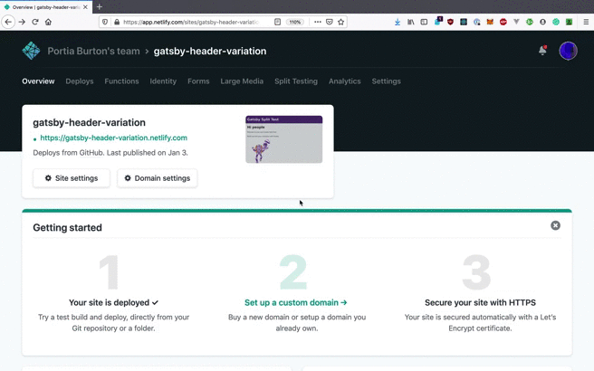
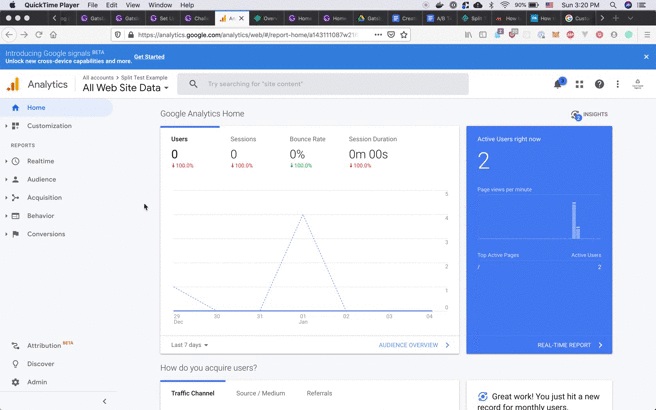
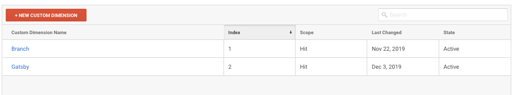
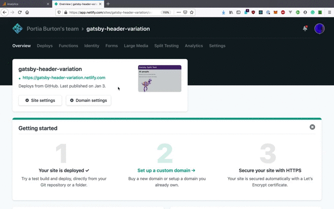
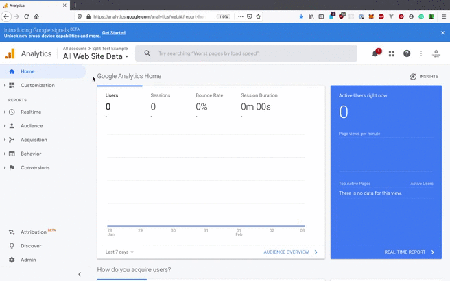

Learn how to create an A/B test (otherwise known as a split test) with Google Analytics and Netlify. Note that Netlify uses the term "split test".

## Creating an A/B test with Netlify

An A/B test compares changes on a web page. If you are creating an A/B test with Netlify, you can [use multiple Git branches containing variations of your site](https://docs.netlify.com/site-deploys/split-testing/#run-a-branch-based-test). If you are not familiar with Git branches, visit the [Git Guide](https://rogerdudler.github.io/git-guide/), which explains Git in detail.

Let’s say you read on Twitter that users spend more time on webpages with blue headers. You have a hunch that this might be correct, but you want some data to verify this claim.

You can use an A/B test to see if changing your header to blue actually increases page engagement.

The following example changes the color of the header for a site using [Gatsby's default starter](https://github.com/gatsbyjs/gatsby-starter-default) to another shade of purple (`#5B3284`).

```javascript:title=src/components/header.js
<header
  style={{
    background: `#5B3284`, // highlight-line
    marginBottom: `1.45rem`,
  }}
>
```

Once you're finished with your first variation, commit your changes to `master`, [create a new remote repository on GitHub](https://help.github.com/en/github/getting-started-with-github/create-a-repo) if you don't have one already, and push your changes.

```shell
git add src/components/header.js
git commit -m "Change header background color"
git remote add origin [your remote repo URL]
git push -u origin master
```

To create your second variation, create a new branch.

```shell
git checkout -b heading-variation
```

After you have made the new branch, go to `header.js` and change the background color to blue.

```javascript:title=src/components/header.js
<header
  style={{
    background: `#1f618d`, // highlight-line
    marginBottom: `1.45rem`,
  }}
>
```

Commit your changes and push your `heading-variation` branch to GitHub.

## Deploying your site with Netlify

When you have created your two variations, it's time to [deploy your site to Netlify](/docs/how-to/previews-deploys-hosting/deploying-to-netlify/)!

After you have deployed your website, set up a [split test on Netlify](https://docs.netlify.com/site-deploys/split-testing/).

When you are setting up your split test on Netlify, navigate to the homepage of your project. Scroll down to 'Active Split Test'. Choose 'Start a Split Test'. On the next page, pick which branches you would like to include in the split test and start the test.



## Creating a Google Analytics custom dimension

Custom dimensions allow you to capture and measure user behavior. You can learn more about custom dimensions from the [Google Analytics official documentation](https://support.google.com/analytics/answer/2709829?hl=en).

Go to [analytics.google.com](https://analytics.google.com). If you have not already done so, sign up for an account.

After you've created an account, you'll need to create a custom dimension. Head over to the bottom left navigation panel and choose "Admin". On the next page, under Admin, you will see three columns: "Account", "Property", and "View". Go to "Property" and select "Custom Dimension". A submenu will appear. Choose "Custom Dimension" again. On the next page, select "+ New Custom Dimension" and create a new custom dimension.



## Injecting your Google Analytics script

After you have set up your custom dimension on Google Analytics, go to your site’s home page on Netlify and navigate to "Site Settings".

Choose "Build & Deploy" and scroll down to "Post Processing". Post Processing is where you are going to add your Google Analytics (GA) script to Netlify. Your GA script is located in the Google Analytics Admin.

When you have pasted the GA Script into Post Processing, be sure to add your custom dimension, and set it to the name of your branch. Let’s say you have two custom dimensions, and you want to use `gatsby`.



```javascript
ga("send", "pageview", {
  dimension2: "{{ BRANCH }}",
})
```

‘{{ BRANCH }}’ is the name of the two branches you deployed. In the example case, this variable references the `master` and `heading-variation` branches.

Notice our variable is `dimension2` and not `Gatsby`. It is important that the variable expresses the index of your custom dimension name and not the actual name itself.

The final result should be similar to the following:

```javascript
<script>
(function(i,s,o,g,r,a,m){i['GoogleAnalyticsObject']=r;i[r]=i[r]||function(){
(i[r].q=i[r].q||[]).push(arguments)},i[r].l=1*new Date();a=s.createElement(o),
m=s.getElementsByTagName(o)[0];a.async=1;a.src=g;m.parentNode.insertBefore(a,m)
})(window,document,'script','https://www.google-analytics.com/analytics.js','ga');

ga('create', 'UA-XXXXXXXXX-X', 'auto');
ga('send', 'pageview', {
   'dimension2': '{{ BRANCH }}'
});
</script>
```



## Checking your results on Google Analytics

It takes some time for Google Analytics to record the results of the A/B test. Wait about half a day and then log into your Google Analytics account. Go to the navigation on the left-hand side of the page and select "Behavior". From the submenu, choose "Site Content" and, from there, select "All Pages".

You should see a line graph under "All Pages". Below the line graph on the left-hand side, there is a "Secondary dimension" button. Select the "Secondary dimension" button and select "Custom Dimensions". Choose the custom dimension that you created earlier and you should see the names of the branches you created in Netlify. In this example, the `master` and `heading-variation` branches are displayed in the table.



## Other resources

- Netlify's documentation for [running branch-based split tests](https://docs.netlify.com/site-deploys/split-testing/)
- Google Analytics documentation on [custom dimensions and metrics](https://support.google.com/analytics/answer/2709828)
