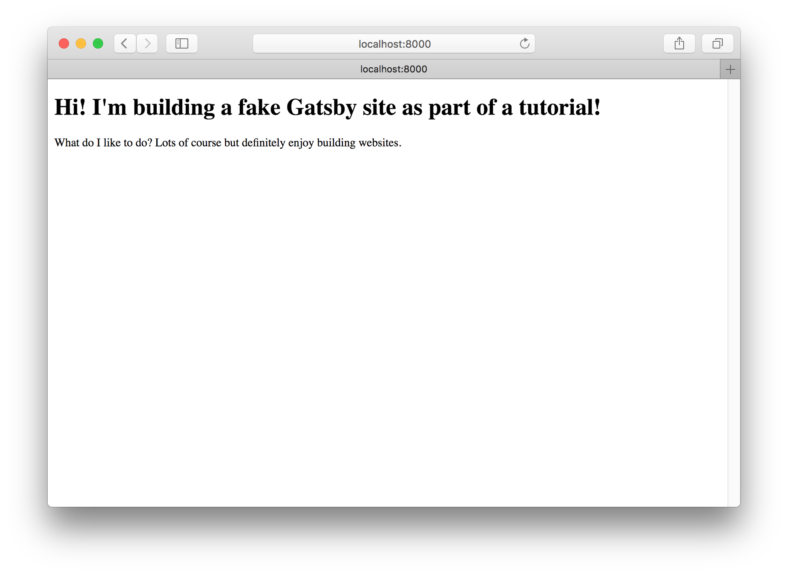
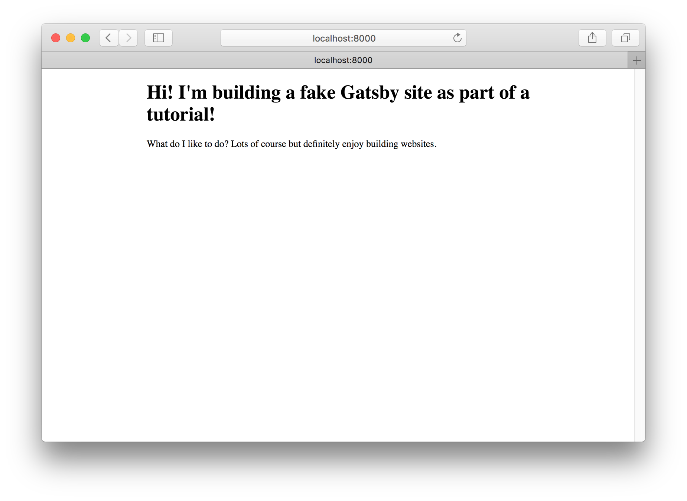

In this guide, you'll learn how to create layout components.

### What are layout components?

Layout components are for sections of your site that you want to share across multiple pages. For example, Gatsby sites will commonly have a layout component with a shared header and footer. Other common things to add to layouts are a sidebar and/or navigation menu. On this page for example, the header at the top is part of gatsbyjs.org’s layout component.

Let’s dive in and explore creating layouts.

### Get up and running with Gatsby

First, you'll want to create a new Gatsby site. If you don't already have Gatsby installed, install it:

```shell
npm install -g gatsby-cli
```

Next, create a new Gatsby site using the "Hello World" starter:

```shell
gatsby new my-gatsby-site https://github.com/gatsbyjs/gatsby-starter-hello-world
```

Next, change into the new site directory and start the site in `develop` mode:

```shell
cd my-gatsby-site
gatsby develop
```

Your site is now running at `http://localhost:8000`. Open the `my-gatsby-site` directory in your code editor of choice and edit the front page:

```jsx:title=src/pages/index.js
import React from "react"

export default () => (
  <div>
    <h1>Hi! I'm building a fake Gatsby site as part of a tutorial!</h1>
    <p>
      What do I like to do? Lots of course but definitely enjoy building
      websites.
    </p>
  </div>
)
```

Save your changes and the browser will update in real time! You now have the start of a nice personal site!



But it would be nice if the page content was centered on the screen.

### Your first layout component

First, create a new directory at `src/components`.

Now create a very basic layout component at `src/components/layout.js`:

```jsx:title=src/components/layout.js
import React from "react"

export default ({ children }) => (
  <div style={{ margin: `0 auto`, maxWidth: 650, padding: `0 1rem` }}>
    {children}
  </div>
)
```

Now you need to import this new layout component into your front page component.

Change `src/pages/index.js` to look like:

```jsx{2,5,11}:title=src/pages/index.js
import React from "react"
import Layout from "../components/layout"

export default () => (
  <Layout>
    <h1>Hi! I'm building a fake Gatsby site as part of a tutorial!</h1>
    <p>
      What do I like to do? Lots of course but definitely enjoy building
      websites.
    </p>
  </Layout>
)
```



Sweet, the layout is working! Now, your text is centered and constrained to
a column 650 pixels wide, as you specified.

### Import and add layout component to other pages

Create an `about` page:

```jsx:title=src/pages/about.js
import React from "react"

export default () => (
  <div>
    <h1>About me</h1>
    <p>I’m good enough, I’m smart enough, and gosh darn it, people like me!</p>
  </div>
)
```

If you navigate to the `about` page (`localhost:8000/about`), you'll find that the `about` page isn't centered.

So import and add the layout component to `about.js`:

```jsx{2,5,8}:title=src/pages/about.js
import React from "react"
import Layout from "../components/layout"

export default () => (
  <Layout>
    <h1>About me</h1>
    <p>I’m good enough, I’m smart enough, and gosh darn it, people like me!</p>
  </Layout>
)
```

And there you have it!

_Challenge:_ With your new "layout component" powers, trying adding headers, footers,
global navigation, sidebars, etc. to your Gatsby sites!

### References

- [Creating nested layout components in Gatsby](https://www.gatsbyjs.org/tutorial/part-three/)

### See also

- [Life After Layouts in Gatsby V2](https://www.gatsbyjs.org/blog/2018-06-08-life-after-layouts/)
