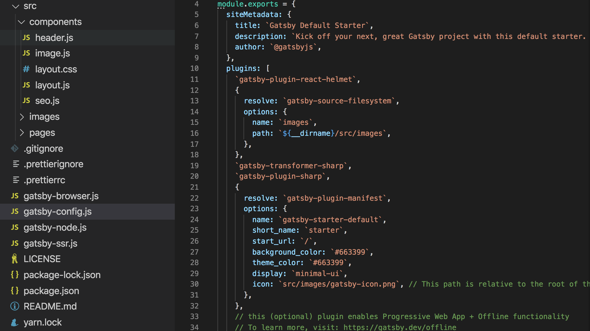
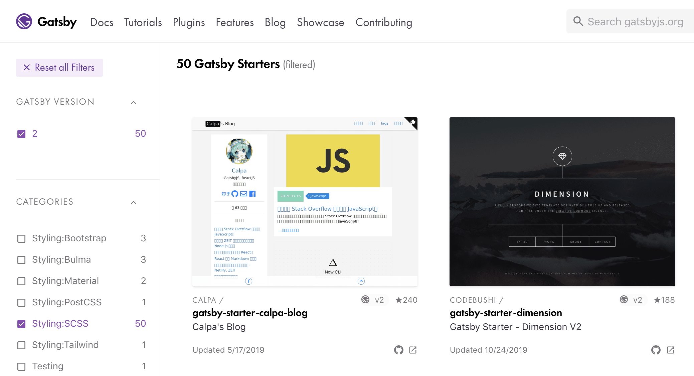

While a Gatsby [starter](/docs/starters/) is a working website out of the box, chances are you'll want to modify your starter at some point. Building on top of a starter reduces the amount of boilerplate code you need to write yourself. You're therefore able to write your own content, functionality, and styling faster.

## Prerequisites

What you need to know will depend on the starter you choose and the data or functionality you'd like to modify. Even if you choose _not_ to modify the starter's components, you may still want to update text, use data from an external source, and modify the style (CSS) of the site. To do this, you'll write some [Markdown](/docs/how-to/routing/mdx/markdown-syntax/) and [JSON](https://www.digitalocean.com/community/tutorials/an-introduction-to-json).

To modify the functionality of a starter, you'll want a basic understanding of [JSX](/docs/glossary#jsx) syntax for updating components and making new ones. You'll also want some knowledge of [GraphQL](/docs/conceptual/graphql-concepts/) for querying your data. Start with these and add to your skills as you continue to add functionality to your starter.

## Choosing a starter

To choose a starter, first consider the functionality you need. Are you building an e-commerce site? A blog? Do you already know what data sources you'll want to use? Find a starter that fulfills your requirements by using the searchbar and filters in the [Gatsby Starter Library](/starters/).

If you're not sure what to choose or want only the most essential functionality, try customizing either [`gatsby-starter-blog`](https://github.com/gatsbyjs/gatsby-starter-blog) (if you're primarily using this site as a blog) or [`gatsby-starter-default`](https://github.com/gatsbyjs/gatsby-starter-default). These official starters are maintained by Gatsby and are great options, particularly for your first Gatsby site.

## Exploring the folder structure

Taking the default Gatsby starter as an example, dedicate some time to looking through some of the most important files in the repository (repo). You'll find most of these in the root (or _main_) folder of your project. Doing so will give you a clearer picture of how the various parts of your Gatsby site work together.



- `src/pages`: a directory for page components to live, with at least one [index.js file (example)](https://github.com/gatsbyjs/gatsby-starter-hello-world/blob/master/src/pages/index.js).
- `gatsby-config.js`: a space to add configurable data and plugins. Among the [API files](/docs/api-files/), `gatsby-config.js` is the one you're most likely to need to modify. See [Gatsby Config](/docs/reference/config-files/gatsby-config/) for more information.
- `package.json`: the "command center" for Gatsby dependencies and scripts. Find an example in the [default starter's package.json](https://github.com/gatsbyjs/gatsby-starter-default/blob/master/package.json) file.
- `README.md`: this should include instructions for how to install and configure the starter, a list of its features or structure, and helpful tips. If you plan to share the source code for your site with other people, you can replace this information with documentation for your specific project.
- `static`: a directory for static assets, such as a `favicon.ico` file. You can add whatever static files you need in here and they'll be copied to the `public` folder. If you're not sure which files belong here, check out the [How-To Guide about the static folder](/docs/how-to/images-and-media/static-folder/).

If you'd like to read descriptions of all of these files, as well as the other files that make up a Gatsby site, check out the [Gatsby project structure](/docs/reference/gatsby-project-structure/) documentation.

## Adding content

How exactly you add content to your site will depend somewhat on your starter's structure. The default starter includes the `src/pages/` directory, which contains `404.js`, `index.js`, and `page-2.js`. Adding a JavaScript file to this directory will automatically create a new route available at `http://localhost:8000/[file-name]`. For example, if you'd like to add a page to share your speaking experience, you might include `speaking.js` in `src/pages/` as written below:

```jsx:title=src/pages/speaking.js
import React from "react"
import { Link } from "gatsby"

import Layout from "../components/layout"
import SEO from "../components/seo"

const SpeakingPage = () => (
  <Layout>
    <SEO title="Home" />
    <h1>Speaking Engagements</h1>
    <p>I would love to speak at your conference!</p>
    <p>I will be speaking at the following conferences next year:</p>
    <ul>
      <li>JS Heroes</li>
      <li>self.conference</li>
      <li>Strange Loop</li>
    </ul>
  </Layout>
)

export default SpeakingPage
```

At this point, you can navigate to `http://localhost:8000/speaking` in your browser to view this page! You can also [add pages from Markdown](/docs/how-to/routing/adding-markdown-pages/) or [source data from a content management system](/docs/how-to/sourcing-data/headless-cms/) (CMS) like WordPress. You may even choose a specific starter _because_ it's built to work well with a certain CMS. Try explicitly searching the [Gatsby Starter Library](/starters/) for your preferred system. Once there, check out the category filter. You'll see several options prefixed with "CMS:". Choose the option(s) that best fit your goals for the project.

## Querying data

Being able to query your own data will provide an added level of customization and control over your site. By default, Gatsby does this using [GraphQL](/docs/graphql-reference/). Note the `siteMetadata` in the default starter's `gatsby-config.js`:

```javascript:title=gatsby-config.js
module.exports = {
  // highlight-start
  siteMetadata: {
    title: `Gatsby Default Starter`,
    description: `Kick off your next, great Gatsby project with this default starter. This barebones starter ships with the main Gatsby configuration files you might need.`,
    author: `@gatsbyjs`,
  },
  // highlight-end
  plugins: [
    `gatsby-plugin-react-helmet`,
    {
      resolve: `gatsby-source-filesystem`,
      options: {
        name: `images`,
        path: `${__dirname}/src/images`,
      },
    },
    `gatsby-transformer-sharp`,
    `gatsby-plugin-sharp`,
    {
      resolve: `gatsby-plugin-manifest`,
      options: {
        name: `gatsby-starter-default`,
        short_name: `starter`,
        start_url: `/`,
        background_color: `#663399`,
        theme_color: `#663399`,
        display: `minimal-ui`,
        icon: `src/images/gatsby-icon.png`, // This path is relative to the root of the site.
      },
    },
    // this (optional) plugin enables Progressive Web App + Offline functionality
    // To learn more, visit: https://gatsby.dev/offline
    // `gatsby-plugin-offline`,
  ],
}
```

Elsewhere on the site, GraphQL queries access that data and display it in the browser. The `Layout` component, for instance, runs a query for `siteMetadata`'s `title` property. It then passes that value to the `Header` component via props:

```jsx:title=src/components/layout.js
import React from "react"
import PropTypes from "prop-types"
import { useStaticQuery, graphql } from "gatsby" // highlight-line

import Header from "./header"
import "./layout.css"

const Layout = ({ children }) => {
  // highlight-start
  const data = useStaticQuery(graphql`
    query SiteTitleQuery {
      site {
        siteMetadata {
          title
        }
      }
    }
  `)
  // highlight-end

  return (
    <>
      <Header siteTitle={data.site.siteMetadata.title} /> // highlight-line
      <div
        style={{
          margin: `0 auto`,
          maxWidth: 960,
          padding: `0px 1.0875rem 1.45rem`,
          paddingTop: 0,
        }}
      >
        <main>{children}</main>
        <footer>
          © {new Date().getFullYear()}, Built with
          {` `}
          <a href="https://www.gatsbyjs.com">Gatsby</a>
        </footer>
      </div>
    </>
  )
}

Layout.propTypes = {
  children: PropTypes.node.isRequired,
}

export default Layout
```

This allows the `Header` to set the content of the `<h1>` that appears on every page of the website to the value of `siteTitle`:

```jsx:title=src/components/header.js
import { Link } from "gatsby"
import PropTypes from "prop-types"
import React from "react"

const Header = (
  { siteTitle } // highlight-line
) => (
  <header
    style={{
      background: `rebeccapurple`,
      marginBottom: `1.45rem`,
    }}
  >
    <div
      style={{
        margin: `0 auto`,
        maxWidth: 960,
        padding: `1.45rem 1.0875rem`,
      }}
    >
      <h1 style={{ margin: 0 }}>
        <Link
          to="/"
          style={{
            color: `white`,
            textDecoration: `none`,
          }}
        >
          {siteTitle} // highlight-line
        </Link>
      </h1>
    </div>
  </header>
)

Header.propTypes = {
  siteTitle: PropTypes.string,
}

Header.defaultProps = {
  siteTitle: ``,
}

export default Header
```

Try adding a property to `siteMetadata`, querying for it, and displaying the data on a page of your site. The Gatsby docs have a great introduction to [querying your data with GraphQL](/docs/graphql/).

## Customizing styles

Continuing with `gatsby-starter-default` as an example, have a look at `src/pages/index.js`:

```jsx:title=src/pages/index.js
import React from "react"
import { Link } from "gatsby"

import Layout from "../components/layout"
import Image from "../components/image"
import SEO from "../components/seo"

const IndexPage = () => (
  <Layout>
    <SEO title="Home" />
    <h1>Hi people</h1>
    <p>Welcome to your new Gatsby site.</p>
    <p>Now go build something great.</p>
    // highlight-next-line
    <div style={{ maxWidth: `300px`, marginBottom: `1.45rem` }}>
      <Image />
    </div>
    <Link to="/page-2/">Go to page 2</Link>
  </Layout>
)

export default IndexPage
```

Here, some inline styles are being applied to a `<div>` element. This option will work but may become difficult to manage over time as your styles become more complex. You may wish to use another of several available [styling methods](/docs/styling/). Gatsby doesn’t have an opinion about which styling approach you choose.

You may even choose a specific starter _because_ of its approach to styling. Search the [Gatsby Starter Library](/starters/) using category filters prefixed with "Styling:" and choose the option(s) that best fit your project.



## Other resources

- [Setting Up Gatsby with a Starter](https://dev.to/ekaonthenet/building-my-personal-site--part-2-setting-up-gatsby-with-a-starter-site-1ob1) by Eka
- [Jason Lengstorf and Katie Fujihara livestream building Katie's first Gatsby site](https://youtu.be/oH6qy9Wjj9A)
- [Source files for gatsby-starter-default](https://github.com/gatsbyjs/gatsby-starter-default)
- [Source files for gatsby-starter-blog](https://github.com/gatsbyjs/gatsby-starter-blog)
