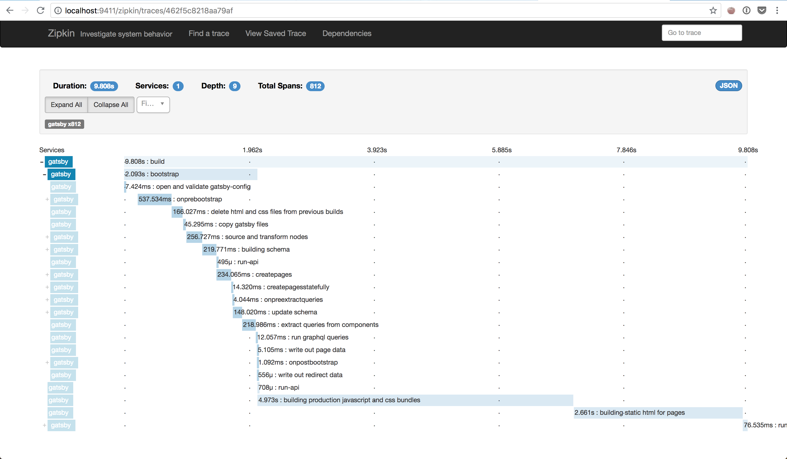

Gatsby allows a build to be traced, enabling you to find which plugins or parts of the build are taking the longest. The trace information can be viewed in any [OpenTracing](http://opentracing.io/) compatible tool such as [Jaeger](https://www.jaegertracing.io/). You can also use Zipkin compatible tools such as [Zipkin](https://zipkin.io/) or [Honeycomb](https://www.honeycomb.io/).

- [Running Gatsby with tracing turned on](/docs/performance-tracing/#running-gatsby-with-tracing-turned-on)
- [Tracing backend examples](/docs/performance-tracing/#tracing-backend-examples)
- [Adding your own tracing](/docs/performance-tracing/#adding-your-own-tracing)



## Running Gatsby with tracing turned on

Gatsby code is instrumented with OpenTracing, which is a general tracing API that is implementation agnostic. Therefore, you'll need to include and configure an OpenTracing compatible library in your application, as well as a backend to collect the trace data.

In addition, Gatsby has additional tracing for GraphQL resolvers. This traces every resolver and might have performance impact, so it's disabled by default. You can enable it with `--graphql-tracing` argument for the build command.

The steps required to add tracing are below. Or, you can skip ahead if you want specific instructions for [Jaeger](/docs/performance-tracing/#local-jaeger-with-docker) or [Zipkin](/docs/performance-tracing/#local-zipkin-with-docker).

### 1. Library dependency

Add an [OpenTracing compatible library](https://github.com/opentracing) to your site's `package.json` dependencies.

### 2. Library configuration file

Each OpenTracing library must be configured. For example, what is the URL of the tracing backend? How often should spans be sent to the backend? What service name should the trace be recorded under? Etc.

The configuration file is a JavaScript file that exports two functions: `create` and `stop`.

- **create**: Create and return an [OpenTracing compatible tracer](https://github.com/opentracing/opentracing-javascript/blob/master/src/tracer.ts). It is called at the start of the build.
- **stop**: Called at the end of the build. Any cleanup required by the tracer should be performed here, such as clearing out any span queues and sending them to the tracing backend.

### 3. Start Gatsby with tracing turned on

The above configuration file can be passed to Gatsby with the `--open-tracing-config-file` command-line option or an environment variable named `GATSBY_OPEN_TRACING_CONFIG_FILE`. When Gatsby is started with this option, it will load the supplied tracing configuration file, and call its `create` function. The returned Tracer will be used for tracing the build. Once the build has stopped, the configuration file's `stop` method will be called, allowing the tracing implementation to perform any cleanup.

## Tracing backend examples

There are many OpenTracing compatible backends available. Below are examples of how to hook [Jaeger](/docs/performance-tracing/#local-jaeger-with-docker) or [Zipkin](/docs/performance-tracing/#local-zipkin-with-docker) into Gatsby.

### OpenTelemetry

[OpenTelemetry](https://opentelemetry.io/) is the new industry standard for tracing. Most vendors now have
built-in support for OpenTelemetry. The following is an example of configuring Gatsby to send build traces
to [Honeycomb](https://www.honeycomb.io/).

1. Install necessary dependencies

```shell
npm install @grpc/grpc-js @opentelemetry/api @opentelemetry/auto-instrumentations-node @opentelemetry/exporter-collector-grpc @opentelemetry/sdk-node @opentelemetry/shim-opentracing opentracing
```

2. Create a file named `tracing.js` in the root of your site with the following code (adding your honeycomb API key and database).

```js
const process = require(`process`)
const { Metadata, credentials } = require(`@grpc/grpc-js`)
const api = require(`@opentelemetry/api`)
const { TracerShim } = require(`@opentelemetry/shim-opentracing`)
const opentracing = require(`opentracing`)
const { NodeSDK } = require(`@opentelemetry/sdk-node`)
const {
  getNodeAutoInstrumentations,
} = require(`@opentelemetry/auto-instrumentations-node`)
const { Resource } = require(`@opentelemetry/resources`)
const {
  SemanticResourceAttributes,
} = require(`@opentelemetry/semantic-conventions`)
const {
  CollectorTraceExporter,
} = require(`@opentelemetry/exporter-collector-grpc`)

const metadata = new Metadata()
metadata.set(`x-honeycomb-team`, `ADD YOUR API KEY`)
metadata.set(`x-honeycomb-dataset`, `ADD YOUR DATASET NAME`)
const traceExporter = new CollectorTraceExporter({
  url: `grpc://api.honeycomb.io:443/`,
  credentials: credentials.createSsl(),
  metadata,
})

const sdk = new NodeSDK({
  resource: new Resource({
    [SemanticResourceAttributes.SERVICE_NAME]: `gatsby`,
  }),
  traceExporter,
  instrumentations: [getNodeAutoInstrumentations()],
})

sdk
  .start()
  .then(() => console.log(`Tracing initialized`))
  .catch(error => console.log(`Error initializing tracing`, error))

exports.create = () => {
  // We shim Gatsby's use of OpenTracing for OpenTelemetry
  const tracer = api.trace.getTracer(`my-tracer`)
  return new TracerShim(tracer)
}

exports.stop = async () => {
  await sdk.shutdown()
}
```

3. OpenTelemetry includes a built-in collector which needs to be started first. So
   we run Gatsby in a special way telling Node to require our tracing file immediately.

```shell
GATSBY_OPEN_TRACING_CONFIG_FILE=tracing.js node -r ./tracing.js node_modules/gatsby/cli.js build
```

### Local Jaeger with Docker

[Jaeger](https://www.jaegertracing.io/) is an open source tracing system that can be run locally using Docker.

1. Add [jaeger-client](https://www.npmjs.com/package/jaeger-client) to your site:

   ```shell
   yarn add jaeger-client
   ```

   or

   ```shell
   npm install jaeger-client
   ```

2. Run Jaeger's all-in-one Docker instance with:

   ```shell
   docker run -d --name jaeger \
       -e COLLECTOR_ZIPKIN_HTTP_PORT=9411 \
       -p 5775:5775/udp \
       -p 6831:6831/udp \
       -p 6832:6832/udp \
       -p 5778:5778 \
       -p 16686:16686 \
       -p 14268:14268 \
       -p 9411:9411 \
       jaegertracing/all-in-one:1.8
   ```

   See [Jaeger getting started](https://www.jaegertracing.io/docs/1.8/getting-started/) for more information.

3. Start Gatsby `build` or `develop` with `--open-tracing-config-file` pointing at the Jaeger configuration file. An example file is provided in the Gatsby project under [node_modules/gatsby/dist/utils/tracer/jaeger-local.ts](https://github.com/gatsbyjs/gatsby/blob/master/packages/gatsby/src/utils/tracer/jaeger-local.ts) that will send tracing spans to your local Docker instance over HTTP. E.g

   ```shell
   gatsby build --open-tracing-config-file node_modules/gatsby/dist/utils/tracer/jaeger-local.js
   ```

4. Once the build is complete, view your tracing information at `http://localhost:16686`. On the left menu, select the `build` operation to see your build's root trace.

### Local Zipkin with Docker

[Zipkin](https://zipkin.io/) is an open source tracing system that can be run locally using Docker.

1. Add following dependencies to your site's `package.json`

   - [zipkin](https://www.npmjs.com/package/zipkin)
   - [zipkin-javascript-opentracing](https://www.npmjs.com/package/zipkin-javascript-opentracing)
   - [zipkin-transport-http](https://www.npmjs.com/package/zipkin-transport-http)

2. Run Zipkin's all-in-one Docker instance with `docker run -d -p 9411:9411 openzipkin/zipkin`. See [Zipkin getting started](https://zipkin.io/pages/quickstart.html) for more information.

3. Start Gatsby `build` or `develop` with `--open-tracing-config-file` pointing at the Zipkin configuration file. An example file is provided in the Gatsby project under `node_modules/gatsby/dist/utils/tracer/zipkin-local.js` that will send tracing spans to your local Docker instance. E.g

   ```shell
   gatsby build --open-tracing-config-file node_modules/gatsby/dist/utils/tracer/zipkin-local.js
   ```

4. Once the build is complete, view your tracing information at `http://localhost:9411`

## Adding your own tracing

The default tracing that comes with Gatsby can give you a good idea of which plugins or stages of the build are slowing down your site. But sometimes, you'll want to trace the internals of your site. Or if you're a plugin author, you might want to trace long operations.

To provide custom tracing, you can use the `tracing` object, which is present in the args passed to API implementers. This tracing object contains a function called `startSpan`. This wraps [OpenTracing startSpan](https://github.com/opentracing/opentracing-javascript/blob/master/src/tracer.ts#L79), but provides the default `childOf: parentSpan` span args. `startSpan` returns a span object that you must explicitly end by calling its `.finish()` method. For example:

```javascript:title=gatsby-node.js
exports.sourceNodes = async ({ actions, tracing }) => {
  const span = tracing.startSpan(`foo`)

  // Perform any span operations. E.g. add a tag to your span
  span.setTag(`bar`, `baz`)

  // Rest of your plugin code

  span.finish()
}
```

With this span, you can perform any OpenTracing span operation such as [span.setTag](https://github.com/opentracing/opentracing-javascript/blob/master/src/span.ts#L89). Make sure that the tracing backend supports these operations. You can provide an optional second span options argument to `startSpan` which will be passed to the underlying OpenTracing call.

For advanced use cases, the `tracing` object also provides `tracer` and `parentSpan` fields. You can use these to construct independent spans, or your own child spans (see the [OpenTracing project](https://github.com/opentracing/opentracing-javascript/tree/master/src) for more info).
