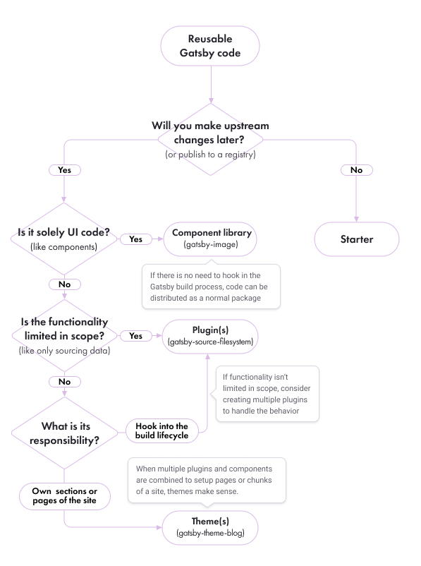

In the Gatsby ecosystem, there's more than one way to build a site. To help you understand the differences between plugins, themes, and starters, this guide will talk through some of the details.

## What is a plugin?

Gatsby plugins are Node.js packages that implement Gatsby APIs and are commonly installed through a registry like npm. There are many types of [plugins](/plugins/), including data sourcing, SEO, responsive images, offline support, support for Sass, TypeScript, sitemaps and RSS, Google Analytics, and more. You can also [make your own plugins](/docs/creating-plugins/) and either distribute them for fellow Gatsby developers to use or [install them locally](/docs/loading-plugins-from-your-local-plugins-folder/).

- [Plugin docs](/docs/plugins/)
- [Using a plugin](/docs/using-a-plugin-in-your-site/)
- [Plugin library](/plugins/)
- [Creating plugins](/docs/creating-plugins/)

## What is a theme?

A Gatsby theme is a type of plugin that includes a `gatsby-config.js` file and adds pre-configured functionality, data sourcing, and/or UI code to Gatsby sites. Since they are plugins, themes can be packaged and distributed through a registry like npm or yarn, and versions can be updated through a site's `package.json` file.

With a Gatsby theme, all of your default configuration (shared functionality, data sourcing, design) is abstracted out of your site and into an installable package. A theme might differ from a typical plugin in that it packages up usage of a plugin into a consumable API, making it easy to include functionality without having to type out all of the code by hand (such as GraphQL queries). To understand more of the motivation for Gatsby themes, check out the docs on [What are Gatsby Themes?](/docs/themes/what-are-gatsby-themes/)

- [Themes docs](/docs/themes/)
- [Using a theme](/docs/themes/using-a-gatsby-theme/)
- [Themes in plugin library](/plugins/?=gatsby-theme)
- [Creating a theme](/docs/themes/building-themes/)

## What is a starter?

A starter is a boilerplate Gatsby site that users can copy and [customize](/docs/modifying-a-starter/). Once modified, a starter maintains no connection to its source.

Gatsby offers [official starters](/docs/starters/#official-starters) for a default site, blog site, bare-bones hello world site, and both using and creating themes. There are also many starters from members of the community that can provide a good starting point for your Gatsby site.

- [Starter docs](/docs/starters/)
- [Modifying a starter](/docs/modifying-a-starter/)
- [Starter library](/starters/)
- [Creating a starter](/docs/creating-a-starter/)
- [Converting a starter to a theme](/docs/themes/converting-a-starter/)

## Comparing differences

Once you have a conceptual understanding of what a plugin, theme, and starter is, you may ask yourself what each is suited for in relation to each other.

The following tables put plugins, themes, and starters side-by-side, showing what each is more appropriate for.

**Legend**

| Icon | Feature Capability    |
| ---- | --------------------- |
| ●    | Fully configurable    |
| ◐    | Somewhat configurable |
| ○    | Not configurable      |

### Differences in maintainability

When it comes to maintaining a Gatsby site, plugins and themes offer a distinct advantage to starters by being distributed as packages, making pulling in upstream changes in multiple Gatsby sites as easy as a new install.

| Maintenance        | Plugin | Theme | Starter |
| ------------------ | ------ | ----- | ------- |
| Versioning         | ●      | ●     | ●       |
| Install as Package | ●      | ●     | ○       |

#### Versioning

Starters can still be versioned inside a repository so that you can track issues or bugs associated with specific developments in the starter but it's more difficult to make updates with new changes.

#### Installing as a package

Because starters are "ejected" each time they are used, it's difficult to sync changes across multiple sites derived from the same starter. This problem was one of the motivating factors in developing the newer concept of themes for Gatsby. You can read more about why themes were developed in the [What are Gatsby Themes guide](/docs/themes/what-are-gatsby-themes/#gatsby-starters).

### Differences in configurability

Plugins and themes can expose a varying level of an API surface (meaning a piece of the plugin or theme that a user of it can interact with), constraining what is possible and providing sensible defaults to make them easier to start picking up and using.

| Configuration         | Plugin | Theme | Starter |
| --------------------- | ------ | ----- | ------- |
| Shadowing             | ◐      | ●     | ○       |
| Uses Multiple Plugins | ◐      | ●     | ●       |
| Custom components     | ◐      | ●     | ●       |

#### Shadowing

The options exposed by a plugin or theme are up to the author. For example, a plugin or theme can allow a specific path to be provided in the `gatsby-config` so the plugin knows where to build pages from. In this case the user wouldn't be able adjust _how_ those pages are built, only from what path. As an escape hatch to change small pieces of an installed theme, [shadowing](/docs/themes/shadowing/) was introduced. Theme shadowing allows users to replace a file with their own version of it. Because themes are also plugins, shadowing is possible in plugins as well.

An example of a plugin that uses shadowing is [`gatsby-plugin-theme-ui`](/packages/gatsby-plugin-theme-ui/?=theme-ui#customizing-the-theme) which allows you to shadow a theme file to use your own theme.

Starters aren't capable of shadowing (and they don't need to be), because a user of a starter can adjust any file by editing it directly.

#### Uses multiple plugins

Starters can be configured with multiple plugins so someone can get up and running without worrying about configuring too many loose ends. Themes are capable of the same by making a `gatsby-config` that a Gatsby site will run along with its own config. Plugins are also capable of this (because themes are a plugin), but it is recommended that _plugins be limited to their specific functionality_.

#### Custom components

Custom components are most traditionally distributed as packages in the React ecosystem. Components don't need to hook into the Gatsby build system, so if shipped with a plugin they don't need to be included in a `gatsby-config`'s plugin array. This is the case with `gatsby-image` which is a React component. It doesn't need to be included in the plugins array because it is merely a component.

Some plugins and themes ship with components you can use in a Gatsby site. An example is the [`<OutboundLink />` component from `gatsby-plugin-google-analytics`](/packages/gatsby-plugin-google-analytics/?=#outboundlink-component). Other plugins, like [`gatsby-plugin-react-helmet`](/packages/gatsby-plugin-react-helmet), require you to install components from other dependent libraries.

Because themes are meant to own a section of a site—like a page or part of a page—they are more suited to ship with components that could then be shadowed for customization.

Starters will include components to render data, but they are tied to the starter.

## Deciding which to use

As an aid to help try and guide you to which of the 3 options is right for your use case, consider this flowchart:

