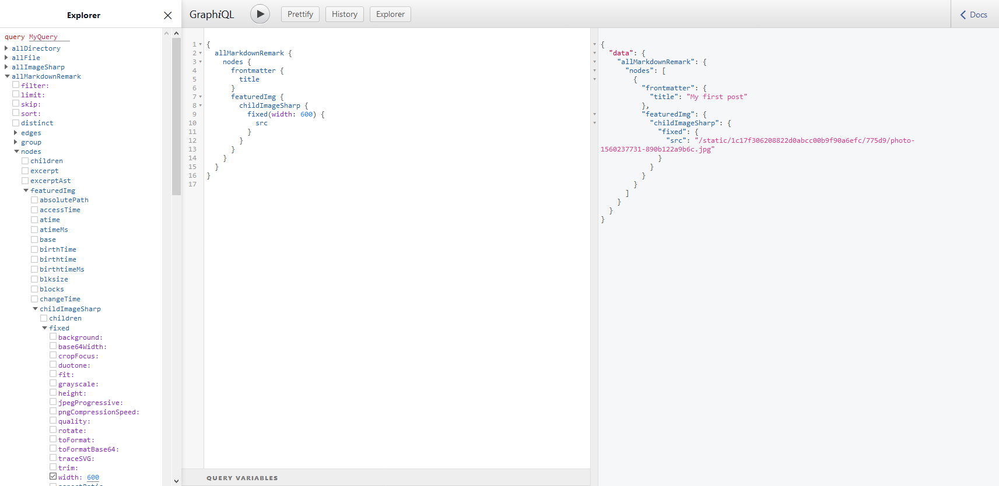

Gatsby allows powerful image processing features through using the [`Sharp`](https://github.com/lovell/sharp/) library to automatically process images to be performant and have features like lazy-loading. That said, this only works if the image is a file node in the GraphQL layer.

If you want the same ecosystem for files that are hosted online and not located in your repo, [`gatsby-source-filesystem`](/packages/gatsby-source-filesystem/) has an API called `createRemoteFileNode` to solve this.

This guide will walk you through how to use `createRemoteFileNode` process and get the same benefits of gatsby-transformer-sharp with externally sourced images.

## Setup

A usecase that this technique can be useful is if you want to create a featured image in a blogpost, but the image is a url up on the web instead of a local file. This could be hosted somewhere like Imgur, S3, or anywhere up on the internet.

Give a sample post:

```markdown
---
title: My first blogpost!
featuredImgUrl: https://images.unsplash.com/photo-1560237731-890b122a9b6c
---

Hello World
```

We can have a frontmatter field for the url of the featured image we want to pull down and use as part of the site.

By default, this is just a string as we haven't told Gatsby how to interpret it, but now we can add some code into `gatsby-node.js` to modify it.

## Gatsby Node

In your gatsby-node file, we can do some processing to create file nodes for the `featuredImgUrl` frontmatter field.

```js:title=gatsby-node.js
const { createRemoteFileNode } = require("gatsby-source-filesystem")

exports.onCreateNode = async ({
  node,
  actions: { createNode },
  store,
  cache,
  createNodeId,
}) => {
  // For all MarkdownRemark nodes, call createRemoteFileNode
  if (node.internal.type === "MarkdownRemark") {
    let fileNode = await createRemoteFileNode({
      url: node.frontmatter.featuredImgUrl, // string that points to the URL of the image
      parentNodeId: node.id, // id of the parent node of the fileNode we are going to create
      createNode, // helper function in gatsby-node to generate the node
      createNodeId, // helper function in gatsby-node to generate the node id
      cache, // Gatsby's cache
      store, // Gatsby's redux store
    })

    // if the file was created, attach the new node to the parent node
    if (fileNode) {
      node.featuredImg___NODE = fileNode.id
    }
  }
}
```

Going step by step through the code:

1. Create an onCreateNode function so you can watch for when `MarkdownRemark` nodes are made.
2. Use `createRemoteFileNode` by passing in the various required fields and get a reference to it afterwards.
3. If the node is created, attach it as a child of the original node. `___NODE` tells the graphql layer that the name before it is going to be a field on the parent node that links to another node. To do this, pass the id as the reference.

And now since it is a file node, `gatsby-transformer-sharp` will pick it up and create a `childImageSharp` child node inside this newly created node.

## Usage in templates

Now that the images are being generated and available in GraphQL, let's use it in action.

If you open GraphiQL and write a query on the markdown nodes, you can see a new

```graphql
query {
  allMarkdownRemark {
    nodes {
      featuredImg {
        childImageSharp {
          # ...
        }
      }
    }
  }
}
```



We can then use gatsby-transformer-sharp to fill in the query for a fluid image here.

```graphql
query {
  allMarkdownRemark {
    nodes {
      featuredImg {
        childImageSharp {
          fixed(width: 600) {
            ...GatsbyImageSharpFixed
          }
        }
      }
    }
  }
}
```

And finally, we can update the template for this blogpost to include this image. This template is based on the one in [Part Seven](/tutorial/part-seven/) of the Gatsby Tutorial.

```jsx
import React from "react"
import Img from "gatsby-image"
import { graphql } from "gatsby"

const template = ({ data }) => {
  return (
    <>
      <h1>{data.markdownRemark.frontmatter.title}</h1>
      
      <div dangerouslySetInnerHTML={{ __html: data.markdownRemark.html }} />
    </>
  )
}

export default template

export const query = graphql`
  query BlogPostQuery($slug: String) {
    markdownRemark(fields: { slug: { eq: $slug } }) {
      frontmatter {
        title
      }
      html
      featuredImg {
        childImageSharp {
          fixed(width: 600) {
            ...GatsbyImageSharpFixed
          }
        }
      }
    }
  }
`
```

And if you run `gatsby develop`, you'll see the remote file locally now:


