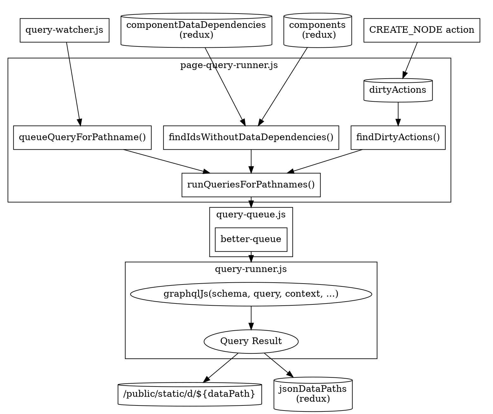

> This documentation isn't up to date with the latest version of Gatsby.
>
> Outdated areas are:
>
> - implementation details are out of date
>
> You can help by making a PR to [update this documentation](https://github.com/gatsbyjs/gatsby/issues/14228).

## Query execution

Query execution is kicked off by bootstrap by calling [`createQueryRunningActivity()`](https://github.com/gatsbyjs/gatsby/blob/master/packages/gatsby/src/query/index.js#L192). The main files involved in this step are:

- [index.js](https://github.com/gatsbyjs/gatsby/blob/master/packages/gatsby/src/query/index.js)
- [queue.ts](https://github.com/gatsbyjs/gatsby/blob/master/packages/gatsby/src/query/queue.ts)
- [query-runner.ts](https://github.com/gatsbyjs/gatsby/blob/master/packages/gatsby/src/query/query-runner.ts)

Here's an overview of how it all relates:



## Figuring out which queries need to be executed

The first thing this query does is figure out what queries need to be run. You might think this would be a matter of running the Queries that were enqueued in [Extract Queries](/docs/query-extraction/), but matters are complicated by support for `develop`. Below is the logic for figuring out which queries need to be executed (code is in [runQueries()](https://github.com/gatsbyjs/gatsby/blob/master/packages/gatsby/src/internal-plugins/query-runner/page-query-runner.js#L36)).

### Already queued queries

All queries queued after being extracted (from `query-watcher.js`).

### Queries without node dependencies

All queries whose component path isn't listed in `componentDataDependencies`. In [Schema Generation](/docs/schema-generation/), all Type resolvers record a dependency between the page whose query is running and any nodes that were successfully resolved. So, If a component is declared in the `components` Redux namespace (occurs during [Page Creation](/docs/page-creation/)), but is _not_ contained in `componentDataDependencies`, then by definition, the query has not been run. Therefore it needs to be run. Checkout [Page -> Node Dependencies](/docs/page-node-dependencies/) for more info. The code for this step is in [findIdsWithoutDataDependencies](https://github.com/gatsbyjs/gatsby/blob/master/packages/gatsby/src/internal-plugins/query-runner/page-query-runner.js#L96).

### Pages that depend on dirty nodes

In `develop` mode, every time a node is created, or is updated (e.g. via editing a markdown file), that node needs to be dynamically added to the [enqueuedDirtyActions](https://github.com/gatsbyjs/gatsby/blob/master/packages/gatsby/src/internal-plugins/query-runner/page-query-runner.js#L61) collection. When your queries are executed, the code will look up all nodes in this collection and map them to pages that depend on them (as described above). These pages' queries must also be executed. In addition, this step also handles dirty `connections` (see [Schema Connections](/docs/schema-root-fields/)). Connections depend on a node's type. So if a node is dirty, the code marks all connection nodes of that type dirty as well. The code for this step is in [popNodeQueries](https://github.com/gatsbyjs/gatsby/blob/master/packages/gatsby/src/query/index.js#L72). _Note: dirty ids is really talking about dirty paths_.

### Queue queries for execution

There is now a list of all pages that need to be executed (linked to their Query information). Gatsby will queue them for execution (for real this time). A call to [runQueriesForPathnames](https://github.com/gatsbyjs/gatsby/blob/master/packages/gatsby/src/query/index.js#L153) kicks off this step. For each page or static query, Gatsby creates a Query Job that looks something like:

```javascript
{
  id: // page path, or static query hash
  hash: // only for static queries
  jsonName: // jsonName of static query or page
  query: // raw query text
  componentPath: // path to file where query is declared
  isPage: // true if not static query
  context: {
    path: // if staticQuery, is jsonName of component
    ...page // page object. Not for static queries
    ...page.context // not for static queries
  }
}
```

This Query Job contains everything it needs to execute the query (and do things like recording dependencies between pages and nodes). It gets pushed onto the queue in [query-queue.js](https://github.com/gatsbyjs/gatsby/blob/master/packages/gatsby/src/query/index.js) and then waits for the queue to empty. Next, this doc will cover how `query-queue` works.

### Query queue execution

[query-queue.js](https://github.com/gatsbyjs/gatsby/blob/master/packages/gatsby/src/query/index.js) creates a [better-queue](https://www.npmjs.com/package/better-queue) queue that offers advanced features like parallel execution, which is handy since queries do not depend on each other so Gatsby can take advantage of this. Every time an item is consumed from the queue, it calls [query-runner.ts](https://github.com/gatsbyjs/gatsby/blob/master/packages/gatsby/src/query/query-runner.ts) where it can finally execute the query!

Query execution involves calling the [graphql-js](https://graphql.org/graphql-js/) library with 3 pieces of information:

1. The Gatsby schema that was inferred during [Schema Generation](/docs/schema-generation/).
2. The raw query text. Obtained from the Query Job.
3. The Context, also from the Query Job. Has the page's `path` amongst other things so that Gatsby can record [Page -> Node Dependencies](/docs/page-node-dependencies/).

Graphql-js will parse the query, and executes the top level query. E.g. `allMarkdownRemark( limit: 10 )` or `file( relativePath: { eq: "blog/my-blog.md" } )`. These will invoke the resolvers defined in [Schema Connections](/docs/schema-root-fields/) or [GQL Type](/docs/schema-gql-type/), which both use sift to query over all nodes of the type in Redux. The result will be passed through the inner part of the GraphQL query where each type's resolver will be invoked. The vast majority of these will be `identity` functions that just return the field value. Some however could call a [custom plugin field](/docs/schema-gql-type/#plugin-fields) resolver. These in turn might perform side effects such as generating images. This is why the query execution phase of bootstrap often takes the longest.

Finally, a result is returned.

### Save query results to Redux and disk

As queries are consumed from the queue and executed, their results are saved to Redux and disk for consumption later on. This involves converting the result to pure JSON, and then saving it to its [dataPath](/docs/behind-the-scenes-terminology/#datapath). Which is relative to `public/static/d`. The data path includes the jsonName and hash. E.g: for the page `/blog/2018-07-17-announcing-gatsby-preview/`, the queries results would be saved to disk as something like:

```text
/public/static/d/621/path---blog-2018-07-17-announcing-gatsby-preview-995-a74-dwfQIanOJGe2gi27a9CLKHjamc.json
```

For static queries, instead of using the page's jsonName, Gatsby uses a hash of the query.

Now Gatsby needs to store the association of the page -> the query result in Redux so it can be recalled later. This is accomplished via the [`json-data-paths`](https://github.com/gatsbyjs/gatsby/blob/master/packages/gatsby/src/redux/reducers/json-data-paths.js) reducer which is invoked by creating a `SET_JSON_DATA_PATH` action with the page's jsonName and the saved dataPath.
