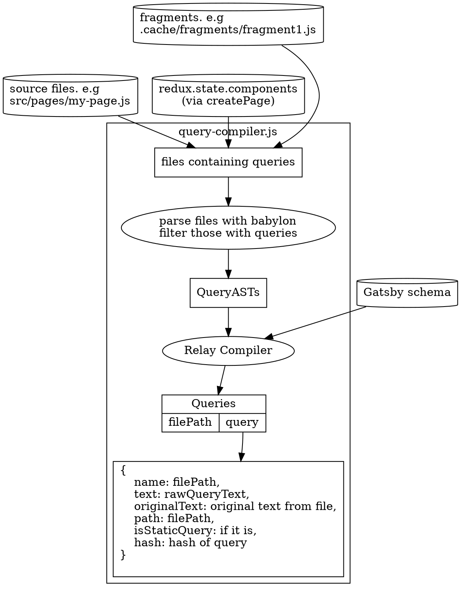
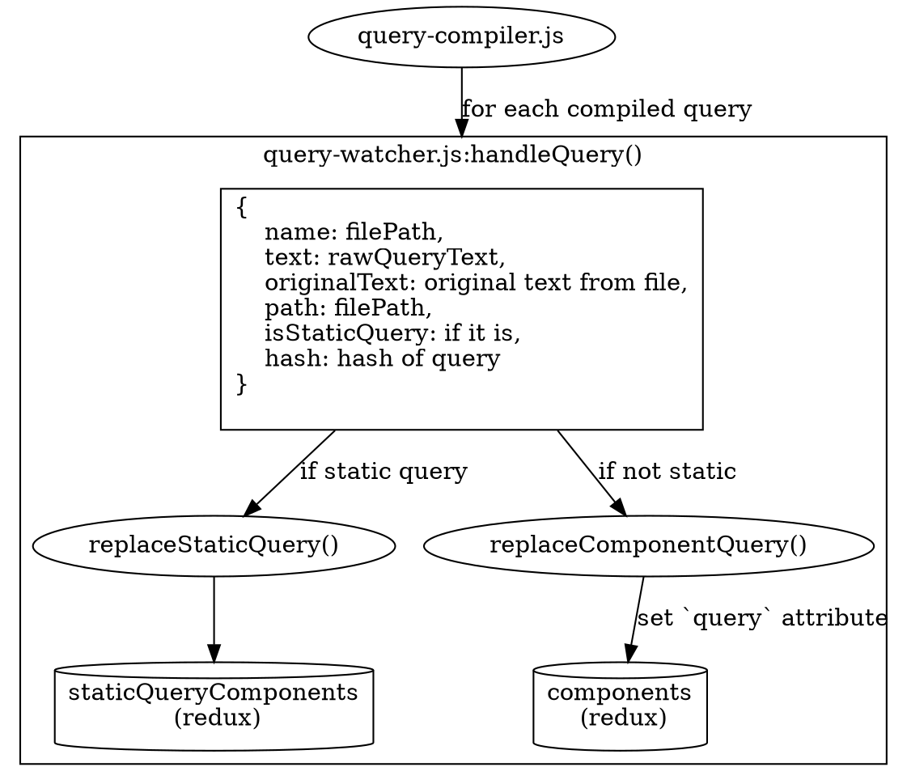
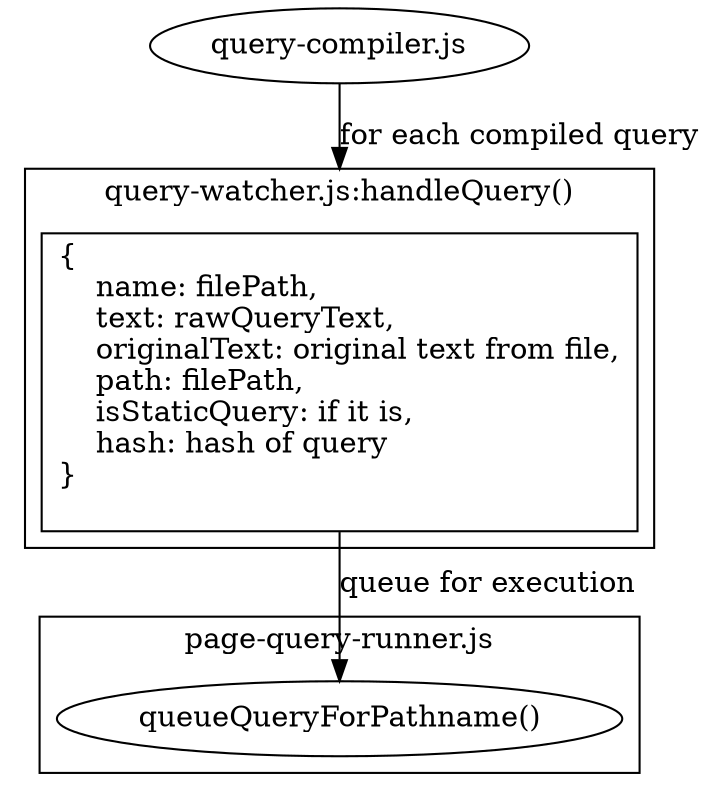

> This documentation isn't up to date with the latest version of Gatsby.
>
> Outdated areas are:
>
> - queries in dependencies (node_modules) and themes are now extracted as well
> - add meta key for hook in JSON in diagram
>
> You can help by making a PR to [update this documentation](https://github.com/gatsbyjs/gatsby/issues/14228).

## Extracting queries from files

Up until now, Gatsby has [sourced all nodes](/docs/node-creation/) into Redux, [inferred a schema](/docs/schema-generation/) from them, and [created all pages](/docs/page-creation/). The next step is to extract and compile all GraphQL queries from your source files. The entrypoint to this phase is [query-watcher extractQueries()](https://github.com/gatsbyjs/gatsby/blob/master/packages/gatsby/src/query/query-watcher.js), which immediately compiles all GraphQL queries by calling into [query-compiler.js](https://github.com/gatsbyjs/gatsby/blob/master/packages/gatsby/src/query/query-compiler.js).

### Query compilation

The first thing it does is use [babylon-traverse](https://babeljs.io/docs/en/next/babel-traverse.html) to load all JavaScript files in the site that have GraphQL queries in them. This produces AST results that are passed to the [relay-compiler](https://facebook.github.io/relay/docs/en/compiler-architecture.html). This accomplishes a couple of things:

1. It informs us of any malformed queries, which are promptly reported back to the user.
2. It builds a tree of queries and fragments they depend on. And outputs a single optimized query string with the fragments.

After this step, Gatsby will have a map of file paths (of site files with queries in them) to Query Objects, which contain the raw optimized query text, as well as other metadata such as the component path and page `jsonName`. The following diagram shows the flow involved during query compilation

### Store queries in Redux

Gatsby is now in the [handleQuery](https://github.com/gatsbyjs/gatsby/blob/master/packages/gatsby/src/query/query-watcher.js#L54) function.

If the query is a `StaticQuery`, Gatsby will call the `replaceStaticQuery` action to save it to the `staticQueryComponents` namespace which is a mapping from a component's path to an object that contains the raw GraphQL Query amongst other things. More details can be found in the doc on [Static Queries](/docs/static-vs-normal-queries/). Gatsby also removes a component's `jsonName` from the `components` Redux namespace. See [Page -> Node Dependencies](/docs/page-node-dependencies/).

If the query is just a normal every-day query (not StaticQuery), then Gatsby updates its component's `query` in the Redux `components` namespace via the [replaceComponentQuery](https://github.com/gatsbyjs/gatsby/blob/master/packages/gatsby/src/redux/actions.js#L827) action.

## Queue for execution

Now that Gatsby has saved your query, it's ready to queue for execution. Query execution is mainly handled by [page-query-runner.ts](https://github.com/gatsbyjs/gatsby/blob/master/packages/gatsby/src/query/query-runner.ts), so it accomplishes this by passing the component's path to `queueQueryForPathname` function.

Now let's learn about [Query Execution](/docs/query-execution/).
