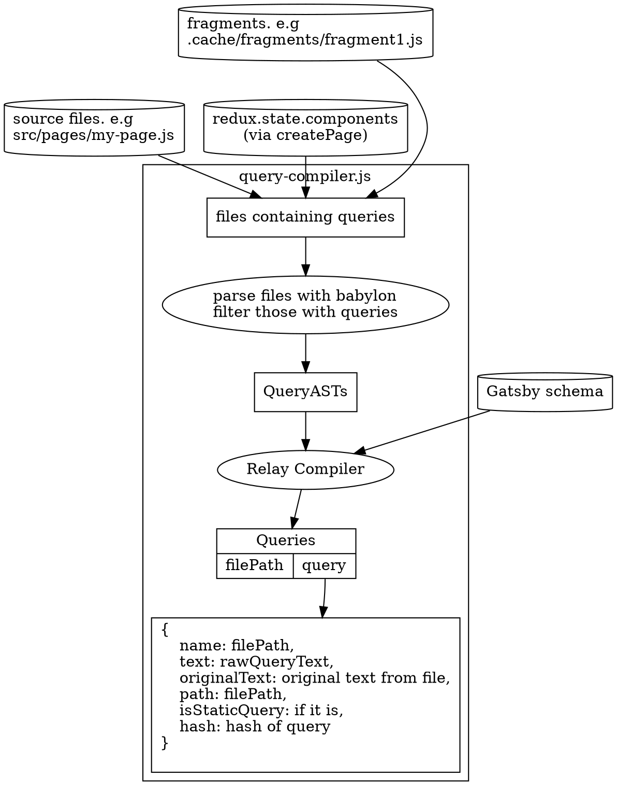
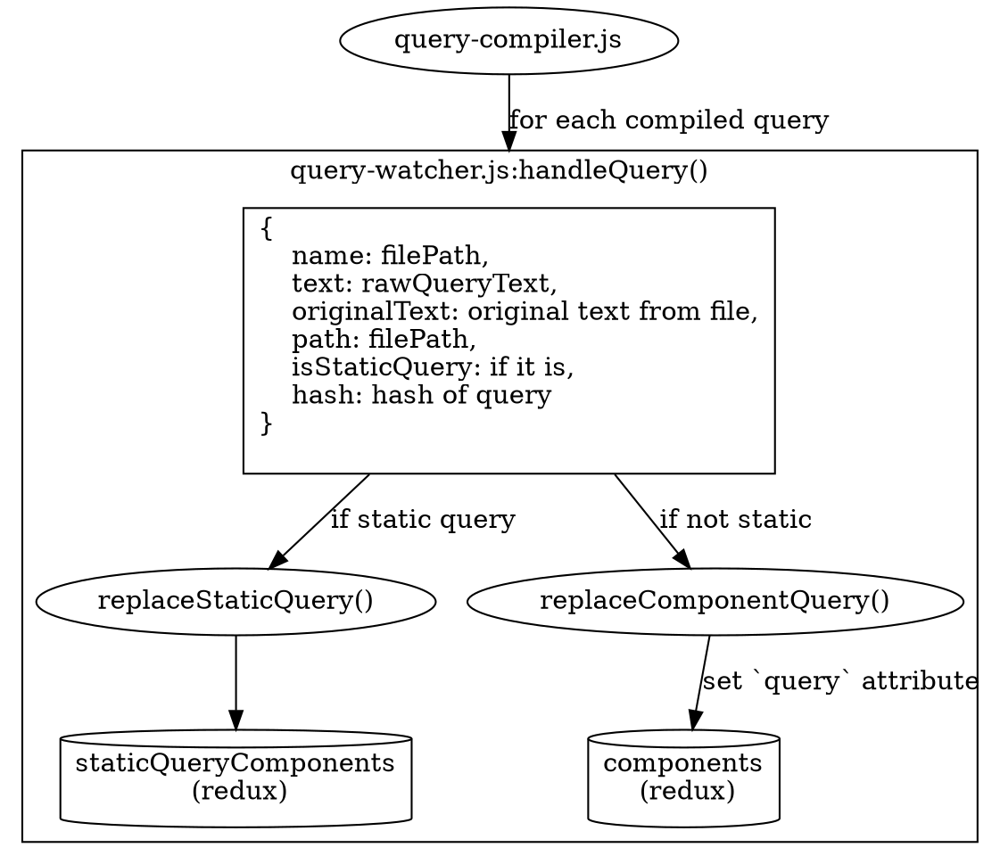
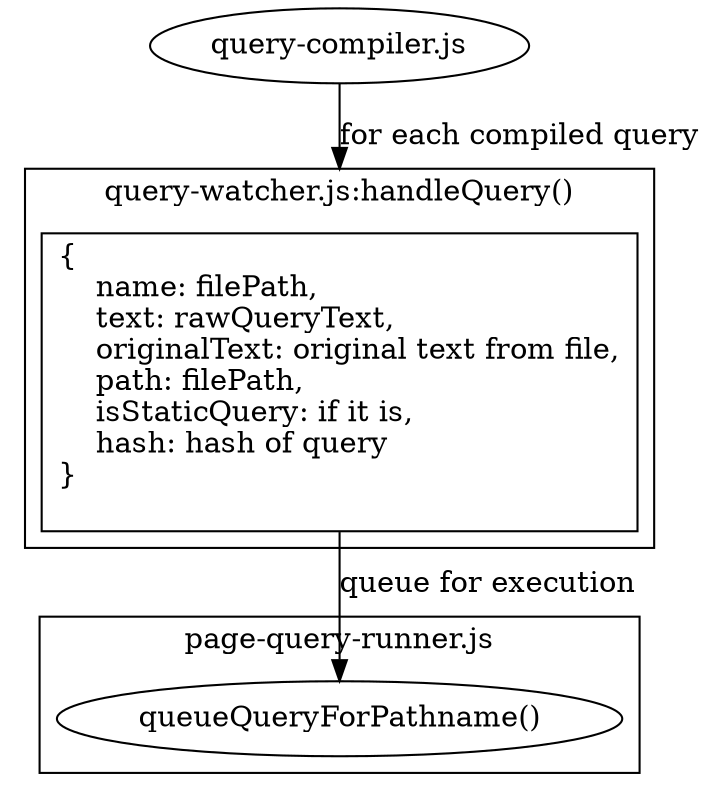

### Extracting Queries from Files

Up until now, we have [sourced all nodes](/docs/node-creation/) into redux, [inferred a schema](/docs/schema-generation/) from them, and [created all pages](/docs/page-creation/). The next step is to extract and compile all graphql queries from our source files. The entrypoint to this phase is [query-watcher extractQueries()](https://github.com/gatsbyjs/gatsby/blob/master/packages/gatsby/src/internal-plugins/query-runner/query-watcher.js), which immediately compiles all graphql queries by calling into [query-compiler.js](https://github.com/gatsbyjs/gatsby/blob/master/packages/gatsby/src/internal-plugins/query-runner/query-compiler.js).

#### Query Compilation

The first thing it does is use [babylon-traverse](https://babeljs.io/docs/en/next/babel-traverse.html) to load all JavaScript files in the site that have graphql queries in them. This produces AST results that are passed to the [relay-compiler](https://facebook.github.io/relay/docs/en/compiler-architecture.html). This accomplishes a couple of things:

1. It informs us of any malformed queries, which are promptly reported back to the user.
1. It builds a tree of queries and fragments they depend on. And outputs a single optimized query string with the fragments.

After this step, we will have a map of file paths (of site files with queries in them) to Query Objects, which contain the raw optimized query text, as well as other metadata such as the component path and page `jsonName`. The following diagram shows the flow involved during query compilation

#### Store Queries in Redux

We're now in the [handleQuery](https://github.com/gatsbyjs/gatsby/blob/master/packages/gatsby/src/internal-plugins/query-runner/query-watcher.js#L68) function.

If the query is a `StaticQuery`, we call the `replaceStaticQuery` action to save it to to the `staticQueryComponents` namespace which is a mapping from a component's path to an object that contains the raw GraphQL Query amongst other things. More details in [Static Queries](/docs/static-vs-normal-queries/). We also remove component's `jsonName` from the `components` Redux namespace. See [Page -> Node Dependencies](/docs/page-node-dependencies/).

If the query is just a normal every day query (not StaticQuery), then we update its component's `query` in the redux `components` namespace via the [replaceComponentQuery](https://github.com/gatsbyjs/gatsby/blob/master/packages/gatsby/src/redux/actions.js#L827) action.

#### Queue for execution

Now that we've saved our query, we're ready to queue it for execution. Query execution is mainly handled by [page-query-runner.js](https://github.com/gatsbyjs/gatsby/blob/master/packages/gatsby/src/internal-plugins/query-runner/page-query-runner.js), so we accomplish this by passing the component's path to `queueQueryForPathname` function.

Now let's learn about [Query Execution](/docs/query-execution/).
