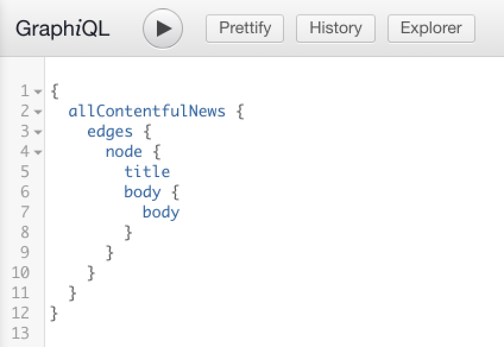

Data sourcing in Gatsby is plugin-driven; Source plugins fetch data from their source (e.g. the `gatsby-source-filesystem` plugin fetches data from the file system, the `gatsby-source-wordpress` plugin fetches data from the WordPress API, etc). You can also source the data yourself.

## Adding data to GraphQL

Gatsby's [GraphQL data layer](/docs/conceptual/graphql-concepts/) uses nodes to model chunks of data. Gatsby source plugins add source nodes that you can query for, but you can also create source nodes yourself. To add custom data to the GraphQL data layer yourself, Gatsby provides methods you can leverage.

This recipe shows you how to add custom data using `createNode()`.

### Directions

1. In `gatsby-node.js` use `sourceNodes()` and `actions.createNode()` to create and export nodes to be able to query the data.

```javascript:title=gatsby-node.js
exports.sourceNodes = ({ actions, createNodeId, createContentDigest }) => {
  const pokemons = [
    { name: "Pikachu", type: "electric" },
    { name: "Squirtle", type: "water" },
  ]

  pokemons.forEach(pokemon => {
    const node = {
      name: pokemon.name,
      type: pokemon.type,
      id: createNodeId(`Pokemon-${pokemon.name}`),
      internal: {
        type: "Pokemon",
        contentDigest: createContentDigest(pokemon),
      },
    }
    actions.createNode(node)
  })
}
```

2. Run `gatsby develop`.

   > _Note: After making changes in `gatsby-node.js` you need to re-run `gatsby develop` for the changes to take effect._

3. Query the data (in [GraphiQL](/docs/how-to/querying-data/running-queries-with-graphiql/) or in your components).

```graphql
query MyPokemonQuery {
  allPokemon {
    nodes {
      name
      type
      id
    }
  }
}
```

### Additional resources

- Walk through an example using the `gatsby-source-filesystem` plugin in [tutorial part five](/docs/tutorial/part-five/#source-plugins)
- Search available source plugins in the [Gatsby library](/plugins/?=source)
- Understand source plugins by building one in the [source plugin tutorial](/docs/how-to/plugins-and-themes/creating-a-source-plugin/)
- The createNode function [documentation](/docs/reference/config-files/actions/#createNode)

## Sourcing Markdown data for blog posts and pages with GraphQL

You can source Markdown data and use Gatsby's [`createPages` API](/docs/reference/config-files/actions/#createPage) to create pages dynamically.

This recipe shows how to create pages from Markdown files on your local filesystem using Gatsby's GraphQL data layer.

### Prerequisites

- A [Gatsby site](/docs/quick-start) with a `gatsby-config.js` file
- The [Gatsby CLI](/docs/reference/gatsby-cli) installed
- The [gatsby-source-filesystem plugin](/plugins/gatsby-source-filesystem) installed
- The [gatsby-transformer-remark plugin](/plugins/gatsby-transformer-remark) installed
- A `gatsby-node.js` file

### Directions

1. In `gatsby-config.js`, configure `gatsby-transformer-remark` along with `gatsby-source-filesystem` to pull in Markdown files from a source folder. This would be in addition to any previous `gatsby-source-filesystem` entries, such as for images:

```js:title=gatsby-config.js
module.exports = {
  plugins: [
    `gatsby-transformer-remark`,
    {
      resolve: `gatsby-source-filesystem`,
      options: {
        name: `content`,
        path: `${__dirname}/src/content`,
      },
    },
  ]
```

2. Add a Markdown post to `src/content`, including frontmatter for the title, date, and path, with some initial content for the body of the post:

```markdown:title=src/content/my-first-post.md
---
title: My First Post
date: 2019-07-10
path: /my-first-post
---

This is my first Gatsby post written in Markdown!
```

3. Start up the development server with `gatsby develop`, navigate to the GraphiQL explorer at `http://localhost:8000/___graphql`, and write a query to get all markdown data:

```graphql
{
  allMarkdownRemark {
    edges {
      node {
        frontmatter {
          path
        }
      }
    }
  }
}
```

<iframe
  title="Query for all markdown"
  src="https://q4xpb.sse.codesandbox.io/___graphql?explorerIsOpen=false&query=%7B%0A%20%20allMarkdownRemark%20%7B%0A%20%20%20%20edges%20%7B%0A%20%20%20%20%20%20node%20%7B%0A%20%20%20%20%20%20%20%20frontmatter%20%7B%0A%20%20%20%20%20%20%20%20%20%20path%0A%20%20%20%20%20%20%20%20%7D%0A%20%20%20%20%20%20%7D%0A%20%20%20%20%7D%0A%20%20%7D%0A%7D"
  width="600"
  height="300"
/>

4. Add the JavaScript code to generate pages from Markdown posts at build time by copying the GraphQL query into `gatsby-node.js` and looping through the results:

```js:title=gatsby-node.js
const path = require(`path`)

exports.createPages = async ({ actions, graphql }) => {
  const { createPage } = actions

  const result = await graphql(`
    {
      allMarkdownRemark {
        edges {
          node {
            frontmatter {
              path
            }
          }
        }
      }
    }
  `)
  if (result.errors) {
    console.error(result.errors)
  }

  result.data.allMarkdownRemark.edges.forEach(({ node }) => {
    createPage({
      path: node.frontmatter.path,
      component: path.resolve(`src/templates/post.js`),
    })
  })
}
```

5. Add a post template in `src/templates`, including a GraphQL query for generating pages dynamically from Markdown content at build time:

```jsx:title=src/templates/post.js
import React from "react"
import { graphql } from "gatsby"

export default function Template({ data }) {
  const { markdownRemark } = data // data.markdownRemark holds your post data
  const { frontmatter, html } = markdownRemark
  return (
    <div className="blog-post">
      <h1>{frontmatter.title}</h1>
      <h2>{frontmatter.date}</h2>
      <div
        className="blog-post-content"
        dangerouslySetInnerHTML={{ __html: html }}
      />
    </div>
  )
}

export const pageQuery = graphql`
  query($path: String!) {
    markdownRemark(frontmatter: { path: { eq: $path } }) {
      html
      frontmatter {
        date(formatString: "MMMM DD, YYYY")
        path
        title
      }
    }
  }
`
```

6. Run `gatsby develop` to restart the development server. View your post in the browser: `http://localhost:8000/my-first-post`

### Additional resources

- [Tutorial: Programmatically create pages from data](/docs/tutorial/part-seven/)
- [Creating and modifying pages](/docs/creating-and-modifying-pages/)
- [Adding Markdown pages](/docs/how-to/routing/adding-markdown-pages/)
- [Guide to creating pages from data programmatically](/docs/programmatically-create-pages-from-data/)
- [Example repo](https://github.com/gatsbyjs/gatsby/tree/master/examples/recipe-sourcing-markdown) for this recipe

## Sourcing from WordPress

### Prerequisites

- An existing [Gatsby site](/docs/quick-start/) with a `gatsby-config.js` and `gatsby-node.js` file
- A WordPress instance, either self-hosted or on Wordpress.com

### Directions

1. Install the `gatsby-source-wordpress` plugin by running the following command:

```shell
npm install gatsby-source-wordpress
```

2. Configure the plugin by modifying the `gatsby-config.js` file such that it includes the following:

```javascript:title=gatsby-config.js
module.exports = {
  ...
  plugins: [
    {
      resolve: `gatsby-source-wordpress`,
      options: {
        // baseUrl will need to be updated with your WordPress source
        baseUrl: `wpexample.com`,
        protocol: `https`,
        // is it hosted on wordpress.com, or self-hosted?
        hostingWPCOM: false,
        // does your site use the Advanced Custom Fields Plugin?
        useACF: false
      }
    },
  ]
}
```

> **Note:** Refer to the [`gatsby-source-wordpress` plugin docs](/plugins/gatsby-source-wordpress/?=wordpre#how-to-use) to know more about configuring your plugins.

3. Create a template component such as `src/templates/post.js` with the following code in it:

```jsx:title=post.js
import React, { Component } from "react"
import { graphql } from "gatsby"
import PropTypes from "prop-types"

class Post extends Component {
  render() {
    const post = this.props.data.wordpressPost

    return (
      <>
        <h1>{post.title}</h1>
        <div dangerouslySetInnerHTML={{ __html: post.content }} />
      </>
    )
  }
}

Post.propTypes = {
  data: PropTypes.object.isRequired,
  edges: PropTypes.array,
}

export default Post

export const pageQuery = graphql`
  query($id: String!) {
    wordpressPost(id: { eq: $id }) {
      title
      content
    }
  }
`
```

4. Create dynamic pages for your WordPress posts by pasting the following sample code in `gatsby-node.js`:

```javascript:title=gatsby-node.js
const path = require(`path`)
const { slash } = require(`gatsby-core-utils`)

exports.createPages = async ({ graphql, actions }) => {
  const { createPage } = actions

  // query content for WordPress posts
  const result = await graphql(`
    query {
      allWordpressPost {
        edges {
          node {
            id
            slug
          }
        }
      }
    }
  `)

  const postTemplate = path.resolve(`./src/templates/post.js`)
  result.data.allWordpressPost.edges.forEach(edge => {
    createPage({
      // `path` will be the url for the page
      path: edge.node.slug,
      // specify the component template of your choice
      component: slash(postTemplate),
      // In the ^template's GraphQL query, 'id' will be available
      // as a GraphQL variable to query for this posts's data.
      context: {
        id: edge.node.id,
      },
    })
  })
}
```

5. Run `gatsby-develop` to see the newly generated pages and navigate through them.

6. Open the `GraphiQL IDE` at `http://localhost:8000/__graphql` and open the Docs or Explorer to observe the queryable fields for `allWordpressPosts`.

The dynamic pages created above in `gatsby-node.js` have unique paths for navigating to particular posts, using a template component for the posts and a sample GraphQL query to source WordPress post content.

### Additional resources

- [Getting Started with WordPress and Gatsby](/blog/2019-04-26-how-to-build-a-blog-with-wordpress-and-gatsby-part-1/)
- More on [Sourcing from WordPress](/docs/how-to/sourcing-data/sourcing-from-wordpress/)
- [Live example on Sourcing from WordPress](https://github.com/gatsbyjs/gatsby/tree/master/examples/using-wordpress)

## Sourcing data from Contentful

### Prerequisites

- A [Gatsby site](/docs/quick-start/)
- A [Contentful account](https://www.contentful.com/)
- The [Contentful CLI](https://www.npmjs.com/package/contentful-cli) installed

### Directions

1. Log in to Contentful with the CLI and follow the steps. It will help you create an account if you don't have one.

```shell
contentful login
```

2. Create a new space if you don't already have one. Make sure to save the space ID given to you at the end of the command. If you already have a Contentful space and space ID, you can skip steps 2 and 3.

Note: for new accounts, you can overwrite the default onboarding space. Check to see the [spaces included with your account](https://app.contentful.com/account/profile/space_memberships).

```shell
contentful space create --name 'Gatsby example'
```

3. Seed the new space with example blog content using the new space ID returned from the previous command, in place of `<space ID>`.

```shell
contentful space seed -s '<space ID>' -t blog
```

For example, with a space ID in place: `contentful space seed -s '22fzx88spbp7' -t blog`

4. Create a new access token for your space. Remember this token, as you will need it in step 6.

```shell
contentful space accesstoken create -s '<space ID>' --name 'Example token'
```

5. Install the `gatsby-source-contentful` plugin in your Gatsby site:

```shell
npm install gatsby-source-contentful
```

6. Edit the file `gatsby-config.js` and add the `gatsby-source-contentful` to the `plugins` array to enable the plugin. You should strongly consider using [environment variables](/docs/how-to/local-development/environment-variables/) to store your space ID and token for security purposes.

```javascript:title=gatsby-config.js
plugins: [
   // add to array along with any other installed plugins
   // highlight-start
   {


    resolve: `gatsby-source-contentful`,
    options: {
      spaceId: `<space ID>`, // or process.env.CONTENTFUL_SPACE_ID
      accessToken: `<access token>`, // or process.env.CONTENTFUL_TOKEN
    },
  },
  // highlight-end
],
```

7. Run `gatsby develop` and make sure the site compiled successfully.

8. Query data with the [GraphiQL editor](/docs/how-to/querying-data/running-queries-with-graphiql/) at `http://localhost:8000/___graphql`. The Contentful plugin adds several new node types to your site, including every content type in your Contentful website. Your example space with a "Blog Post" content type produces a `allContentfulBlogPost` node type in GraphQL.



To query for Blog Post titles from Contentful, use the following GraphQL query:

```graphql
{
  allContentfulBlogPost {
    edges {
      node {
        title
      }
    }
  }
}
```

Contentful nodes also include several metadata fields like `createdAt` or `node_locale`.

9. To show a list of links to the blog posts, create a new file in `/src/pages/blog.js`. This page will display all posts, sorted by updated date.

```jsx:title=src/pages/blog.js
import React from "react"
import { graphql, Link } from "gatsby"

const BlogPage = ({ data }) => (
  <div>
    <h1>Blog</h1>
    <ul>
      {data.allContentfulBlogPost.edges.map(({ node, index }) => (
        <li key={index}>
          <Link to={`/blog/${node.slug}`}>{node.title}</Link>
        </li>
      ))}
    </ul>
  </div>
)

export default BlogPage

export const query = graphql`
  {
    allContentfulBlogPost(sort: { fields: [updatedAt] }) {
      edges {
        node {
          title
          slug
        }
      }
    }
  }
`
```

To continue building out your Contentful site including post detail pages, check out the rest of the [Gatsby docs](/docs/how-to/sourcing-data/sourcing-from-contentful/) and additional resources below.

### Additional resources

- [Building a Site with React and Contentful](/blog/2018-1-25-building-a-site-with-react-and-contentful/)
- [More on Sourcing from Contentful](/docs/how-to/sourcing-data/sourcing-from-contentful/)
- [Contentful source plugin](/plugins/gatsby-source-contentful/)
- [Long-text field types returned as objects](/plugins/gatsby-source-contentful/#a-note-about-longtext-fields)
- [Example repository for this recipe](https://github.com/gatsbyjs/gatsby/tree/master/examples/recipe-sourcing-contentful)

## Pulling data from an external source and creating pages without GraphQL

You don't have to use the GraphQL data layer to include data in pages, [though there are reasons why you should consider GraphQL](/docs/why-gatsby-uses-graphql/). You can use the node `createPages` API to pull unstructured data directly into Gatsby sites rather than through GraphQL and source plugins.

In this recipe, you'll create dynamic pages from data fetched from the [PokéAPI’s REST endpoints](https://www.pokeapi.co/). The [full example](https://github.com/jlengstorf/gatsby-with-unstructured-data/) can be found on GitHub.

### Prerequisites

- A Gatsby Site with a `gatsby-node.js` file
- The [Gatsby CLI](/docs/reference/gatsby-cli) installed
- The [axios](https://www.npmjs.com/package/axios) package installed through npm

### Directions

1. In `gatsby-node.js`, add the JavaScript code to fetch data from the PokéAPI and programmatically create an index page:

```js:title=gatsby-node.js
const axios = require("axios")

const get = endpoint => axios.get(`https://pokeapi.co/api/v2${endpoint}`)

const getPokemonData = names =>
  Promise.all(
    names.map(async name => {
      const { data: pokemon } = await get(`/pokemon/${name}`)
      return { ...pokemon }
    })
  )
exports.createPages = async ({ actions: { createPage } }) => {
  const allPokemon = await getPokemonData(["pikachu", "charizard", "squirtle"])

  // Create a page that lists Pokémon.
  createPage({
    path: `/`,
    component: require.resolve("./src/templates/all-pokemon.js"),
    context: { allPokemon },
  })
}
```

2. Create a template to display Pokémon on the homepage:

```jsx:title=src/templates/all-pokemon.js
import React from "react"

export default function AllPokemon({ pageContext: { allPokemon } }) {
  return (
    <div>
      <h1>Behold, the Pokémon!</h1>
      <ul>
        {allPokemon.map(pokemon => (
          <li key={pokemon.id}>
            
            <p>{pokemon.name}</p>
          </li>
        ))}
      </ul>
    </div>
  )
}
```

3. Run `gatsby develop` to fetch the data, build pages, and start the development server.
4. View your homepage in a browser: `http://localhost:8000`

### Additional resources

- [Full Pokemon data repo](https://github.com/jlengstorf/gatsby-with-unstructured-data/)
- More on using unstructured data in [Using Gatsby without GraphQL](/docs/how-to/querying-data/using-gatsby-without-graphql/)
- When and how to [query data with GraphQL](/docs/conceptual/graphql-concepts/) for more complex Gatsby sites

## Sourcing content from Drupal

### Prerequisites

- A [Gatsby site](/docs/quick-start)
- A [Drupal](http://drupal.org) site
- The [JSON:API module](https://www.drupal.org/project/jsonapi) installed and enabled on the Drupal site

### Directions

1. Install the `gatsby-source-drupal` plugin.

```shell
npm install gatsby-source-drupal
```

2. Edit your `gatsby-config.js` file to enable the plugin and configure it.

```javascript:title=gatsby-config.js
module.exports = {
  plugins: [
    {
      resolve: `gatsby-source-drupal`,
      options: {
        baseUrl: `https://your-website/`,
        apiBase: `api`, // optional, defaults to `jsonapi`
      },
    },
  ],
}
```

3. Start the development server with `gatsby develop`, and open the GraphiQL explorer at `http://localhost:8000/___graphql`. Under the Explorer tab, you should see new node types, such as `allBlockBlock` for Drupal blocks, and one for every content type in your Drupal site. For example, if you have a "Page" content type, it will be available as `allNodePage`. To query all "Page" nodes for their title and body, use a query like:

```graphql
{
  allNodePage {
    edges {
      node {
        title
        body {
          value
        }
      }
    }
  }
}
```

4. To use your Drupal data, create a new page in your Gatsby site at `src/pages/drupal.js`. This page will list all Drupal "Page" nodes.

_**Note:** the exact GraphQL schema will depend on your how Drupal instance is structured._

```jsx:title=src/pages/drupal.js
import React from "react"
import { graphql } from "gatsby"

const DrupalPage = ({ data }) => (
  <div>
    <h1>Drupal pages</h1>
    <ul>
    {data.allNodePage.edges.map(({ node, index }) => (
      <li key={index}>
        <h2>{node.title}</h2>
        <div>
          {node.body.value}
        </div>
      </li>
    ))}
   </ul>
  </div>
)

export default DrupalPage

export const query = graphql`
  {
  allNodePage {
    edges {
      node {
        title
        body {
          value
        }
      }
    }
  }
}
```

5. With the development server running, you can view the new page by visiting `http://localhost:8000/drupal`.

### Additional Resources

- [Using Decoupled Drupal with Gatsby](/blog/2018-08-13-using-decoupled-drupal-with-gatsby/)
- [More on sourcing from Drupal](/docs/how-to/sourcing-data/sourcing-from-drupal)
- [Tutorial: Programmatically create pages from data](/docs/tutorial/part-seven/)
