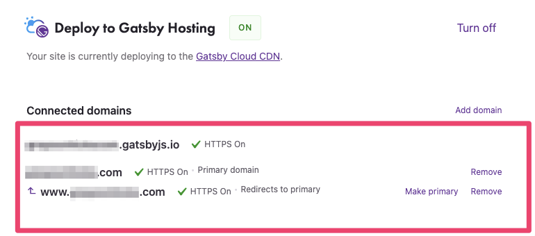
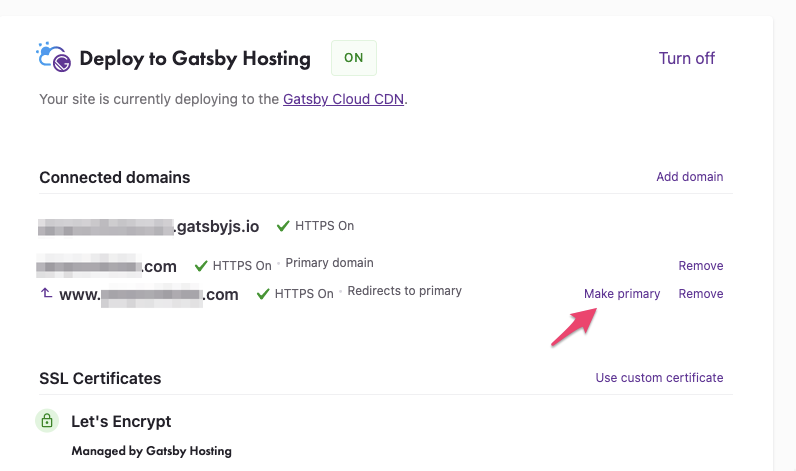
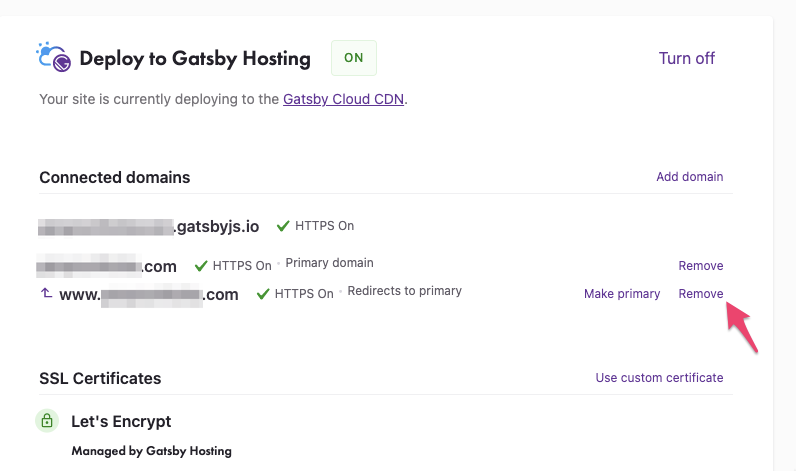
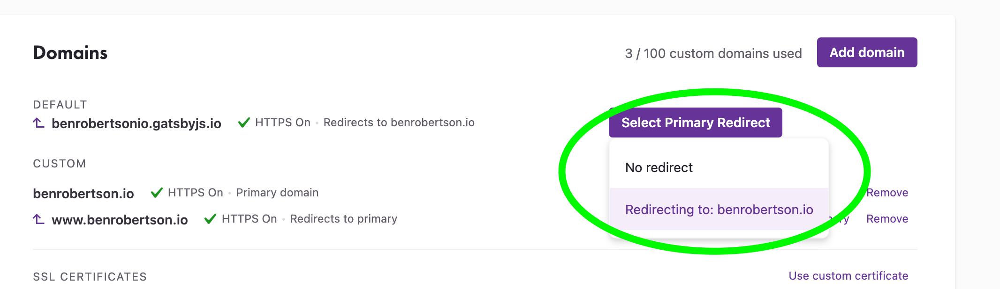

## Introduction

Adding a custom domain to your Gatsby Cloud site will add both the [apex domain](https://datacadamia.com/network/name/apex#about) and "www" subdomain. This guide will show you how to configure these domains, and redirect between the two.

### Adding the domain

1. Add either an apex domain or `www` subdomain to your Gatsby Hosting configuration. You can read more about adding a domain in [Adding a Custom Domain](/docs/how-to/cloud/adding-a-custom-domain/).

2. You should see a redirect pair of domains with the domain you entered as a "Primary domain".

3. Follow the directions for adding [DNS records](https://www.cloudflare.com/learning/dns/dns-records/) for both of the domains that are listed. The apex domain will need an A record pointed to an IP address and the subdomain will need a CNAME pointed at your Gatsby Hosting default URL, `YOUR_SITE_PREFIX`.

### Switching the redirect

If you want the redirected domain to be the primary domain, click the **"Make Primary"** button on the right-hand side of the domain listing.

### Removing a domain from a redirect

To remove a domain from the redirect, click **"Remove"** on the right-hand side of the domain listing. The remaining domain will act as a non-redirected domain, regardless of whether it was the primary domain.

If you re-add the domain you just removed, both domains will act as primary domains without a redirect. If you need to re-add the redirect, remove both domains and start over.

### Adding the gatsbyjs.io domain to a redirect

Gatsby Cloud now allows you to redirect your `gatsbyjs.io` domain to your primary domain. This ensures that search engines don't index the `gatsbyjs.io` domain. To do this:

1. Next to where your `gatsbyjs.io` domain is listed, click **"Select Primary Redirect"**.
1. Select a Primary domain:

All `gatsbyjs.io` domains will 301 redirect to the primary domain that you select. A 301, or permanent, redirect is when the server signals to the browser that this page has been permanently moved to another location.
