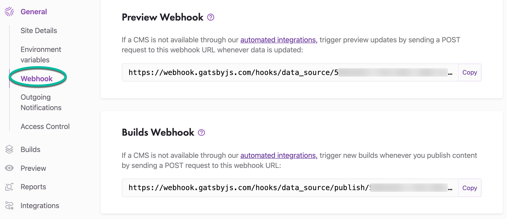
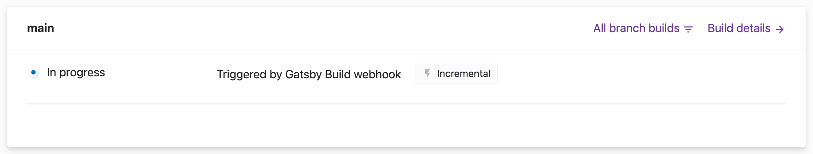
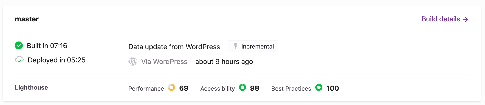

In this guide, you'll learn the differences between Build and Preview webhooks, and how each interacts with your Gatsby Cloud site.

## Using webhooks

For every site, Gatsby Cloud provides two webhooks:

A Build Webhook which triggers a Production Build,
and a Preview Webhook which triggers a CMS Preview build.
These webhooks can be found by going to "Site Settings" then selecting **"General > Webhook"** in the sidebar menu.



When you connect a content management system (CMS) to your site (manually or via Quick Connect), it uses these webhooks to trigger your builds.

You can use any tool (Postman, Zapier, etc.) to send a `POST` request to either of the webhooks. For example, here's the structure for a `curl` request to some site's Preview Webhook:

```shell
curl -X POST https://webhook.gatsbyjs.com/hooks/data_source/<site id>
```

## How do you know a webhook worked?

You can tell when a build is triggered via webhook by inspecting the build card. For example, a build triggered via the Build Webhook will say "Triggered by Gatsby Build Webhook."



However, if the build is triggered by one of the officially supported CMSs, the build card will indicate the name of the CMS that triggered it.



## Specifying a data source

You can use the `x-gatsby-cloud-data-source` HTTP header to specify the data source you want to refresh. For example, if your source plugin is called `gatsby-source-awesome` then you want to send `"x-gatsby-cloud-data-source": "gatsby-source-awesome"` as a header value in the webhook.

Note: The `x-gatsby-cloud-data-source` header value must include "gatsby-source" in the name for it to be considered a valid source.

## Clearing the cache

If you need to trigger a cache clear before you build, you can do this by making a `POST` request to `https://webhook.gatsbyjs.com/hooks/builds/trigger/:siteId` with the header `x-gatsby-cache: false`, which will trigger a build with no cache. If you want to use this for previews, add an additional header: `x-runner-type: PREVIEW`.
Using `curl`, the request would look like this for clearing cache on a build:

```shell
curl -X POST https://webhook.gatsbyjs.com/hooks/builds/trigger/<site id> --header "x-gatsby-cache: false"
```
