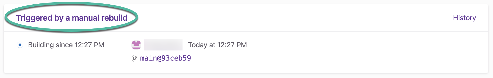
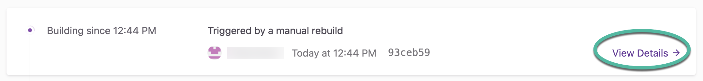
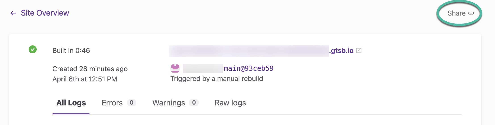
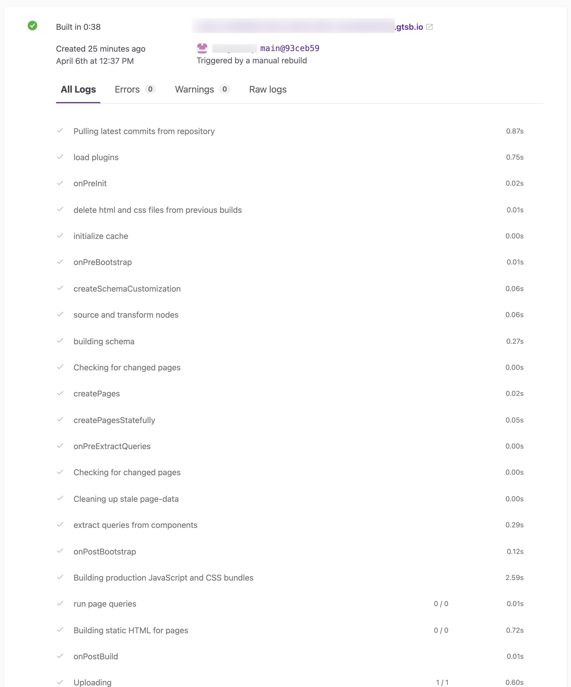
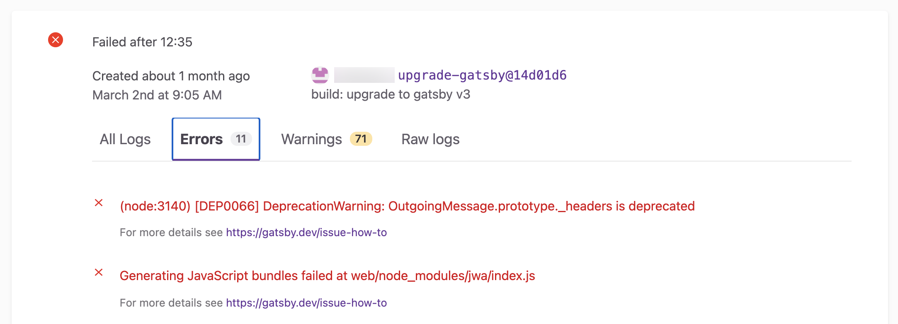
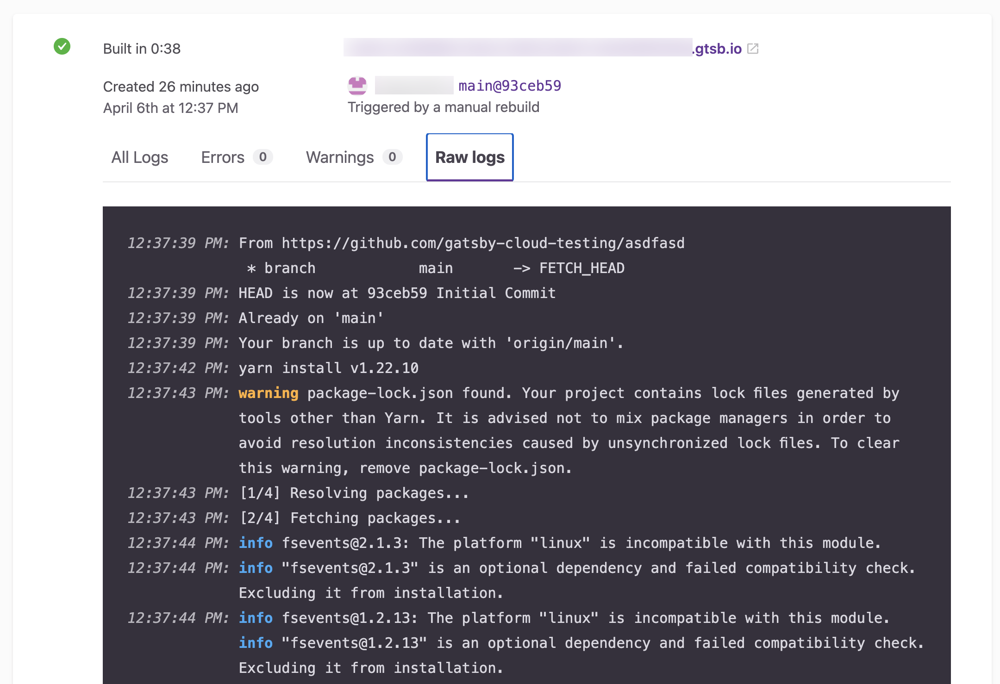

Gatsby Cloud provides a few helpful views of build logs to understand more about what is happening during the build process.

## Viewing build logs

You can view logs by clicking on the "title link" on any Production or Pull Request build card.

For CMS Preview builds, click the **"View Details"** link on the build card.

Select **"Share"** at the top of the logs page to copy the page link. This is useful for when you need to contact Customer Support.

## Structured logs

Structured logs provide an immediate, high-level overview of the status of your build. They include information about how long each build step lasted as well as any warnings or errors. They are shown in the "All Logs" tab. Structure logging is only available on Gatsby version `2.16.0` or later.

### Error and warning logs

The Error and Warnings tabs filter the structured logging to only show, errors or warnings, respectively.

## Raw logs

Raw logs provide the full, unstructured build process output. They are useful for finding more detail about exactly where things went wrong.

### Verbose logs

You can get verbose logging by [setting an environment variable](/docs/reference/cloud/managing-environment-variables): `VERBOSE=1`
