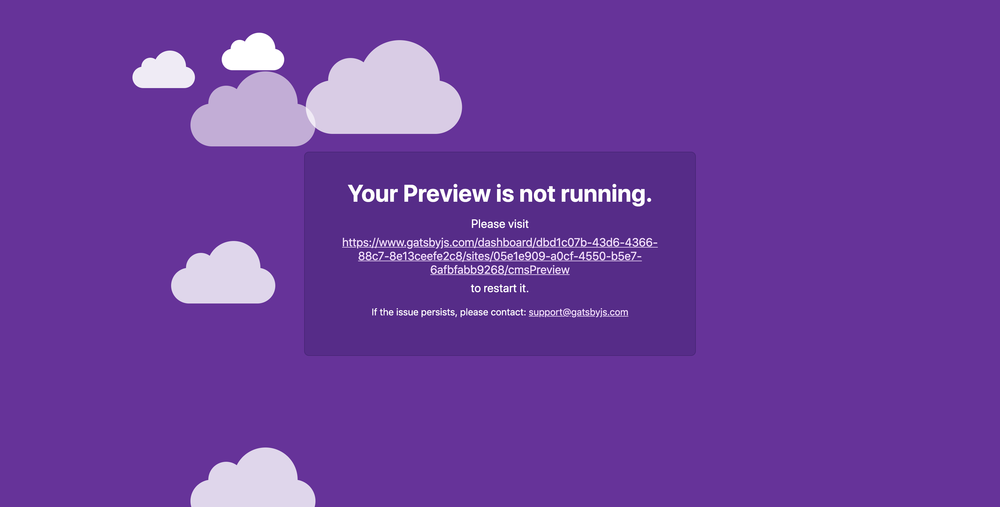

Gatsby Cloud has several soft and hard limits to prevent abuse on the platform. These limits apply separately to the use of Builds and Hosting. Gatsby may take action to reduce or limit your usage, and whenever possible, you'll be notified before any action is taken. Below is a guide to the general limits it is expected most users will fall below for each plan.

## Build limits

|           | Free  | Professional | Agency      | Enterprise |
| --------- | ----- | ------------ | ----------- | ---------- |
| Memory    | 1GB   | 8GB          | 8GB         | 8+ GB      |
| Bandwidth | 100GB | Up to 1TB    | Up to 1.5TB | Custom     |

Running into memory errors? See [Resolving Out-of-Memory Issues](/docs/how-to/performance/resolving-out-of-memory-issues/).

## Hosting limits

|           | Free              | Professional             | Agency                   | Enterprise |
| --------- | ----------------- | ------------------------ | ------------------------ | ---------- |
| Requests  | 1,000,000 / month | Up to 10,000,000 / month | Up to 15,000,000 / month | Custom     |
| Bandwidth | 100GB / month     | Up to 1TB / month        | Up to 1.5TB / month      | Custom     |

The above limits are upgradeable on an ad hoc basis for a Professional plan. These limits serve as a guide to help you pick the right plan for your needs. Visit our [Pricing](https://www.gatsbyjs.com/pricing/) page to see more details about what’s included in each plan and what plan might be right for your use case.

## Functions platform limits

Serverless Functions on Gatsby Cloud are included in all plans with increasing monthly allotments based on the plan.

|                               | Free    | Professional | Agency  | Enterprise |
| ----------------------------- | ------- | ------------ | ------- | ---------- |
| Invocations / month           | 100,000 | 250,000      | 500,000 | Custom     |
| Invocation Memory Consumption | 128MB   | 512MB        | 512MB   | 1GB        |
| Invocation Timeout            | 15s     | 15s          | 15s     | 15s        |

## SSR/DSG limits

On the free tier, If none of the sites in the organization get any SSR/DSG requests for seven(7) days, the service will be scaled to 0. The next time a request comes in, it will scale back up. This first request will be slower than a normal request. After that, the service will stay scaled up for a minimum of 7 days again (every request resets the 7-day counter).

For Professional plans, the duration is 14 days and Enterprise never scales down.

## Resource timeouts

Gatsby Cloud terminates cloud resources when the customer’s cloud container does not create a build within a timeout period. For the Performance and Enterprise tiers, this timeout is applied differently between Builds and Gatsby Preview. These timeout limitations across all tiers are subject to change at the discretion of Gatsby, Inc. We reserve the right to adjust these limitations at any time.

The timeout periods for each pricing tier are listed below:

|                             | Free   | Professional | Agency  | Enterprise |
| --------------------------- | ------ | ------------ | ------- | ---------- |
| Cloud Builds Timeout Period | 1 hour | 4 hours      | 4 hours | 24 hours   |
| Preview Timeout Period\*    | 1 hour | 4 hours      | 4 hours | 36 Hours   |

\*_Preview timeout period only applies to the legacy CMS Previews experience. Currently, the following source plugins use legacy previews:_

- `gatsby-source-sanity`
- `gatsby-source-wordpress < 5.2.3`
- `gatsby-source-datocms < 2.6.15`

When Gatsby Cloud terminates your resource after the timeout period, the next build will require restarting your resources. Typically in cloud infrastructure, this would mean a cold build, but each Gatsby Cloud build saves the Gatsby Cache to cloud storage. Upon restarting your resource, Gatsby Cloud will restore the previously saved Gatsby cache to attempt a “warm” build. However, builds created after the timeout period may be slower depending on the state of the Gatsby Cache.

The Gatsby Cache works for Production Builds, as well as Pull Request and CMS Preview builds. However, when CMS Previews timeout, the URL for that preview will return an idle screen similar to the screenshot below. A Gatsby Cloud user can visit the link on that page to restart the preview for your content editors.

