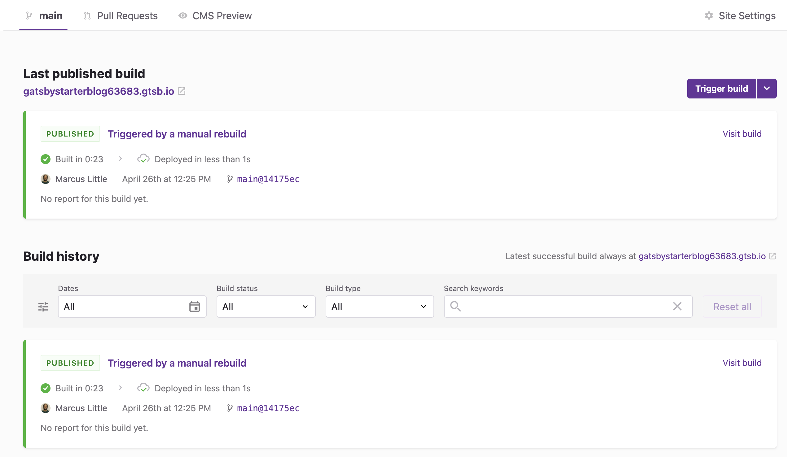
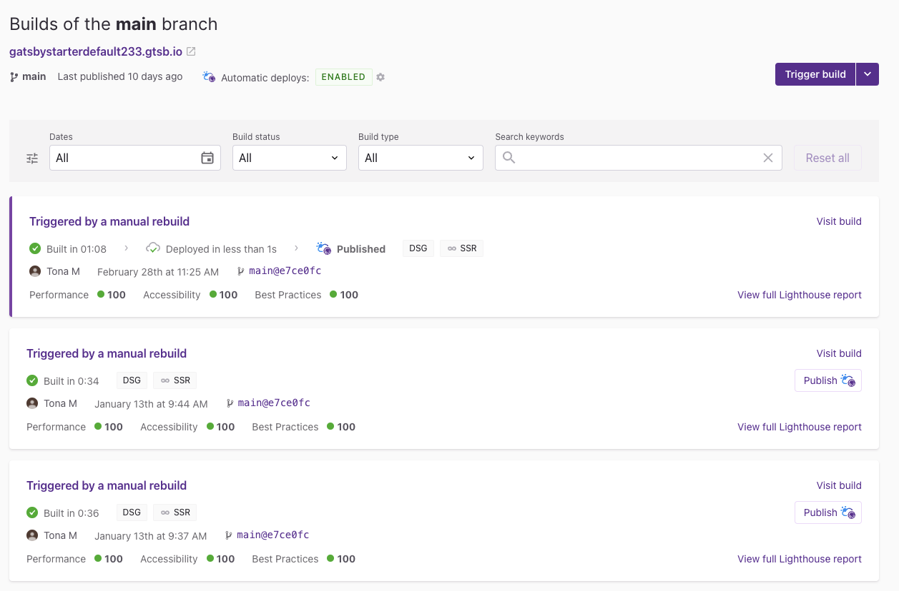
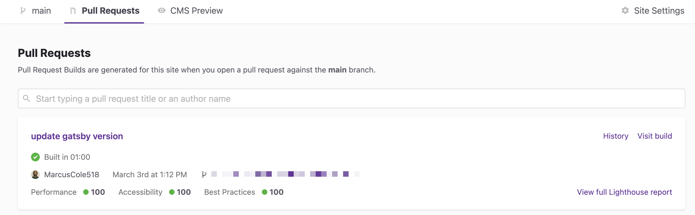

Production Builds and Pull Request Builds are used for readying your site for deployment. When you add a site to Gatsby Cloud, you will find them under the **"Deploys"** tab of the Site Overview page.

## Production builds

A Production Build is a build of your site's production branch, i.e., the repository branch you select when creating a site. Production builds are suitable for hosting on the internet. If you enable Gatsby Hosting or connect your site to a 3rd party hosting service, the site will automatically deploy after a Production Build completes.

### How production builds are triggered

A Production Build may be triggered when any of the following events occur:

- a new Gatsby Cloud site is created
- a Git commit to the production branch (e.g. pushing a new code or merging a pull request)
- the **Trigger Build** button in the Gatsby Cloud user interface is clicked
  a `POST` request to the Build Webhook
- an update from a connected content management system (configuration dependent)
- A change is made to an environment variable or hosting configuration

You can search for a specific production build. Here's how:

- Filter by a specific date or a date range
- Filter by build status
- Filter by build type
- Search: Can search multiple keywords. The search spans Github commit messages, Github commit ID as well as GitHub user id. Any match found in these areas will be listed.

## Pull request builds

A Pull Request Build is a build of a non-production branch of your site. Pull Request Builds are intended to show the impact of potential code changes before merging those changes into your production branch.

### How pull request builds are triggered

A **Pull Request** Build will be triggered when any of the following events occur:

- a pull request (PR) is opened against the site's production branch
- a new commit is pushed to the PR branch
- the **Trigger Build** button in the Gatsby Cloud user interface is clicked
