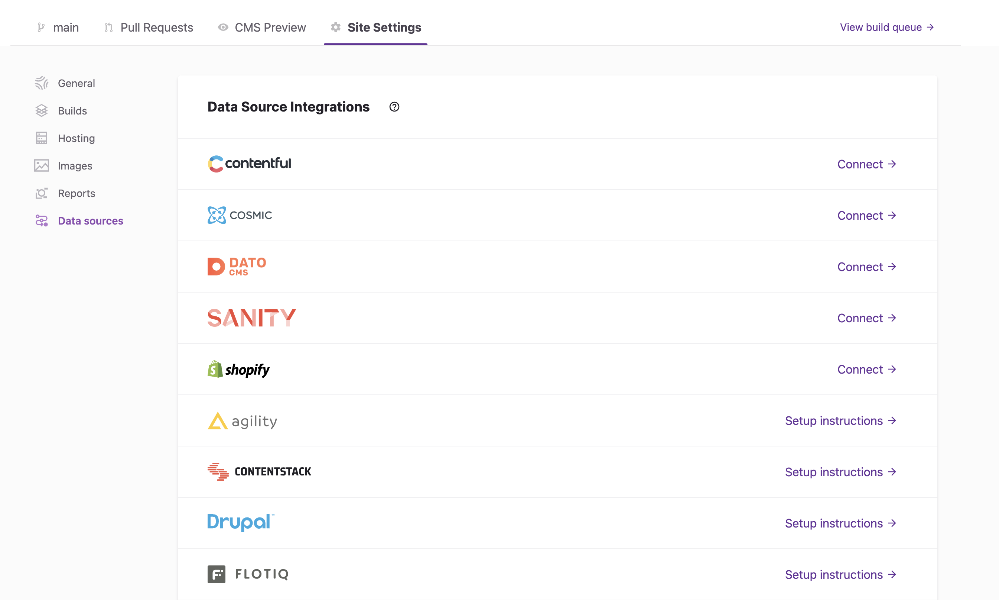
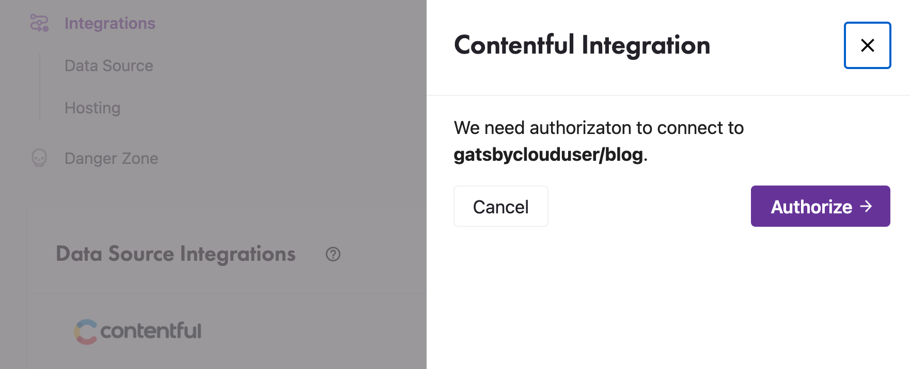
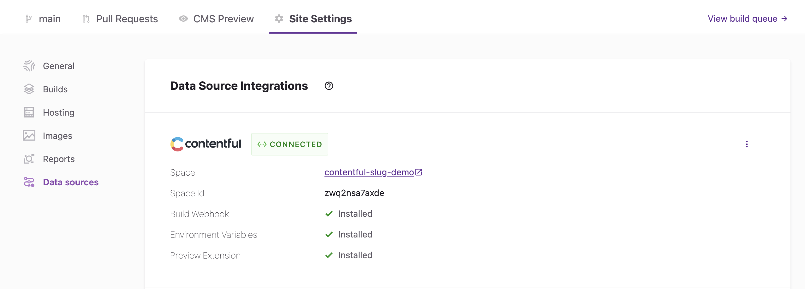

Quick Connect is a Gatsby Cloud feature that handles automatically configuring your content management system (CMS) integration. Quick Connect shows up in three places:

- During the "Integrations" step when creating a site from a repository or template.
- During the "Connect CMS" step when creating a site from a CMS specific template.
- When setting up a data source integration via "Site Settings".

Quick Connect is available for the following CMS providers:

- Contentful
- Cosmic
- DatoCMS
- Sanity
- Shopify

## Connecting during site creation

When creating a site from a CMS specific starter, Quick Connect will bootstrap the entire CMS project required to provide content to the new site. All of the content models, content, webhooks, and environment variables will be configured automatically.

When creating a site from a Gatsby project repository, Quick Connect will prompt you to choose the CMS project to associate the site with. For detailed instructions, see the guide for [connecting to your specific CMS](https://support.gatsbyjs.com/hc/en-us/sections/360011112314-Connecting-to-a-Content-Management-System).

## Connecting using Site Settings

You can set up a data source integration for a site you previously created by going to **"Site Settings > Data Sources"**.

Clicking **"Connect"** will start the setup process for the data source integration. You will be prompted to authorize Gatsby Cloud to connect to your CMS by logging in to your CMS account or providing an authentication token.

Once authorized, Quick Connect will automatically configure webhooks, environment variables, and the preview extension (where applicable) for your CMS.

Quick Connect assumes some default environment variable names for things like access tokens and project IDs, so you may need to modify them to match the variable names in your project. Again, see the guide for [connecting to your specific CMS](https://support.gatsbyjs.com/hc/en-us/sections/360011112314) for more information. Also, see the [Managing Environment Variables](/docs/reference/cloud/managing-environment-variables/) guide.
