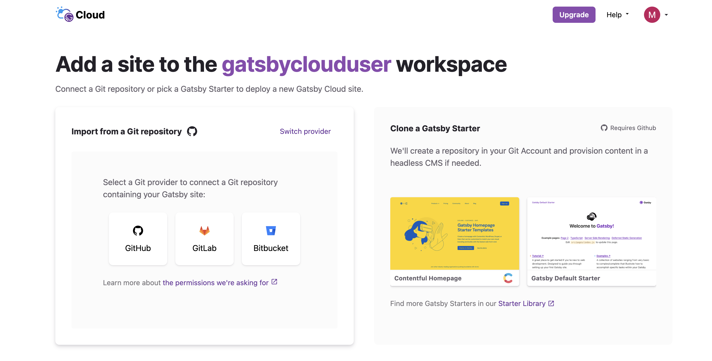
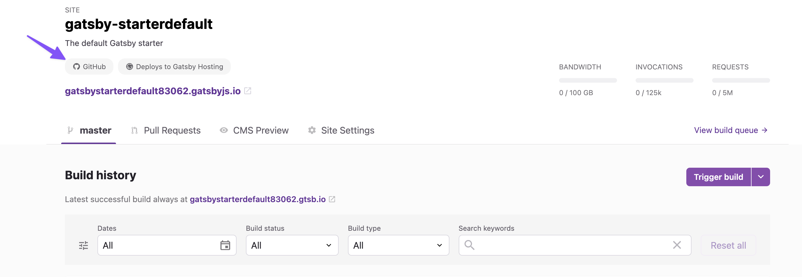
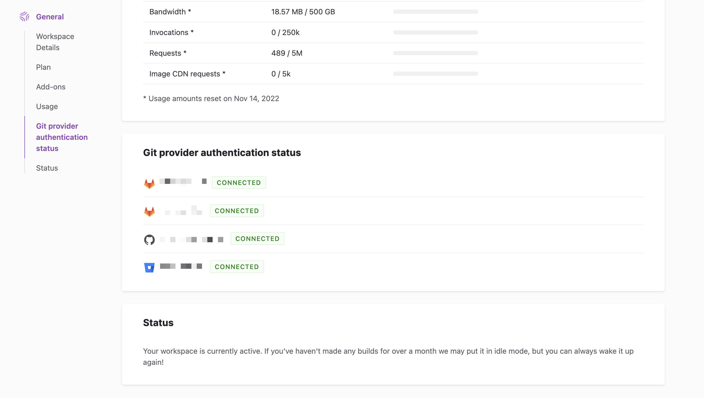

Gatsby Cloud provides VCS ([Version Control System](https://www.atlassian.com/git/tutorials/what-is-version-control)) integrations for your repositories in three major Git providers:

- Github
- GitLab
- Bitbucket

These integrations allow you to automatically trigger builds for your commits and pull requests, and update your Gatsby Cloud site in real time.

## Connecting to a Git provider

When [creating a Gatsby Cloud site from a repository](/docs/how-to/cloud/create-site-from-repository), you'll be prompted to select one of the supported Git providers from which to import your repository:

## Linking to the repository

Depending on the Git provider you choose, a corresponding badge will be displayed on the site which links directly to the repository:

## Git provider authentication status

Under "Workspace Settings > Git provider authentication status" you can view the status of the connections to each Git provider you've integrated with.

If any of these integrations has a failed connection, the **workspace owner** can refresh the connection from this tab.

