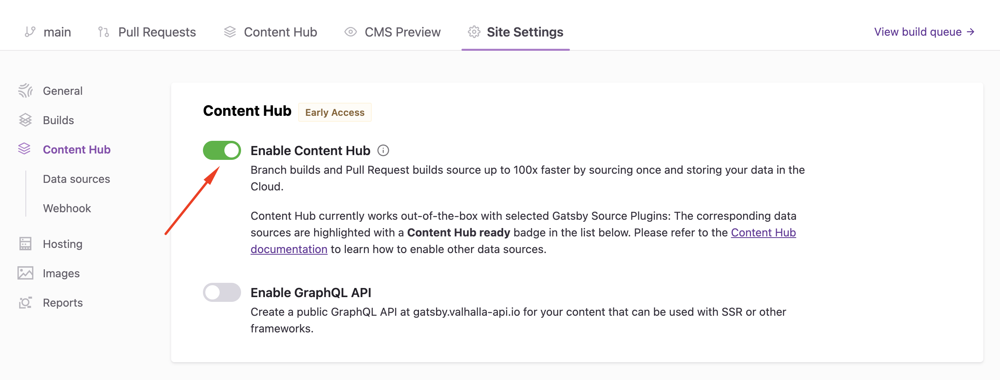
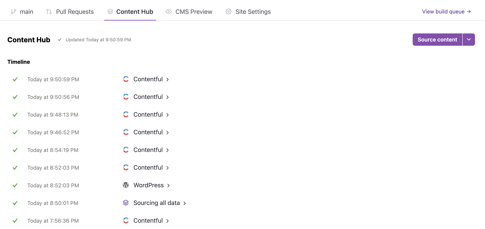
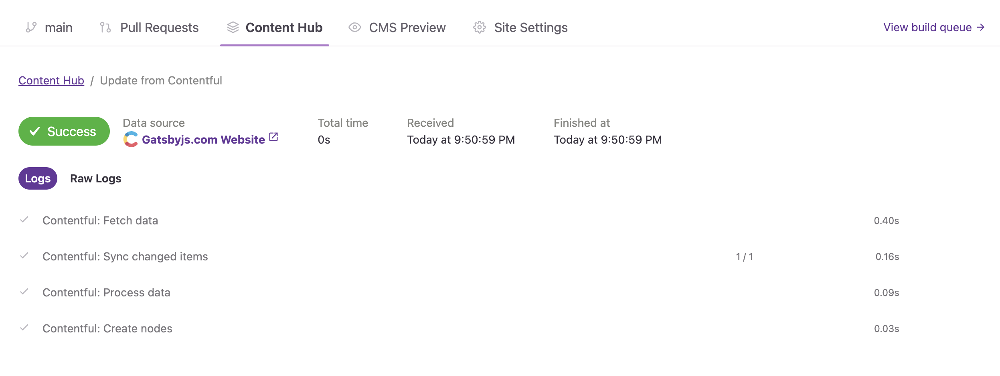
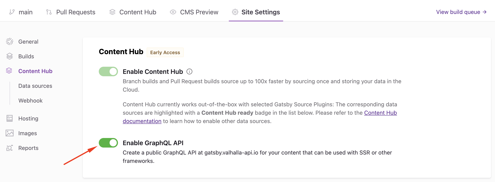
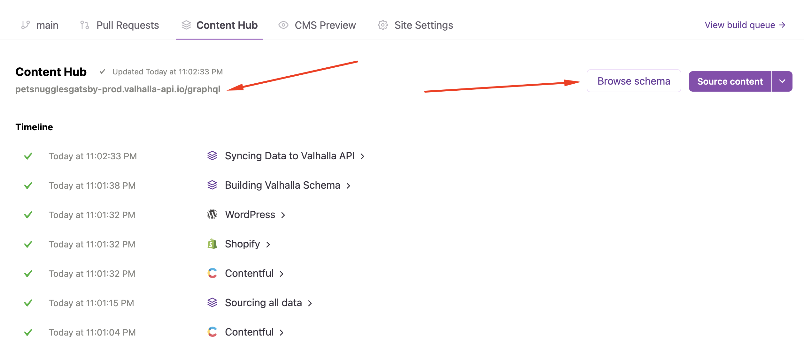

## Introduction

This guide will show you how to enable and use Valhalla Content Hub with a Gatsby site on [Gatsby Cloud](/dashboard/signup). Valhalla Content Hub caches your Gatsby site's [data layer](/docs/conceptual/graphql-concepts/). This speeds up the sourcing process of your builds for large content sites. With Valhalla Content Hub, you can also enable a GraphQL API that will allow you to access your Gatsby data outside of the build process.

## Prerequisites

- You have to have an account on Gatsby Cloud, you can [sign up here](/dashboard/signup).
- An existing workspace and Gatsby site that meet the requirements below.

Gatsby Cloud Workspace requirements:

- Valhalla Content Hub must be turned on for your Gatsby Cloud workspace before it can be enabled on your Gatsby site.
- Valhalla Content Hub can be turned on for agency and enterprise customers. If you are a professional customer, you can request early access from the Content Hub tab of your Gatsby site if you would like to join our early access program.

Valhalla Content Hub currently only works with the following source plugins:

- [`gatsby-source-contentful`](/plugins/gatsby-source-contentful/)
- [`gatsby-source-wordpress`](/plugins/gatsby-source-wordpress/)
- [`gatsby-source-shopify`](/plugins/gatsby-source-shopify/)
- [`gatsby-source-drupal`](/plugins/gatsby-source-drupal/)

Gatsby site requirements:

- Your Gatsby site must be using `gatsby@4.24.6` or later
- Content Hub currently doesn’t work if you use local file downloads in your CMS. An example would be if you download images from WordPress and process them during your Gatsby build. You can get around this limitation by using [Gatsby’s Image CDN](/docs/how-to/images-and-media/using-gatsby-plugin-image/#gatsby-cloud-image-cdn).

## How does Valhalla Content Hub improve content sourcing?

In a traditional Gatsby build, source plugins reach out to CMS APIs to source all of the data to build your Gatsby site. _Accelerated Sourcing_ persists and maintains this data between builds. This means your pull request builds and your branch builds (often called production builds) can use cached content that is already stored on Gatsby Cloud. This has a number of benefits:

- The duration of the sourcing step for your builds is drastically reduced.
- Builds that can utilize Content Hub will not need to access your CMS API. This reduces your bandwidth and helps prevent your CMS API from becoming overloaded.

Not every build can use Content Hub. If you are changing your source plugin configuration options, for example, your sourced content might need to change. In this case, your Gatsby build will fall back on sourcing content from your CMS API the same way it does today. If those changes are merged that sourced content will be cached in Content Hub and used in subsequent builds.

## Enable Valhalla Content Hub

1. In your Gatsby Site on Gatsby Cloud, navigate to **"Site Settings"** tab and select the **"Content Hub"** item in the left sidebar.
1. Click the **Enable Content Hub for all builds** toggle to enable the feature. This will create a Valhalla Content Hub instance and begin sourcing content for supported source plugins.
   

### Viewing Content Hub Activity

1. In your Gatsby Site on Gatsby Cloud, click on the **Content Hub** tab. This will contain a list of all the sourcing events for your Content Hub.
   

2. Click on an individual sourcing event to view additional details. This page will allow you to view "**Logs"** and **"Raw Logs"** for the event. Some events currently only contain Raw Logs.
   

3. On the **"Content Hub"** tab, you can click the **"Source content"** or **"Clear cache and source content"** button to trigger your Content Hub instance to source all the data from your CMS APIs.

### Viewing Builds triggered by Content Hub

In your **"Branch Builds"** tab or your **"Pull Requests"** tab, you can view which builds were able to use Content Hub. Builds that were able to use the Content Hub cache will contain a Content Hub badge.

### Changes to the build process with Content Hub

On a Gatsby site without Content Hub, a build can be triggered by a Git action or a CMS data update. This would trigger a new build on the Gatsby site. With Content Hub this becomes a two-step process. First, a sourcing event is triggered in the Content Hub tab. When this sourcing event is finished, a build is triggered in your branch builds tab. There are some cases where a build will not be triggered. This could occur if you triggered a data update from your CMS but no data was actually updated in Content Hub.

## Enable the GraphQL API

With Valhalla Content Hub, you can enable a public GraphQL API that allows you to access your Gatsby data outside of the build process. This is useful for using your Gatsby data in Gatsby's [Server-Side Rendering API](/docs/reference/rendering-options/server-side-rendering/), [Gatsby Functions](/docs/reference/functions/), or even other frameworks.

1. In your Gatsby Site on Gatsby Cloud, navigate to **"Site Settings"** tab and select the **"Content Hub"** item in the left sidebar.
1. Click the **"Enable GraphQL API"** toggle to enable the feature. This will create a public GraphQL API with your Gatsby data.
   

1. Navigate to the **"Content Hub"** tab to view the URL of your GraphQL API below the Content Hub title. This API URL can now be used to access your data anywhere you need it. You can also click the **"Browse schema"** button to open up your GraphQL API in [Apollo Explorer](https://www.apollographql.com/docs/graphos/explorer/explorer/) so you can view the available data.
   

## Additional Resources

- [Valhalla Content Hub Webinar](/resources/webinars/product-launch-valhalla-content-hub/)
- [Overview of Valhalla Content Hub](/products/valhalla-content-hub)
