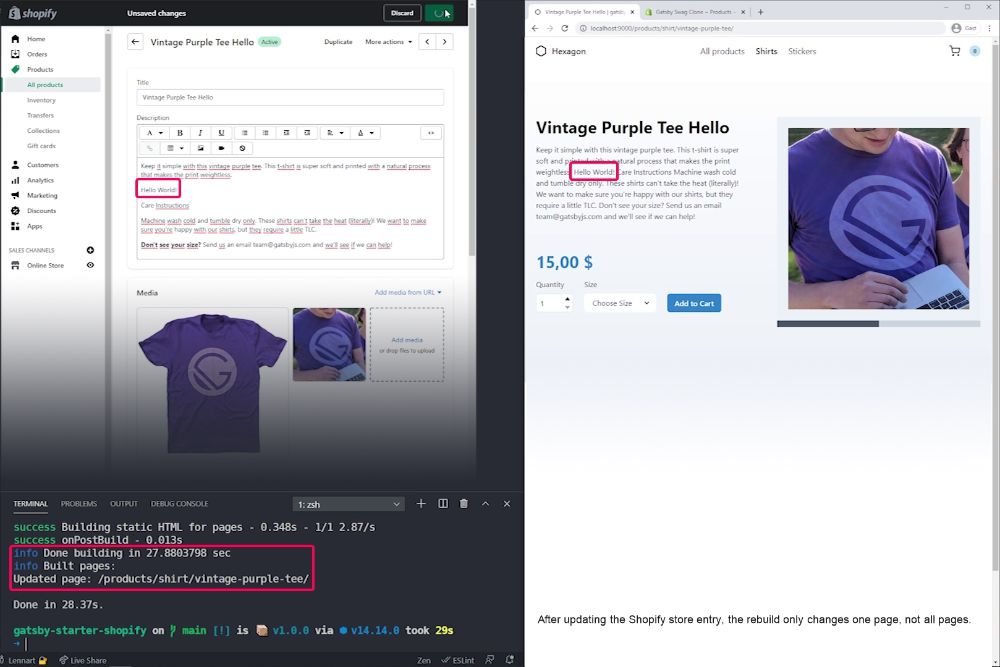
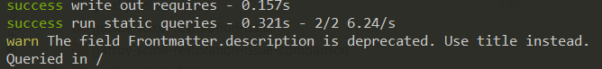

Welcome to `gatsby@3.0.0` release (March 2021 #1).

This is the first major bump of Gatsby since [September 2018](https://www.npmjs.com/package/gatsby/v/2.0.0)!
We’ve tried to make migration smooth. Please refer to the [migration guide](/docs/reference/release-notes/migrating-from-v2-to-v3/)
and [let us know](https://github.com/gatsbyjs/gatsby/issues/new/choose) if you encounter any issues when migrating.

Key highlights of this release:

- [Incremental Builds in OSS](#incremental-builds-in-oss) - regenerate HTML only when necessary, leading to faster builds
- [Fast Refresh](#fast-refresh) - new hot-reloading engine, error recovery, better DX
- [gatsby-plugin-image@1.0.0](#gatsby-plugin-image100)
- [gatsby-source-wordpress@5.0.0](#gatsby-source-wordpress500) - brand-new, significantly improved integration with WordPress
- [gatsby-source-contentful@5.0.0](#gatsby-source-contentful500)
- [Miscellaneous changes in plugins](#miscellaneous-changes-in-plugins)

Major dependency updates:

- [Node 12](#node-12)
- [webpack 5](#webpack-5)
- [React 17](#react-17)
- [GraphQL 15](#graphql-15)
- [ESLint 7](#eslint-7)

Also check out [notable bugfixes and improvements](#notable-bugfixes-and-improvements).

**Bleeding Edge:** Want to try new features as soon as possible? Install `gatsby@next` and let us know
if you have any [issues](https://github.com/gatsbyjs/gatsby/issues).

[Previous release notes for v2.32](/docs/reference/release-notes/v2.32)

[Full changelog](https://github.com/gatsbyjs/gatsby/compare/gatsby@2.32.0-next.0...gatsby@3.0.0)

## Breaking Changes

If you're looking for an overview of all breaking changes and how to migrate, please see the [migrating from v2 to v3 guide](/docs/reference/release-notes/migrating-from-v2-to-v3/).

## Incremental Builds in OSS

Gatsby v2 introduced experimental "Conditional Page Builds" (enabled by `GATSBY_EXPERIMENTAL_PAGE_BUILD_ON_DATA_CHANGES` environment variable). It had some gotchas and quirks, and it wasn't ready yet for GA. With Gatsby v3, we improved this feature and activated it by default for everyone! So incremental builds is available in OSS now. This improvement is (re)generating only subset of HTML files that needs to be generated. To be able to use it you will need to keep the `.cache` and `public` directories from previous builds.

Take a project powered by Shopify as an example. You have your listing of all products and then individual product pages. When you change one single product, only that page should be rebuilt. In the screenshot below you can see exactly that (the sentence "Hello World" was added to the description):



The screenshot is taken from a talk about Gatsby v3 at [GatsbyConf](https://gatsbyconf.com/). You can view the video showcasing this feature on [YouTube](https://www.youtube.com/watch?v=tO-5qFa_hH8).

### How does it work?

Gatsby tracks "inputs" when generating HTML files. In particular we track:

- which page template the page is using
- result of page query
- results of static queries used by a page template
- frontend source code (shared and also browser `gatsby-browser` / SSR `gatsby-ssr` specifically)

When those inputs change since the last build, the HTML files are marked to be regenerated. If they don't change, we can reuse HTML files generated in previous build.

### Avoid direct filesystem calls

As we mentioned, Gatsby tracks "inputs" used to generate HTML files. However, the `gatsby-ssr` file allows some arbitrary code execution like using the [`fs` module](https://nodejs.org/api/fs.html). For example:

```js:title=gatsby-ssr.js
const fs = require(`fs`)
const someUntrackedInput = fs.readFileSync(`some-path.txt`)

// Rest of gatsby-ssr.js file
```

While Gatsby could also track files that are read, the custom code that does those reads might have some special logic that Gatsby is not aware of. In the above example the filename could be generated and changed between builds, or the file read itself could change -- so we see this as "arbitrary" file reading. If Gatsby discovers that `fs` modules are used, it will disable "Incremental Builds"-mode to stay on the safe side (there will be warnings mentioning "unsafe builtin method").

If your `gatsby-ssr` (either site itself or plugin) make use of `fs` reads, head over to [migrating from v2 to v3 guide](/docs/reference/release-notes/migrating-from-v2-to-v3/#using-fs-in-ssr) and check how to migrate.

## Fast Refresh

After adding our initial Fast Refresh integration back in November 2020, we worked on it over the last couple of releases. For Gatsby v3 we further improved usability, reliability, and accessibility to make it the default overlay. With this the old `react-hot-loader` is removed and you can benefit from all the new features it has: Fast Refresh is faster, handles errors better, and preserves state across re-renders.

Here's a preview:


We built a custom error overlay that aims to give you helpful information to fix your bugs more quickly. It features:

- A clear indication whether it's a runtime error, compile error, or GraphQL error
- Source code snippets that you can open in your editor with the press of a button
- The exact error location, including the original line and column
- The overlay automatically goes away once you fix the error

We also added two new ESLint rules inside the default configuration that will warn you against anti-patterns in your code:

- No anonymous default exports
- Page templates must only export one default export (the page) and `query` as a named export

Visit the [Fast Refresh reference guide](/docs/reference/local-development/fast-refresh/) to learn more.

## Node 12

We are dropping support for Node 10 as it is approaching maintenance EOL date (2021-04-30).
The new required version of Node is `12.13.0`. See the main changes in [Node 12 release notes](https://nodejs.org/en/blog/release/v12.0.0/).

Check [Node’s releases document](https://github.com/nodejs/Release#nodejs-release-working-group) for version statuses.

## webpack 5

Please refer to the webpack [release notes](https://webpack.js.org/blog/2020-10-10-webpack-5-release/) for a full list of changes.

Key changes in the new webpack version:

- Improved build performance with Persistent Caching
- Improved Long-Term Caching with better algorithms and defaults
- Improved bundle size with better Tree Shaking and Code Generation
- Improved compatibility with the web platform
- Cleaned up internal structures

What does that mean for your Gatsby site? Gatsby is now able to tree-shake on a page level instead of an app level. You'll see reductions up to 20% on file size. Users returning to your site will benefit from the improved hashing algorithms as unchanged files will be loaded from the browser cache.

We’ve tried to protect you from the burden of manual webpack migration, but if you are using a custom
webpack config or community plugins that do not support webpack 5 yet, you may find the [webpack migration guide](https://webpack.js.org/migrate/5/) useful.

## React 17

Please refer to React's own [release notes](https://reactjs.org/blog/2020/10/20/react-v17.html) for a full list of changes.

The minimum version of Gatsby is now 16.9.0 to support Fast Refresh, React Hooks, and Suspense by default. We've also made sure we're 100% compatible with React 17. To use the new [React JSX transform](https://reactjs.org/blog/2020/09/22/introducing-the-new-jsx-transform.html) have a look at the [`babel-preset-gatsby`](#babel-preset-gatsby) section below.

With this change, we'll be adding more experiments to support [Concurrent mode](https://reactjs.org/blog/2019/11/06/building-great-user-experiences-with-concurrent-mode-and-suspense.html) and [React server components](https://reactjs.org/blog/2020/12/21/data-fetching-with-react-server-components.html) in future releases.

## GraphQL 15

Please refer to `graphql-js`'s own [release notes](https://github.com/graphql/graphql-js/releases/tag/v15.0.0) for a full list of changes.

With this upgrade we can finally leverage interface inheritance for [queryable interfaces](https://www.gatsbyjs.com/docs/reference/graphql-data-layer/schema-customization/#queryable-interfaces-with-the-nodeinterface-extension).
You no longer need to use `@nodeInterface` directive in schema customization:

```diff
exports.createSchemaCustomization = function createSchemaCustomization({ actions }) {
  const { createTypes } = actions
  createTypes(`
-   interface Foo @nodeInterface
+   interface Foo implements Node
    {
      id: ID!
    }
  `)
}
```

Also, Gatsby now displays GraphQL deprecations as CLI warnings. Example output:



## ESLint 7

Please refer to `eslint`'s own [migration guide](https://eslint.org/docs/user-guide/migrating-to-7.0.0) to update your custom ESLint files.

If you rely on Gatsby's default ESLint configuration, you should have a smooth transition. We upgraded the underlying rules, so you might get some new warnings/errors.

Gatsby no longer uses the deprecated `eslint-loader`. We’ve moved to `eslint-webpack-plugin`. By using the plugin, behaviour has changed a little bit, as warnings and errors are displayed later than in version 2.

## `gatsby-plugin-image@1.0.0`

This release includes a new plugin, `gatsby-plugin-image`, replacing the old `gatsby-image` plugin. Built from the ground up for speed and best practices, it's the most performant way to use images in React. If you saw your scores drop with recent Lighthouse updates, migrating to this plugin should help you get top scores again. It comes with a new, simplified GraphQL API (no more fragments), as well as a new `StaticImage` component that's as easy to use as an `` tag.

The `GatsbyImage` component supports three responsive layout types, as shown in the video below.

<video controls autoplay loop>
  <source type="video/mp4" src="../../built-in-components/layouts.mp4" />
  <p>Your browser does not support the video element.</p>
</video>

There is a codemod available to help migrate from `gatsby-image`. Support is included in all sources that use `childImageSharp`, as well as out of the box support in several CMS plugins, with more coming soon.

For more information, see:

- [Migrating from gatsby-image to gatsby-plugin-image](/docs/reference/release-notes/image-migration-guide/)
- [How-To Guide: Using gatsby-plugin-image](/docs/how-to/images-and-media/using-gatsby-plugin-image/)
- [Reference Guide: Gatsby Image plugin](/docs/reference/built-in-components/gatsby-plugin-image/)
- [The `gatsby-plugin-image` README](/plugins/gatsby-plugin-image/)
- [GatsbyConf: Announcing gatsby-plugin-image](https://www.youtube.com/watch?v=zRtFwzF4p1o)

## `gatsby-source-wordpress@5.0.0`

Recently we’ve announced the brand-new WordPress integration. Refer to this post on the Gatsby Blog for the full details: [Announcing Gatsby’s New WordPress Integration](/blog/wordpress-integration/)

The originally published version of renewed `gatsby-source-wordpress` is `4.0.0`. It is
fully compatible with Gatsby v2.

For Gatsby v3 bump we’ve also bumped `gatsby-source-wordpress` to `5.0.0`. It should
be a straight-forward update from `gatsby-source-wordpress@^4.0.0`. No additional changes
from you are required.

- Fixed a bug where adding a post type named "Filter" would break options queries [PR #29718](https://github.com/gatsbyjs/gatsby/pull/29718)
- Fixed an HTML field `gatsby-image` regression that would prevent image transforms in certain situations [PR #29778](https://github.com/gatsbyjs/gatsby/pull/29778) and [PR #29813](https://github.com/gatsbyjs/gatsby/pull/29813)

## `gatsby-source-contentful@5.0.0`

- Migrated to the latest Contentful SDK, via [PR #29520](https://github.com/gatsbyjs/gatsby/pull/29520)
- Compatibility with `gatsby-plugin-image`
- Retries when downloading assets
- Retries on network errors

## gatsby-plugin-gatsby-cloud v1 & v2

Gatsby Cloud now includes Hosting for all your Gatsby projects. `gatsby-plugin-gatsby-cloud` is a new plugin that you need to install when using Gatsby Cloud Hosting. It generates redirects and rewrites for your client side routes automatically and even allows you to set custom Headers on a per-file basis.

If you're using Gatsby v2 please install `gatsby-plugin-gatsby-cloud@^1.0.0`. For Gatsby v3 we’ve bumped `gatsby-plugin-gatsby-cloud` to `2.0.0`. It should
be a straight-forward update, no additional changes from you are required.

Read more about `gatsby-plugin-gatsby-cloud` at the [README](/packages/gatsby-plugin-gatsby-cloud/).

## Miscellaneous changes in plugins

### `babel-preset-gatsby`

`babel-preset-gatsby` now accepts `reactImportSource` which is passed to the underlying `@babel/preset-react` importSource field. Note that this field is only supported when `reactRuntime` is `automatic`. It is `classic` by default.

Configuration looks like this.

```json
{
  "presets": [
    [
      "babel-preset-gatsby",
      {
        "reactRuntime": "automatic",
        "reactImportSource": "@emotion/react"
      }
    ]
  ]
}
```

### `gatsby-plugin-guessjs`

The plugin is **deprecated**. It is not compatible with Gatsby v3.

### `gatsby-transformer-remark`

When using the `tableOfContents` functionality, the defaults have changed. `absolute` now defaults to `false`, and `pathToSlugField` defaults to an empty string.

### `gatsby-react-router-scroll`

`ScrollContainer`, previously deprecated, has now been removed. Please use the `useScrollRestoration` hook instead.

### `gatsby-core-utils`

Introduce `fetchRemoteNode` utility (supersedes file download utils from `gatsby-source-filesystem`) via [PR #29531](https://github.com/gatsbyjs/gatsby/pull/29531)

### `gatsby-plugin-styled-components`

Support `topLevelImportPaths` option, via [PR #29544](https://github.com/gatsbyjs/gatsby/pull/29544)

### `gatsby-plugin-canonical-urls`

Add plugin options validation to `gatsby-plugin-canonical-urls`, via [PR #29688](https://github.com/gatsbyjs/gatsby/pull/29688)

## Notable bugfixes and improvements

- Drop `terminal-link` from our CLI as in some terminals it turned lines blank, via [PR #29472](https://github.com/gatsbyjs/gatsby/pull/29472)
- Update the `pathExist` function in `gatsby-plugin-feed`, via [PR #29616](https://github.com/gatsbyjs/gatsby/pull/29616)
- Cache AVIF images in `gatsby-plugin-offline`, via [PR #29394](https://github.com/gatsbyjs/gatsby/pull/29394)
- Improve efficiency when writing HTML files to disk, via [PR #29219](https://github.com/gatsbyjs/gatsby/pull/29219)
- 10-20% faster sourcing by memoizing actions when running plugins, via [PR #29240](https://github.com/gatsbyjs/gatsby/pull/29240)
- Do not miss page invalidations when using `runQuery` in custom resolvers, via [PR #29392](https://github.com/gatsbyjs/gatsby/pull/29392)
- Upgrade TypeScript to 4.0, via [PR #29388](https://github.com/gatsbyjs/gatsby/pull/29388)

## Contributors

A big **Thank You** to [our community who contributed](https://github.com/gatsbyjs/gatsby/compare/gatsby@2.32.0-next.0...gatsby@3.0.0) to this release 💜

- [lokesh-coder](https://github.com/lokesh-coder): chore(docs): Fix typo in contributing style guide [PR #29262](https://github.com/gatsbyjs/gatsby/pull/29262)
- [domvo](https://github.com/domvo): fix(gatsby-plugin-sharp): make sure to pass the failOnError option to base64 generation [PR #29254](https://github.com/gatsbyjs/gatsby/pull/29254)
- [axe312ger](https://github.com/axe312ger)
  - feat(contentful): add retry logic to asset downloading [PR #29268](https://github.com/gatsbyjs/gatsby/pull/29268)
  - feat(gatsby-source-contentful): improve Contentful image handling [PR #29398](https://github.com/gatsbyjs/gatsby/pull/29398)
  - fix(contentful): fix import [PR #29522](https://github.com/gatsbyjs/gatsby/pull/29522)
  - fix(contentful): retry on network errors when checking credentials [PR #29664](https://github.com/gatsbyjs/gatsby/pull/29664)
  - chore(gatsby-source-contentful): migrate to latest Contentful SDK [PR #29520](https://github.com/gatsbyjs/gatsby/pull/29520)
- [louis-morgan](https://github.com/louis-morgan): chore(gatsby-source-wordpress): Update querying-data tutorial [PR #29353](https://github.com/gatsbyjs/gatsby/pull/29353)
- [deraru](https://github.com/deraru): chore(docs): Fix product slugs for building-an-ecommerce-site-with-shopify page [PR #29292](https://github.com/gatsbyjs/gatsby/pull/29292)
- [meeroslav](https://github.com/meeroslav): docs(wordpress): fix broken assets link after migration [PR #29389](https://github.com/gatsbyjs/gatsby/pull/29389)
- [zonayedpca](https://github.com/zonayedpca): chore(docs): Remove extra curly brace [PR #29405](https://github.com/gatsbyjs/gatsby/pull/29405)
- [geekster909](https://github.com/geekster909): docs(gatsby-source-wordpress): fix back to readme.md link [PR #29468](https://github.com/gatsbyjs/gatsby/pull/29468)
- [isabelleingato](https://github.com/isabelleingato): docs(gatsby-plugin-netlify): Update readme [PR #29168](https://github.com/gatsbyjs/gatsby/pull/29168)
- [Javaman2](https://github.com/Javaman2)
  - chore(docs): Update adding-markdown-pages [PR #29484](https://github.com/gatsbyjs/gatsby/pull/29484)
  - Update index.js to stop React errors in console about the 'key' [PR #29485](https://github.com/gatsbyjs/gatsby/pull/29485)
- [astrokd](https://github.com/astrokd): chore(docs): Update sourcing-from-json-or-yaml [PR #29488](https://github.com/gatsbyjs/gatsby/pull/29488)
- [jbampton](https://github.com/jbampton)
  - docs: fix spelling [PR #29494](https://github.com/gatsbyjs/gatsby/pull/29494)
  - docs: remove unneeded whitespace from Markdown link [PR #29582](https://github.com/gatsbyjs/gatsby/pull/29582)
  - docs: fix spelling [PR #29581](https://github.com/gatsbyjs/gatsby/pull/29581)
  - docs: fix case of GitHub, JavaScript, TypeScript and WordPress [PR #29580](https://github.com/gatsbyjs/gatsby/pull/29580)
  - fix(gatsby-recipes): change 'Typescript' to 'TypeScript' [PR #29587](https://github.com/gatsbyjs/gatsby/pull/29587)
  - fix(gatsby-source-wordpress): remove hard tabs from Markdown [PR #29627](https://github.com/gatsbyjs/gatsby/pull/29627)
  - chore(docs): remove unneeded whitespace before commas and full stops [PR #29629](https://github.com/gatsbyjs/gatsby/pull/29629)
- [rogermparent](https://github.com/rogermparent): Fix URL typo in sass recipe [PR #29530](https://github.com/gatsbyjs/gatsby/pull/29530)
- [gregberge](https://github.com/gregberge): fix(gatsby-plugin-styled-components): Support `topLevelImportPaths` option [PR #29544](https://github.com/gatsbyjs/gatsby/pull/29544)
- [strategore](https://github.com/strategore): chore(docs): Update Directus plugin link [PR #29533](https://github.com/gatsbyjs/gatsby/pull/29533)
- [jasonbahl](https://github.com/jasonbahl): Update graphql-wordpress-and-gatsby.md [PR #29558](https://github.com/gatsbyjs/gatsby/pull/29558)
- [bryndyment](https://github.com/bryndyment): chore(docs): Fix caching typo [PR #29578](https://github.com/gatsbyjs/gatsby/pull/29578)
- [mareksuscak](https://github.com/mareksuscak): Update the changelog of Contentful plugin to show a working example [PR #29579](https://github.com/gatsbyjs/gatsby/pull/29579)
- [kdwarn](https://github.com/kdwarn): chore(docs): Add note on reloading bash configuration. [PR #29613](https://github.com/gatsbyjs/gatsby/pull/29613)
- [frederickfogerty](https://github.com/frederickfogerty): chore: improve description of placeholder parameter [PR #29670](https://github.com/gatsbyjs/gatsby/pull/29670)
- [odkpatrick](https://github.com/odkpatrick): chore(docs): Updated gatsby-for-ecommerce [PR #29676](https://github.com/gatsbyjs/gatsby/pull/29676)
- [lwz7512](https://github.com/lwz7512): fix(gatsby-source-wordpress):issue #29535 not finished createSchemaCu… [PR #29554](https://github.com/gatsbyjs/gatsby/pull/29554)
- [stefanprobst](https://github.com/stefanprobst): fix(gatsby): fix regex filter in graphql queries [PR #26592](https://github.com/gatsbyjs/gatsby/pull/26592)
- [kartikcho](https://github.com/kartikcho): fix(gatsby): context.nodeModel.runQuery should return [] instead of null [PR #25885](https://github.com/gatsbyjs/gatsby/pull/25885)
- [hendra-go](https://github.com/hendra-go): Update index.js [PR #29758](https://github.com/gatsbyjs/gatsby/pull/29758)
- [hiad](https://github.com/hiad): fix(gatsby-plugin-feed): Exists function and update version fs-extra [PR #29616](https://github.com/gatsbyjs/gatsby/pull/29616)
- [disintegrator](https://github.com/disintegrator): feat(babel-preset-gatsby): allow setting importSource on preset-react [PR #29260](https://github.com/gatsbyjs/gatsby/pull/29260)
- [herecydev](https://github.com/herecydev): fix(gatsby): Add dir=ltr to Fast Refresh overlay [PR #29900](https://github.com/gatsbyjs/gatsby/pull/29900)
