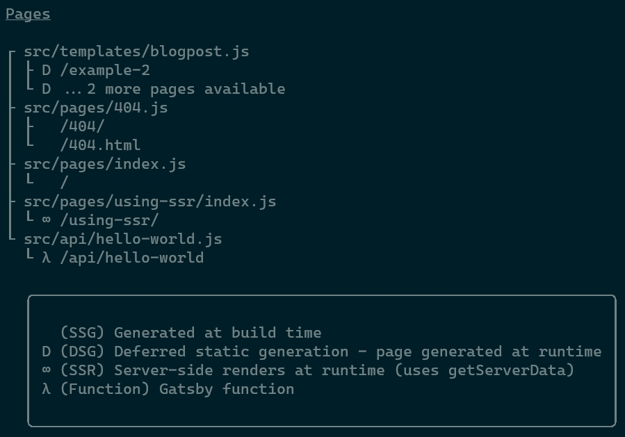

Welcome to `gatsby@4.0.0` release (October 2021 #1).

We've released Gatsby 3 in [March 2021](/docs/reference/release-notes/v3.0) and now have a lot of exciting new features for Gatsby 4!
We’ve tried to make migration smooth. Please refer to the [migration guide](/docs/reference/release-notes/migrating-from-v3-to-v4/)
and [let us know](https://github.com/gatsbyjs/gatsby/issues/new/choose) if you encounter any issues when migrating.

Key highlights of this release:

- [Parallel Query Running](#parallel-query-running) - up to 40% reduction in build times
- [Deferred Static Generation (DSG)](#deferred-static-generation-dsg) - defer page generation to user request, speeding up build times
- [Server-Side Rendering (SSR)](#server-side-rendering-ssr) - pre-render a page with data that is fetched when a user visits the page

Major dependency updates:

- [Node 14](#node-14)

Also check out [notable bugfixes and improvements](#notable-bugfixes-and-improvements).

**Bleeding Edge:** Want to try new features as soon as possible? Install `gatsby@next` and let us know
if you have any [issues](https://github.com/gatsbyjs/gatsby/issues).

[Previous release notes for 3.14](/docs/reference/release-notes/v3.14)

[Full changelog](https://github.com/gatsbyjs/gatsby/compare/gatsby@3.14.0-next.0...gatsby@4.0.0)

## Breaking Changes

If you're looking for an overview of all breaking changes and how to migrate, please see the [migrating from v3 to v4 guide](/docs/reference/release-notes/migrating-from-v3-to-v4/).

## Overview Video

Prefer video over text? No problem! Learn more about all the new features (+ demo) and what we'll work on beyond Gatsby 4 in the video below:

<iframe
  width="560"
  height="315"
  src="https://www.youtube.com/embed/6Eglvixg4eg"
  title="YouTube video player"
  frameborder="0"
  allow="accelerometer; autoplay; clipboard-write; encrypted-media; gyroscope; picture-in-picture"
  allowfullscreen
></iframe>

## Parallel Query Running

Query running is the portion of the Gatsby build process that happens after your site's content has been sourced from the various content sources configured for your Gatsby site. This step is understandably one of the more expensive portions of the build process because it's where all of the data is being extracted into the corresponding page data required to efficiently generate the actual website pages that your visitors interact with.

We've rearchitected the Gatsby data layer (not a trivial thing to do!) to allow page queries and static queries to occur in parallel, leading to a **40% reduction in build times** for some sites! This innovation starts with allowing for parallel content queries, but positions Gatsby for a number of interesting use cases (imagine what you can do with a portable data layer 🤔).

### How does it work?

The crux of the matter, regarding query running, is that Gatsby had historically utilized [Redux](https://redux.js.org/) as its internal, in-process data store. Now, our existing datastore is very fast because it’s an in-memory data store, but it carries a key limitation that was hindering our ability to substantially optimize the Gatsby build process: It’s only accessible via the current thread/process. This means that the Gatsby build process, and more specifically the query running portion of that process, could not be shared across CPU cores.

The team evaluated a collection of strategies for optimizing and decoupling the data layer in order to allow cross-cpu, and possibly cross-machine coordination of content queries and landed on the node.js implementation of [LMDB](http://www.lmdb.tech/doc/): [lmdb-store](https://github.com/DoctorEvidence/lmdb-store) as the foundation for the architecture update. `lmdb-store` affords incredibly efficient data access, focused on fast read operations, which makes it suitable for the Gatsby user’s use case.

The Gatsby main process now coordinates content query workers with the now-shared data store. Therefore, you will now have `n-1` query workers when building your Gatsby site, where n is the total number of CPU’s provisioned for your Gatsby Cloud (or other CI/CD host) site.

You can learn more about Parallel Query Running in the video below:

<iframe
  width="560"
  height="315"
  src="https://www.youtube.com/embed/X3haR60VjZc"
  title="YouTube video player"
  frameborder="0"
  allow="accelerometer; autoplay; clipboard-write; encrypted-media; gyroscope; picture-in-picture"
  allowfullscreen
></iframe>

## Deferred Static Generation (DSG)

When a Gatsby site uses Deferred Static Generation, it means they are deferring or delaying the building of particular pages on their website until runtime. Once a delayed page is requested (visited) by a site visitor it will be built on the fly in the same manner as any Server-Side Rendered page, but it will now persist as a static build on the edge. So, for that first, and only first user on a deferred page – they will get the performance of any other SSR page, but each and every user after that will receive a **completely statically** generated page.

For example, imagine you have an archive of old articles that no longer receive significant traffic. There is no practical reason to generate them on each build (and thus delay the delivery of fresh articles). In this case, you may choose to defer the generation of old pages, and Gatsby will skip them during the build step.

Due to the introduction of `lmdb-store` as the data store the generation of DSG pages happens with a **snapshot of all the data at buildtime** which means no APIs need to be requested on runtime and the data will be the same for everyone. Gatsby generates an engine internally that can build pages with the provided data, meaning that each of your deploys will be **atomic** as both page generation & data for each page is saved. Once you update your content, Incremental Builds only updates the necessary pages and updates the data store.

You can learn more about the [different rendering options](/docs/conceptual/rendering-options/) or read the [How-To on using DSG](/docs/how-to/rendering-options/using-deferred-static-generation/).

## Server-Side Rendering (SSR)

Gatsby 4 now supports Server-Side Rendering, giving developers the choice of generating content at either build time, as with static-site generation, or at runtime. With Server-Side Rendering, teams can now run more effective A/B tests, personalize content, and more all while still using the Gatsby framework.

Server-Side Rendering is a method of content rendering in which each web page is served to a site visitor at runtime, meaning that a portion of the build process happens on each page request. Because the content is rendering during runtime, visitors will always get the latest version of content directly from the server — though they may have to wait a few seconds for it display.

For example, imagine you are building a site with user reviews. You want those reviews to be immediately indexed by search engines as soon as they are posted, so client-side rendering is not an option.

You can learn more about the [different rendering options](/docs/conceptual/rendering-options/) or read the [How-To on using SSR](/docs/how-to/rendering-options/using-server-side-rendering).

## Node 14

We are dropping support for Node 12 as a new underlying dependency (`lmdb-store`) is requiring `>=14.15.0`. See the main changes in [Node 14 release notes](https://nodejs.org/en/blog/release/v14.0.0/).

Check [Node’s releases document](https://github.com/nodejs/Release#nodejs-release-working-group) for version statuses.

## Pages Output in CLI

With our new rendering options you now can have different kinds of pages in your project. We've added an output for `gatsby build` that tells you exactly which pages are SSG, DSG, SSR, or a Gatsby Function.

## Notable bugfixes and improvements

- `gatsby`: Reduce page-renderer size, via [PR #33051](https://github.com/gatsbyjs/gatsby/pull/33051)
- `gatsby`: Add queue to prefetch, making it less eager. Via [PR #33530](https://github.com/gatsbyjs/gatsby/pull/33530)
- `gatsby-source-wordpress`: Use `gatsby-plugin-image`, via [PR #33138](https://github.com/gatsbyjs/gatsby/pull/33138)

## Contributors

A big **Thank You** to [our community who contributed](https://github.com/gatsbyjs/gatsby/compare/gatsby@3.14.0-next.0...gatsby@4.0.0) to this release 💜

- [merceyz](https://github.com/merceyz): fix: add missing dependencies [PR #31837](https://github.com/gatsbyjs/gatsby/pull/31837)
- [actuallyatiger](https://github.com/actuallyatiger): chore(docs): Update GitHub Pages doc [PR #29031](https://github.com/gatsbyjs/gatsby/pull/29031)
- [acbramley](https://github.com/acbramley): Document filtering temporary files [PR #32048](https://github.com/gatsbyjs/gatsby/pull/32048)
- [jabrks](https://github.com/jabrks): fix(gatsby): Don't bundle moment locale files [PR #33092](https://github.com/gatsbyjs/gatsby/pull/33092)
- [nagiek](https://github.com/nagiek): feat(gatsby): Add aggregation resolvers to group [PR #32533](https://github.com/gatsbyjs/gatsby/pull/32533)
- [aleksanderantropov](https://github.com/aleksanderantropov)
  - chore(docs): Correct gatsby-cloud plugin in tutorial part 3 [PR #33118](https://github.com/gatsbyjs/gatsby/pull/33118)
  - docs: fix typo [PR #33137](https://github.com/gatsbyjs/gatsby/pull/33137)
  - chore(docs): Remove highlight-line from tutorial part 5 [PR #33121](https://github.com/gatsbyjs/gatsby/pull/33121)
- [bartveneman](https://github.com/bartveneman): docs(gatsby-plugin-gatsby-cloud): fix typo: asterix -> asterisk [PR #33135](https://github.com/gatsbyjs/gatsby/pull/33135)
- [rudouglas](https://github.com/rudouglas): chore(gatsby): add environment variable for setting tracing config file [PR #32513](https://github.com/gatsbyjs/gatsby/pull/32513)
- [herecydev](https://github.com/herecydev): feat(gatsby-plugin-styled-components): Add ability to disable vendor prefixes [PR #33147](https://github.com/gatsbyjs/gatsby/pull/33147)
- [minimalsm](https://github.com/minimalsm): docs: Fix broken link on Getting Started with MDX page [PR #33148](https://github.com/gatsbyjs/gatsby/pull/33148)
- [angeloashmore](https://github.com/angeloashmore)
  - fix(gatsby): allow null plugin option values on build [PR #33227](https://github.com/gatsbyjs/gatsby/pull/33227)
  - fix(gatsby-source-graphql): support Gatsby 4 [PR #33310](https://github.com/gatsbyjs/gatsby/pull/33310)
  - feat(gatsby-plugin-image): support multiple sources using gatsby-plugin-image [PR #32544](https://github.com/gatsbyjs/gatsby/pull/32544)
- [axe312ger](https://github.com/axe312ger)
  - fix(contentful): createUrl now enforces https protocol [PR #33236](https://github.com/gatsbyjs/gatsby/pull/33236)
  - feat(gatsby-source-contentful): move types into createSchemaCustomization [PR #33207](https://github.com/gatsbyjs/gatsby/pull/33207)
  - chore(gatsby-source-contentful): download assets via gatsby-core-utils [PR #33482](https://github.com/gatsbyjs/gatsby/pull/33482)
  - chore(gatsby-source-contentful): clean up code base and introduce es-module syntax [PR #33213](https://github.com/gatsbyjs/gatsby/pull/33213)
- [fbuireu](https://github.com/fbuireu): chore(gatsby-source-contentful): Fix RichText example [PR #33261](https://github.com/gatsbyjs/gatsby/pull/33261)
- [alvis](https://github.com/alvis): fix(gatsby): correct the definition for getNode [PR #33259](https://github.com/gatsbyjs/gatsby/pull/33259)
- [Xenonym](https://github.com/Xenonym): chore(docs): fix typo in site performance guide [PR #33294](https://github.com/gatsbyjs/gatsby/pull/33294)
- [labifrancis](https://github.com/labifrancis): chore(docs): Improve Shopify guide [PR #33298](https://github.com/gatsbyjs/gatsby/pull/33298)
- [aaronadamsCA](https://github.com/aaronadamsCA): chore(gatsby): Fix static query types, document useStaticQuery [PR #33322](https://github.com/gatsbyjs/gatsby/pull/33322)
- [crstnre](https://github.com/crstnre): docs: fix "(r)esource congestion" [PR #33392](https://github.com/gatsbyjs/gatsby/pull/33392)
- [NikSchaefer](https://github.com/NikSchaefer): chore(docs): Fix Grammar Issue [PR #33408](https://github.com/gatsbyjs/gatsby/pull/33408)
- [torn4dom4n](https://github.com/torn4dom4n): chore(gatsby-plugin-manifest): Update README links [PR #33406](https://github.com/gatsbyjs/gatsby/pull/33406)
- [orsi](https://github.com/orsi): chore(gatsby-source-contentful): Improve README on rich text ref [PR #33401](https://github.com/gatsbyjs/gatsby/pull/33401)
- [ondrabus](https://github.com/ondrabus): chore(docs): Update Kentico Kontent references [PR #33411](https://github.com/gatsbyjs/gatsby/pull/33411)
- [samouss](https://github.com/samouss): fix(gatsby): postcss-svgo - remove plugin removeAttrs [PR #33266](https://github.com/gatsbyjs/gatsby/pull/33266)
- [raresportan](https://github.com/raresportan): fix(gatsby): replace checks for .cache/json with checks for .cache/caches-lmdb [PR #33431](https://github.com/gatsbyjs/gatsby/pull/33431)
- [amalitsky](https://github.com/amalitsky): chore(gatsby-plugin-sitemap): Fix a typo [PR #33467](https://github.com/gatsbyjs/gatsby/pull/33467)
- [mrudden](https://github.com/mrudden): chore(docs): Removed plugin in tutorial not mentioned elsewhere [PR #33486](https://github.com/gatsbyjs/gatsby/pull/33486)
- [shreemaan-abhishek](https://github.com/shreemaan-abhishek)
  - docs(gatsby): fix grammatical errors [PR #33471](https://github.com/gatsbyjs/gatsby/pull/33471)
  - docs(gatsby): fix typo [PR #33502](https://github.com/gatsbyjs/gatsby/pull/33502)
  - docs(gatsby): fix preposition usage [PR #33510](https://github.com/gatsbyjs/gatsby/pull/33510)
- [JSinkler713](https://github.com/JSinkler713): docs: Update building-an-ecommerce-site-with-shopify.md [PR #33478](https://github.com/gatsbyjs/gatsby/pull/33478)
- [RomerDev](https://github.com/RomerDev): chore(docs): Updating Git adding Remote Origin [PR #33314](https://github.com/gatsbyjs/gatsby/pull/33314)
- [joshatoutthink](https://github.com/joshatoutthink)
  - BREAKING(gatsby-transformer-json): Prefix `id` and only use createNodeId [PR #28942](https://github.com/gatsbyjs/gatsby/pull/28942)
  - BREAKING(gatsby-transformer-yaml): Prefix `id` and only use createNodeId [PR #28943](https://github.com/gatsbyjs/gatsby/pull/28943)
- [tim-hanssen](https://github.com/tim-hanssen): chore(docs): Add 'Prepr CMS' guide to docs [PR #33480](https://github.com/gatsbyjs/gatsby/pull/33480)
- [ParasRawat29](https://github.com/ParasRawat29): chore(docs): Fix typo in part-7 tutorial [PR #33556](https://github.com/gatsbyjs/gatsby/pull/33556)
- [digiturnal](https://github.com/digiturnal): chore(gatsby-plugin-react-helmet): Update Examples [PR #33552](https://github.com/gatsbyjs/gatsby/pull/33552)
- [shivangisareen](https://github.com/shivangisareen): chore(docs): Update query var in part-7 tutorial [PR #33559](https://github.com/gatsbyjs/gatsby/pull/33559)
- [aaronm-git](https://github.com/aaronm-git): chore(docs): Clarify SEO component guide [PR #33451](https://github.com/gatsbyjs/gatsby/pull/33451)
- [erikbgithub](https://github.com/erikbgithub): specifying what actually changed [PR #33452](https://github.com/gatsbyjs/gatsby/pull/33452)
- [tonyhallett](https://github.com/tonyhallett): chore(gatsby): Add `assetPrefix` to `IGatsbyConfig` [PR #33575](https://github.com/gatsbyjs/gatsby/pull/33575)
- [psharma-ii](https://github.com/psharma-ii): fix(gatsby-source-wordpress): Add steps for `refetch_ALL` [PR #33264](https://github.com/gatsbyjs/gatsby/pull/33264)
