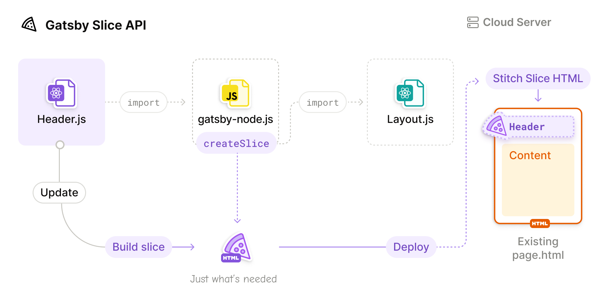

Welcome to `gatsby@5.0.0` release (November 2022 #1).

Gatsby 5 introduces the Slices API and Partial Hydration (Beta). Slices unlock up to 90% reduction in build duration for content changes in highly shared components, Partial Hydration allows you to ship only the necessary JavaScript to the browser.
We’ve tried to make migration smooth. Please refer to the [migration guide](/docs/reference/release-notes/migrating-from-v4-to-v5/)
and [let us know](https://github.com/gatsbyjs/gatsby/issues/new/choose) if you encounter any issues when migrating.

Key highlights of this release:

- [Slice API](#slice-api) - Only re-build individual slices of your page
- [Partial Hydration (Beta)](#partial-hydration-beta) - Improve frontend performance by shipping less JavaScript
- [GraphiQL v2](#graphiql-v2) - An all new UI with features like dark mode, tabs, and persisted state

Major dependency updates:

- [Node 18](#node-18)
- [React 18](#react-18)

**Bleeding Edge:** Want to try new features as soon as possible? Install `gatsby@next` and let us know
if you have any [issues](https://github.com/gatsbyjs/gatsby/issues).

[Full changelog][full-changelog]

## Breaking Changes

If you're looking for an overview of all breaking changes and how to migrate, please see the [migrating from v4 to v5 guide](/docs/reference/release-notes/migrating-from-v4-to-v5/).

If you're curious about our release schedules and which versions are officially supported, head to the [Gatsby Framework Version Support](/docs/reference/release-notes/gatsby-version-support/) document. As of Gatsby 5 we're no longer supporting Gatsby 2 and Gatsby 3.

## Overview Video

Prefer video over text? No problem! Learn more about all the new features in the video below:

<iframe
  width="560"
  height="315"
  src="https://www.youtube-nocookie.com/embed/6RwfzZi5gn0"
  title="YouTube video player"
  frameborder="0"
  allow="accelerometer; autoplay; clipboard-write; encrypted-media; gyroscope; picture-in-picture"
  allowfullscreen
></iframe>

## Slice API

The Slice API allows you to define highly-shared components in your site, which will then inform Gatsby to build those shared components only once. After the files are built, Gatsby will then stitch the resulting markup and JavaScript to the pages that include that shared component. This means that changes to highly-shared components (such as headers, footers, and common layouts) no longer require a rebuild of all pages that use that shared component.

The Slice API introduces two critical pieces, the [`createSlice`](/docs/reference/config-files/actions/#createSlice) action from the [`createPages`](/docs/reference/config-files/gatsby-node/#createPages) API and the `<Slice>` placeholder. To create a Slice, you must first call `createSlice` within `gatsby-node`:

```js:title=gatsby-node.js
exports.createPages = async ({ actions }) => {
  actions.createSlice({
    id: `header`,
    component: require.resolve(`./src/components/header.js`),
  })
}
```

Then, use the `<Slice>` placeholder where the `<Header>` component was previously:

```js:title=src/components/layout.js
import { Slice } from "gatsby"
import { Footer } from "./footer"

export const DefaultLayout = ({ children, headerClassName }) => {
  return (
    <div className={styles.defaultLayout} />
      <Slice alias="header" className={headerClassName} />
      {children}
      <Footer />
    </div>
  )
}
```

Here's an overview of how it works:



Now, when a code update or data update is made for the `<Header>` component, only the HTML for the Slice will be updated, and later stitched into the pre-existing HTML for the pages that use it.

We want to make sure the Slice API is worthwhile for all Gatsby sites, so the implementation is built into Gatsby's open source product. To validate the improvements of the Slice API, we created a 10,000 page Contentful site with a shared header. We then benchmarked two types of changes, code updates to the git repository and data updates to Contentful. Here are the results:

|                                             | Code Update | Data Update |
| ------------------------------------------- | ----------- | ----------- |
| No Slices (Self-Hosted)                     | 1253s       | 1276s       |
| With Slices (Self-Hosted)                   | 1011s       | 958s        |
| No Slices on Gatsby Cloud                   | 155s        | 22s         |
| With Slices on Gatsby Cloud                 | 129s        | 15s         |
| With Slices on Gatsby Cloud + Optimizations | 34s         | 10s         |

Across the board we can see at least a 20% decrease in build time when using Slices. When using the [Slices Optimization](/docs/how-to/cloud/slices-optimization/) on Gatsby Cloud, build time decreases by 78% for code updates compared to No Slices on Gatsby Cloud. As the site grows, the benefit of the Gatsby Slice API will only increase.

For more information, read the [Using Slices How-To Guide](/docs/how-to/performance/using-slices/) or the [Slice API Reference Documentation](/docs/reference/built-in-components/gatsby-slice).

If you have any questions about the Slice API, you can comment on the [Gatsby 5 Umbrella Discussion](https://github.com/gatsbyjs/gatsby/discussions/36609) or [`gatsby-5` Discord channel](https://discord.gg/MhfpnT4cNg).

## Partial Hydration (Beta)

Partial Hydration enables you to selectively add interactivity to your otherwise completly static app. This results in improved frontend performance while keeping the benefits of client-side apps. Gatsby uses [React server components](https://github.com/reactjs/rfcs/blob/main/text/0188-server-components.md) to achieve this.

[Hydration](/docs/conceptual/react-hydration/) (or often referred to as re-hydration) is the process of using client-side JavaScript to add application state and interactivity to server-rendered HTML. Since the initial release of Gatsby, apps built with Gatsby were always fully hydrated on the client. With Gatsby 5 you now can also use Partial Hydration inside Gatsby. Here's a visualization showing how Full Hydration and Partial Hydration differ conceptually:


Partial Hydration is in **Beta** and not enabled by default. You have to opt-in to try it out. The reason for this is that React server components are still quite new (the ecosystem as a whole hasn't caught up, e.g. CSS-in-JS libraries) and you are currently required to use an experimental version of `react`/`react-dom`. Therefore we don't recommend using Partial Hydration in production just yet. Once things have stabilized we'll announce the general availablity release of Partial Hydration and adjust the documentation.

Read the [Partial Hydration How-To Guide](/docs/how-to/performance/partial-hydration/) for detailed instructions. We also recommend reading the [Partial Hydration Conceptual Guide](/docs/conceptual/partial-hydration/) to understand why Gatsby chose React server components and how Partial Hydration works on a high-level.

As a quick start, here's how you can use Partial Hydration in Gatsby 5 today:

- Install experimental version of `react` and `react-dom`:
  ```shell
  npm install --save-exact react@experimental react-dom@experimental
  ```
- Enable the feature flag inside `gatsby-config`:
  ```js:title=gatsby-config.js
  module.exports = {
    flags: {
      PARTIAL_HYDRATION: true
    }
  }
  ```
- Add the `"use client"` directive to any component that needs to be a client component. You can see an example in the [gatsby-partial-hydration-starter](https://github.com/gatsbyjs/gatsby-partial-hydration-starter/blob/main/src/components/demo.js)

If you have any questions about Partial Hydration, you can comment on the [RFC: Partial Hydration](https://github.com/gatsbyjs/gatsby/discussions/36608) or [`partial-hydration` Discord channel](https://discord.gg/KEVcg3rup2).

## GraphiQL v2

GraphiQL is Gatsby's integrated GraphQL development environment (IDE). It’s a powerful (and all-around awesome) tool you’ll use often while building Gatsby websites. We've updated [GraphiQL](https://github.com/graphql/graphiql/tree/main/packages/graphiql) from v1 to v2 to bring you these cool new features:

- Dark Mode
- Tabs
- Persisted State/Tabs using `localStorage`
- Better documentation explorer through search and markdown support
- Plugin ecosystem

Want to learn more? Head to the [Introducing GraphiQL docs](/docs/how-to/querying-data/running-queries-with-graphiql/).

The plugin ecosystem also will allow us to more easily add functionality to GraphiQL in the future. In preparation for this release we've created [`@graphiql/plugin-code-exporter`](https://github.com/graphql/graphiql/tree/main/packages/graphiql-plugin-code-exporter) for example.

Many thanks go to [acao](https://github.com/acao) and the [Stellate team](https://stellate.co/) for shipping GraphiQL v2! More props [in this tweet thread](https://twitter.com/GraphiQL/status/1563057905984995328).

## Node 18

We are dropping support for Node 14 and 16 as our currently supported Node 14 version will reach EOL during the Gatsby 5 lifecycle. Since the timing of the "Active LTS" status of Node 18 is nearly the same as Gatsby 5 we're jumping directly to Node 18. See the main changes in [Node 18 release notes](https://nodejs.org/en/blog/release/v18.0.0/).

Check [Node’s releases document](https://github.com/nodejs/Release#nodejs-release-working-group) for version statuses.

## React 18

We are dropping official support for React 16 and 17. The new minimal required version is React 18. This is a requirement for the Partial Hydration feature.

## Performance improvements

- The [GraphQL schema: Changes to sort and aggregation fields](/docs/reference/release-notes/migrating-from-v4-to-v5/#graphql-schema-changes-to-sort-and-aggregation-fields) change enables lower resource usage (significantly reduced memory usage) and faster “Building schema” step.

- The [Non-ESM browsers are not polyfilled by default](/docs/reference/release-notes/migrating-from-v4-to-v5/#non-esm-browsers-are-not-polyfilled-by-default) change speeds up the "Building production JavaScript and CSS bundles" step dramatically since webpack doesn't have to polyfill a lot of code anymore.

## Highlights from v4

While we have your attention we want to showcase all the awesome features we shipped during the Gatsby 4 lifecycle. Give them a try!

- [Script Component](/docs/reference/built-in-components/gatsby-script/): Gatsby’s Script component offers a convenient way to declare different loading strategies, and a default loading strategy that gives Gatsby users strong performance out of the box.
- [Head API](/docs/reference/built-in-components/gatsby-head/): Gatsby includes a built-in `Head` export that allows you to add elements to the document head of your pages. Compared to react-helmet or other similar solutions, Gatsby Head is easier to use, more performant, has a smaller bundle size, and supports the latest React features.
- [MDX v2](/plugins/gatsby-plugin-mdx/): `gatsby-plugin-mdx` was updated to support MDX v2. All of the speed, bundle size, and syntax improvements for MDX v2 can be taken advantage of in Gatsby.
- [TypeScript](/docs/how-to/custom-configuration/typescript/) & [GraphQL Typegen](/docs/how-to/local-development/graphql-typegen/): You can write your `gatsby-config` and `gatsby-node` in TypeScript now. Together with GraphQL Typegen which automatically generates TypeScript types for your GraphQL queries you can author all your Gatsby code in TypeScript.
- [Image CDN](/blog/image-cdn-lightning-fast-image-processing-for-gatsby-cloud/): Images are typically the largest files on a site and delay page load significantly while they are pulled over the network. With Image CDN, image processing can be done outside of your builds so you can ship your content even faster.

## Contributors

A big **Thank You** to [our community who contributed][full-changelog] to this release 💜

- [mattmuroya](https://github.com/mattmuroya): chore(gatsby-source-contentful): Correct image embed code sample [PR #36670](https://github.com/gatsbyjs/gatsby/pull/36670)
- [yasell](https://github.com/yasell): fix(gatsby): remove unused console.log [PR #36713](https://github.com/gatsbyjs/gatsby/pull/36713)
- [ashhitch](https://github.com/ashhitch): chore(docs): Update storybook main.js examples to be consistant [PR #36702](https://github.com/gatsbyjs/gatsby/pull/36702)
- [joshterrill](https://github.com/joshterrill): chore: Update old placehold.it URLs [PR #36731](https://github.com/gatsbyjs/gatsby/pull/36731)
- [Toxillo](https://github.com/Toxillo): chore(docs): Update tutorial part 5 with a better fitting screenshot [PR #36741](https://github.com/gatsbyjs/gatsby/pull/36741)
- [ShaunDychko](https://github.com/ShaunDychko): chore(gatsby-plugin-sitemap): Document `excludes` glob matching [PR #36690](https://github.com/gatsbyjs/gatsby/pull/36690)
- [Lightwight](https://github.com/Lightwight): fix(gatsby-page-utils): path creation on windows filesystem [PR #36766](https://github.com/gatsbyjs/gatsby/pull/36766)
- [kentmz](https://github.com/kentmz): chore(docs): added Dialoguewise to headless cms list [PR #36651](https://github.com/gatsbyjs/gatsby/pull/36651)
- [muescha](https://github.com/muescha)
  - chore(docs): TypeScript and Gatsby: add info for CSS Modules [PR #36820](https://github.com/gatsbyjs/gatsby/pull/36820)
  - chore(docs): Tutorial Part 2 - add exports and imports for component example [PR #36818](https://github.com/gatsbyjs/gatsby/pull/36818)
  - chore(docs): Tutorial Part 2 - Fix import [PR #36825](https://github.com/gatsbyjs/gatsby/pull/36825)
- [brysongilbert](https://github.com/brysongilbert): chore(gatsby-core-utils): Update README with correct cpuCoreCount args [PR #36838](https://github.com/gatsbyjs/gatsby/pull/36838)
- [mac2000](https://github.com/mac2000): feat(gatsby-remark-embed-snippet): added csproj to language map so it will be recognized as xml [PR #36919](https://github.com/gatsbyjs/gatsby/pull/36919)
- [BreGoNunez](https://github.com/BreGoNunez): chore(docs): Add clarification for Pro Tip on Part 4 of tutorial [PR #36918](https://github.com/gatsbyjs/gatsby/pull/36918)
- [roryclaasen](https://github.com/roryclaasen): chore(gatsby-link): Correct type export [PR #36968](https://github.com/gatsbyjs/gatsby/pull/36968)

[full-changelog]: https://github.com/gatsbyjs/gatsby/compare/gatsby@4.25.0-next.0...gatsby@5.0.0
