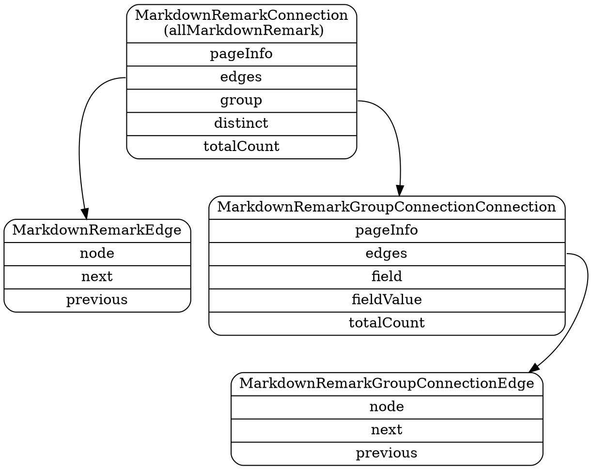

> This documentation isn't up to date with the latest [schema customization changes](/docs/schema-customization).
>
> Outdated areas are:
>
> - add `nodes` as a sibling to `edges`
> - there might be more convenience fields (ask @freiksenet)
>
> You can help by making a PR to [update this documentation](https://github.com/gatsbyjs/gatsby/issues/14228).

## What are schema connections?

So far in schema generation, we have covered how [GraphQL types are inferred](/docs/schema-gql-type), how [query arguments for types](/docs/schema-input-gql) are created, and how [sift resolvers](/docs/schema-sift) work. But all of these only allow querying down to a single node of a type. Schema connections is the ability to query over **collections** of nodes of a type. For example, if we want to query all markdown nodes by some criteria, it will allow us to write queries such as:

```graphql
{
  allMarkdownRemark(filter: {frontmatter: {tags: {in: "wordpress"}}}) {
    edges {
      node {
        ...
      }
    }
  }
}
```

Other features covered by schema connections are aggregators and reducers such as `distinct`, `group` and `totalCount`, `edges`, `skip`, `limit`, and more.

### Connection/Edge

A connection is an abstraction that describes a collection of nodes of a type, and how to query and navigate through them. In the above example query, `allMarkdownRemark` is a Connection Type. Its field `edges` is analogous to `results`. Each Edge points at a `node` (in the collection of all markdownRemark nodes), but it also points to the logical `next` and `previous` nodes, relative to the `node` in the collection (meaningful if you provided a `sort` arg).

_Fun Fact: This stuff is all based on [relay connections](https://facebook.github.io/relay/graphql/connections.htm) concepts_

The ConnectionType also defines input args to perform paging using the `skip/limit` pattern. The actual logic for paging is defined in the [graphql-skip-limit](https://www.npmjs.com/package/graphql-skip-limit) library in [arrayconnection.js](https://github.com/gatsbyjs/gatsby/blob/master/packages/graphql-skip-limit/src/connection/arrayconnection.js). It is invoked as the last part of the [run-sift](/docs/schema-sift#5-run-sift-query-on-all-nodes) function. To aid in paging, the ConnectionType also defines a `pageInfo` field with a `hasNextPage` field.

The ConnectionType is defined in the [graphql-skip-limit connection.js](https://github.com/gatsbyjs/gatsby/blob/master/packages/graphql-skip-limit/src/connection/connection.js) file. Its construction function takes a Type, and uses it to create a connectionType. E.g. passing in `MarkdownRemark` Type would result in a `MarkdownRemarkConnection` type whose `edges` field would be of type `MarkdownRemarkEdge`.

### GroupConnection

A GroupConnection is a Connection with extended functionality. Instead of simply providing the means to access nodes in a collection, it allows you to group those nodes by one of its fields. It _is_ a `Connection` Type itself, but with 3 new fields: `field`, `fieldValue`, and `totalCount`. It adds a new input argument to `ConnectionType` whose value can be any (possibly nested) field on the original type.

The creation of the GroupConnection is handled in [build-connection-fields.js](https://github.com/gatsbyjs/gatsby/blob/master/packages/gatsby/src/schema/build-connection-fields.js#L57). It's added as the `group` field to the top level type connection. This is most easily shown in the below diagram.



Let's see this in practice. Say we were trying to group all markdown nodes by their author. We would query the top level `MarkdownRemarkConnection` (`allMarkdownRemark`) which would return a `MarkdownRemarkConnection` with this new group input argument, which would return a `MarkdownRemarkGroupConnectionConnection` field. E.g:

```graphql
{
  allMarkdownRemark {
    group(field: frontmatter___author) {
      fieldValue
      edges {
        node {
          frontmatter {
            title
          }
        }
      }
    }
  }
}
```

#### Field enum value

The `frontmatter___author` value is interesting. It describes a nested field. I.e, we want to group all markdown nodes by their `frontmatter.author` field. The author field in each frontmatter subobject. So why not use a period? The problem is that GraphQL doesn't allow periods in fields names, so we instead use `___`, and then in the [resolver](https://github.com/gatsbyjs/gatsby/blob/master/packages/gatsby/src/schema/build-connection-fields.js#L69), we convert it back to a period.

The second interesting thing is that `frontmatter___author` is not a string, but rather a GraphQL enum. You can verify this by using intellisense in GraphiQL to see all possible values. This implies that Gatsby has generated all possible field names. Which is true! To do this, we create an [exampleValue](/docs/schema-gql-type#gqltype-creation) and then use the [flat](https://www.npmjs.com/package/flat) library to flatten the nested object into string keys, using `___` delimiters. This is handled by the [data-tree-utils.js/buildFieldEnumValues](https://github.com/gatsbyjs/gatsby/blob/master/packages/gatsby/src/schema/data-tree-utils.js#L277) function.

Note, the same enum mechanism is used for creation of `distinct` fields

#### Group Resolver

The resolver for the Group type is created in [build-connection-fields.js](https://github.com/gatsbyjs/gatsby/blob/master/packages/gatsby/src/schema/build-connection-fields.js#L57). It operates on the result of the core connection query (e.g. `allMarkdownRemark`), which is a `Connection` object with edges. From these edges, we retrieve all the nodes (each edge has a `node` field). And now we can use lodash to group those nodes by the fieldname argument (e.g. `field: frontmatter___author`).

If sorting was specified ([see below](#sorting)), we sort the groups by fieldname, and then apply any `skip/limit` arguments using the [graphql-skip-limit](https://www.npmjs.com/package/graphql-skip-limit) library. Finally we are ready to fill in our `field`, `fieldValue`, and `totalCount` fields on each group, and we can return our resolved node.

### Input filter creation

Just like in [gql type input filters](/docs/schema-input-gql), we must generate standard input filters on our connectiontype arguments. As a reminder, these allow us to query any fields by predicates such as `{ eq: "value" }`, or `{ glob: "foo*" }`. This is covered by the same functions (in [infer-graphql-object-type.js](https://github.com/gatsbyjs/gatsby/blob/master/packages/gatsby/src/schema/infer-graphql-input-fields.js)), except that we're passing in Connection types instead of basic types. The only difference is that we use the `sort` field ([see below](#sorting))

### Sorting

A `sort` argument can be added to the `Connection` type (not the `GroupConnection` type). You can sort by any (possibly nested) field in the connection results. These are enums that are created via the same mechanism described in [enum fields](#field-enum-value). Except that the inference of these enums occurs in [infer-graphql-input-type.js](https://github.com/gatsbyjs/gatsby/blob/master/packages/gatsby/src/schema/infer-graphql-input-fields.js#L302).

The Sort Input Type itself is created in [build-node-connections.js](https://github.com/gatsbyjs/gatsby/blob/master/packages/gatsby/src/schema/build-node-connections.js#L49) and implemented by [create-sort-field.js](https://github.com/gatsbyjs/gatsby/blob/master/packages/gatsby/src/schema/create-sort-field.js). The actual sorting occurs in run-sift (below).

### Connection Resolver (sift)

Finally, we're ready to define the resolver for our Connection type (in [build-node-connections.js](https://github.com/gatsbyjs/gatsby/blob/master/packages/gatsby/src/schema/build-node-connections.js#L65)). This is where we come up with the name `all${type}` (e.g. `allMarkdownRemark`) that is so common in Gatsby queries. The resolver is fairly simple. It uses the [sift.js](https://www.npmjs.com/package/sift) library to query across all nodes of the same type in redux. The big difference is that we supply the `connection: true` parameter to `run-sift.js` which is where sorting, and pagination is actually executed. See [Querying with Sift](/docs/schema-sift) for how this actually works.
