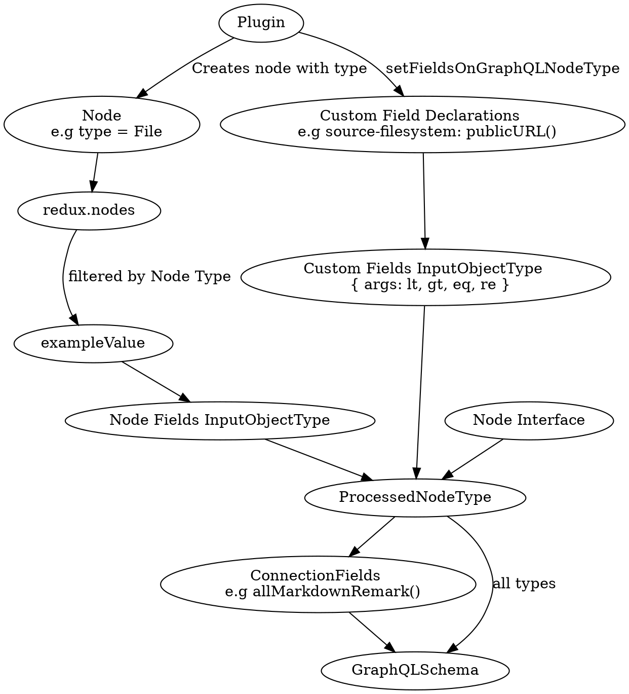

## GrapQL Schema Generation

Once the nodes have been sourced and transformed, the next step is to generate the GraphQL Schema. This is one of the more complex parts of the Gatsby code base. We must infer a GraphQL schema from all the nodes that have been sourced and transformed so far. Read on to find out how that occurs.

At a high level, here are the steps performed during this stage:



1. Group all nodes by type (`node.internal.type`). E.g `File`, `ImageSharp`. Then, for each type, perform the following steps:
1. Each plugin has the chance to provide custom field Types for their node type via the [setFieldsOnGraphQLNodeType]() API. These APIS are run now
1. Convert each of these custom field types into an input filter type.
1. Build an example object from all the existing nodes. 
1. For each example value, generate a GraphQL Type (or use a scalar), and an input filter type. So we can query this node by any of its fields
1. Create a `GraphQLObjectType` (the actual GraphQL Type object)
1. Create GraphQL types for connections between fields. This includes pagination, sorting, and limits for collections of nodes.
1. Create a new `GraphQLSchema` using the inferred Types and connection types and save this to `redux.schema`

See below for details on each of the above steps.

### 1. Group all nodes by type

Each sourced or transformed node has a `node.internal.type`, which is set by the plugin that created it. E.g, the `source-filesystem` plugin [sets the type to File](https://github.com/gatsbyjs/gatsby/blob/master/packages/gatsby-source-filesystem/src/create-file-node.js#L46). The `transformer-json` plugin creates a dynamic type [based on the parent node](https://github.com/gatsbyjs/gatsby/blob/master/packages/gatsby-transformer-json/src/gatsby-node.js#L48). E.g `PostsJson` for a `posts.json` file.

During the schema generation phase, we must generate a [GraphQLObjectType](https://graphql.org/graphql-js/type/#graphqlobjecttype) for each of these `node.internal.type`s. The below steps are run for each unique type.

### 2. Plugins create custom fields

Gatsby infers GraphQL Types from the fields on the sourced and transformed nodes. But before that, we allow plugins to create their own custom fields. For example, `source-filesystem` creates a [publicURL](https://github.com/gatsbyjs/gatsby/blob/master/packages/gatsby-source-filesystem/src/extend-file-node.js#L11) field that when resolved, will copy the file into the `public/static` directory and return the new path.

To declare custom fields, plugins implement the [setFieldsOnGraphQLNodeType](/docs/node-apis/#setFieldsOnGraphQLNodeType) API and apply the change only to types that they care about (e.g source-filesystem [only proceeds if type.name = `File`](https://github.com/gatsbyjs/gatsby/blob/master/packages/gatsby-source-filesystem/src/extend-file-node.js#L6). During schema generation, Gatsby will call this API, allowing the plugin to declare these custom fields, [which are returned](https://github.com/gatsbyjs/gatsby/blob/master/packages/gatsby/src/schema/build-node-types.js#L151) to the main schema process.

### 3. Convert custom plugin fields into Input Filter Types

For each of the custom fields declared by the plugins in the previous step, we create a [GraphQLInputObjectType](https://graphql.org/graphql-js/type/#graphqlinputobjecttype). Depending on the type of the field, we also generate a variety of input filters to assist with querying. For example, for `source-filesystem`, [publicURL](https://github.com/gatsbyjs/gatsby/blob/master/packages/gatsby-source-filesystem/src/extend-file-node.js#L12) is a string. Therefore we might want to query the publicURL by a string that is equal to, not equal to, matches a regex etc. These are defined in the [scalarFilterMap](https://github.com/gatsbyjs/gatsby/blob/master/packages/gatsby/src/schema/infer-graphql-input-fields-from-fields.js#L84).

### 4. Build an example object

The next step is to start inferring the GraphQL equivelent of the node's fields. To do this, we [build a super object](https://github.com/gatsbyjs/gatsby/blob/master/packages/gatsby/src/schema/data-tree-utils.js#L305) by merging all instances of the type's nodes from redux. During this step, we can detect if nodes have inconsistent types for their fields. E.g node1.foo = "string". node2.foo = 5. And raise an error if so.

### 5. Generate GraphQL Type from Example

Now that we've built an object with examples of all the type's possible fields, we can [infer](https://github.com/gatsbyjs/gatsby/blob/master/packages/gatsby/src/schema/infer-graphql-input-fields.js#L71) the actual GraphQL equivelent types. This simply maps javascript types to GraphQL types. E.g `typeof(value) = int` would result in `GraphQLInt`. If the type is an object, we recurse down into its structure, inferring types from each of its sub fields. 

### 6. Create a GraphqlObjectType

We're now ready to create our final Graphql Type, known as a [ProcessedNodeType](https://github.com/gatsbyjs/gatsby/blob/master/packages/gatsby/src/schema/build-node-types.js#L182). This includes all inferred fields from the example object, merged with all the fields created from the plugins. It also includes the `Node Interface`, which provides reuseuable fields such as id, parent and children. We also create the same Input Types like in the plugin so that we can query by a node's field by regex, equality etc.

### 7. Create Connection Fields

We've built a GraphQL type where we can query by any of the node's fields, including custom plugin fields. But what about querying for connections between nodes? E.g query the first 10 fields of this type, sorted by this field? And use skip/limit pagination style? 

This occurs in [build-connection-fields](https://github.com/gatsbyjs/gatsby/blob/master/packages/gatsby/src/schema/build-connection-fields.js#L17). We create useful fields such as `totalCount`, `distinct`, `group`, `next`, `prev`, `edges`, `sort`, etc. We end up with a GraphQL Type that can be queried for all of its nodes. For example :

```javascript
allMarkdownRemark(
  sort: {}, 
  limit: 100, 
  filter: { fileAbsolutePath: { ne: null} } 
)
```

### 8. Create a new `GraphQLSchema` using the inferred Types and connection types and save this to `redux.schema`

We're done! We've created GraphQL Types by inferring from node's examples and combining them with custom fields declared by plugins. We've also created Types that can be queried for all instances of that node's types. We now merge these types into a single collection which is used to create a new [GraphQLSchema](https://github.com/gatsbyjs/gatsby/blob/master/packages/gatsby/src/schema/index.js#L23), which is then saved to `redux.schema`.

## More schema information

### `${type}___${field}` strings  e.g `frontmatter___date`

You might see sorting queries such as:

```graphql
{
  allMarkdownRemark(sort: { fields: [frontmatter___date]}) {
    edges {
      node {
        ...
      }
    }
  }
}
```

The `frontmatter___date` is a notation the `date` field on the `frontmatter` type. In sift, this would be represented as `frontmatter.date`, but graphql doesn't allow this syntax, so we're forced to use `___` instead of a period. The translation occurs in [run-sift.js](https://github.com/gatsbyjs/gatsby/blob/master/packages/gatsby/src/schema/run-sift.js#L255)

### Sift querying

TODO
