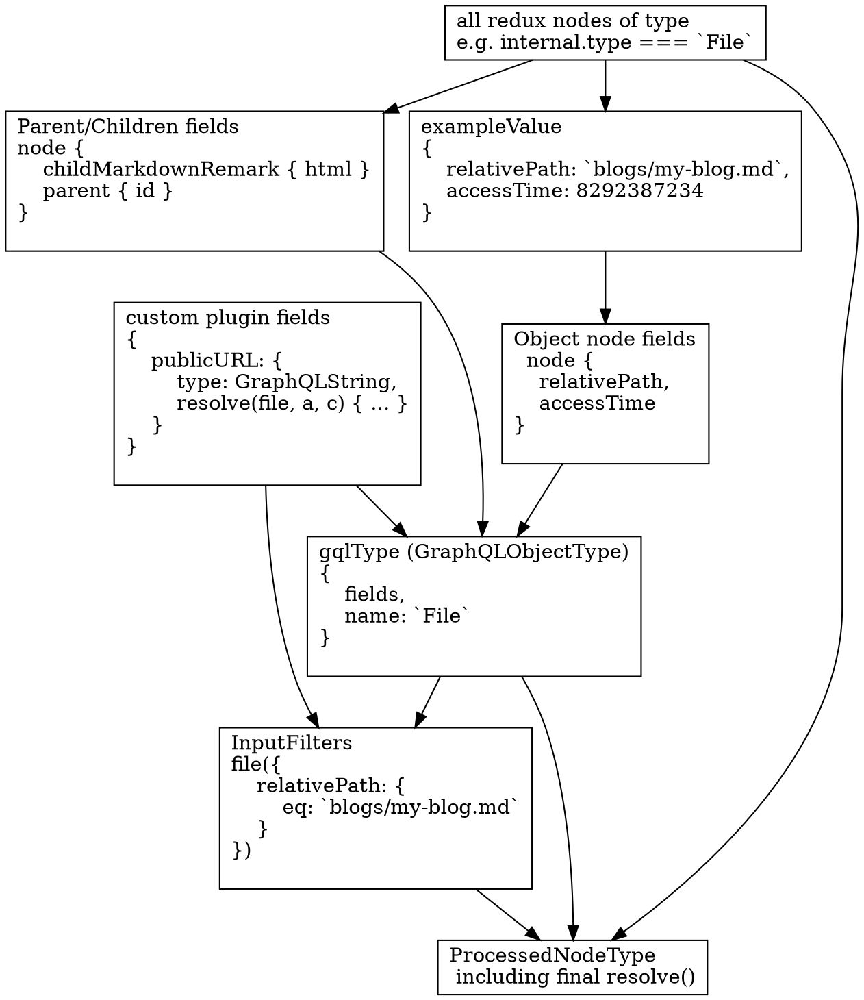

> This documentation isn't up to date with the latest [schema customization changes](/docs/schema-customization).
> You can help by making a PR to [update this documentation](https://github.com/gatsbyjs/gatsby/issues/14228).

Once the nodes have been sourced and transformed, the next step is to generate the GraphQL Schema. This is one of the more complex parts of the Gatsby code base. In fact, as of writing, it accounts for a third of the lines of code in core Gatsby. It involves inferring a GraphQL schema from all the nodes that have been sourced and transformed so far. Read on to find out how it's done.

## Group all nodes by type

Each sourced or transformed node has a `node.internal.type`, which is set by the plugin that created it. E.g, the `source-filesystem` plugin [sets the type to File](https://github.com/gatsbyjs/gatsby/blob/master/packages/gatsby-source-filesystem/src/create-file-node.js#L46). The `transformer-json` plugin creates a dynamic type [based on the parent node](https://github.com/gatsbyjs/gatsby/blob/master/packages/gatsby-transformer-json/src/gatsby-node.js#L48). E.g. `PostsJson` for a `posts.json` file.

During the schema generation phase, we must generate what's called a `ProcessedNodeType` in Gatsby. This is a simple structure that builds on top of a [graphql-js GraphQLObjectType](https://graphql.org/graphql-js/type/#graphqlobjecttype). Our goal in the below steps is to infer and construct this object for each unique node type in redux.

The flow is summarized by the below graph. It shows the intermediate transformations or relevant parts of the user's GraphQL query that are performed by code in the Gatsby [schema folder](https://github.com/gatsbyjs/gatsby/tree/master/packages/gatsby/src/schema), finally resulting in the [ProcessedNodeType](https://github.com/gatsbyjs/gatsby/blob/master/packages/gatsby/src/schema/build-node-types.js#L182). It uses the example of building a `File` GraphQL type.

## For each unique Type

The majority of schema generation code kicks off in [build-node-types.js](https://github.com/gatsbyjs/gatsby/blob/master/packages/gatsby/src/schema/build-node-types.js). The below steps will be executed for each unique type.

### 1. Plugins create custom fields

Gatsby infers GraphQL Types from the fields on the sourced and transformed nodes. But before that, we allow plugins to create their own custom fields. For example, `source-filesystem` creates a [publicURL](https://github.com/gatsbyjs/gatsby/blob/master/packages/gatsby-source-filesystem/src/extend-file-node.js#L11) field that when resolved, will copy the file into the `public/static` directory and return the new path.

To declare custom fields, plugins implement the [setFieldsOnGraphQLNodeType](/docs/node-apis/#setFieldsOnGraphQLNodeType) API and apply the change only to types that they care about (e.g. source-filesystem [only proceeds if type.name = `File`](https://github.com/gatsbyjs/gatsby/blob/master/packages/gatsby-source-filesystem/src/extend-file-node.js#L6). During schema generation, Gatsby will call this API, allowing the plugin to declare these custom fields, [which are returned](https://github.com/gatsbyjs/gatsby/blob/master/packages/gatsby/src/schema/build-node-types.js#L151) to the main schema process.

### 2. Create a "GQLType"

This step is quite complex, but at its most basic, it infers GraphQL Fields by constructing an `exampleObject` that merges all fields of the type in Redux. It uses this to infer all possible fields and their types, and construct GraphQL versions of them. It does the same for fields created by plugins (like in step 1). This step is explained in detail in [GraphQL Node Types Creation](/docs/schema-gql-type).

### 3. Create Input filters

This step creates GraphQL input filters for each field so the objects can be queried by them. More details in [Building the Input Filters](/docs/schema-input-gql).

### 4. ProcessedTypeNode creation with resolve implementation

Finally, we have everything we need to construct our final Gatsby Type object (known as `ProcessedTypeNode`). This contains the input filters and gqlType created above, and implements a resolve function for it using sift. More detail in the [Querying with Sift](/docs/schema-sift) section.

### 5. Create Connections for each type

We've inferred all GraphQL Types, and the ability to query for a single node. But now we need to be able to query for collections of that type (e.g. `allMarkdownRemark`). [Schema Connections](/docs/schema-connections/) takes care of that.
