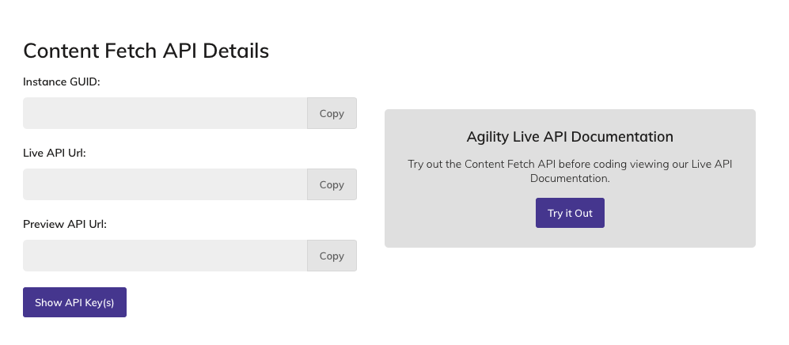
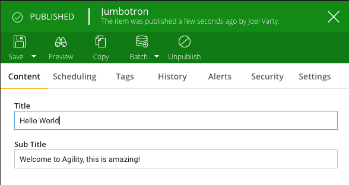

This guide takes you through the steps involved in setting up a Gatsby site that fetches content from [Agility CMS](https://agilitycms.com/).

## What is Agility CMS? What makes it different?

[Agility CMS](https://agilitycms.com/) is a headless Content Management System (CMS) that lets you define your custom content types and relationships. This is called Content Architecture, and you can reuse this content for your websites and apps.

In addition, Agility CMS provides a page routing API, which allows you to offload control of the sitemap to the content editors.

All content is available through the Agility CMS Fetch or Preview API.

## Getting started

### Create a free Agility account

Create an Agility CMS account with the Free Plan (this plan is free forever). [Sign up to Agility CMS](https://account.agilitycms.com/sign-up?product=agility-free).

Once your account is created, you'll need to grab your GUID and API Keys.

### Get the code

Make sure you have the Gatsby CLI installed:

```shell
npm install -g gatsby-cli
```

Clone the [Agility CMS Gatsby Starter](https://github.com/agility/agility-gatsby-starter) repo from GitHub that has all the code you need to get started:

```shell
git clone https://github.com/agility/agility-gatsby-starter.git
```

Install the dependencies:

```shell
npm install
```

Once you've the infrastructure set up, run the site in development mode:

```shell
gatsby develop
```

The site is just a starter, but it has a bunch of interesting features that you can use to build from. The next step is to hook this code up to your new Agility CMS instance that you just created.

## Hook it up to your Agility CMS instance

Edit the `gatsby-config.js` file and repace the `guid` and `apiKey` with yours.

You can find your API keys on the Getting Started page in the Agility CMS Content Manager.



If you use the `preview` key, you won't have to publish to see the changes you've made show up. If you use the `fetch` key, make sure you've published any content you wish to see changed.

## How it works

The Gatsby Source Plugin downloads all the Pages on the Agility CMS Sitemap, as well as any Shared Content that's referenced on the `sharedContent` property in the `gatsby-config.js` file.

All of those pages and content are then made available in GraphQL to the React Components you will write to render those pages.

Check out the component called "Jumbotron". This is an example of how to display a styled heading and sub-heading with content that comes from Agility CMS. Here is the Module that provides this content being edited in the Agility CMS Content Manager:



And here is the code used to render it. Notice that the `title` and `subTitle` fields are available as properties of the `item.fields` object.

```javascript:title=src/modules/Jumbotron.js
import React, { Component } from "react"
import { graphql, StaticQuery } from "gatsby"

import "./Jumbotron.css"

export default class Jumbotron extends Component {
  render() {
    return (
      <section className="jumbotron">
        <h1>{this.props.item.fields.title}</h1>
        <h2>{this.props.item.fields.subTitle}</h2>
      </section>
    )
  }
}
```

When you add new modules and content definitions to Agility CMS, the components used to render those modules will automatically receive the strongly typed data delivered to those modules as props.
