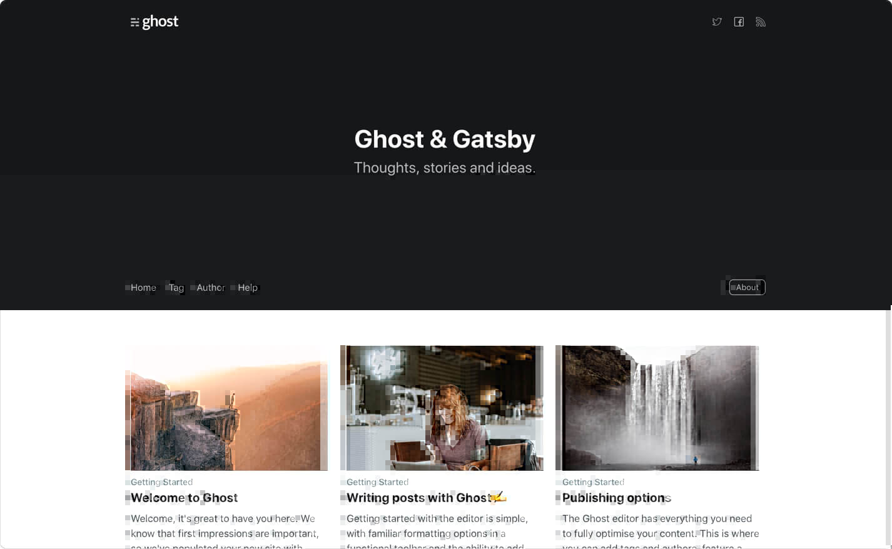

[Ghost](https://ghost.org) is an open source, professional publishing platform built on a modern Node.js technology stack — designed for teams who need power, flexibility and performance - used by Apple, NASA, Sky News, OpenAI & many more.

It comes with all the benefits of modern, centralized Headless CMS platforms, with the added benefit of being released completely for free under an MIT license, so you have total ownership and control of it without needing to depend on a third party backend.

This guide will walk you through using Gatsby with the [Ghost Content API](https://docs.ghost.org/api/content/).

---

## Quick start

The fastest way to get started is with the official **Gatsby Starter Ghost** repository, which contains a light scaffolding of queries and templates to get a brand-new site up and running.

- Repository: https://github.com/tryghost/gatsby-starter-ghost
- Demo: https://gatsby.ghost.org

[](https://gatsby.ghost.org)

---

## Install and setup

If you prefer to start from scratch or integrate the Ghost Content API into an existing site, you can set up the **Gatsby Source Ghost** plugin.

```shell
npm install gatsby-source-ghost
```

### Configuration

```javascript:title=gatsby-config.js
// These are working demo credentials, try them out!

module.exports = {
  plugins: [
    {
      resolve: `gatsby-source-ghost`,
      options: {
        apiUrl: `https://gatsby.ghost.io`,
        contentApiKey: `9cc5c67c358edfdd81455149d0`,
      },
    },
  ],
}
```

---

## Generating pages

Once the source plugin is set up, you can use the [`createPages` API](/docs/reference/config-files/gatsby-node/#createPages) in `gatsby-node.js` to run queries against your Ghost data with GraphQL. In this example, Gatsby iterates over each post returned by the Ghost API and generates a new page with that data, using the `post.js` template file.

There are several ways to structure queries depending on how you prefer to work, but here's a very minimal example:

```javascript:title=gatsby-node.js
const path = require(`path`)

exports.createPages = async ({ graphql, actions, reporter }) => {
  const postTemplate = path.resolve(`./src/templates/post.js`)

  // Query Ghost data
  const result = await graphql(`
    {
      allGhostPost(sort: { published_at: ASC }) {
        edges {
          node {
            slug
          }
        }
      }
    }
  `)

  // Handle errors
  if (result.errors) {
    reporter.panicOnBuild(`Error while running GraphQL query.`)
    return
  }

  if (!result.data.allGhostPost) {
    return
  }

  // Create pages for each Ghost post
  const items = result.data.allGhostPost.edges
  items.forEach(({ node }) => {
    node.url = `/${node.slug}/`

    actions.createPage({
      path: node.url,
      component: postTemplate,
      context: {
        slug: node.slug,
      },
    })
  })
}
```

---

## Outputting data

The code above will create pages in the root of the site at `/`, with the path being the slug of the post.

Then, within the `post.js` template, you can determine exactly how and where you want to output data on each page. Again, you'll use GraphQL to query individual fields, so an example looks something like this:

```jsx:title=templates/post.js
import React from "react"
import { graphql } from "gatsby"

const Post = ({ data }) => {
  const post = data.ghostPost
  return (
    <>
      <article className="post">
        {post.feature_image ? (
          
        ) : null}
        <h1>{post.title}</h1>
        <section dangerouslySetInnerHTML={{ __html: post.html }} />
      </article>
    </>
  )
}

export default Post

export const postQuery = graphql`
  query($slug: String!) {
    ghostPost(slug: { eq: $slug }) {
      title
      slug
      feature_image
      html
    }
  }
`
```

---

## Wrapping up

You should have a broad understanding of how Gatsby and the Ghost Content API work together now in order to use Ghost as a headless CMS. Your writers can enjoy the slick administration experience, while your development team can keep using their ideal tooling. Everyone wins!

### What to read next

Here are some further resources and reading material to help you get started with some more advanced examples and use-cases:

- [Gatsby + Ghost announcement post](/blog/2019-01-14-modern-publications-with-gatsby-ghost/)
- [More info about Ghost as a Headless CMS](https://blog.ghost.org/jamstack/)
- [Official Gatsby Starter for Ghost](https://github.com/tryghost/gatsby-starter-ghost)
- [Official Gatsby Source Plugin for Ghost](/plugins/gatsby-source-ghost/)
- [Official Ghost developer docs](https://docs.ghost.org/api/)
