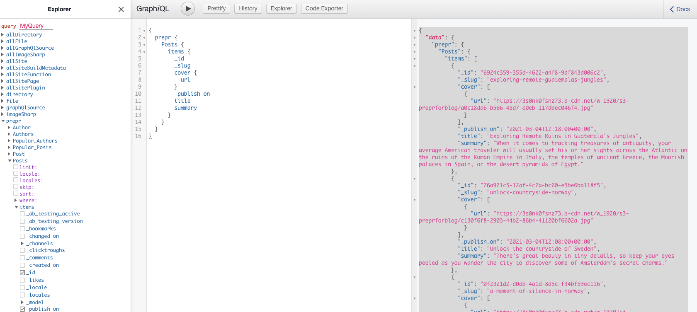

In this guide, you’ll go through how to quickly source content for your Gatsby site from Prepr CMS.

## Data-driven Headless CMS

[Prepr](https://prepr.io?referrer=gatsby-headless-docs-top) is a data-driven Headless Content Management System (Headless CMS)
that lets you deliver content across platforms at scale. Prepr is not your average headless CMS. We’re powered by graph database
technology.

## Getting started

In this guide you'll create a Gatsby site capable of querying data from Prepr.

### Prerequisites

This guide assumes the following:

- You have an active Prepr environment
- You've created a new Prerp project (preferably using the `Example` template)

All schema and data references in this guide are from the Prepr CMS `Example` template.

### Create a new Gatsby site

To begin, let's create a new Gatsby site using the default starter.

```shell
gatsby new gatsby-site https://github.com/gatsbyjs/gatsby-starter-default
```

Once finished, navigate inside of the project with `cd gatsby-site`.

### Add the `gatsby-source-graphql` plugin

In order to fetch data from Prper you need the `gatsby-source-graphql` plugin. Because Prepr uses GraphQL, you will take advantage of
Gatsby's ability to stitch two GraphQL APIs together, reducing the time required to transform content. There is no need
to use a special gatsby-source-x-cms plugin, the GraphQL source plugin is all you need.

You can install this package with:

```shell
npm install gatsby-source-graphql
```

### Configure the plugin

The last step required before you can query your data is to configure `gatsby-source-graphql`.
Inside of `gatsby-config.js`, add a new plugin configuration.

> We recommend using environment variables with your Prepr `url`. You can learn more about using environment variables with Gatsby [in the How-To Guide about environment variables](/docs/how-to/local-development/environment-variables).

```js
{
  resolve: 'gatsby-source-graphql',
    options: {
      // Your Prepr API Url (Inside Prepr, go to Settings -> Access Tokens)
      url: process.env.PREPRCMS_URL,
      // Top level Query type
      typeName: "PREPR",
      // The field you'll query against when using data from Prepr
      fieldName: "prepr",
    },
},
```

### Inspecting the schema

Start the Gatsby development environment with `npx gatsby develop`. Once running, you will be able to access the GraphiQL explorer in your browser:

`http://localhost:8000/___graphql`

From here, you will be able to browse the generated GraphQL schema of your Gatsby project.



If everything works correctly, you should now have your Prepr environment added to the Gatsby source API!
You can read more about how to use the GraphQL API in the [Prepr CMS docs](https://docs.prepr.io/reference/graphql/v1/introduction).

### Querying for content

Using the generated schema, we can begin to write GraphQL queries for Gatsby data. Consider the query below, which will
return a full list of all available `Post` items.

```graphql
{
  prepr {
    Posts {
      items {
        _id
        _slug
        cover {
          url
        }
        _publish_on
        title
        summary
      }
    }
  }
}
```

```json
{
  "data": {
    "prepr": {
      "Posts": {
        "items": [
          {
            "_id": "6924c359-355d-4622-a4f8-9df843d006c2",
            "_slug": "exploring-remote-guatemalas-jungles",
            "cover": [
              {
                "url": "https://3s0nk0fsnz73.b-cdn.net/w_1920/s3-preprforblog/a0c18da6-b566-45d7-a0eb-117dbec046f4.jpg"
              }
            ],
            "_publish_on": "2021-03-04T12:18:00+00:00",
            "title": "Exploring Remote Ruins in Guatemala's Jungles",
            "summary": "When it comes to tracking treasures of antiquity, your average American traveler will usually set his or her sights across the Atlantic on the ruins of the Roman Empire in Italy, the temples of ancient Greece, the Moorish palaces in Spain, or the desert pyramids of Egypt."
          },
          {
            "_id": "76a921c5-12af-4c7a-bc60-e3be6ba118f5",
            "_slug": "unlock-countryside-norway",
            "cover": [
              {
                "url": "https://3s0nk0fsnz73.b-cdn.net/w_1920/s3-preprforblog/c130f6f8-2903-44b2-86b4-41120bf6602a.jpg"
              }
            ],
            "_publish_on": "2021-03-04T12:08:00+00:00",
            "title": "Unlock the countryside of Sweden",
            "summary": "There's great beauty in tiny details, so keep your eyes peeled as you wander the city to discover some of Amsterdam’s secret charms."
          },

          // ...more results
        ]
      }
    }
  },
}
```

### Query implementation

Gatsby offers two means of data querying: [page queries](/docs/how-to/querying-data/page-query) and [static queries](/docs/how-to/querying-data/static-query).

#### Page query

Page queries run at build time and can accept GraphQL variables via page context. As the name suggest, they can only be used on pages and **not** on non-page components.

The resulting data is available via the page props `data` key.

```jsx
import React from "react"
import { graphql } from "gatsby"

function IndexPage({ data: { prepr:{posts} } }) {
  return (
    <ul>
      {posts.items.map(post => (
        <li key={post._id}>
          <h3>{post.title}</h3>
        </li>
      ))}
    </ul>
  )
}

export const pageQuery = graphql`
  query IndexPageQuery {
    prepr {
      posts: Posts {
        items {
          _id
          _slug
          cover {
            url
          }
          _publish_on
          title
          summary
        }
      }
    }
  }
`

export default IndexPage
```

#### Static query hook

Static queries also run at build time, but can be used in all components via the `useStaticQuery` hook or `<StaticQuery />` component. However they do **not** accept GraphQL variables.

```jsx
import React from "react"
import { graphql, useStaticQuery } from "gatsby"

function IndexPage() {
  const { prepr:{posts} } = useStaticQuery(graphql`
    {
      prepr {
        posts: Posts {
          items {
          _id
          _slug
          cover {
            url
          }
          _publish_on
          title
          summary
          }
        }
      }
    }
  `)

  return (
    <ul>
      {posts.items.map(post => (
        <li key={post._id}>
          <h3>{post.title}</h3>
        </li>
      ))}
    </ul>
  )
}

export default IndexPage
```

## Learn more

For additional examples of how to query and use data in the context of Gatsby & Prepr, check out the following references:

- [`gatsby-source-graphql`](/plugins/gatsby-source-graphql/)
- [`Prepr CMS docs`](https://docs.prepr.io/reference/graphql/v1/introduction)
