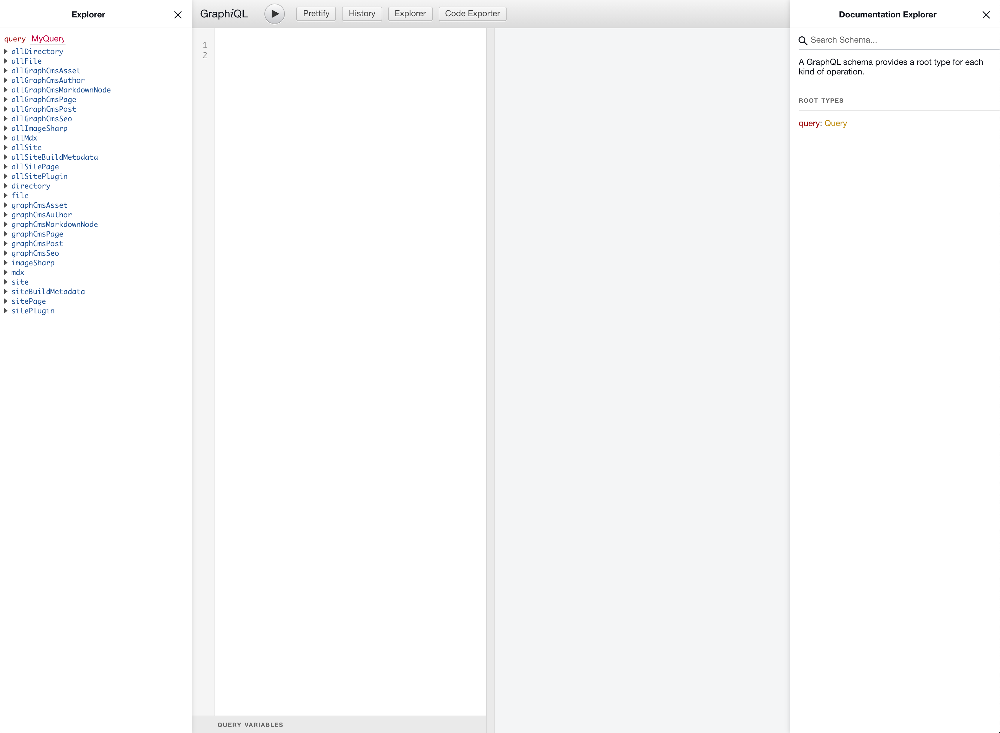

## Data-driven Headless CMS

[Prepr](https://prepr.io?referrer=gatsby-headless-docs-top) is a data-driven Headless Content Management System (Headless CMS)
that lets you deliver content across platforms at scale. With features like an intuitive schema builder, GraphQL mutations API,
and out of the box localization, Prepr enables you to rapidly build digital projects with your preferred frameworks and languages.

## Getting started

In this guide you'll create a Gatsby site capable of querying data from Prepr.

### Prerequisites

This guide assumes the following:

- You have an active Prepr environment
- You've created a new Prerp project (preferably using the `Example` template)

All schema and data references in this guide are from the Prepr CMS `Example` template.

### Create a new Gatsby site

To begin, let's create a new Gatsby site using the default starter.

```shell
gatsby new gatsby-site https://github.com/gatsbyjs/gatsby-starter-default
```

Once finished, navigate inside of the project with `cd gatsby-site`.

### Add the `gatsby-source-graphql` plugin

In order to fetch data from Prper you need the `gatsby-source-graphql` plugin. Because Prepr uses GraphQL, you will take advantage of
Gatsby's ability to stitch two GraphQL APIs together, reducing the time required to transform content. There is no need
to use a special gatsby-source-x-cms plugin, the GraphQL source plugin is all you need.

You can install this package with:

```shell
npm install gatsby-source-graphql
```

### Configure the plugin

The last step required before you can query your data is to configure `gatsby-source-graphql`.
Inside of `gatsby-config.js`, add a new plugin configuration.

> We recommend using environment variables with your Prepr `url`. You can learn more about using environment variables with Gatsby [in the How-To Guide about environment variables](/docs/how-to/local-development/environment-variables).

```js
{
  resolve: 'gatsby-source-graphql',
    options: {
      // Your Prepr API Url (Inside Prepr, go to Settings -> Access Tokens)
      url: process.env.PREPRCMS_URL,
      // Top level Query type
      typeName: "PREPR",
      // The field you'll query against when using data from Prepr
      fieldName: "prepr",
    },
},
```

### Inspecting the schema

Start the Gatsby development environment with `npx gatsby develop`. Once running, you will be able to access the GraphiQL explorer in your browser:

`http://localhost:8000/___graphql`

From here, you will be able to browse the generated GraphQL schema of your Gatsby project.



If everything works correctly, you should now have your Prepr environment added to the Gatsby source API!
You can read more about how to use the GraphQL API in the [Prepr CMS docs](https://docs.prepr.io/reference/graphql/v1/introduction).

### Querying for content


Using the generated schema, we can begin to write GraphQL queries for Gatsby data. Consider the query below, which will
return a full list of all available `Product` items.

```graphql
{
  allGraphCmsPost {
    nodes {
      id
      content {
        markdown
      }
      coverImage {
        url
      }
      date
      slug
      title
    }
  }
}
```

```json
{
  "data": {
    "allGraphCmsPost": {
      "nodes": [
        {
          "id": "Post:ckadrcx4g00pw01525c5d2e56",
          "content": {
            "markdown": "Lorem ipsum dolor sit amet, consectetur adipiscing elit. Quid ergo? Huius ego nunc auctoritatem sequens idem faciam. Duo Reges: constructio interrete. Sed in rebus apertissimis nimium longi sumus. Itaque his sapiens semper vacabit. Non semper, inquam;\n\n\n\nVerum hoc idem saepe faciamus. Quamquam haec quidem praeposita recte et reiecta dicere licebit.\n\n\n\nAt coluit ipse amicitias. Certe non potest. Bonum incolumis acies: misera caecitas. Quo studio Aristophanem putamus aetatem in litteris duxisse? Idem iste, inquam, de voluptate quid sentit? Facillimum id quidem est, inquam.\n"
          },
          "coverImage": {
            "url": "https://media.graphcms.com/QEg7oQCTEeEjLSEPQJtg"
          },
          "date": "2020-05-05",
          "slug": "technical-seo-with-graphcms",
          "title": "Technical SEO with GraphCMS"
        },
        {
          "id": "Post:ckadrfuu000pe0148kels2b5e",
          "content": {
            "markdown": "Lorem ipsum dolor sit amet, consectetur adipiscing elit. Id enim natura desiderat. Falli igitur possumus. Negat enim summo bono afferre incrementum diem. Indicant pueri, in quibus ut in speculis natura cernitur.\n\n\n\n# Lorem Ipsum\n\n\n\nNe amores quidem sanctos a sapiente alienos esse arbitrantur. Summus dolor plures dies manere non potest? Expectoque quid ad id, quod quaerebam, respondeas. Non est ista, inquam, Piso, magna dissensio. Respondeat totidem verbis. Non est igitur summum malum dolor.\n\n\n\nHic ambiguo ludimur. Nam Pyrrho, Aristo, Erillus iam diu abiecti. Si longus, levis dictata sunt. Duo Reges: constructio interrete. Deinde dolorem quem maximum?\n"
          },
          "coverImage": {
            "url": "https://media.graphcms.com/gzYJIkMRRHCq0JLDOqgU"
          },
          "date": "2020-05-01",
          "slug": "union-types-and-sortable-relations",
          "title": "Union Types and Sortable Relations with GraphCMS"
        }

        // ...more results
      ]
    }
  }
}
```


### Query implementation

Gatsby offers two means of data querying: [page queries](/docs/how-to/querying-data/page-query) and [static queries](/docs/how-to/querying-data/static-query).

#### Page query

Page queries run at build time and can accept GraphQL variables via page context. As the name suggest, they can only be used on pages and **not** on non-page components.

The resulting data is available via the page props `data` key.

```jsx
import React from "react"
import { graphql } from "gatsby"

function IndexPage({ data: { posts } }) {
  return (
    <ul>
      {posts.items.map(post => (
        <li key={post._id}>
          <h3>{post.title}</h3>
        </li>
      ))}
    </ul>
  )
}

export const pageQuery = graphql`
  query IndexPageQuery {
    posts: Posts {
      items {
        _id
        _slug
        cover {
          url
        }
        _publish_on
        title
        summary
      }
    }
  }
`

export default IndexPage
```

#### Static query hook

Static queries also run at build time, but can be used in all components via the `useStaticQuery` hook or `<StaticQuery />` component. However they do **not** accept GraphQL variables.

```jsx
import React from "react"
import { graphql, useStaticQuery } from "gatsby"

function IndexPage() {
  const { posts } = useStaticQuery(graphql`
    {
      posts: Posts {
        items {
        _id
        _slug
        cover {
          url
        }
        _publish_on
        title
        summary
        }
      }
    }
  `)

  return (
    <ul>
      {posts.items.map(post => (
        <li key={post._id}>
          <h3>{post.title}</h3>
        </li>
      ))}
    </ul>
  )
}

export default IndexPage
```

## Learn more

For additional examples of how to query and use data in the context of Gatsby & Prepr, check out the following references:

- [`gatsby-source-graphql`](/plugins/gatsby-source-graphql/)
- [`gatsby-starter-preprio-blog`](https://github.com/preprio/gatsby-starter-prepr-blog)
- [`Prepr CMS docs`](https://docs.prepr.io/reference/graphql/v1/introduction)
