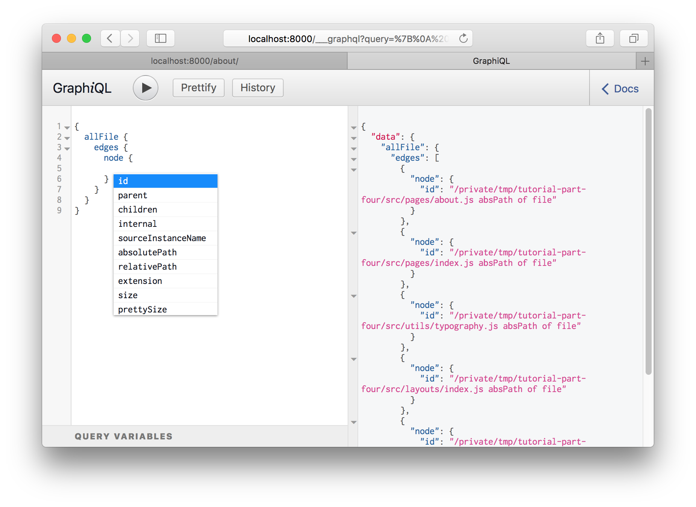

This guide will walk you through sourcing data from the filesystem.

## Setup

This guide assumes that you have a Gatsby project set up. If you need to set up a project, please reference the [Quick Start Guide](/docs/quick-start/).

It will also be useful if you are familiar with [GraphiQL](/docs/introducing-graphiql/), a tool that helps you structure your queries correctly.

## Using `gatsby-source-filesystem`

`gatsby-source-filesystem` is the Gatsby plugin for creating File nodes from the file system.

Install the plugin at the root of your Gatsby project:

```shell
npm install --save gatsby-source-filesystem
```

Then add it to your project's `gatsby-config.js` file:

```javascript:title=gatsby-config.js
module.exports = {
  siteMetadata: {
    title: `Your Site Name`,
  },
  plugins: [
    // highlight-start
    {
      resolve: `gatsby-source-filesystem`,
      options: {
        name: `src`,
        path: `${__dirname}/src/`,
      },
    },
    // highlight-end
  ],
}
```

Save the `gatsby-config.js` file, and restart the Gatsby development server.

Open up GraphiQL.

If you bring up the autocomplete window, you'll see:


Hit <kbd>Enter</kbd> on `allFile` then type <kbd>Ctrl + Enter</kbd> to run a
query.


Delete the `id` from the query and bring up the autocomplete again (<kbd>Ctrl +
Space</kbd>).



Try adding a number of fields to your query, pressing <kbd>Ctrl + Enter</kbd>
each time to re-run the query. You'll see something like this:


The result is an array of File "nodes" (node is a fancy name for an object in a
"graph"). Each File object has the fields you queried for.

## Transforming File nodes

Once files have been sourced, various "transformer" plugins in the Gatsby ecosystem can then be used to transform File nodes into various other types of data. For example, a JSON file can be sourced using `gatsby-source-filesystem`, and then the resulting File nodes can be transformed into JSON nodes using `gatsby-transformer-json`.

## Further reference and examples

For further reference, you may be interested in checking out the `gatsby-source-filesystem` [package README](/packages/gatsby-source-filesystem/), and various official and community [starters that use the plugin](/starters/?d=gatsby-source-filesystem).
