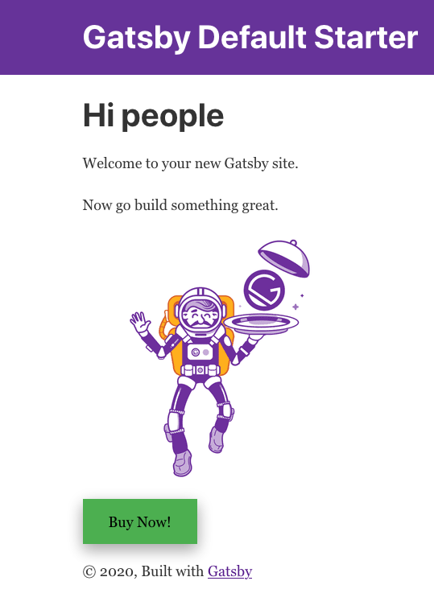

A/B or split testing is when you make test changes to a website. If you have two buttons- a green “Buy Now!” button and a red “Buy Now!” button. You want to figure out which button will receive the most clicks. A split test would be an ideal way to measure engagement.

 

Split testing is a data-driven way to figure out what works on your website, and it is a great way to determine how to make impactful improvements.

One of the main advantages of conducting split tests on Gatsby is performance and the other is price. When you’re testing different variations on your website you are not forced to load heavy and inefficient third party scripts.

Split testing software can be prohibitively expensive- some platforms can run into the thousands per month. If you are leveraging Netlify and Google Analytics, you’re able to set up an A/B test with Gatsby for free.

<GuideList slug={props.slug} />
