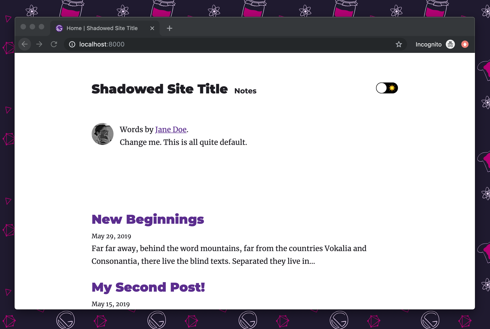

Gatsby themes are intended to be composable. This means you can install multiple themes alongside each other.

The `gatsby-starter-theme` composes two Gatsby themes: `gatsby-theme-blog` and `gatsby-theme-notes`

```shell
gatsby new my-blog https://github.com/gatsbyjs/gatsby-starter-theme
```

The starter includes both theme packages (`gatsby-theme-blog` and `gatsby-theme-notes`) in the starter's `gatsby-config.js` file.

```javascript:title=gatsby-config.js
module.exports = {
  plugins: [
    {
      resolve: `gatsby-theme-notes`,
      options: {
        mdx: true,
        basePath: `/notes`,
      },
    },
    // with gatsby-theme-ui, the last theme in the config
    // will override the theme-ui context from other themes
    { resolve: `gatsby-theme-blog` },
  ],
  siteMetadata: {
    title: `My site title`,
  },
}
```

In the default setup, a blog will be served from the root path (`/`), and the notes content will be served from `/notes`.




## Tutorial

For a step-by-step tutorial, see the ["Using Multiple Themes Together" tutorial](/tutorial/using-multiple-themes-together).
