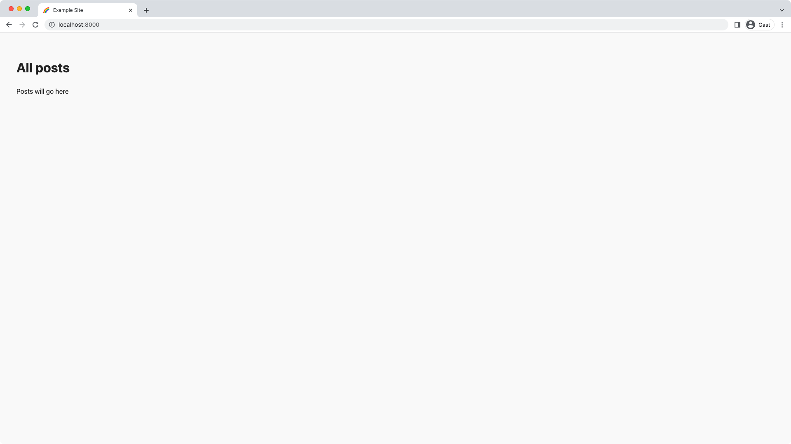

import { LinkButton } from "gatsby-interface"
import Collapsible from "@components/collapsible"
import { MdArrowForward } from "react-icons/md"

## Introduction

Now that you have the necessary background knowledge and your development environment set up, you can get your local project running!

There are many ways to author a Gatsby plugin or more generally speaking an npm package. Since we don't want you to be stuck in decision fatigue on how to do things, you'll learn how to build a Gatsby source plugin in TypeScript with just `tsc` (that is the TypeScript compiler). Later you can decide to use other tooling if you wish. The repository you'll clone will also show how to test your plugin in a Gatsby site.

By the end of this part of the tutorial, you will have:

- Cloned the companion repository to your local machine
- Explored the project structure
- Installed all required dependencies and built all packages
- Spun up the local development server

## Clone the repository

Clone the [companion repository](https://github.com/gatsbyjs/creating-source-plugin-tutorial) from GitHub to your desired location. The repository's `main` branch shows the finished state after following this tutorial. You can reference its code as an additional resource while going through this guide.

<Collapsible
  summary={<em>GitHub cloning instructions</em>}
>

HTTPS snippet:

```shell
git clone https://github.com/gatsbyjs/creating-source-plugin-tutorial.git
```

SSH snippet:

```shell
git clone git@github.com:gatsbyjs/creating-source-plugin-tutorial.git
```

Also be sure to check out [GitHub's documentation for how to clone a repository](https://docs.github.com/en/repositories/creating-and-managing-repositories/cloning-a-repository).

</Collapsible>

After successfully cloning the repository, navigate to its folder and switch to the `start` branch to have a clean boilerplate:

```shell
git checkout start
```

Open the repository in your favorite editor as it'll make the next step easier.

## Project structure

The `creating-source-plugin-tutorial` project includes three directories:

- `api`: This is the example backend API
- `plugin`: The source plugin
- `site`: An example Gatsby site

The `site` uses the `plugin` which sources its data from `api`. As mentioned in [Part 0](/docs/tutorial/creating-a-source-plugin/part-0/#development-environment) this project uses yarn workspaces to make this setup work.

By having the plugin and an example site that uses the plugin in the same repository, you can more easily test your plugin.

<Announcement>

You can ignore the `api` folder unless you're curious how a [GraphQL Yoga server](https://github.com/dotansimha/graphql-yoga) is set up. For the purpose of this tutorial the example backend API was included so that this tutorial doesn't rely on outside resources. This way you can run everything locally.

</Announcement>

The `plugin` itself has a structure we'd also recommend following:

- A `package.json` file that sets `gatsby` and `gatsby-plugin` as its `"keywords"` so that Gatsby's plugin search can pick it up
- A root `gatsby-node.js` that requires `./dist/gatsby-node` (the compiled TypeScript file). At the moment Gatsby looks for a root `gatsby-node.js` file as its entry file.
- A well-written `README` that explains to the user in concise steps how to install, use, and configure your plugin (also see [How to write a plugin README](/contributing/docs-contributions/how-to-write-a-plugin-readme/))
- A `src` folder with the plugin's source code
  - A root `gatsby-node.ts` file that exports [Gatsby Node APIs](/docs/reference/config-files/gatsby-node/) from individual files
  - Individual files that only contain the specific Node API (in [kebab case](https://en.wikipedia.org/wiki/Letter_case#Kebab_case)), e.g. `onPluginInit` becomes `on-plugin-init.ts`. This will also make unit testing your plugin easier.

How you organize your `src` folder is of course up to you, but we'd recommend keeping things consistent and files lowercase.

<Collapsible
  summary={<em>Wondering about a source plugin template for new projects?</em>}
>

Above we said that you can ignore the `api` folder. This is because for your real-world project you'll most likely source the data from an external API, not an API locally in your repository.

The companion repository not only has a `start` branch but also a `template` branch without the `api` folder. You'll learn more about this at the end in the [What's next?](/docs/tutorial/creating-a-source-plugin/whats-next/) part. For now, go through the tutorial and at the end you'll know how to leverage the repository as a template for your new projects!

</Collapsible>

## Start the project

Ready to see something happen in your browser? Then let's go!

First, install the necessary dependencies to run everything:

```shell
yarn
```

Afterwards, open a new window in your terminal (you should have two now).

In the first window, run the `develop:deps` script to start watching the `api` and `plugin` directories. If you change something inside `api`, the GraphQL server will be restarted, if you change something in `plugin` the TypeScript compiler will output updated files.

```shell
yarn develop:deps
```

You should find something like this in your terminal:

```shell
[develop:api   ] 14:48:03 - Starting compilation in watch mode...
[develop:api   ]
[develop:plugin] 14:48:03 - Starting compilation in watch mode...
[develop:plugin]
[develop:api   ] Server is running at http://localhost:4000/graphql
[develop:api   ]
[develop:api   ] 14:48:04 - Found 0 errors. Watching for file changes.
[develop:plugin]
[develop:plugin] 14:48:04 - Found 0 errors. Watching for file changes.
[develop:api   ] Server is running at http://localhost:4000/graphql
```

Now, in your second terminal window, run the `develop:site` script. This runs `gatsby develop` for the example site:

```shell
yarn develop:site
```

While `gatsby develop` is running you should also note the `info Example plugin loaded...` log. This verifies that the plugin was successfully loaded for this initial demo. Yay 🎉

<Announcement>

You're running `develop:site` in a separate window so that you can restart the process independently of the `develop:deps` script. If you make a change to your `plugin` you'll need to restart the example site.

</Announcement>

Once the development server is ready, go to `http://localhost:8000`, and be greeted by a minimalistic index page.



### Key takeaways

- It's good practice to develop your source plugin alongside an example site to be able to test it
- You can keep your code organized by placing each Gatsby Node API in its own file
- When making changes to your plugin, you'll need to restart `gatsby develop` to see your changes applied

<Announcement>

**Share Your Feedback!**

Our goal is for this tutorial to be helpful and easy to follow. We'd love to hear your feedback about what you liked or didn't like about this part of the tutorial.

Use the "Was this doc helpful to you?" form at the bottom of this page to let us know what worked well and what we can improve.

</Announcement>

### What's coming next?

In Part 2 you'll learn how to do the most important part of a Gatsby source plugin: sourcing data and displaying it on your site.

<LinkButton
  to="/docs/tutorial/creating-a-source-plugin/part-2/"
  rightIcon={<MdArrowForward />}
  variant="SECONDARY"
>
  Continue to Part 2
</LinkButton>