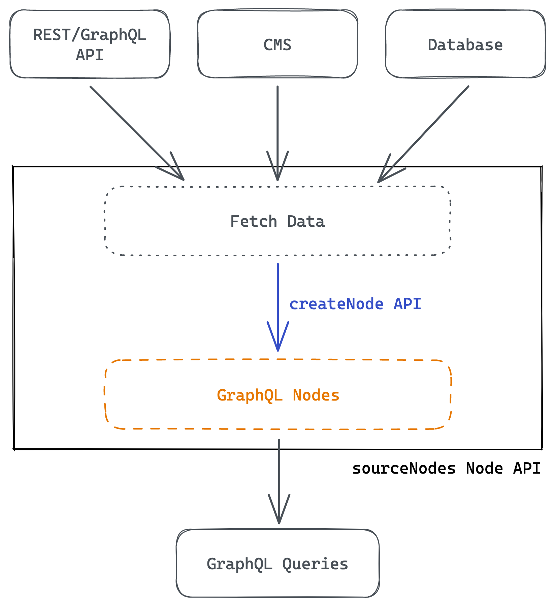
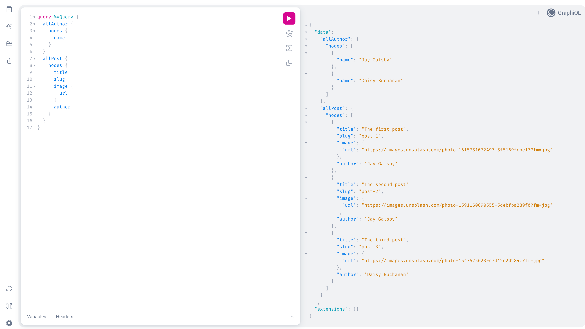
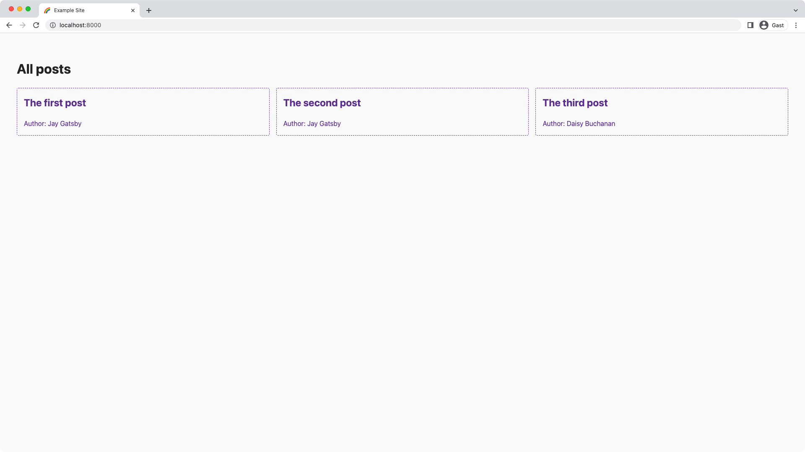
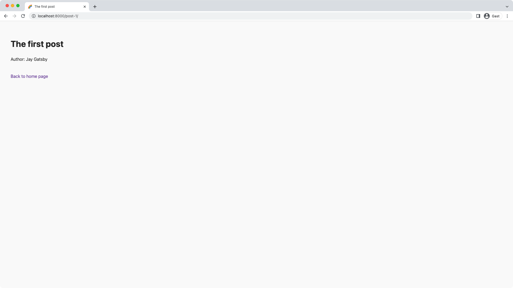

import { LinkButton } from "gatsby-interface"
import Collapsible from "@components/collapsible"
import { MdArrowForward } from "react-icons/md"

## Introduction

Time to get started with implementing the core part of a source plugin!

Gatsby exposes many [Gatsby Node APIs](/docs/reference/config-files/gatsby-node/) (some people also refer to such APIs as "hooks") that allow anyone, including source plugins, to hook into Gatsby's build process. You can create pages, modify the bundler configuration, or in the case of a source plugin add data to Gatsby's GraphQL data layer.

In this part of the tutorial, you'll learn how to use the [`sourceNodes` Node API](/docs/reference/config-files/gatsby-node/#sourceNodes).

By the end of this part of the tutorial, you will be able to:

- Fetch data from an external backend API
- Insert that data into Gatsby's GraphQL data layer
- Display your results inside a Gatsby site

The diagram below shows a high-level view of how a Gatsby source plugin works. (Don't worry if this doesn't make sense yet. You'll learn about each step as you go.)



<Collapsible
  summary={<em>Expand for detailed description</em>}
>

To get data into Gatsby's GraphQL data layer the source plugin goes through these steps:

1. Fetch data from a remote REST/GraphQL API, content management system (CMS), database, or any other data source you can think of.
1. Call `createNode` API to create GraphQL nodes.
1. Use these newly created GraphQL nodes for GraphQL queries in your site.

</Collapsible>

## Source data from an API

Before making changes to your plugin, double check that you're running the `develop:deps` script in your terminal (or more general: That you're recompiling your plugin on changes). Otherwise you'll wonder why you don't see your changes reflected in your example site (don't ask how we know).

### Add `sourceNodes` lifecycle

Create a new file called `source-nodes.ts` inside the plugin's `src` folder with a named `sourceNodes` export:

```ts:title=plugin/src/source-nodes.ts
import type { GatsbyNode } from "gatsby"

export const sourceNodes: GatsbyNode[`sourceNodes`] = async (gatsbyApi) => {
  const { reporter } = gatsbyApi

  reporter.info(`Example plugin sourceNodes...`)
}
```

You're importing the TypeScript type `GatsbyNode` from `gatsby`. The `GatsbyNode` type is a representation of all available Gatsby Node APIs and you can access each type with bracket notation. For example, you can get the TypeScript type for the `onPluginInit` API like this: ``GatsbyNode[`onPluginInit`]``.

Each Gatsby Node API receives its available [Node API helpers](/docs/reference/config-files/node-api-helpers/) as its first parameter. The second parameter to the function is the plugin's options. 

In the example above you're adding a log to the terminal output for initial testing purposes. You'll learn more about plugin options and the `reporter` API in [Part 4](/docs/tutorial/creating-a-source-plugin/part-4/).

<Announcement>

**Pro tip:** You're not immediately destructuring the Node API helpers in the function, but only in the function body. This way you'll be able to more easily pass `gatsbyApi` to utility functions.

A destructured version would look like this:

```ts
export const sourceNodes: GatsbyNode[`sourceNodes`] = async ({ reporter }) => {
  reporter.info(`Example plugin sourceNodes...`)
}
```

The problem with this is that if you want to pass `reporter` or any other helper to a utility function, you'll always need to update all function parameters when you add/remove a helper. `gatsbyApi` contains everything and inside the helper function you can access what you need. You'll see this applied in just a bit.

</Announcement>

Next, add the `sourceNodes` export to the plugin's `gatsby-node.ts`. Gatsby checks for named exports in `gatsby-node` file, and only when those are given it runs the different Node APIs.

```ts:title=plugin/src/gatsby-node.ts
export type { IPluginOptions } from "./types"

export { onPluginInit } from "./on-plugin-init"
// highlight-next-line
export { sourceNodes } from "./source-nodes"
```

In a second terminal window run (or restart if it's still running) the `develop:site` script:

```shell
yarn develop:site
```

You should see the new log `info Example plugin sourceNodes...` printed to the terminal.

### Fetch data

After learning how to add the `sourceNodes` API to your plugin, it's time to do more than just outputting a message.

Open the `source-nodes.ts` file, remove the previous `reporter` usage, and import the `fetchGraphQL` utility. You'll use it to make requests against the example GraphQL API and it returns an object containing `data` and `errors` (you'll only use `data` for now).

```ts:title=plugin/src/source-nodes.ts
import type { GatsbyNode } from "gatsby"
import { fetchGraphQL } from "./utils"

export const sourceNodes: GatsbyNode[`sourceNodes`] = async (gatsbyApi) => {
  const { data } = await fetchGraphQL(
    `http://localhost:4000/graphql`,
    ``
  )
}
```

The first argument to `fetchGraphQL` is the endpoint, the second argument is the GraphQL query you want to make against the API.

For this tutorial you'll be querying the `Post` and `Author` entities from the example API. You can see the query for that in the next step.

<Collapsible
  summary={<em>Working with a remote backend API</em>}
>

The topic of "working with a remote backend API" is a really broad topic and not something we can cover here in its entirety as part of this tutorial. However, here are some tips that will help you while working on your plugin:

- Feel free to either use a barebones fetch function (via [`node-fetch`](https://www.npmjs.com/package/node-fetch)) or something more batteries-included like [`got`](https://www.npmjs.com/package/got). It depends on your API, e.g. if it's unreliable, add retry logic to your fetching. If it's your small API that you know, a more barebones approach will probably be just fine.
- Check if the source you're trying to access has its own SDK. Many CMSs have their own SDK, e.g. Contentful with their [`contentful`](https://www.npmjs.com/package/contentful) package. When available, we'd recommend using these first.
- It's good practice to gracefully handle errors when trying to access a remote API. This includes errors directly from the API but also ones like sudden internet connection loss. You don't want to silently fail on such errors but show them to the user of your plugin.

You can also explore the API if you're not familiar with it. For example, you can visit `http://localhost:4000/graphql` to explore the example API of this tutorial. It's a fully functional GraphiQL IDE window and with its help you can create your queries and test them. Check if your remote API has interactive documentation or other forms of exploring the API.

</Collapsible>

Add the GraphQL query to the second parameter of `fetchGraphQL` and add the correct TypeScript types:

```ts:title=plugin/src/source-nodes.ts
import type { GatsbyNode } from "gatsby"
import { fetchGraphQL } from "./utils"
// highlight-next-line
import type { IAuthorInput, IPostInput } from "./types"

export const sourceNodes: GatsbyNode[`sourceNodes`] = async (gatsbyApi) => {
  // highlight-start
  interface IApiResponse {
    data: {
      posts: Array<IPostInput>
      authors: Array<IAuthorInput>
    }
    errors?: Array<{
      message: string
      locations: Array<unknown>
    }>
  }
  // highlight-end

  // highlight-next-line
  const { data } = await fetchGraphQL<IApiResponse>(
    `http://localhost:4000/graphql`,
    // highlight-start
    `query FetchApi {
      posts {
        id
        slug
        title
        image {
          url
          alt
          width
          height
        }
        author
      }
      authors {
        id
        name
      }
    }
    `
    // highlight-end
  )
}
```

To see if you can successfully source the data from the API, `console.dir` the `data` result:

```ts:title=plugin/src/source-nodes.ts
// Imports

export const sourceNodes: GatsbyNode[`sourceNodes`] = async (gatsbyApi) => {
  // Rest of the code

  console.dir(data, { depth: null })
}
```

<Announcement>

**Pro tip:** If you use `console.log(data)`, the whole depth of the object won't be shown. You can use `console.dir` instead, with a `depth` setting to display everything.

</Announcement>

Restart the `develop:site` script and if everything worked correctly, you should see something like this in your terminal output:

```shell
{
  posts: [
    {
      id: '1',
      slug: 'post-1',
      title: 'The first post',
      image: {
        url: 'https://images.unsplash.com/photo-1615751072497-5f5169febe17?fm=jpg',
        alt: 'brown and white long coated dog',
        width: 3024,
        height: 4032
      },
      author: 'Jay Gatsby'
    },
    {
      id: '2',
      slug: 'post-2',
      title: 'The second post',
      image: {
        url: 'https://images.unsplash.com/photo-1591160690555-5debfba289f0?fm=jpg',
        alt: 'golden retriever puppy on focus',
        width: 5394,
        height: 6743
      },
      author: 'Jay Gatsby'
    },
    {
      id: '3',
      slug: 'post-3',
      title: 'The third post',
      image: {
        url: 'https://images.unsplash.com/photo-1547525623-c7d42c20284c?fm=jpg',
        alt: 'long fur white dog on grass',
        width: 4000,
        height: 6000
      },
      author: 'Daisy Buchanan'
    }
  ],
  authors: [
    { id: '1', name: 'Jay Gatsby' },
    { id: '2', name: 'Daisy Buchanan' }
  ]
}
warn The plugin plugin has generated no Gatsby nodes. Do you need it? This could also suggest the plugin is misconfigured.
```

This means that you can successfully access data from the example API! Gatsby is smart enough to notice that you run a plugin with a `sourceNodes` API but that it doesn't generate any nodes. That's why the warning is showing up. You'll fix this in the next step.

## Create GraphQL nodes

Before immediately diving into the node creation process, let’s take a step back and ask yourself: What do you want to create from `data` inside Gatsby? Within the context of this tutorial, that question is simpler to answer — nodes of type `Post` and `Author` — but this won’t be the case for every API you’ll work with. While inspecting the data that is available, you’ll want to think of how to assemble different node types and the relationships they have to one another. It helps to write this down, outside of code, in plain English or even a diagram. Only after doing that should you start writing the code.
For instance, while it's not the API you'll be working with in this tutorial, here's an example of an API where you'll need to think about fitting node types:

- You're requesting the REST API endpoint called `/authors` and it gives you back a list of authors, each with a unique ID. However, this API response doesn't contain the details for each author, instead you're supposed to call `/author/<author-id>` to request additional information.
- The strict 1:1 mapping of API endpoints to node types would mean you'd have `Author` and `AuthorDetail`
- However, you shouldn't create `Author` and `AuthorDetail` node types but instead only a `Author` one. While creating the `Author` one, access the information from the author detail endpoint and enrich the `Author` information.

<Announcement>

**Need a refresher on what "nodes" are?** Don't worry!

Inside Gatsby's data layer, information is stored in objects called **nodes**. A node is the smallest form unit of data in the data layer. Different source plugins create different types of nodes, each of which have their own properties. For example, `gatsby-source-filesystem` creates `File` nodes.

Also be sure to checkout the [GraphQL concepts](/docs/conceptual/graphql-concepts/) page if you need more information.

</Announcement>

### `createNode`

Besides fetching of the actual data, the creation of nodes is another important piece to a source plugin.

<Announcement>

**Key Gatsby Concept** 💡

Be sure to read this section carefully as understanding how [`createNode`](/docs/reference/config-files/actions/#createNode) works is really important for the rest of this tutorial and for source plugins in general.

</Announcement>

A basic usage of `createNode` looks like this:

```ts:title=gatsby-node.ts
import type { GatsbyNode, NodeInput } from "gatsby"

export const sourceNodes: GatsbyNode[`sourceNodes`] = (gatsbyApi) => {
  // Your arbitrary, serializable data
  const yourData = {
    hello: `world`,
  }

  const node = {
    ...yourData,
    // Required fields
    id: gatsbyApi.createNodeId(`some-string`),
    internal: {
      type: `TypeName`,
      contentDigest: gatsbyApi.createContentDigest(yourData)
    }
  } satisfies NodeInput

  gatsbyApi.actions.createNode(node)
}
```

<Collapsible
  summary={<em>Explanation on each required node field</em>}
>

Here's a short explanation on each required field for your convenience:

- `id`: The node's ID that Gatsby uses to track it. It must be a globally unique ID. You should use the [`createNodeId`](/docs/reference/config-files/node-api-helpers/#createNodeId) helper to create it.
- `internal`: An object that only allows a defined set of keys (see API reference)
  - `type`: The name of the node type
  - `contentDigest`: A hash (or short digital summary) of the contents of a node. The digest should be unique to the node since it's used for caching. If the node changes, this digest should also change. You can use the [`createContentDigest`](/docs/reference/config-files/node-api-helpers/#createContentDigest) helper to create that hash.
  
    If your node contains information like a revision ID or a `lastUpdated` timestamp, you should use this instead of creating your own content digest. This will lead to lower CPU utilization and still achieve the goal of invalidating the cache for the node when said node changes.

You can use the [`createNode` API reference](/docs/reference/config-files/actions/#createNode) in the future if you're creating more advanced node types, e.g. ones where you have to define the [`mediaType`](/docs/tutorial/creating-a-source-plugin/part-7/#mime-types).

</Collapsible>

Once the `sourceNodes` API with its `createNode` call is run one is able to query the `TypeName` type with a `hello` key:

```graphql
query {
  typeName {
    hello
  }
}
```

### Task: Define constants

Since you'll need to use the name of your node types in a couple of places, it's easy to introduce typos while using them. Create a `constants.ts` file to define your names once and reuse them everywhere. This way you can also more easily change the names after the fact. Neat!

<Announcement>

You don't always need constants for your node types. It depends on your data source and the data you have to work with.

If you're working with a more barebones API you might need to manually map endpoints and/or data to node types. Meanwhile, when you work with a CMS, node types will often be dynamic and defined through the CMS data. In those instances you won't need to manually define types as the CMS will drive that.

</Announcement>

Add the following to your new `constants.ts` file:

```ts:title=plugin/src/constants.ts
export const NODE_TYPES = {
  Post: `Post`,
  Author: `Author`,
} as const
```

<Announcement>

**TypeScript tip:** You're using a [`const` assertion](https://www.typescriptlang.org/docs/handbook/release-notes/typescript-3-4.html#const-assertions) here to make the object read-only and tell the compiler to infer the most specific type it can. In this specific instance you use `as const` to enable an `enum`-like pattern instead of directly using TypeScript's `enum`.

</Announcement>

For the next step you'll also need some additional TypeScript types, so go ahead and add the following to the `types.ts` file:

```ts:title=plugin/src/types.ts
// Rest of imports
import { NODE_TYPES } from "./constants"

export type NodeBuilderInput =
  | { type: typeof NODE_TYPES.Author; data: IAuthorInput }
  | { type: typeof NODE_TYPES.Post; data: IPostInput }

// Rest of types
```

You're setting up [Discriminated Unions](https://www.typescriptlang.org/docs/handbook/typescript-in-5-minutes-func.html#discriminated-unions) here which will be used as the input type for the `nodeBuilder` utility. It ensures that e.g. with `type: "Author"` only the `data` in the shape of `IAuthorInput` can be passed in.

### Task: Create `nodeBuilder` utility

You'll create a utility function called `nodeBuilder`. Its purpose is to take in data, mutate it (if necessary), and then call [`createNode`](/docs/reference/config-files/actions/#createNode) for each node type with its respective data. You're then calling `nodeBuilder` for each of your entries from the API response, filling Gatsby's data store with the data from the example API.

Now that you know how a barebones version of `createNode` works, DRY (acronym for "Do not repeat yourself") things up by creating the `nodeBuilder` function inside `source-nodes.ts`.

1. Import the `SourceNodesArgs` and `NodeInput` type from `gatsby` and the `NodeBuilderInput` type from `types.ts`. Also import the `NODE_TYPES` constants you just created:

    ```ts:title=plugin/src/source-nodes.ts
    // highlight-next-line
    import type { GatsbyNode, SourceNodesArgs, NodeInput } from "gatsby"
    import { fetchGraphQL } from "./utils"
    // highlight-next-line
    import type { IAuthorInput, IPostInput, NodeBuilderInput } from "./types"
    // highlight-next-line
    import { NODE_TYPES } from "./constants"

    export const sourceNodes: GatsbyNode[`sourceNodes`] = async (gatsbyApi) => {
      // Contents of sourceNodes
    }

    // highlight-start
    interface INodeBuilderArgs {
      gatsbyApi: SourceNodesArgs
      input: NodeBuilderInput
    }
    // highlight-end

    // highlight-next-line
    export function nodeBuilder({ gatsbyApi, input }: INodeBuilderArgs) {}
    ```

    <Announcement>

    **TypeScript tip:** The `gatsbyApi` that a Gatsby Node API receives isn't always the same on each Node API. Therefore types in the naming scheme "Node API name" (in PascalCase) + "Args" exist, e.g. `sourceNodes` => `SourceNodesArgs`, `createSchemaCustomization` => `CreateSchemaCustomizationArgs`. Those utility TypeScript types are helpful when passing `gatsbyApi` or parts of it to another function.

    </Announcement>

1. Apply the same logic as the barebones `createNode` example to the `nodeBuilder` function:

    - Generate a unique `id`, dependent on the `input.type` and `id` from `input.data`
    - Fill out the [necessary fields](/docs/reference/config-files/actions/#createNode) on the node (as explained in "Explanation on each required node field" above)
    - Add your arbitrary data (in this case `...input.data`)
    - Call `createNode`

    ```ts:title=plugin/src/source-nodes.ts
    // Rest of the file

    export function nodeBuilder({ gatsbyApi, input }: INodeBuilderArgs) {
      const id = gatsbyApi.createNodeId(`${input.type}-${input.data.id}`)

      const node = {
        ...input.data,
        id,
        _id: input.data.id,
        parent: null,
        children: [],
        internal: {
          type: input.type,
          contentDigest: gatsbyApi.createContentDigest(input.data),
        },
      } satisfies NodeInput

      gatsbyApi.actions.createNode(node)
    }
    ```

    Great, you wrote a reusable helper function to create nodes! Now it's time to put it to use.

    <Announcement>

    **Pro tip:** If your incoming data has keys that clash with fields reserved by Gatsby (in this example `id`), you can prefix those fields to still make them available. So the `id` coming from the example API will be available at `_id`. You don't have to use a `_` prefix, you can choose whatever you want (but we'd recommend keeping things consistent).

    **TypeScript tip:** You can use the [`satisfies` operator](https://www.typescriptlang.org/docs/handbook/release-notes/typescript-4-9.html#the-satisfies-operator) to check against a desired shape while inferring the most specific type possible.

    </Announcement>

1. Scroll up in `source-nodes.ts` to the place where you're calling `console.dir()` and remove that log. Replace it with a destructuring assignment of `data` to get the `posts` and `authors` results out of it (you can also set an empty array as a default value):

    ```ts:title=plugin/src/source-nodes.ts
    // Rest of the file

    export const sourceNodes: GatsbyNode[`sourceNodes`] = async (gatsbyApi) => {
      // Rest of sourceNodes

      const { posts = [], authors = [] } = data
    }
    ```

    So both `posts` and `authors` are arrays of objects that you should iterate over. And each individual `post` and `author` will become a Gatsby node when you iterate over both arrays and call `nodeBuilder` inside the loops:

    ```ts:title=plugin/src/source-nodes.ts
    // Rest of the file

    export const sourceNodes: GatsbyNode[`sourceNodes`] = async (gatsbyApi) => {
      // Rest of sourceNodes

      const { posts = [], authors = [] } = data

      // highlight-start
      for (const post of posts) {
        nodeBuilder({ gatsbyApi, input: { type: NODE_TYPES.Post, data: post } })
      }

      for (const author of authors) {
        nodeBuilder({ gatsbyApi, input: { type: NODE_TYPES.Author, data: author } })
      }
      // highlight-end
    }
    ```

Hopefully you can see the benefit of creating a helper function: You don't have to repeat yourself inside the loops, making the code for sourcing data and creating nodes more readable, concise, and clear.

## Display results in your site

You've created GraphQL nodes from your data — time to also display them in your site!

Restart the `develop:site` script in your terminal. Once the development server is running, go to Gatsby's GraphiQL IDE at `http://localhost:8000/___graphql` (Need a refresher? Read the [introduction to GraphiQL](/docs/tutorial/part-4/#use-graphiql-to-explore-the-data-layer-and-write-graphql-queries)).

Inside GraphiQL, try a query against your newly created `Author` and `Post` nodes, for example:

```graphql
query MyQuery {
  allAuthor {
    nodes {
      name
    }
  }
  allPost {
    nodes {
      title
      slug
      image {
        url
      }
      author
    }
  }
}
```

You should see this result in your browser:



Great, you've successfully queried your data in a Gatsby site! As the last step of this part of the tutorial, you'll create pages from all available posts as well as display them on the index page.

First, edit the index page to display all posts and link to their individual pages (which you'll create in just a second):

```tsx:title=site/src/pages/index.tsx
import * as React from "react"
import { Link, graphql, HeadFC, PageProps } from "gatsby"

export default function IndexPage({
  data: {
    allPost: { nodes: posts },
  },
}: PageProps<Queries.IndexPageQuery>): React.ReactElement {
  return (
    <main>
      <h1>All posts</h1>
      <section className="posts-grid">
        {posts.map((post) => (
          <Link key={post.id} to={post.slug} className="posts-card">
            <h2>{post.title}</h2>
            <span>Author: {post.author}</span>
          </Link>
        ))}
      </section>
    </main>
  )
}

export const Head: HeadFC = () => (
  <React.Fragment>
    <title>Example Site</title>
    <link
      rel="icon"
      href="data:image/svg+xml,<svg xmlns='http://www.w3.org/2000/svg' viewBox='0 0 100 100'><text y='0.9em' font-size='90'>🌈</text></svg>"
    />
  </React.Fragment>
)

export const query = graphql`
  query IndexPage {
    allPost {
      nodes {
        id
        slug
        title
        author
      }
    }
  }
`
```

<Announcement>

After copying & pasting the above contents of the index page into your file, your editor might complain about `Queries.IndexPageQuery` (TypeScript error). This type gets autogenerated through the GraphQL query at the bottom of the file. Your editor might need a second until it finds the type. If it doesn't fix itself, a reload of the code editor often helps.

</Announcement>

If you go back to your browser and navigate to `http://localhost:8000`, your index page should look like this:



To add the individual pages that the cards link to, create a new file called `{Post.slug}.tsx` inside `site/src/pages` with the following contents:

```tsx:title=site/src/pages/{Post.slug}.tsx
import * as React from "react"
import { Link, graphql, PageProps, HeadFC } from "gatsby"

export default function PostPage({
  data: { post },
}: PageProps<{ post: Queries.Post }>): React.ReactElement {
  return (
    <main>
      <h1>{post.title}</h1>
      <p>Author: {post.author}</p>
      <br />
      <Link to="/">Back to home page</Link>
    </main>
  )
}

export const Head: HeadFC<{ post: Queries.Post }> = ({ data: { post } }) => (
  <React.Fragment>
    <title>{post.title}</title>
    <link
      rel="icon"
      href="data:image/svg+xml,<svg xmlns='http://www.w3.org/2000/svg' viewBox='0 0 100 100'><text y='0.9em' font-size='90'>🌈</text></svg>"
    />
  </React.Fragment>
)

export const query = graphql`
  query PostPage($slug: String!) {
    post(slug: { eq: $slug }) {
      title
      author
    }
  }
`
```

If you now click on one of the cards, e.g. the "The first post" card you should be linked to `http://localhost:8000/post-1/` and see the individual post:



## Summary

Good job! You've finished the most important part of creating a source plugin.

Take a moment to think back on what you've learned so far. Challenge yourself to answer the following questions from memory:

- Which Gatsby Node API is the appropriate one to add data to Gatsby's data layer?
- How do you fetch data from a remote API?
- What is the purpose of `createNode`?
- How do you create GraphQL nodes from your data?

As a quick review, here's the diagram outlining the process:


<Collapsible
  summary={<em>Expand for detailed description</em>}
>

To get data into Gatsby's GraphQL data layer the source plugin goes through these steps:

1. Fetch data from a remote REST/GraphQL API, CMS, database, or any other data source you can think of.
1. Call `createNode` API to create GraphQL nodes.
1. Use these newly created GraphQL nodes for GraphQL queries in your site.

</Collapsible>

### Key takeaways

- Source plugins pull data from their original location into Gatsby's GraphQL data layer through the `sourceNodes` Node API.
- When creating nodes with `createNode` you'll need to think about reserved and required fields, modifying your incoming data if necessary.
- You can create a utility function around `createNode` to more efficiently create nodes.
- You can use your example site to immediately test out if your source plugin works correctly.

<Announcement>

**Share Your Feedback!**

Our goal is for this tutorial to be helpful and easy to follow. We'd love to hear your feedback about what you liked or didn't like about this part of the tutorial.

Use the "Was this doc helpful to you?" form at the bottom of this page to let us know what worked well and what we can improve.

</Announcement>

### What's coming next?

In Part 3, you'll explicitly define the GraphQL schema of your source plugin and create a foreign-key relationship between the `Post` and `Author` node types.

<LinkButton
  to="/docs/tutorial/creating-a-source-plugin/part-3/"
  rightIcon={<MdArrowForward />}
  variant="SECONDARY"
>
  Continue to Part 3
</LinkButton>