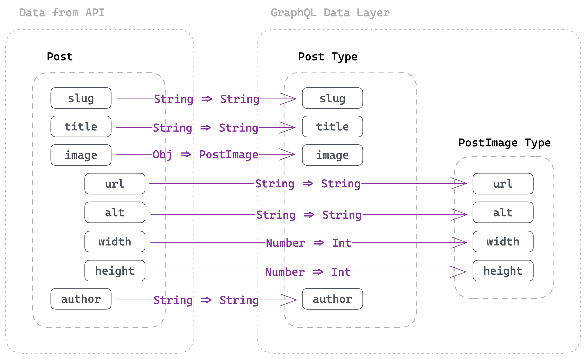
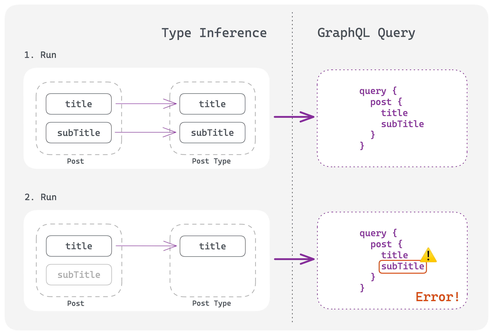

import { LinkButton } from "gatsby-interface"
import Collapsible from "@components/collapsible"
import { MdArrowForward } from "react-icons/md"

## Introduction

In the last part you learned how to create GraphQL nodes and use them in your site. In this part you'll dive deeper into the GraphQL schema creation process and learn how to modify the schema. This knowledge will be valuable for the reliability and usability of your plugin.

One of Gatsby’s main strengths is the ability to query data from a variety of sources in a uniform way with GraphQL. For this to work, a GraphQL schema must be generated that defines the shape of the data. Gatsby is able to automatically infer a GraphQL Schema from your data, and in many cases, this is really all you need. However, there are situations when you either want to explicitly define the data shape, or add custom functionality to the query layer — this is what Gatsby’s `createSchemaCustomization` Node API provides.

In this part of the tutorial, you'll learn how to use the [`createSchemaCustomization` Node API](/docs/reference/config-files/gatsby-node/#createSchemaCustomization).

By the end of this part of the tutorial, you will be able to:

- Describe how Gatsby automatically creates GraphQL types
- Explicitly define the GraphQL schema for your plugin
- Create a foreign-key relationship between your `Post` and `Author` nodes

## Automatic type inference

Before explaining how you can explicitly define your GraphQL schema, it's important for you to understand how Gatsby's automatic type inference works. Then, it'll make more sense why you'd want to define a schema manually and what benefits this offers.

In order to translate the data shape into GraphQL type definitions, Gatsby has to inspect the contents of every field and check its type. There is a big problem with this approach though: If the values on a field are of different types, Gatsby cannot decide which one is the correct one. A consequence of this is that if your data sources change, type inference could suddenly fail. For example, this could happen when data from your source is optional and thus can sometimes exist, sometimes not exist.

The diagram below shows how inference works:



<Collapsible
  summary={<em>Expand for detailed description</em>}
>

You source your incoming data, for example the `Post` information:

```json
{
  slug: 'post-1',
  title: 'The first post',
  image: {
    url: 'https://images.unsplash.com/photo-1615751072497-5f5169febe17?fm=jpg',
    alt: 'brown and white long coated dog',
    width: 3024,
    height: 4032
  },
  author: 'Jay Gatsby'
}
```

When you pass this data through `createNode` (as shown in [Part 2](/docs/tutorial/creating-a-source-plugin/part-2/)) Gatsby inspects the data and tries to figure out ("infer") the appropriate GraphQL types. So a JavaScript `String` becomes a GraphQL `String`, a JavaScript `Number` becomes an `Int`, and a JavaScript object becomes a new GraphQL type.

The `Post` will be translated to this:

```graphql
type Post implements Node {
  slug: String
  title: String
  image: PostImage
  author: String
}

type PostImage {
  url: String
  alt: String
  width: Int
  height: Int
}
```

</Collapsible>

Now let's imagine that not every key on the `Post` input data is always given. There could be an additional, new field called `subTitle` on the `Post` input. Not every post will have a subtitle, therefore it's an optional field.

The diagram below shows the problem with inference when data has optional fields:



<Collapsible
  summary={<em>Expand for detailed description</em>}
>

On the first run the incoming data has `title` and `subTitle` so Gatsby also infers both fields for its `Post` GraphQL type. You can then query it in your page/static queries and expect it to exist in the schema.

But on the second run the `subTitle` was removed from the data and as a consequence Gatsby didn't infer this field. `subTitle` now doesn't exist in the `Post` GraphQL type, but in the GraphQL query you're still trying to query it. This leads to an error where Gatsby complains that it can't find the field.

The error would be something like this (in your terminal):

```shell
There was an error in your GraphQL query:

Cannot query field "subTitle" on type "Post".
```

</Collapsible>

So while you know that `subTitle` is optional, Gatsby can't automatically infer this. Therefore you'll need to help Gatsby interpret your data and define the GraphQL schema — which you'll learn in the next step.

## Explicitly define your GraphQL schema

We **strongly** recommend to explicitly define the GraphQL schema for your source plugin to ensure future compatibility with Gatsby's ecosystem. This way the pitfalls you've read above won't occur. In general, it's considered best practice to define types as it adds reliablity and usability to your plugin.

Without further ado, add a new file called `create-schema-customization.ts` to the plugin with the following contents:

```ts:title=plugin/src/create-schema-customization.ts
import type { GatsbyNode } from "gatsby"

export const createSchemaCustomization: GatsbyNode[`createSchemaCustomization`] =
  ({ actions }) => {
    const { createTypes } = actions
  }
```

Add the new `createSchemaCustomization` export to the `gatsby-node.ts` file so that it gets executed:

```ts:title=plugin/src/gatsby-node.ts
export type { IPluginOptions } from "./types"

export { onPluginInit } from "./on-plugin-init"
export { sourceNodes } from "./source-nodes"
// highlight-next-line
export { createSchemaCustomization } from "./create-schema-customization"
```

Also double check that you're running the `develop:deps` script in your terminal so that your changes to the plugin are compiled.

### `createTypes`

Before using [`createTypes`](/docs/reference/config-files/actions/#createTypes), here are some things to note for its usage:

- Type definitions can be provided either in GraphQL's [schema definition language (SDL)](https://graphql.org/learn/schema/), Gatsby Type Builders, or a combination of both. You'll use the SDL syntax for the rest of this tutorial but you can also read an example for Gatsby's Type Builder syntax in this part.
- By default, explicit type definitions you add with `createTypes` will be merged with inferred field types. So if you only want to define a subset of fields, the rest will be inferred as before. You can modify this behavior with the `@infer` and `@dontInfer` extensions. You'll learn more about extensions in [Add a foreign-key relationship](#add-a-foreign-key-relationship).
- Type definitions targeting root node types, e.g. `MarkdownRemark` or others added in `sourceNodes`/`onCreateNode` like `Post` and `Author`, need to implement the `Node` interface. You can do this by adding `implements Node` to the SDL.

Using an arbitrary example, let's imagine this is the shape of incoming data to `createNode` that gets inspected and inferred:

```json
{
  "name": "Gatsby",
  "address": {
    "street": "Some street",
    "city": "San Francisco",
    "state": "California",
  }
}
```

In this example, let's pretend that you know `state` is not always provided — meaning that you want to explicitly define it to avoid the situation described above. Conversely, you also know that `street` will always be defined, and as such, you can mark it as [Non-Null](https://graphql.org/learn/schema/#lists-and-non-null) with a `!`. Lastly, `city` will be automatically inferred and merged with the custom types.

```ts
import type { GatsbyNode } from "gatsby"

export const createSchemaCustomization: GatsbyNode[`createSchemaCustomization`] =
  ({ actions }) => {
    const { createTypes } = actions

    createTypes(`
      type User implements Node {
        address: UserAddress
      }

      type UserAddress {
        street: String!
        state: String
      }
    `)
  }
```

In this example the `User` type is a root node type, so you'll be able to query it with `allUser` and `user` in GraphQL.

<Collapsible
  summary={<em>Gatsby Type Builder example</em>}
>

In many cases, GraphQL SDL provides a succinct way to provide type definitions for your schema. If however you need more flexibility, `createTypes` also accepts type definitions provided with the help of Gatsby Type Builders, which are more flexible than SDL syntax. They are accessible on the `schema` argument passed to Node APIs.

```ts
import type { GatsbyNode } from "gatsby"

export const createSchemaCustomization: GatsbyNode[`createSchemaCustomization`] =
  ({ actions, schema }) => {
    const { createTypes } = actions

    const typeDefs = [
      schema.buildObjectType({
        name: `User`,
        interfaces: [`Node`],
        fields: {
          address: `UserAddress`,
        },
      }),
      schema.buildObjectType({
        name: `UserAddress`,
        fields: {
          street: {
            type: `String!`,
          },
          state: `String`,
        },
      }),
    ]

    createTypes(typeDefs)
  }
```

The SDL syntax is easier to read and should be used with GraphQL schemas that are predefined ("hardcoded"). The SDL syntax becomes harder to read once it's generated through string interpolation due to a dynamic GraphQL schema.

This is where the Type Builders come in. They are better suited for a GraphQL schema that should be dynamically generated, e.g. when your CMS has the ability to create custom types.

</Collapsible>

### Task: Add types for `Post` and `Author`

Going back to your `create-schema-customization.ts` file, begin writing out the GraphQL types inside `createTypes`. Start by creating the root node types:

```ts:title=plugin/src/create-schema-customization.ts
import type { GatsbyNode } from "gatsby"

export const createSchemaCustomization: GatsbyNode[`createSchemaCustomization`] =
  ({ actions }) => {
    const { createTypes } = actions

    createTypes(`
      type Post implements Node {
        id: ID!
      }

      type Author implements Node {
        id: ID!
      }
    `)
  }
```

One note on the usage of `id: ID!`: Each GraphQL type that implements the `Node` interface needs to define the field `id` with type `ID!`.

Since you've defined the names for your node types in the `NODE_TYPES` constant, use them through string interpolation:

```ts:title=plugin/src/create-schema-customization.ts
import type { GatsbyNode } from "gatsby"
// highlight-next-line
import { NODE_TYPES } from "./constants"

export const createSchemaCustomization: GatsbyNode[`createSchemaCustomization`] =
  ({ actions }) => {
    const { createTypes } = actions

    createTypes(`
// highlight-next-line
      type ${NODE_TYPES.Post} implements Node {
        id: ID!
      }

// highlight-next-line
      type ${NODE_TYPES.Author} implements Node {
        id: ID!
      }
    `)
  }
```

Try to add the fields for both root node types. Can you figure it out by inspecting the data shape used in `source-nodes.ts`? Don't worry if not, you can use the solution below.

<Collapsible
  summary={<em>Show me the solution</em>}
>

Your solution could look something like this:

```ts:title=plugin/src/create-schema-customization.ts
import type { GatsbyNode } from "gatsby"
import { NODE_TYPES } from "./constants"

export const createSchemaCustomization: GatsbyNode[`createSchemaCustomization`] =
  ({ actions }) => {
    const { createTypes } = actions

    createTypes(`
      type ${NODE_TYPES.Post} implements Node {
        id: ID!
        _id: Int!
        slug: String!
        title: String!
        author: String!
        image: ${NODE_TYPES.Post}Image!
      }

      type ${NODE_TYPES.Author} implements Node {
        id: ID!
        _id: Int!
        name: String!
      }

      type ${NODE_TYPES.Post}Image {
        url: String!
        alt: String!
        width: Int!
        height: Int!
      }
    `)
  }
```

</Collapsible>

<Announcement>

**Pro tip:** If you use the [GraphQL Typegen](/docs/how-to/local-development/graphql-typegen/) option, during `gatsby develop` the file `.cache/typegen/schema.graphql` will be generated. This is the current GraphQL schema inside Gatsby and you can use it to copy/paste types.

You can also use the [documentation explorer in GraphiQL](/docs/tutorial/part-4/#use-graphiql-to-explore-the-data-layer-and-write-graphql-queries) to figure out the exact shape of GraphQL types.

</Announcement>

When restarting the `develop:site` script you won't see any difference in your frontend at `http://localhost:8000` since only the GraphQL types behind the scenes slightly changed.

If you go to `site/src/pages/index.tsx` in your editor, you can hover over e.g. `<h2>{post.title}</h2>` and verify that the TypeScript type is now `string`. Previously, the type would have been `string | null` as the GraphQL type was also nullable. Thus defining GraphQL types explicitly and marking fields as non-null has the nice benefit of making [GraphQL Typegen](/docs/how-to/local-development/graphql-typegen/) more accurate, too.

## Add a foreign-key relationship

As mentioned in the introduction, you can use the `createSchemaCustomization` Node API not only for defining the data shape, but also to add additional functionality. Out of the box, Gatsby provides ready to use extensions you can use without having to manually write GraphQL field resolvers. The easiest way of using them is through a directive in the SDL.

If you want to learn more, read our documentation about [extensions and directives](/docs/reference/graphql-data-layer/schema-customization/#extensions-and-directives) and how you can create your own [custom extensions](/docs/reference/graphql-data-layer/schema-customization/#creating-custom-extensions).

<Announcement>

**Pro tip:** The `createSchemaCustomization` API is really powerful and also allows you to create [custom resolvers](/docs/reference/graphql-data-layer/schema-customization/#createresolvers-api). However, in the context of a source plugin the usage of custom resolvers should be discouraged! Please use a combination of `@link`/`@proxy` instead of custom resolvers due to performance reasons.

</Announcement>

In this tutorial you'll use the `@link` extension to create a foreign-key relationship between your `Post` and `Author` nodes. This relationship can either already exist in your data source (and you want to replicate it) or it can be a completely new association you want to create.

You can also use the [`@proxy` directive](/docs/reference/graphql-data-layer/schema-customization/#aliasing-fields) to model your GraphQL types to your liking but it won't be covered in this tutorial.

<Announcement>

**Foreign-key relationship:** This term comes from relational databases. A foreign-key is a set of attributes in a table that refers to the primary key of another table. The foreign-key links these two tables.

</Announcement>

When inspecting the incoming `Post` and `Author` data, do you see the foreign-key between both data sets?

`Post`:

```json
{
  id: '1',
  slug: 'post-1',
  title: 'The first post',
  image: {
    url: 'https://images.unsplash.com/photo-1615751072497-5f5169febe17?fm=jpg',
    alt: 'brown and white long coated dog',
    width: 3024,
    height: 4032
  },
  author: 'Jay Gatsby'
}
```

`Author`:

```json
{ 
  id: '1',
  name: 'Jay Gatsby'
}
```

The `author` field on `Post` is the foreign-key to the `Author` data set. It is the unique identifier that could link both data sets together.

<Announcement>

**Key Gatsby Concept** 💡

The goal of a foreign-key relationship through `@link` in Gatsby is to expand the provided field value to a full node. You can enrich the information of a node by adding relevant/additional data from another node.

This is a really powerful ability in Gatsby's data layer.

Imagine this example: "Team Gatsby" likes to author their blog posts in Markdown, "Team Daisy" is responsible for keeping author information up do date and keeps track of that in a CMS. As long as both teams use the same unique identifier, both nodes can be linked together in Gatsby's data layer. Both teams can work independently on their data.

</Announcement>

In the previous section you already defined the GraphQL types for `Post` and `Author` so all the necessary boilerplate is already done. You can now use the `@link` extension (as a directive in the SDL). Before showing that, here's a short explanation on the `@link` extension:

- `@link` can receive two arguments (`by` and `from`) but if no argument is given, Gatsby will use the `id` field as the foreign-key field (equivalent to `@link(by: "id")`). You'll use this default behavior in [Part 6](/docs/tutorial/creating-a-source-plugin/part-6/) for the Image CDN feature.
- `by` is the field you link **to** (on the target node)
- `from` is the field you link **from** (on the current node). Check the [foreign-key documentation](/docs/reference/graphql-data-layer/schema-customization/#foreign-key-fields) for more details.
- You'll also need to adjust the GraphQL type of the field on the current node since you're extending the field from a `String`/`Int` to a full node

As you want to link the `author` field of `Post` to the `name` field of `Author`, you'll need to write the `@link` extension like so:

```
@link(by: "name")
```

The GraphQL type of `author` needs to be changed from `String!` to `Author` as this field now should hold a full `Author` node.

Open the `create-schema-customization.ts` file and make the necessary changes:

```ts:title=plugin/src/create-schema-customization.ts
import type { GatsbyNode } from "gatsby"
import { NODE_TYPES } from "./constants"

export const createSchemaCustomization: GatsbyNode[`createSchemaCustomization`] =
  ({ actions }) => {
    const { createTypes } = actions

    createTypes(`
      type ${NODE_TYPES.Post} implements Node {
        id: ID!
        _id: Int!
        slug: String!
        title: String!
// highlight-next-line
        author: ${NODE_TYPES.Author} @link(by: "name")
        image: ${NODE_TYPES.Post}Image!
      }

      type ${NODE_TYPES.Author} implements Node {
        id: ID!
        _id: Int!
        name: String!
      }

      type ${NODE_TYPES.Post}Image {
        url: String!
        alt: String!
        width: Int!
        height: Int!
      }
    `)
  }
```

Restart the `develop:site` script. The terminal should print out an error like this:

```shell
GraphQLError: Field "author" of type "Author" must have a selection of subfields. Did you mean "author { ... }"?
```

This is actually a good sign! It means that the current GraphQL queries in `src/pages/index.tsx` and `src/pages/{Post.slug}.tsx` are outdated with their usage of `author`.

Open GraphiQL at `http://localhost:8000/___graphql` and run the following query:

```graphql
query MyQuery {
  allPost {
    nodes {
      title
      author {
        name
      }
    }
  }
}
```

You should get the following result back:


Awesome, you successfully linked the `Post` and `Author` nodes! To wrap up this part of the tutorial, update the index page and page template in your example site.

Update the query and usage in `src/pages/index.tsx` like so:

```tsx:title=site/src/pages/index.tsx
// Imports

export default function IndexPage({
  data: {
    allPost: { nodes: posts },
  },
}: PageProps<Queries.IndexPageQuery>): React.ReactElement {
  return (
    <main>
      <h1>All posts</h1>
      <section className="posts-grid">
        {posts.map((post) => (
          <Link key={post.id} to={post.slug} className="posts-card">
            <h2>{post.title}</h2>
            {/* highlight-next-line */}
            <span>Author: {post.author.name}</span>
          </Link>
        ))}
      </section>
    </main>
  )
}

// Head API

export const query = graphql`
  query IndexPage {
    allPost {
      nodes {
        id
        slug
        title
// highlight-start
        author {
          name
        }
// highlight-end
      }
    }
  }
`
```

And in `src/pages/{Post.slug}.tsx` like so:

```tsx:title=site/src/pages/{Post.slug}.tsx
// Imports

export default function PostPage({
  data: { post },
}: PageProps<{ post: Queries.Post }>): React.ReactElement {
  return (
    <main>
      <h1>{post.title}</h1>
      {/* highlight-next-line */}
      <p>Author: {post.author.name}</p>
      <br />
      <Link to="/">Back to home page</Link>
    </main>
  )
}


// Head API

export const query = graphql`
  query PostPage($slug: String!) {
    post(slug: { eq: $slug }) {
      title
// highlight-start
      author {
        name
      }
// highlight-end
    }
  }
`
```

Visit your index page in the browser and everything should be working again.

## Summary

Good job! You've extended your knowledge about Gatsby's data layer.

Take a moment to think back on what you've learned so far. Challenge yourself to answer the following questions from memory:

- How does Gatsby's automatic type inference work?
- What are pitfalls of this automatic inference?
- What Node API and functions should you use to prevent those pitfalls?
- What is a foreign-key relationship and how to you set one up in Gatsby?

### Key takeaways

- One of Gatsby’s main strengths is the ability to query data from a variety of sources in a uniform way with GraphQL. For this to work, a GraphQL schema must be generated that defines the shape of the data.
- By default, Gatsby's GraphQL schema is automatically inferred from your data. Gatsby inspects the contents of every field and checks its type in order to convert it to GraphQL types. However, while powerful, this automatic type inference has problems with field values of different types.
- To make your plugin more reliable, you should explicitly define the GraphQL schema for it. This way the pitfalls from the automatic type inference won’t occur.
- You can use the `createTypes` function to define a GraphQL schema (in SDL syntax or via Gatsby Type Builders)
- Gatsby has existing GraphQL extensions like `@link` that enable you to add functionality to your schema
- You can use `@link` to create a foreign-key relationship between GraphQL nodes

<Announcement>

**Share Your Feedback!**

Our goal is for this tutorial to be helpful and easy to follow. We'd love to hear your feedback about what you liked or didn't like about this part of the tutorial.

Use the "Was this doc helpful to you?" form at the bottom of this page to let us know what worked well and what we can improve.

</Announcement>

### What's coming next?

In Part 4 of the Tutorial, you'll learn all about utilities available to plugin authors to improve the functionality of your plugin.

<LinkButton
  to="/docs/tutorial/creating-a-source-plugin/part-4/"
  rightIcon={<MdArrowForward />}
  variant="SECONDARY"
>
  Continue to Part 4
</LinkButton>