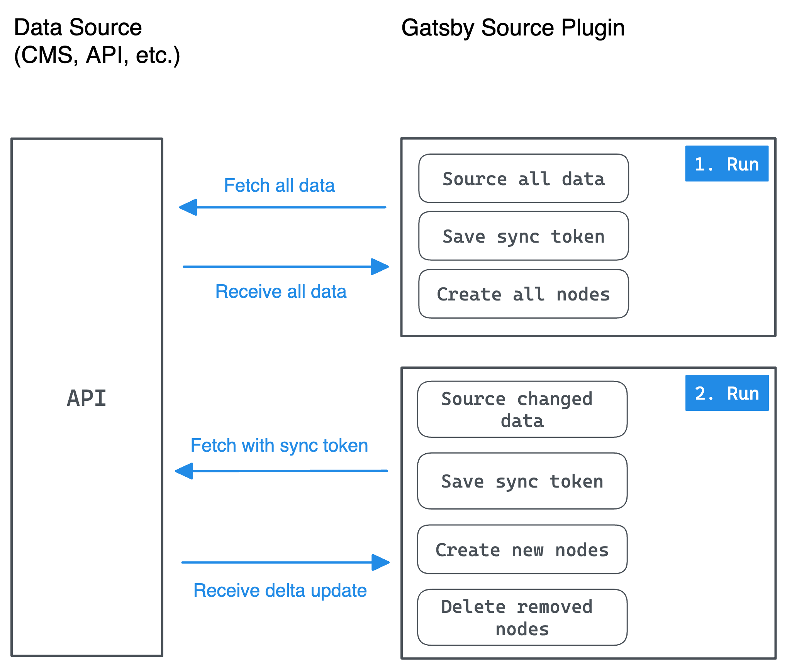

import { LinkButton } from "gatsby-interface"
import Collapsible from "@components/collapsible"
import { MdArrowForward } from "react-icons/md"

## Introduction

The term "Incremental Builds" is not specific to Gatsby as it's more a concept than a specific technology or implementation. Generally speaking it means that on subsequent runs of an action data is only changed incrementally, in contrast to having to do a full action each time. This is often achieved by populating a cache on the first run, listening for changes, and then only updating what has changed.

Gatsby supports Incremental Builds to varying degrees and in different places:

- The open source framework incrementally builds various steps in its build pipeline without requiring any special setup from users. These optimizations are a more generic approach and work with every site, regardless of their use case or sources.
- Often times a large portion of the build is spent on sourcing data from remote APIs through Gatsby source plugins. Source plugin authors can write their plugin in such a way that on subsequent runs data sourcing is only happening incrementally. This behavior is called [Delta updates](#delta-updates) in this part of the tutorial. This optimization can further be supercharged if the source plugin is approved for [Cloud Builds](https://support.gatsbyjs.com/hc/en-us/articles/360053099253-Gatsby-Builds-Full-Incremental-and-Cloud) on Gatsby Cloud.
- Source plugins can also create/update/delete GraphQL nodes in an incremental fashion instead of recreating them all on every run (`createNode`, `touchNode`, and `deleteNode`). This functionality is directly coupled with Delta updates.

By the end of this part of the tutorial, you will be able to:

- Use Node APIs to optimize node creation
- Describe in more detail how delta updates work

## Overview

Before diving into the details, here's a high-level overview of how Incremental Builds work:



<Collapsible
  summary={<em>Expand for detailed description</em>}
>

On the left side you have your API (CMS, Database, etc.) and on the right side the Gatsby source plugin.

During the first run of the source plugin a couple of things happen:

- All available data from the API is requested and sourced
- Once sourcing is done, a sync token (e.g. a token returned by the API or a generated timestamp) is saved. It'll be used on subsequent runs.
- All GraphQL nodes are created

The API changed (e.g. a content editor fixed a typo in the CMS) and a new build is kicked off. During the second run of the source plugin this data change is happening incrementally:

- The sync token is sent along with the request to the API
- The API only returns the changed data, not the full data
- A new sync token is saved
- According to the delta update, new nodes are created and nodes referencing old data are removed

</Collapsible>

Here's a quick analogy with a tool you might use daily: `git`

- You're using `git clone` to copy a git repository to your local machine. You're fetching all information and all commits. (1. Run in above diagram)
- After a while you're coming back to your local clone and see that other contributors have since then pushed commits to the upstream repository. You use `git pull` to fetch the latest information. Instead of fetching all information and commits again, `git` only fetches the new commits. (2. Run in above diagram)

## Delta updates

As explained in the introduction, a source plugin can have a great impact on the time it takes for a user to see their changes applied. For a source plugin to support Incremental Builds both the API and source plugin have to support the concept of delta updates (which you learned about in [Part 4](/docs/tutorial/creating-a-source-plugin/part-4/#cache-api)).

Ideally, the delta updates from your API contain all CRUD (Create/Update/Delete) actions that occured since the last update.

The steps below outline the order you should structure your `sourceNodes` API to source data in an ideal way.

<Announcement>

**Please note:** Currently this tutorial's example API doesn't support delta updates. Thus you'll see code examples from `gatsby-source-contentful` to illustrate the explanations where necessary. Please let us know through the "Was this doc helpful to you?" form at the bottom of this page if you wish to see the example API directly support delta updates.

</Announcement>

### 1. Prevent garbage collection

Gatsby aggressively garbage collects nodes between runs. This means that nodes that were created in the previous run but are not created in the current run will be deleted. You can tell Gatsby to keep old, but still valid nodes around, by "touching" them. For this you need to use the [`touchNode` API](/docs/reference/config-files/actions/#touchNode).

<Announcement>

**Garbage collection:** In computer science, garbage collection (GC) is a form of automatic memory management. The garbage collector attempts to reclaim memory which was allocated by the program, but is no longer referenced; such memory is called garbage.

</Announcement>

The `touchNode` API is primarily useful for source plugins fetching nodes from a remote system that can return only nodes that have been updated. The source plugin then touches all the nodes that haven’t been updated but still exist so Gatsby knows to keep them. Since Gatsby only tries to delete stale nodes on the first initial run, you need to "touch" them only once.

This technique can be shown in your source plugin, so open the `plugin/src/source-nodes.ts` file and follow the steps:

1. Initialize a `isFirstSource` boolean variable above the `sourceNodes` API. Inside `sourceNodes` you'll set it to false and then on subsequent runs the codepath it'll be used in won't get called again.

    ```ts:title=plugin/src/source-nodes.ts
    // Imports

    // highlight-next-line
    let isFirstSource = true

    export const sourceNodes: GatsbyNode[`sourceNodes`] = async (gatsbyApi) => {
      // sourceNodes content
    }

    // Rest of file
    ```

1. Destructure `actions` and `getNodes` from `gatsbyApi`. Also destructure `touchNode` from `actions`:

    ```ts:title=plugin/src/source-nodes.ts
    // Imports

    let isFirstSource = true

    export const sourceNodes: GatsbyNode[`sourceNodes`] = async (gatsbyApi) => {
      // highlight-next-line
      const { actions, reporter, cache, getNodes } = gatsbyApi
      // highlight-next-line
      const { touchNode } = actions
      const { endpoint } = pluginOptions

      // Rest of sourceNodes
    }

    // Rest of file
    ```

1. Use `isFirstSource` after the initialization of the `activityTimer`:

    ```ts:title=plugin/src/source-nodes.ts
    // Imports

    let isFirstSource = true

    export const sourceNodes: GatsbyNode[`sourceNodes`] = async (gatsbyApi) => {
      const { actions, reporter, cache, getNodes } = gatsbyApi
      const { touchNode } = actions
      const { endpoint } = pluginOptions

      const sourcingTimer = reporter.activityTimer(`Sourcing from plugin API`)
      sourcingTimer.start()

      // highlight-start
      if (isFirstSource) {
        // Do something on first source

        isFirstSource = false
      }
      // highlight-end

      // Rest of sourceNodes
    }

    // Rest of file
    ```

1. Inside the `isFirstSource` block, use the `getNodes` function to get an array of nodes back (it returns all nodes that are currently in Gatsby's data layer). Filter out any nodes that are not from your source plugin and then "touch" the rest of them.

    ```ts:title=plugin/src/source-nodes.ts
    // Imports

    let isFirstSource = true

    export const sourceNodes: GatsbyNode[`sourceNodes`] = async (gatsbyApi) => {
      // Rest of sourceNodes

      if (isFirstSource) {
        // highlight-start
        getNodes().forEach((node) => {
          if (node.internal.owner !== `plugin`) {
            return
          }

          touchNode(node)
        })
        // highlight-end

        isFirstSource = false
      }

      // Rest of sourceNodes
    }

    // Rest of file
    ```

    `plugin` is the name of your source plugin for this tutorial. Adjust it to the actual name once you write your actual source plugin.

With the code complete, your source plugin won't discard GraphQL nodes that should still exist on subsequent runs.

### 2. Create and use sync token

The details of this step completely depend on the remote API you're working with. Visit the API's documentation to check if it supports delta updates and how you can use them.

Independent from what sync token you need to save (be it a timestamp, a token, or something else), you've already learned in [Part 4](/docs/tutorial/creating-a-source-plugin/part-4/#cache-api) how you can use the `cache` API to save and use that token.

Use that sync token on subsequent calls to the API to only receive delta updates.

<Collapsible
  summary={<em>Example: <code>gatsby-source-contentful</code></em>}
>

You can view the whole source code under the GitHub permalinks for [source-nodes](https://github.com/gatsbyjs/gatsby/blob/240f5a9dc9f0cc5f5369e3087244378aad3d5ccf/packages/gatsby-source-contentful/src/source-nodes.js#L87-L144) and [fetch](https://github.com/gatsbyjs/gatsby/blob/2794ed31f693c74921d20011aa4b060bc32eaec0/packages/gatsby-source-contentful/src/fetch.js#L236).

1. First, a unique `sourceId` string is generated from the `spaceId` and `environment` which are both set in the plugin's options.

    ```js
    const sourceId = `${pluginConfig.get(`spaceId`)}-${pluginConfig.get(
      `environment`
    )}`
    ```

1. `sourceId` used for the `CACHE_SYNC_TOKEN` string:

    ```js
    const CACHE_SYNC_TOKEN = `contentful-sync-token-${sourceId}`
    ```

1. The next part might be unfamiliar to you since the tutorial hasn't mentioned it so far:

    ```js
    const syncToken =
      store.getState().status.plugins?.[`gatsby-source-contentful`]?.[
        CACHE_SYNC_TOKEN
      ]
    ```

    In [Part 4](/docs/tutorial/creating-a-source-plugin/part-4/#cache-api) you've learned how to use the `cache` API to save a sync token. You can also use the [`setPluginStatus` API](/docs/reference/config-files/actions/#setPluginStatus) to achieve the same end result. While `gatsby-source-contentful` uses `setPluginStatus`, we'd recommend using the `cache` API instead due to it's simpler usage.

    Regardless, in the end a `syncToken` is saved inside a variable.

1. The `syncToken` is passed to the `fetchContent` utility function:

    ```js
    const {
      currentSyncData,
      // + other data
    } = await fetchContent({ syncToken, pluginConfig, reporter })
    ```

    And coming back is the `currentSyncData`, the delta update.

1. The `fetchContent` utility function itself uses Contentful's [Sync API](https://www.contentful.com/developers/docs/concepts/sync/) to get delta updates. Here's the relevant code snippet:

    ```js
    const query = syncToken
      ? { nextSyncToken: syncToken, ...basicSyncConfig }
      : { initial: true, ...basicSyncConfig }
    currentSyncData = await syncClient.sync(query)
    ```

    As mentioned in the beginning, it really depends on your API how this `fetchContent` utility function would look like for you (Note: The equivalent in this tutorial would be the `fetchGraphQL` utility).

</Collapsible>

### 3. Create/update/delete nodes

The details of this step completely depend on the remote API you're working with. Visit the API's documentation to check what data (and in which shape) you're getting back on delta updates.

Let's assume the data you've got back looks like this:

```json
{
  "entries": [
    {
      "id": 3
    },
    {
      "id": 4
    }
  ],
  "updatedEntries": [
    {
      "id": 1
    }
  ],
  "deletedEntries": [
    {
      "id": 2
    }
  ]
}
```

You then can use different Node APIs for each of those CRUD operations:

- **Create:** You can use the [`createNode` API](/docs/reference/config-files/actions/#createNode) to create new GraphQL nodes.
    ```ts
    entries.forEach(node => createNode(node))
    ```
- **Update:** Also call `createNode` to update nodes.
    ```ts
    updatedEntries.forEach(node => createNode(node))
    ```
- **Delete:** Use the [`deleteNode` API](/docs/reference/config-files/actions/#deleteNode) to delete nodes.
    ```ts
    deletedEntries.forEach(node => deleteNode(node))
    ```

## Summary

Good job! You've completed one of the more theoretical parts of this tutorial.

Take a moment to think back on what you've learned so far. Challenge yourself to answer the following questions from memory:

- What are Incremental Builds and how do they function in the context of Gatsby source plugins?
- What is the use case for the `touchNode` Node API?
- Which Node APIs can you use to create/update/delete GraphQL nodes?

### Key takeaways

- Source plugin authors can write their plugin in such a way that on subsequent runs data sourcing is only happening incrementally through delta updates.
- Both your remote API and source plugin have to support delta updates.
- You can use the `touchNode` API to tell Gatsby to keep existing GraphQL nodes around during garbage collection.
- Most APIs use a sync token that you need to send along the request to the API to receive a delta update.
- You can use `createNode`/`deleteNode` to create/update/delete GraphQL nodes according to the delta update.

<Announcement>

**Share Your Feedback!**

Our goal is for this tutorial to be helpful and easy to follow. We'd love to hear your feedback about what you liked or didn't like about this part of the tutorial.

Use the "Was this doc helpful to you?" form at the bottom of this page to let us know what worked well and what we can improve.

</Announcement>

### What's coming next?

In Part 6 you'll learn how Image CDN can greatly improve image processing in your source plugin.

<LinkButton
  to="/docs/tutorial/creating-a-source-plugin/part-6/"
  rightIcon={<MdArrowForward />}
  variant="SECONDARY"
>
  Continue to Part 6
</LinkButton>