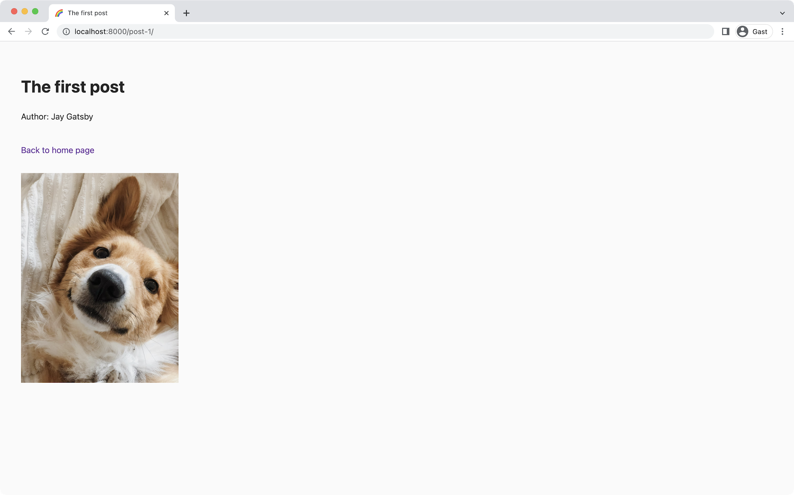

import { LinkButton } from "gatsby-interface"
import Collapsible from "@components/collapsible"
import { MdArrowForward } from "react-icons/md"

## Introduction

Gatsby has best-in-class image support with its [`gatsby-plugin-image`](/plugins/gatsby-plugin-image/) feature. With it you can easily add responsive, optimized images to sites in all modern formats. Traditionally, images were downloaded and transformed to enable this behavior. Image CDN solves this by skipping image processing during the build, and instead deferring and offloading it to a dedicated image CDN. Visitors still get images in the most optimized formats such as AVIF and WebP, but site builds complete in a fraction of the time.

By the end of this part of the tutorial, you will be able to:

- Add Image CDN support to your source plugin
- Use Image CDN with `gatsby-plugin-image` in your example site

## Add Image CDN to your plugin

Gatsby's Image CDN feature can be added to any Gatsby source plugin. We recommend using it over manual file downloading for the reasons above. As long as your API gives back a URL to an image, you should be able to implement the required code. Basically, for Image CDN to work you need two things:

- A GraphQL root node type that implements the `RemoteFile` interface
- During node creation for that GraphQL node type, certain fields must exist on the node to match what `RemoteFile` expects

In [Part 3](/docs/tutorial/creating-a-source-plugin/part-3/#createtypes) you learned that root node types need to implement the `Node` interface. Similarly to `Node`, `RemoteFile` is also provided by Gatsby itself and will handle all the complicated pieces of Image CDN behind the scenes.

<Announcement>

**Pro tip:** Gatsby's Image CDN feature is smart enough to work on all platforms, even if no CDN provider like on Gatsby Cloud or Netlify is available. In those cases (including locally on your computer) it automatically falls back to processing images during the build. This won't give users a build improvement but things on the frontend will still behave the same and builds won't fail.

</Announcement>

The `RemoteFile` interface has the following shape:

```graphql
interface RemoteFile {
  id: ID!
  mimeType: String!
  filename: String!
  filesize: Int
  width: Int
  height: Int
  publicUrl: String!
  resize(/* args */): RemoteFileResize
  gatsbyImage(/* args */): GatsbyImageData
}
```

For node types implementing `RemoteFile` this means:

- Always required are `publicUrl` (the url to the image/file), [`mimeType`](https://developer.mozilla.org/en-US/docs/Web/HTTP/Basics_of_HTTP/MIME_Types) (e.g. `image/jpg` or `application/pdf`), and `filename`. `publicUrl` will be defined through `url` during node creation.
- `width`, `height`, `resize`, and `gatsbyImage` can be null. This is because the `RemoteFile` interface can also handle assets other than images, like PDFs.

For node types that are images this means: `publicUrl`, `mimeType`, `filename`, `width`, and `height` are mandatory.

<Announcement>

**Pro tip:** `resize` and `gatsbyImage` will be provided by Gatsby. They are GraphQL resolvers relying on the existing data on the GraphQL node. You'll use `gatsbyImage` later to get your data for the `<GatsbyImage />` comopnent.

</Announcement>

Here's an example of a GraphQL root node that implements `RemoteFile` and creates nodes with all required fields for images:

- Schema customization to implement `RemoteFile` on `ImageAsset`:

    ```ts
    import type { GatsbyNode } from "gatsby"

    export const createSchemaCustomization: GatsbyNode[`createSchemaCustomization`] =
      ({ actions }) => {
        const { createTypes } = actions

        createTypes(`
          type ImageAsset implements Node & RemoteFile {
            alt: String!
          }
        `)
      }
    ```

- Creating the `ImageAsset` node with all required fields:

    ```ts
    import type { GatsbyNode } from "gatsby"
    import type { IRemoteImageNodeInput } from "gatsby-plugin-utils"

    export const sourceNodes: GatsbyNode[`sourceNodes`] = (gatsbyApi) => {
      const { actions, createNodeId, createContentDigest } = gatsbyApi
      const { createNode } = actions

      const remoteUrl = `https://images.unsplash.com/photo-1644310972589-643a2099d946?fm=jpg`

      const imageData = {
        url: remoteUrl,
        placeholderUrl: `${data.url}&w=%width%&h=%height%`,
        mimeType: `image/jpg`,
        filename: `red-rosa-infinity`,
        width: 3000,
        height: 4000,
        alt: `Red and rosa infinity thingy floating in air`,
      }

      const node: IRemoteImageNodeInput = {
        ...imageData,
        id: createNodeId(`ImageAsset-${remoteUrl}`),
        parent: null,
        children: [],
        internal: {
          type: `ImageAsset`,
          contentDigest: createContentDigest(imageData),
        },
      }

      createNode(node)
    }
    ```

As you can see the `ImageAsset` node holds all required fields but you can also add your own additional, arbitrary fields (like `alt` shown in the example). Once `ImageAsset` is created, you'll be able to call `gatsbyImage` and `resize` on these GraphQL nodes and use Image CDN.

The URL you provide to the `url` field should link to the image version with the highest resolution, so if e.g. your API can provide image URLs in different sizes, pick the one with the best resolution.

One field that hasn't been mentioned yet is the `placeholderUrl`. The `<GatsbyImage />` component supports displaying a placeholder while the image loads. You can tell Image CDN to use your `placeholderUrl` to generate said placeholder. If your API supports returning different sized images through URL segments or URL params, you can place `%width%` and `%height%` into the URL. This tutorial uses Unsplash as it supports [dynamically resizing images](https://unsplash.com/documentation#dynamically-resizable-images) and thus both are used with the `w` query param. Alternatively, you could also provide the smallest possible image available from your API to this field.

**Are width and height missing from the API response?** Not every API returns width, height, and mimeType for an image. You can use [`probe-image-size`](https://www.npmjs.com/package/probe-image-size) to get these information from your remote URL.

<Collapsible
  summary={<em><code>probe-image-size</code> example</em>}
>

`probe-image-size` returns a Promise so you'll need to `await` its result. You could use it something like this:

```ts
import type { GatsbyNode } from "gatsby"
import type { IRemoteImageNodeInput } from "gatsby-plugin-utils"
import probe from "probe-image-size"

export const sourceNodes: GatsbyNode[`sourceNodes`] = async (gatsbyApi) => {
  const { actions, createNodeId, createContentDigest } = gatsbyApi
  const { createNode } = actions

  const remoteUrl = `https://some-url.com/without-dimensions`
  const imageAttr = await probe(remoteUrl)

  const imageData = {
    url: remoteUrl,
    mimeType: imageAttr.mime,
    filename: remoteUrl,
    width: imageAttr.width,
    height: imageAttr.height,
  }

  const node: IRemoteImageNodeInput = {
    ...imageData,
    id: createNodeId(`TypeName-${remoteUrl}`),
    parent: null,
    children: [],
    internal: {
      type: `TypeName`,
      contentDigest: createContentDigest(imageData),
    },
  }

  createNode(node)
}
```

</Collapsible>

### Task: Write `createAssetNode` utility

Time to apply your theoretical knowledge about Image CDN to your own plugin.

You'll create a new root node called `Asset` through a `createAssetNode` utility. You can think of it as a more specialized version of the `nodeBuilder` utility, only responsible for creating nodes that should become `Asset` and hence Image CDN capable. Creating a separate `Asset` type will also make schema customization in the next task easier.

1. Open `plugin/src/constants.ts` and add a new node type:

    ```ts:title=plugin/src/constants.ts
    export const NODE_TYPES = {
      Post: `Post`,
      Author: `Author`,
      // highlight-next-line
      Asset: `Asset`,
    } as const

    // Rest of contants
    ```

1. Open `plugin/src/source-nodes.ts`. Add the type imports for `IRemoteImageNodeInput` and `IPostImageInput`, create a shell for `createAssetNode` at the end of the file:

    ```ts:title=plugin/src/source-nodes.ts
    import type { GatsbyNode, SourceNodesArgs, NodeInput } from "gatsby"
    // highlight-next-line
    import type { IRemoteImageNodeInput } from "gatsby-plugin-utils"
    import { fetchGraphQL } from "./utils"
    import type {
    // highlight-next-line
      IPostImageInput,
      IAuthorInput,
      IPostInput,
      NodeBuilderInput,
      IPluginOptionsInternal,
    } from "./types"
    import { NODE_TYPES, ERROR_CODES, CACHE_KEYS } from "./constants"

    let isFirstSource = true

    export const sourceNodes: GatsbyNode[`sourceNodes`] = async (
      gatsbyApi,
      pluginOptions: IPluginOptionsInternal
    ) => {
      // sourceNodes contents
    }

    // nodeBuilder utility

    // highlight-start
    export function createAssetNode(
      gatsbyApi: SourceNodesArgs,
      data: IPostImageInput
    ) {}
    // highlight-end
    ```

    Similar to `nodeBuilder` it receives `gatsbyApi` to call the various node helpers but `data` must be in the shape of `IPostImageInput`. This TypeScript type is identical to the `image` object shape inside each post in `api/src/data.ts`.

1. Create the function body for `createAssetNode` by following what `nodeBuilder` is doing:

    ```ts:title=plugin/src/source-nodes.ts
    export function createAssetNode(
      gatsbyApi: SourceNodesArgs,
      data: IPostImageInput
    ) {
      const id = gatsbyApi.createNodeId(`${NODE_TYPES.Asset}-${data.url}`)

      const assetNode = {
        id,
        parent: null,
        children: [],
        internal: {
          type: NODE_TYPES.Asset,
          contentDigest: gatsbyApi.createContentDigest(data),
        },
      } satisfies IRemoteImageNodeInput

      gatsbyApi.actions.createNode(assetNode)
    }
    ```

    TypeScript should complain about missing fields on `asstNode`:

    ```shell
    X is missing the following properties from type 'IRemoteImageNodeInput': width, height, url, mimeType, filename
    ```

    These are exactly the fields that are required for image assets.

1. Add the missing fields to the node:

    ```ts:title=plugin/src/source-nodes.ts
    export function createAssetNode(
      gatsbyApi: SourceNodesArgs,
      data: IPostImageInput
    ) {
      const id = gatsbyApi.createNodeId(`${NODE_TYPES.Asset}-${data.url}`)

      const assetNode = {
        id,
        // highlight-start
        url: data.url,
        mimeType: `image/jpg`,
        filename: data.url,
        width: data.width,
        height: data.height,
        placeholderUrl: `${data.url}&w=%width%&h=%height%`,
        alt: data.alt,
        // highlight-end
        parent: null,
        children: [],
        internal: {
          type: NODE_TYPES.Asset,
          contentDigest: gatsbyApi.createContentDigest(data),
        },
      } satisfies IRemoteImageNodeInput

      gatsbyApi.actions.createNode(assetNode)
    }
    ```

    And that's it, you can create `Asset` nodes now! In the next task you'll actually use `createAssetNode`.

### Task: Apply schema customizations

So far your `createAssetNode` utility isn't doing anything. You'll need to use it inside the `nodeBuilder` utility to add an additional `image` field to `Post` nodes. However, this will only work once you have successfully implemented the second requirement of Image CDN: That `Asset` implements the `RemoteFile` interface.

A lot of this task builds upon your knowledge from [Part 3](/docs/tutorial/creating-a-source-plugin/part-3/), specifically the [foreign-key relationship](/docs/tutorial/creating-a-source-plugin/part-3/#add-a-foreign-key-relationship) section. Feel free to revisit those sections if you need a refresher.

You'll implement the `RemoteFile` interface for `Asset` and make it a root node. Then you'll create a foreign-key relationship between `Asset` and the `image` field on `Post`.

1. Open `plugin/src/create-schema-customization.ts`. Change the name of `PostImage` to `Asset` and implement both `Node` and `RemoteFile` for it:

    ```ts:title=plugin/src/create-schema-customization.ts
    import type { GatsbyNode } from "gatsby"
    import { NODE_TYPES } from "./constants"

    export const createSchemaCustomization: GatsbyNode[`createSchemaCustomization`] =
      ({ actions }) => {
        const { createTypes } = actions

        createTypes(`
          type ${NODE_TYPES.Post} implements Node {
            id: ID!
            _id: Int!
            slug: String!
            title: String!
            author: ${NODE_TYPES.Author} @link(by: "name")
            image: ${NODE_TYPES.Post}Image!
          }

          type ${NODE_TYPES.Author} implements Node {
            id: ID!
            _id: Int!
            name: String!
          }

    // highlight-next-line
          type ${NODE_TYPES.Asset} implements Node & RemoteFile {
            url: String!
            alt: String!
            width: Int!
            height: Int!
          }
        `)
      }
    ```

    Nodes that `createAssetNode` creates will be GraphQL root nodes now.

    <Collapsible
      summary={<em>Type builder example</em>}
    >

    If you're not using the SDL syntax but type builders, you'd add it like this:

    ```ts
    schema.buildObjectType({
      name: NODE_TYPES.Asset,
      fields: {
        url: `String!`,
        alt: `String!`,
        width: `Int!`,
        height: `Int!`,
      },
      interfaces: [`Node`, `RemoteFile`],
    })
    ```

    </Collapsible>

1. Create a foreign-key relationship between `Post` and `Asset` through `@link` on the `image` field.

    ```ts:title=plugin/src/create-schema-customization.ts
    createTypes(`
      type ${NODE_TYPES.Post} implements Node {
        id: ID!
        _id: Int!
        slug: String!
        title: String!
        author: ${NODE_TYPES.Author} @link(by: "name")
    // highlight-next-line
        image: ${NODE_TYPES.Asset} @link
      }

      type ${NODE_TYPES.Author} implements Node {
        id: ID!
        _id: Int!
        name: String!
      }

      type ${NODE_TYPES.Asset} implements Node & RemoteFile {
        url: String!
        alt: String!
        width: Int!
        height: Int!
      }
    `)
    ```

    If you remember from Part 3, the default behavior of `@link` is to use the `id` from the target node. Keep that in mind for the following instructions.

1. Open the `plugin/src/source-nodes.ts` file and add a return statement to the `createAssetNode` function. Return the generated `id`:

    ```ts:title=plugin/src/source-nodes.ts
    export function createAssetNode(
      gatsbyApi: SourceNodesArgs,
      data: IPostImageInput
    ) {
      const id = gatsbyApi.createNodeId(`${NODE_TYPES.Asset}-${data.url}`)

      const assetNode = {/* Contents */} satisfies IRemoteImageNodeInput

      gatsbyApi.actions.createNode(assetNode)

      // highlight-next-line
      return id
    }
    ```

1. A node of type `Post` should have the generated `id` of `Asset` as its `image` field. Because only posts can have images, you can conditionally add data to the node if certain conditions are met like this:

    ```ts:title=plugin/src/source-nodes.ts
    export function nodeBuilder({ gatsbyApi, input }: INodeBuilderArgs) {
      const id = gatsbyApi.createNodeId(`${input.type}-${input.data.id}`)

      // highlight-next-line
      const extraData: Record<string, unknown> = {}

      // highlight-start
      if (input.type === `Post`) {
        extraData.image = `some-id`
      }
      // highlight-end

      const node = {
        ...input.data,
        // highlight-next-line
        ...extraData,
        id,
        _id: input.data.id,
        parent: null,
        children: [],
        internal: {
          type: input.type,
          contentDigest: gatsbyApi.createContentDigest(input.data),
        },
      } satisfies NodeInput

      gatsbyApi.actions.createNode(node)
    }
    ```

1. The `some-id` string should be replaced by the `Asset` id of course. Since `createAssetNode` returns the `id`, you can use its result:

    ```ts:title=plugin/src/source-nodes.ts
    export function nodeBuilder({ gatsbyApi, input }: INodeBuilderArgs) {
      const id = gatsbyApi.createNodeId(`${input.type}-${input.data.id}`)

      const extraData: Record<string, unknown> = {}

      if (input.type === `Post`) {
        // highlight-next-line
        const assetId = createAssetNode(gatsbyApi, input.data.image)

        // highlight-next-line
        extraData.image = assetId
      }

      // Rest of nodeBuilder
    }
    ```

1. Restart the `develop:site` script and open GraphiQL at `http://localhost:8000/___graphql`. Run the following query:

    ```graphql
    query FirstPostWithImage {
      post(title: {eq: "The first post"}) {
        title
        image {
          gatsbyImage(width: 600)
        }
      }
    }
    ```

    You should get a result back like this:

    ```json
    {
      "data": {
        "post": {
          "title": "The first post",
          "image": {
            "gatsbyImage": {
              "images": {
                "sources": [
                  {
                    "srcSet": "/_gatsby/image/<long-string>",
                    "type": "image/avif",
                    "sizes": "(min-width: 600px) 600px, 100vw"
                  },
                  {
                    "srcSet": "/_gatsby/image/<long-string>",
                    "type": "image/webp",
                    "sizes": "(min-width: 600px) 600px, 100vw"
                  }
                ],
                "fallback": {
                  "src": "/_gatsby/image/<long-string>",
                  "srcSet": "/_gatsby/image/<long-string>",
                  "sizes": "(min-width: 600px) 600px, 100vw"
                }
              },
              "layout": "constrained",
              "width": 600,
              "height": 800,
              "backgroundColor": "rgb(184,168,152)"
            }
          }
        }
      },
      "extensions": {}
    }
    ```

    It works! Note: `<long-string>` is added above to make things easier to read. If you're seeing an error, stop the `develop:site` script, run `yarn clean:site` and retry `yarn develop:site` again.

    In the next task you'll be able to use the result from `gatsbyImage` inside your pages.

## Use Image CDN in your site

When using [`gatsby-plugin-image`](/docs/how-to/images-and-media/using-gatsby-plugin-image) you use the `gatsbyImageData` GraphQL field to access the necessary data. With Image CDN this name changes to `gatsbyImage` — you've learned this in the last task. The only relevant difference between `gatsbyImageData` and `gatsbyImage` is that the latter requires a `width` or `height` argument.

Refer to the [`gatsby-plugin-image` how-to](/docs/how-to/images-and-media/using-gatsby-plugin-image) for instructions on its usage as this tutorial won't go into details about that.

### Task: Update individual post pages

1. Open `site/src/pages/{Post.slug}.tsx` and add `image` to the GraphQL query:

    ```ts:title=site/src/pages/{Post.slug}.tsx
    // Rest of the file

    export const query = graphql`
      query PostPage($slug: String!) {
        post(slug: { eq: $slug }) {
          title
          author {
            name
          }
    // highlight-start
          image {
            gatsbyImage(width: 300)
            alt
          }
    // highlight-end
        }
      }
    `
    ```

1. Import the necessary `gatsby-plugin-image` helpers and components and use them with `image`:

    ```ts:title=site/src/pages/{Post.slug}.tsx
    import * as React from "react"
    import { Link, graphql, PageProps, HeadFC } from "gatsby"
    // highlight-next-line
    import { GatsbyImage, getImage } from "gatsby-plugin-image"

    export default function PostPage({
      data: { post },
    }: PageProps<{ post: Queries.Post }>): React.ReactElement {
      return (
        <main>
          <h1>{post.title}</h1>
          <p>Author: {post.author.name}</p>
          <br />
          <Link to="/">Back to home page</Link>
          {/* highlight-start */}
          <div className="image">
            <GatsbyImage
              alt={post.image.alt}
              image={getImage(post.image.gatsbyImage)}
            />
          </div>
          {/* highlight-end */}
        </main>
      )
    }

    // Rest of file
    ```

1. Go to `http://localhost:8000/post-1/`. You should see a dog image on the page:

    

## Summary

Magnificent! Your posts now have photos of cute dogs.

Take a moment to think back on what you've learned so far. Challenge yourself to answer the following questions from memory:

- What are the two steps required to implement Image CDN in a source plugin?
- What types of files can `RemoteFile` support?
- What are the mandatory fields that `RemoteFile` expects?

### Key takeaways

- By using Image CDN you can offload the heavy image generation to dedicated providers, giving users of your source plugin great build performance.
- GraphQL root node types of your plugin that represent files and/or images should implement the `RemoteFile` interface and have all required fields on their node.
- You can use `gatsbyImage` in your GraphQL result together with `gatsby-plugin-image` like you're used to.

<Announcement>

**Share Your Feedback!**

Our goal is for this tutorial to be helpful and easy to follow. We'd love to hear your feedback about what you liked or didn't like about this part of the tutorial.

Use the "Was this doc helpful to you?" form at the bottom of this page to let us know what worked well and what we can improve.

</Announcement>

### What's coming next?

In Part 7 advanced topics like Content Sync, testing, debugging, and more will be explained.

<LinkButton
  to="/docs/tutorial/creating-a-source-plugin/part-7/"
  rightIcon={<MdArrowForward />}
  variant="SECONDARY"
>
  Continue to Part 7
</LinkButton>