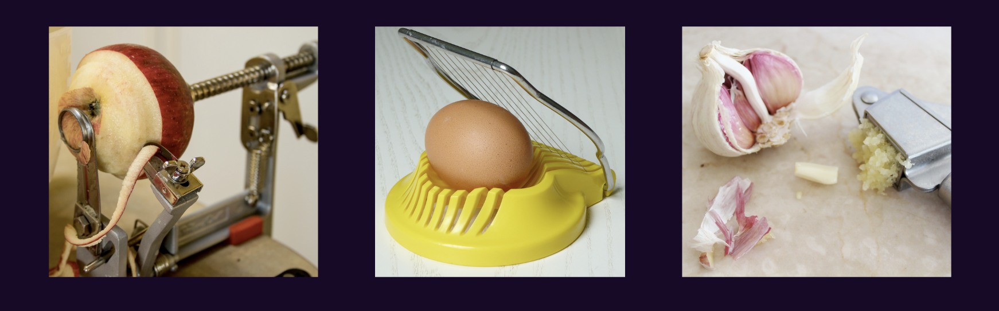

import { LinkButton } from "gatsby-interface"
import Collapsible from "@components/collapsible"
import { MdArrowForward } from "react-icons/md"

## Introduction

It can be a lot of work to build new features for a website. Luckily, by using Gatsby plugins, you can quickly add new functionality to your site without needing to build it from scratch yourself. Gatsby's plugin ecosystem has thousands of prebuilt packages for you to choose from.

In this part of the Tutorial, you'll learn what Gatsby plugins are and how to use them in your site.

By the end of this part of the Tutorial, you will be able to:

- Use the [Gatsby Plugin Library](/plugins) to browse all the available plugins.
- Add a plugin to your Gatsby site.
- Configure your plugins in your `gatsby-config.js` file.

<Announcement>

**Prefer a video?**

If you'd rather follow along with a video, here's a recording of a livestream that covers all the material for Part 3.

**Note**: Parts of this recording may be slightly outdated, but the concepts are generally applicable. For the most up-to-date information, follow along with the written tutorial.

Don't want to miss any future livestreams? Follow our [Gatsby Twitch channel](https://www.twitch.tv/gatsbyjs).

<iframe
  width="560"
  height="315"
  src="https://www.youtube.com/embed/C8YxdGGjvOg?start=228"
  title="YouTube video player"
  frameborder="0"
  allow="accelerometer; autoplay; clipboard-write; encrypted-media; gyroscope; picture-in-picture"
  allowfullscreen
></iframe>

</Announcement>

## What is a plugin?

In Gatsby terms, a **plugin** is a separate npm package that you install to add extra features to your site.

There are a variety of plugins that each have different use cases. Some plugins provide pre-built components, others add analytics, others let you pull data into your site. Some plugins are built by Gatsby employees, while other plugins are built and maintained by community members. So far, there are more than 3,000 plugins to choose from. You can look through all the available plugins using the [Gatsby Plugin Library](/plugins).

You can think of a plugin as an accessory for your site. You don't _need_ to use plugins - you could build out the same functionality from scratch yourself - but they save you time. They're like those fancy single-purpose cooking gadgets that peel apples or crush garlic. You could accomplish the same task using a regular knife, but it's often faster to use a tool that's built to do that one specific job really well.



You will likely use plugins in almost every Gatsby site you build. While working through the rest of the Tutorial, you'll have many opportunities to practice installing and using plugins.

## Add a plugin to your site

To add a plugin to your site, you'll use the following process:

1. **Install the plugin** using npm.
2. **Configure the plugin** in your site's `gatsby-config.js` file.
3. **Use the plugin features** in your site, as needed.

<Collapsible
  summary={<h3>Key Gatsby Concept: Adding a plugin to your site</h3>}
>

Here's a more detailed breakdown of the steps to add a plugin to your site:

#### 1) Install the plugin using npm.

In your terminal, run the following command (swapping out `plugin-name` for the name of the plugin you want to use). This will add the plugin as a dependency in your `package.json` and `package-lock.json` files.

```shell
npm install plugin-name
```

Depending on what plugin you're using, there might be more dependencies that you also need to install. Check the specific plugin's README in the plugin library for more details.

#### 2) Configure the plugin in your `gatsby-config.js` file.

Your `gatsby-config.js` file contains information about your site, including configuration for plugins. You can add a plugin to the `plugins` array:

```js:title=gatsby-config.js
module.exports = {
  siteMetadata: {
    title: "My First Gatsby Site",
  },
  // highlight-next-line
  plugins: ["plugin-name"],
};
```

Some plugins require extra configuration options. In that case, you'll add an object to the `plugins` array (instead of a string), as shown below. (Check the plugin README in the [Gatsby Plugin Library](/plugins) for more details on what that options object should look like.)

```js:title=gatsby-config.js
module.exports = {
  siteMetadata: {
    title: "My First Gatsby Site",
  },
  plugins: [
    // highlight-start
    {
      resolve: "plugin-name",
      options: {
        // Check the plugin README for what options go in here
      }
    },
    // highlight-end
  ]
}
```

<Announcement>

**Note:** After you make updates to your `gatsby-config.js` file, you'll need to restart your `gatsby develop` process for your changes to be picked up.

</Announcement>

#### 3) Use the plugin features in your site.

Now that you've set up the plugin, you can use it in your Gatsby site as needed.

The specifics of this step will be different based on what the plugin does. Sometimes, the plugin might have a component or function that you can import and use in your site. Other times, you might not need to do anything extra at all. Check the plugin's README for more details.

</Collapsible>


The next few sections will walk you through the process of adding a plugin to your site. You'll use the `gatsby-plugin-image` plugin to add performant images to your site.

### Task: Use `gatsby-plugin-image` to add a static image to your home page

You can use the `gatsby-plugin-image` plugin to add responsive images to your site while maintaining high performance scores. `gatsby-plugin-image` exports a component called `StaticImage`, which you can use to load images from a remote URL or your local filesystem.

Follow the steps below to use the `StaticImage` component to add an image from a URL to your home page.

1. In the terminal, run the following command to install `gatsby-plugin-image` and its dependencies.

```shell
npm install gatsby-plugin-image gatsby-plugin-sharp gatsby-source-filesystem
```

<Announcement>

The `StaticImage` component requires a few additional plugins to work. These extra plugins are called **peer dependencies**, and you'll need to install them along with the `gatsby-plugin-image` package:

- `gatsby-plugin-sharp`: Handles the actual image processing that is used by `gatsby-plugin-image`.
- `gatsby-source-filesystem`: Lets you pull in data from your computer's filesystem. (You'll learn more about this plugin later. Just install it for now.)

**Tip:** When adding a new plugin to your site, check the plugin README in the [Gatsby Plugin Library](/plugins) to see if there are any special setup instructions.

</Announcement>

2. Next, add the `gatsby-plugin-image` and `gatsby-plugin-sharp` plugins to your `gatsby-config.js` file. (Don't worry about `gatsby-source-filesystem` just yet. You'll come back to it later.)

```js:title=gatsby-config.js
module.exports = {
  siteMetadata: {
    title: "My First Gatsby Site",
  },
  plugins: [
    // highlight-start
    "gatsby-plugin-image",
    "gatsby-plugin-sharp",
    // highlight-end
  ],
};
```

<Announcement>

**Key Gatsby Concept** 💡

The `gatsby-config.js` file is a special file that Gatsby recognizes automatically. It's where you add plugins and other site configuration.

After you update your `gatsby-config.js` file, your local development server has to restart in order to pick up the new changes. Sometimes it will restart itself automatically, but if you're seeing unexpected behavior, try stopping and restarting it yourself.

</Announcement>

3. Now that your plugins have been installed and configured, you can use the `StaticImage` component in your Gatsby site! You can use the `StaticImage` component similarly to the way you'd use an HTML `` tag.

   The `StaticImage` component expects the following props:

   - `src` (string): The URL to the image you want to load. (This is the same as what you put in the `src` attribute of an `` HTML element.)
   - `alt` (string): The alt text to describe the image. This gets used by screen readers or if there's a problem loading the image.

   Find an image URL online, and then use the `StaticImage` component to add that image to your home page:

```js:title=src/pages/index.js
import * as React from 'react'
import Layout from '../components/layout'
import { StaticImage } from 'gatsby-plugin-image' // highlight-line

const IndexPage = () => {
  return (
    <Layout pageTitle="Home Page">
      <p>I'm making this by following the Gatsby Tutorial.</p>
      {/* highlight-start */}
      <StaticImage
        alt="Clifford, a reddish-brown pitbull, posing on a couch and looking stoically at the camera"
        src="https://pbs.twimg.com/media/E1oMV3QVgAIr1NT?format=jpg&name=large"
      />
      {/* highlight-end */}
    </Layout>
  )
}

export const Head = () => <title>Home Page</title>

export default IndexPage
```

4. In your web browser, go to `localhost:8000` to see your home page. There should now be a photo at the bottom of the page:


<Announcement>

Nothing at `localhost:8000`? Make sure your local development server is still running!

```shell
gatsby develop
```

</Announcement>

### Task: Update the static image to use a photo from your local filesystem

So far, you've used the `StaticImage` component to add an image from an external URL. But what happens if you want to use a photo that isn't on the internet yet?

You can also use the `StaticImage` component to render images from your local filesystem.

1. Download a photo to your computer, and move it into your project folder. To keep things organized, put it in the `src/images` directory.
2. Update the `src` prop in your home page to be a relative path to your file instead of a URL. (Make sure it matches the name of your image!) Don't forget to update the `alt` prop to describe your image!

```js:title=src/pages/index.js
import * as React from 'react'
import Layout from '../components/layout'
import { StaticImage } from 'gatsby-plugin-image'

const IndexPage = () => {
  return (
    <Layout pageTitle="Home Page">
      <p>I'm making this by following the Gatsby Tutorial.</p>
      <StaticImage
        {/* highlight-start */}
        alt="Clifford, a reddish-brown pitbull, dozing in a bean bag chair"
        src="../images/clifford.jpg"
        {/* highlight-end */}
      />
    </Layout>
  )
}

export const Head = () => <title>Home Page</title>

export default IndexPage
```

3. In your web browser, go to `localhost:8000`. Your image should still appear on the home page.


<Announcement>

**Want to see how it all fits together?** Check out the finished state of the [GitHub repo for the example site](https://github.com/gatsbyjs/tutorial-example).

</Announcement>

## Summary

Take a moment to think back on what you've learned so far. Challenge yourself to answer the following questions from memory:

- What is the benefit to using a plugin in your Gatsby site?
- How would you add a new plugin to your Gatsby site?

<Announcement>

**Ship It!** 🚀

Before you move on, deploy your changes to your live site on Gatsby Cloud so that you can share your progress!

First, run the following commands in a terminal to push your changes to your GitHub repository. (Make sure you're in the top-level directory for your Gatsby site!)

```shell
git add .
git commit -m "Finished Gatsby Tutorial Part 3"
git push
```

Once your changes have been pushed to GitHub, Gatsby Cloud should notice the update and rebuild and deploy the latest version of your site. (It may take a few minutes for your changes to be reflected on the live site. Watch your build's progress from your [Gatsby Cloud dashboard](/dashboard/).)

</Announcement>

### Key takeaways

- A plugin is a package that lets you add new features to your site.
- Using plugins saves you development time, since it's faster to install and configure a plugin than it is to recreate the same functionality from scratch.
- The general process for using a plugin is to install it, configure it in your `gatsby-config.js` file, and then use it in your site as needed.
- You can use the [Gatsby Plugin Library](https://www.gatsbyjs.com/plugins) to browse all the available plugins and learn more about how each one works.

<Announcement>

**Share Your Feedback!**

Our goal is for this Tutorial to be helpful and easy to follow. We'd love to hear your feedback about what you liked or didn't like about this part of the Tutorial.

Use the "Was this doc helpful to you?" form at the bottom of this page to let us know what worked well and what we can improve.

</Announcement>

### What's coming next?

In Part 4, you'll learn about a specific category of plugins that let you pull data into your site: source plugins.

<LinkButton
  to="/docs/tutorial/getting-started/part-4/"
  rightIcon={<MdArrowForward />}
  variant="SECONDARY"
>
  Continue to Part 4
</LinkButton>
