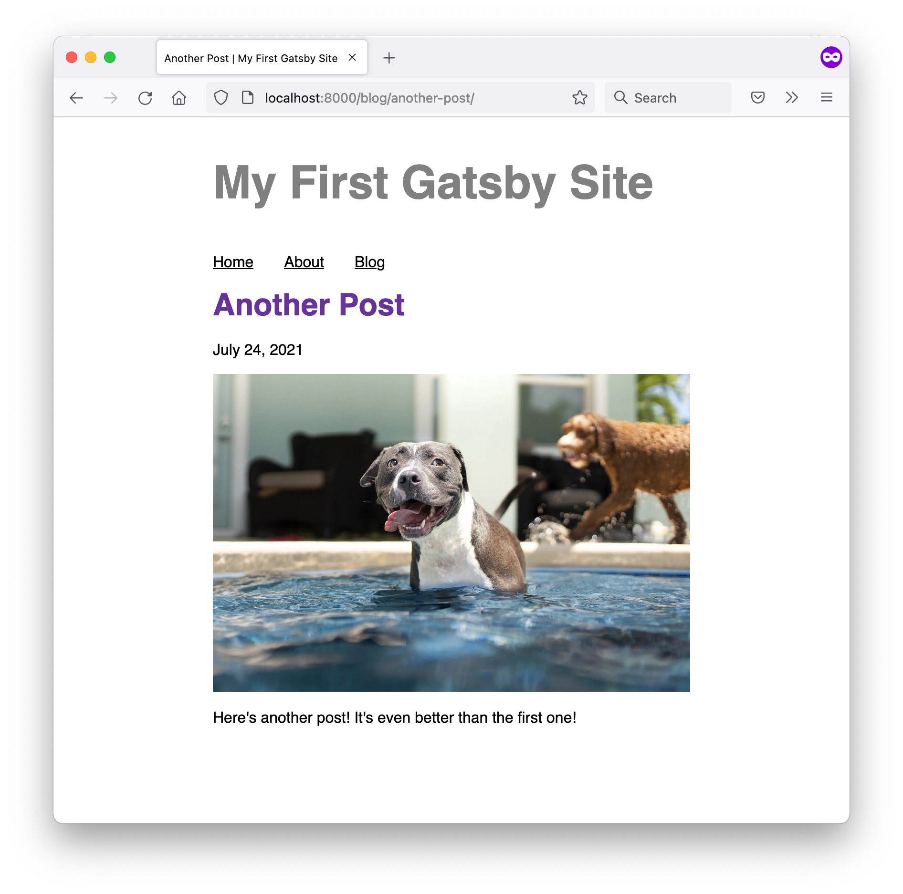

import { LinkButton } from "gatsby-interface"
import Collapsible from "@components/collapsible"
import { MdArrowForward } from "react-icons/md"

## Introduction

In [Part 3](/docs/tutorial/getting-started/part-3/), you used `gatsby-plugin-image` to add static images to your home page. Now that you've worked a bit more with Gatsby's data layer, it's time to revisit `gatsby-plugin-image`. This time, you'll learn how to add dynamic images to your site.

In this part of the Tutorial, you'll use the dynamic `GatsbyImage` component to add hero images to each of your blog posts.

By the end of this part of the Tutorial, you will be able to:

- Use the `GatsbyImage` component to create images dynamically from data.

<Announcement>

**Prefer a video?**

If you'd rather follow along with a video, here's a recording of a livestream that covers all the material for Part 7.

**Note**: Parts of this recording may be slightly outdated, but the concepts are generally applicable. For the most up-to-date information, follow along with the written tutorial.

Don't want to miss any future livestreams? Follow our [Gatsby Twitch channel](https://www.twitch.tv/gatsbyjs).

<iframe
  width="560"
  height="315"
  src="https://www.youtube.com/embed/NQj3H2Z9vn0?start=229"
  title="YouTube video player"
  frameborder="0"
  allow="accelerometer; autoplay; clipboard-write; encrypted-media; gyroscope; picture-in-picture"
  allowfullscreen
></iframe>

</Announcement>

## What's the difference between `GatsbyImage` and `StaticImage`?

Back in [Part 3](/docs/tutorial/getting-started/part-3/) of the Tutorial, you learned about how to use the `StaticImage` component from `gatsby-plugin-image`.

How do you know whether to use the `StaticImage` component or the `GatsbyImage` component? The decision ultimately comes down to whether or not your image source is going to be the same every time the component renders.

- The `StaticImage` component is for _static_ image sources, like a hard-coded file path or remote URL. In other words, the source for your image is always going to be the same every time the component renders.
- The `GatsbyImage` component is for _dynamic_ image sources, like if the image source gets passed in as a prop.

Here's a quick analogy to help illustrate the difference:

- Using the `StaticImage` component is like asking for directions using a physical address, like "400 Main Street". You'll always end up in the same place, no matter how many people you ask.
- Using the `GatsbyImage` component is like asking for directions more generically. If you ask someone to point you to the best coffee shop in town, where you end up will depend on whom you ask and what their personal preferences are.


In this part of the Tutorial, you'll add a hero image to your blog post page template. You'll also add some frontmatter data to your blog post `.mdx` files to specify which image to use for each post. Since the image source you'll load in the page template will change for each blog post, you'll use the `GatsbyImage` component.

## Add hero images to blog post frontmatter

Many blog sites include a hero image at the top of each post. These images are usually large, high-quality photos that are meant to grab the reader's attention and make them want to stay on the page longer.

The steps below will help you find and download some photos for your hero images and add them to the frontmatter for each of your blog posts.

1. Start by organizing the `blog` directory with all your MDX posts. First, create a new subdirectory in your `blog` folder for each post. Then, rename each of your `.mdx` files to `index.mdx` (to prevent the routes from ending up with a duplicated path parameter, like `blog/my-post/my-post/`).
   - For example, a post at `blog/my-first-post.mdx` would move to `blog/my-first-post/index.mdx`. Similarly, a post at `blog/another-post.mdx` would move to `blog/another-post/index.mdx`.

<Announcement>

**Note:** After you move or rename your `.mdx` files, you'll need to stop and restart your local development server for your changes to be picked up.

</Announcement>


2. Use a website like [Unsplash](https://unsplash.com) to find some pretty, freely usable images. For best results, choose photos with a landscape (horizontal) orientation, since those will fit on your screen more easily.
   

3. When you've found a photo that you like, download it and add it to subdirectory for one of your blog posts. Continue downloading photos until you have a different hero image for each post.
   

<Announcement>

**Pro Tip:** Sometimes, the images you download from the internet can be a little _too_ high quality. If you know your site will only ever render an image at 1000 pixels wide, there's no point in having a source image that's 5000 pixels wide. All those extra pixels mean extra work to process and optimize your images, which can slow down build times.

As a general guideline, it's a good idea to **preoptimize** your image files by resizing them to be no more than twice the maximum size they'll be rendered at. For example, if your layout is 600 pixels wide, then the highest resolution image you will need is 1200 pixels (to account for 2x pixel density).

For more detailed information, refer to the doc on [Preoptimizing Your Images](/docs/preoptimizing-images/).

</Announcement>

3. Next, add some additional frontmatter fields to each of your blog posts:
   - `hero_image`: the relative path to the hero image file for that post
   - `hero_image_alt`: a short description of the image, to be used as alternative text for screen readers or in case the image doesn't load correctly
   - `hero_image_credit_text`: the text to display to give the photographer credit for the hero image
   - `hero_image_credit_link`: a link to the page where your hero image was downloaded from

```mdx:title=blog/my-first-post/index.mdx
---
title: "My First Post"
date: "2021-07-23"
slug: "my-first-post"
// highlight-start
hero_image: "./christopher-ayme-ocZ-_Y7-Ptg-unsplash.jpg"
hero_image_alt: "A gray pitbull relaxing on the sidewalk with its tongue hanging out"
hero_image_credit_text: "Christopher Ayme"
hero_image_credit_link: "https://unsplash.com/photos/ocZ-_Y7-Ptg"
// highlight-end
---

...
```

```mdx:title=blog/another-post/index.mdx
---
title: "Another Post"
date: "2021-07-24"
slug: "another-post"
// highlight-start
hero_image: "./anthony-duran-eLUBGqKGdE4-unsplash.jpg"
hero_image_alt: "A grey and white pitbull wading happily in a pool"
hero_image_credit_text: "Anthony Duran"
hero_image_credit_link: "https://unsplash.com/photos/eLUBGqKGdE4"
// highlight-end
---

...
```

```mdx:title=blog/yet-another-post/index.mdx
---
title: "Yet Another Post"
date: "2021-07-25"
slug: "yet-another-post"
// highlight-start
hero_image: "./jane-almon-7rriIaBH6JY-unsplash.jpg"
hero_image_alt: "A white pitbull wearing big googly-eye glasses"
hero_image_credit_text: "Jane Almon"
hero_image_credit_link: "https://unsplash.com/photos/7rriIaBH6JY"
// highlight-end
---

...
```

Now that your hero images are set up, it's time to connect them to the data layer so you can pull them into your blog post page template.

## Install and configure `gatsby-transformer-sharp`

In order to use the `GatsbyImage` component, you'll need to add the `gatsby-transformer-sharp` transformer plugin to your site.

When Gatsby adds nodes to the data layer at build time, the `gatsby-transformer-sharp` plugin looks for any `File` nodes that end with an image extension (like `.png` or `.jpg`) and creates an `ImageSharp` node for that file.


1. In the terminal, run the following command to install `gatsby-transformer-sharp`:

   ```shell
   npm install gatsby-transformer-sharp
   ```

2. Add `gatsby-transformer-sharp` to the `plugins` array in your `gatsby-config.js` file.
   ```js:title=gatsby-config.js
   module.exports = {
     siteMetadata: {
       title: "My First Gatsby Site",
     },
     plugins: [
       // ...existing plugins
       "gatsby-transformer-sharp", // highlight-line
     ],
   }
   ```

Since you've added `gatsby-transformer-sharp` to your site, you'll need to restart your local development server to see the changes in GraphiQL. You'll take a closer look at GraphiQL in the next step.

## Render hero image in the blog post page template

With all the necessary tools in place, you're ready to add your hero image to your blog post page template.

### Task: Use GraphiQL to build the query

First, you'll use GraphiQL to add the hero image frontmatter fields to the GraphQL query for your blog post page template.

1. Open GraphiQL by going to `localhost:8000/___graphql` in a web browser. Start by copying your existing blog post page query into the GraphiQL Query Editor pane. Run it once to make sure everything is working correctly.

<Announcement>

**Note:** You'll need to set up an object in the Query Variables pane with an `id` that matches one of your posts. Refer to [Part 6 section on query variables](/docs/tutorial/getting-started/part-6/#render-post-contents-in-the-blog-post-page-template) if you need a refresher on how to set that up.

</Announcement>

```graphql
query ($id: String) {
  mdx(id: { eq: $id }) {
    frontmatter {
      title
      date(formatString: "MMMM D, YYYY")
    }
  }
}
```

```json
{
  "data": {
    "mdx": {
      "frontmatter": {
        "title": "My First Post",
        "date": "July 23, 2021"
      }
    }
  },
  "extensions": {}
}
```

2. In the Explorer pane, check the boxes for the `hero_image_alt`, `hero_image_credit_link`, and `hero_image_credit_text` fields. When you run your query, you should get back a response something like the JSON object below.

<Announcement>

**Note:** Remember to scroll down to the blue `frontmatter` field, which is lower than the purple `frontmatter:` argument.

</Announcement>

```graphql
query ($id: String) {
  mdx(id: {eq: $id}) {
    frontmatter {
      title
      date(formatString: "MMMM D, YYYY")
      // highlight-start
      hero_image_alt
      hero_image_credit_link
      hero_image_credit_text
      // highlight-end
    }
  }
}
```

```json
{
  "data": {
    "mdx": {
      "frontmatter": {
        "title": "My First Post",
        "date": "July 23, 2021",
        "hero_image_alt": "A gray pitbull relaxing on the sidewalk with its tongue hanging out",
        "hero_image_credit_link": "https://unsplash.com/photos/ocZ-_Y7-Ptg",
        "hero_image_credit_text": "Christopher Ayme"
      }
    }
  },
  "extensions": {}
}
```

3. Adding the `hero_image` field itself is a bit more involved. Within the `hero_image` field, toggle the `childImageSharp` field, and then check the box for the `gatsbyImageData` field. Now your query should look like this:

```graphql
query ($id: String) {
  mdx(id: {eq: $id}) {
    frontmatter {
      title
      date(formatString: "MMMM D, YYYY")
      hero_image_alt
      hero_image_credit_link
      hero_image_credit_text
      // highlight-start
      hero_image {
        childImageSharp {
          gatsbyImageData
        }
      }
      // highlight-end
    }
  }
}
```

<Announcement>

**Pro Tip:** How does GraphiQL know to add extra fields to the `hero_image` frontmatter field?

When Gatsby builds your site, it creates a GraphQL **schema** that describes the different types of data in the data layer. As Gatsby builds that schema, it tries to guess the type of data for each field. This process is called **schema inference**.

Gatsby can tell that the `hero_image` field from your MDX frontmatter matches a `File` node, so it lets you query the `File` fields for that node. Similarly, `gatsby-transformer-sharp` can tell that the file is an image, so it also lets you query the `ImageSharp` fields for that node.

</Announcement>

4. Run your query to see what data you get back in the response. It should mostly look like the response you got back before, but this time with an extra `hero_image` object:

```json
{
  "data": {
    "mdx": {
      "frontmatter": {
        // ...
        // highlight-start
        "hero_image": {
          "childImageSharp": [
            {
              "gatsbyImageData": {
                "layout": "constrained",
                "backgroundColor": "#282828",
                "images": {
                  "fallback": {
                    "src": "/static/402ec135e08c3b799c16c08a82ae2dd8/68193/christopher-ayme-ocZ-_Y7-Ptg-unsplash.jpg",
                    "srcSet": "/static/402ec135e08c3b799c16c08a82ae2dd8/86d57/christopher-ayme-ocZ-_Y7-Ptg-unsplash.jpg 919w,\n/static/402ec135e08c3b799c16c08a82ae2dd8/075d8/christopher-ayme-ocZ-_Y7-Ptg-unsplash.jpg 1839w,\n/static/402ec135e08c3b799c16c08a82ae2dd8/68193/christopher-ayme-ocZ-_Y7-Ptg-unsplash.jpg 3677w",
                    "sizes": "(min-width: 3677px) 3677px, 100vw"
                  },
                  "sources": [
                    {
                      "srcSet": "/static/402ec135e08c3b799c16c08a82ae2dd8/6b4aa/christopher-ayme-ocZ-_Y7-Ptg-unsplash.webp 919w,\n/static/402ec135e08c3b799c16c08a82ae2dd8/0fe0b/christopher-ayme-ocZ-_Y7-Ptg-unsplash.webp 1839w,\n/static/402ec135e08c3b799c16c08a82ae2dd8/5d6d7/christopher-ayme-ocZ-_Y7-Ptg-unsplash.webp 3677w",
                      "type": "image/webp",
                      "sizes": "(min-width: 3677px) 3677px, 100vw"
                    }
                  ]
                },
                "width": 3677,
                "height": 2456
              }
            }
          ]
        }
        // highlight-end
      }
    }
  },
  "extensions": {}
}
```

If you take a closer look at the `gatsbyImageData` object on the `hero_image.childImageSharp` field, you'll see that it contains a bunch of information about the hero image for that post: dimensions, file paths for the images at different sizes, fallback images to use as a placeholder while the image loads. All this data gets calculated by `gatsby-plugin-sharp` at build time. The `gatsbyImageData` object in your response has the same structure that the `GatsbyImage` component needs to render an image.

<Announcement>

**Note:** You might have noticed that the `gatsbyImageData` field in GraphiQL accepts several arguments, like `aspectRatio`, `formats`, or `width`. You can use these arguments to pass in extra data about how you want the Sharp image processing library to create your optimized images.

These options are equivalent to the ones you would pass into the `StaticImage` component as props.

For more information, see the [`gatsby-plugin-image` Reference Guide](/docs/reference/built-in-components/gatsby-plugin-image/#image-options).

</Announcement>

### Task: Add hero image using `GatsbyImage` component

Once you have your GraphQL query set up, you can add it to your blog post page template.

1. Replace your existing page query with the query you built in GraphiQL that includes the hero image frontmatter fields.

   ```js:title=src/pages/blog/{mdx.frontmatter__slug}.js
   // imports

   const BlogPost = ({ data, children }) => {
     return (
       // ...
     )
   }

   // highlight-start
   export const query = graphql`
     query($id: String) {
       mdx(id: {eq: $id}) {
         frontmatter {
           title
           date(formatString: "MMMM DD, YYYY")
           hero_image_alt
           hero_image_credit_link
           hero_image_credit_text
           hero_image {
             childImageSharp {
               gatsbyImageData
             }
           }
         }
       }
     }
   `
   // highlight-end

   export const Head = ({ data }) => <Seo title={data.mdx.frontmatter.title} />

   export default BlogPost
   ```

2. Import the `GatsbyImage` component and the `getImage` helper function from the `gatsby-plugin-image` package.

```js:title=src/pages/blog/{mdx.frontmatter_slug}.js
import * as React from 'react'
import { graphql } from 'gatsby'
import { GatsbyImage, getImage } from 'gatsby-plugin-image' // highlight-line
import Layout from '../../components/layout'
import Seo from '../../components/seo'

// ...
```

2. Use the `getImage` helper function to get back the `gatsbyImageData` object from the `hero_image` field.

```js:title=src/pages/blog/{mdx.frontmatter__slug}.js
// imports

const BlogPost = ({ data, children }) => {
  const image = getImage(data.mdx.frontmatter.hero_image) // highlight-line

  return (
    // ...
  )
}

// ...
```

<Announcement>

**Note:** `getImage` is a helper function that takes in a `File` node or an `ImageSharp` node and returns the `gatsbyImageData` object for that node. You can use it to keep your code a little cleaner and easier to read.

Without the `getImage` helper function, you'd have to type out `data.mdx.frontmatter.hero_image.childImageSharp.gatsbyImageData` (which is longer, but gives you back the same data).

</Announcement>

3. Use the `GatsbyImage` component from `gatsby-plugin-image` to render the hero image data. You should pass `GatsbyImage` two props:

   - `image`: the `gatsbyImageData` object for your `hero_image` field
   - `alt`: the alternative text for your image, from the `hero_image_alt` field

   ```js:title=src/pages/blog/{mdx.frontmatter__slug}.js
   return (
     <Layout pageTitle={data.mdx.frontmatter.title}>
       <p>Posted: {data.mdx.frontmatter.date}</p>
       {/* highlight-start */}
       <GatsbyImage
         image={image}
         alt={data.mdx.frontmatter.hero_image_alt}
       />
       {/* highlight-end */}
       {children}
     </Layout>
   )
   ```

4. Now, when you visit each of your blog post pages, you should see the corresponding hero image rendered before the body of your post!
   

   

   

### Task: Add image credit after hero image

It's important to give credit to people whose work you use in your own site. The last piece of including hero images to your site is to add a paragraph to give credit to the photographer.

<Announcement>

**Pro Tip:** Since the credit link goes to an external page (in other words, one that's not part of your site), you can use the `<a>` HTML tag instead of the Gatsby `Link` component.

Remember, Gatsby's `Link` component only gives performance benefits for internal links to other pages within your site.

</Announcement>

```js:title=src/pages/blog/{mdx.frontmatter__slug}.js
// imports

const BlogPost = ({ data, children }) => {
  const image = getImage(data.mdx.frontmatter.hero_image)

  return (
    <Layout pageTitle={data.mdx.frontmatter.title}>
      <p>{data.mdx.frontmatter.date}</p>
      <GatsbyImage
        image={image}
        alt={data.mdx.frontmatter.hero_image_alt}
      />
      {/* highlight-start */}
      <p>
        Photo Credit:{" "}
        <a href={data.mdx.frontmatter.hero_image_credit_link}>
          {data.mdx.frontmatter.hero_image_credit_text}
        </a>
      </p>
      {/* highlight-end */}
      {children}
    </Layout>
  )
  }

export const query = graphql`
  ...
`

export const Head = ({ data }) => <Seo title={data.mdx.frontmatter.title} />

export default BlogPost
```

<Announcement>

**Syntax Hint:** You might have noticed that there's a `{" "}` after the "Photo Credit:" text `<p>` tag. That's to make sure that a space gets rendered between the colon (`:`) and the link text.

Try removing the `{" "}` and see what happens. The paragraph text should end up being "Photo Credit:Author".

</Announcement>


<Announcement>

**Want to see how it all fits together?** Check out the finished state of the [GitHub repo for the example site](https://github.com/gatsbyjs/tutorial-example).

</Announcement>

## Summary

Take a moment to think back on what you've learned so far. Challenge yourself to answer the following questions from memory:

- When should you use the `GatsbyImage` component instead of the `StaticImage` component?

<Announcement>

**Ship It!** 🚀

Before you move on, deploy your changes to your live site on Gatsby Cloud so that you can share your progress!

First, run the following commands in a terminal to push your changes to your GitHub repository. (Make sure you're in the top-level directory for your Gatsby site!)

```shell
git add .
git commit -m "Finished Gatsby Tutorial Part 7"
git push
```

Once your changes have been pushed to GitHub, Gatsby Cloud should notice the update and rebuild and deploy the latest version of your site. (It may take a few minutes for your changes to be reflected on the live site. Watch your build's progress from your [Gatsby Cloud dashboard](/dashboard/).)

</Announcement>

### Key takeaways

- Use the `StaticImage` component if your component always renders the same image (from a relative path or a remote URL).
- Use the `GatsbyImage` component if the image source changes for different instances of your component (like if it gets passed in as a prop).

<Announcement>

**Share Your Feedback!**

Our goal is for this Tutorial to be helpful and easy to follow. We'd love to hear your feedback about what you liked or didn't like about this part of the Tutorial.

Use the "Was this doc helpful to you?" form at the bottom of this page to let us know what worked well and what we can improve.

</Announcement>

### You did it!

Congratulations, you've reached the end of the official Gatsby Tutorial! 🥳

Want to know more? The next page includes some additional resources that you can use to continue learning about Gatsby.

<LinkButton
  to="/docs/tutorial/getting-started/whats-next/"
  rightIcon={<MdArrowForward />}
  variant="SECONDARY"
>
  Continue to What's Next
</LinkButton>
