import { Announcement, Notification, LinkButton } from 'gatsby-interface'
import Collapsible from '@components/collapsible'
import { MdInfo, MdArrowForward } from 'react-icons/md'

<Notification
  Icon={MdInfo}
  tone="WARNING"
  variant="SECONDARY"
  content={
    <div>
      <p>
        <strong>Note:</strong> We{"'"}re still working on updating this Tutorial to use Gatsby v3.
        The first few parts of the new Tutorial have been released here, and subsequent parts
        will be added as we finish them.
      </p>
      <p style={{ marginBottom: 0 }}>
        If you{"'"}re looking for a full experience in the meantime, you can check out the (slightly outdated){" "}
        <a href="https://v2.gatsbyjs.com/docs/tutorial/">
          <strong>Gatsby v2 Tutorial</strong>
        </a>
        .
      </p>
    </div>
  }
/>

## Introduction

Now that you've set up your computer with all the tools you'll need, it's time to get started!

Over the course of this Tutorial, you'll build and deploy your first Gatsby site: a blog site with support for images and MDX! (If that doesn't mean anything to you now, that's okay! It will by the time you reach the end.) Here's a [finished example](https://introworkshopexamplesitev3.gatsbyjs.io/) of the site you'll build.

In this part of the Tutorial, you will go through the process of creating the template for your blog site and deploying it online for everyone to see.

The diagram below shows a high-level view of how all the pieces of this process fit together. (Don't worry if this doesn't make sense yet. You'll learn about each step as you go.)

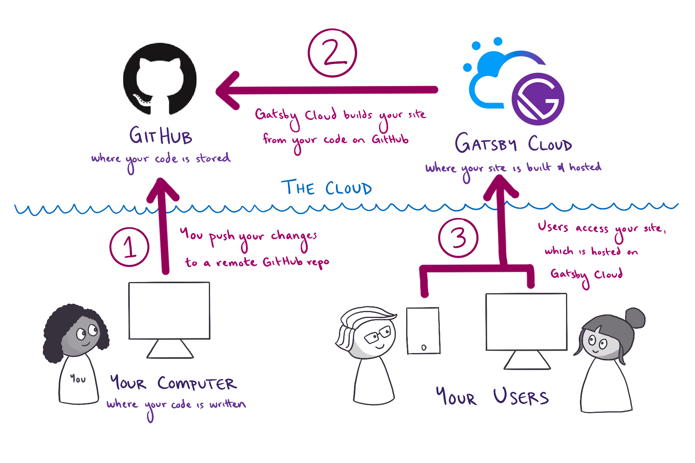

<Collapsible
  summary={<em>Expand for detailed description</em>}
>

First, you write the code for your Gatsby site from your computer. When you're ready to make your changes live on the internet, you go through the following steps:

1. You push your changes from your computer to a remote repository on GitHub. GitHub is an online platform for storing code for your projects.
1. Gatsby Cloud watches your GitHub repository for changes. When it sees your new changes, Gatsby Cloud builds your site from your code on GitHub.
1. Gatsby Cloud hosts the finished version of your site at a unique URL, which users can use to access the latest version of your site.

</Collapsible>

<Announcement style={{marginBottom: "1.5rem"}}>

**Prefer a video?**

If you'd rather follow along with a video, here's a recording of a livestream that covers all the material for Part 1.

You can catch the stream live on Wednesdays at 10AM Pacific Time / 5PM UTC on the [Gatsby Twitch channel](https://www.twitch.tv/gatsbyjs).

<iframe width="560" height="315" src="https://www.youtube.com/embed/wr8rbaHUM6Q?t=470s" title="YouTube video player" frameborder="0" allow="accelerometer; autoplay; clipboard-write; encrypted-media; gyroscope; picture-in-picture" allowfullscreen></iframe>

</Announcement>


## Create a Gatsby site

To create your first Gatsby site, you're going to use a command from the Gatsby command line interface (CLI): `gatsby new`. This command brings up an interactive prompt that asks you questions about the site you want to build. After you enter all the information, the CLI uses your answers to automatically generate your new Gatsby site.

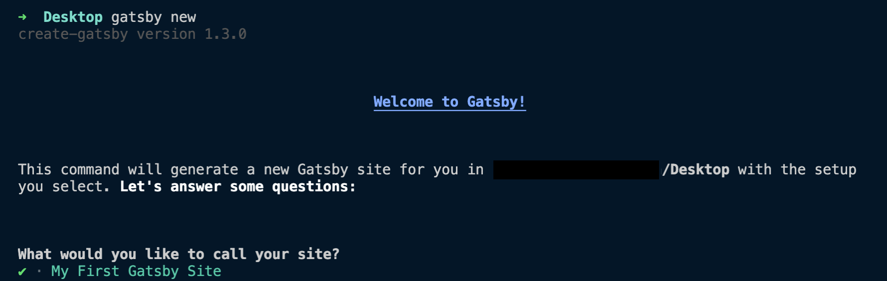

<Announcement style={{marginBottom: "1.5rem"}}>

**Note:** For this Tutorial, your Gatsby CLI should be v3 or newer. To check what version you have installed, run the following command:

```shell
gatsby --version
```

Need to update? Run the command below to get the latest version of the Gatsby CLI:

```shell
npm install -g gatsby-cli
```

</Announcement>

Let's take a closer look at the process:

1. Open the command line, and use the `cd` command to change directories into the folder where you want to create your new Gatsby site. For example, if you wanted to create your new site on your desktop, you might type:
```shell
cd Desktop
```

2. Run the following command from the command line. This will start up the interactive prompt to help you create a new Gatsby site.
```shell:title=Desktop
gatsby new
```

<Announcement style={{marginBottom: "1.5rem"}}>

**Having trouble with `gatsby new`?** If you had trouble globally installing `gatsby-cli` in Part 0, you can also create a new site by running `npm init gatsby` from the command line instead of `gatsby new`.

</Announcement>

3. When the prompt asks, **"What would you like to call your site?"** enter a name for your site.
```shell
What would you like to call your site?
✔ · My First Gatsby Site
```

4. When the prompt asks, **"What would you like to name the folder where your site will be created?"** use the default folder name, which will be based on the site name you chose.
```shell
What would you like to name the folder where your site will be created?
✔ Desktop/ my-first-gatsby-site
```

5. When the prompt asks, **"Will you be using a CMS?"** select **"No (or I'll add it later)"**.
```shell
✔ Will you be using a CMS?
· No (or I'll add it later)
```

<Announcement style={{marginBottom: "1.5rem"}}>

In the future, you can use these options to tell `gatsby new` what features you want to add to your site, and `gatsby new` will automatically configure them for you. It's a much quicker way to set up new projects.

But in this first site, you'll set things up manually to learn about how Gatsby's pieces fit together.

</Announcement>

6. When the prompt asks, **"Would you like to install a styling system?"** select **"No (or I'll add it later)"**. (You'll add styles manually later.)
```shell
✔ Would you like to install a styling system?
· No (or I'll add it later)
```

7. When the prompt asks, **"Would you like to install additional features with other plugins?"** use the arrow and Space keys to select **"Build and host for free on Gatsby Cloud"**, then use the arrow and Enter keys to select **"Done"**.

    This tells `gatsby new` to add a plugin called `gatsby-plugin-gatsby-cloud` to your site. Don't worry about the details of this just yet. You'll learn about plugins later on in the Tutorial. For now, all you need to know is that this plugin will help your site work better when you deploy it with Gatsby Cloud.

8. The prompt will show you a summary of what `gatsby new` will do. It should look something like the output below.
```shell
Thanks! Here's what we'll now do:

    🛠  Create a new Gatsby site in the folder my-first-gatsby-site
    🔌 Install gatsby-plugin-gatsby-cloud


? Shall we do this? (Y/n) › Yes
```

9. When the prompt asks, **"Shall we do this?"** enter **"Y"**. The `gatsby new` command will start building your site. Your internet download speed will affect how long this command takes to run. After it finishes, you should see a message like this:
```shell
🎉  Your new Gatsby site My First Gatsby Site has been successfully
created at ~/Desktop/my-first-gatsby-site.
Start by going to the directory with

  cd my-first-gatsby-site

Start the local development server with

  npm run develop

See all commands at

  https://www.gatsbyjs.com/docs/gatsby-cli/
```

Congratulations, you're now the owner of a brand new Gatsby site!

## Run your site locally

So far, you've generated the code for your site, but what does it actually look like in a web browser like Firefox or Google Chrome? To find out, you'll first need to start up your site's local development server.

The **development server** is a useful tool for when you're working on your site locally (from your own computer). When your development server is running, you can use a web browser to interact with your local copy of your site. That way, you can test out changes to your code, to make sure they work before you actually publish a new version of your site to the internet.

To start up your development server, do the following:

1. In the command line, change into the directory you created for your site:
```shell:title=~/Desktop
cd my-first-gatsby-site
```

<Announcement style={{marginBottom: "1.5rem"}}>

**Tip:** Whenever you want to run any commands for your site, you need to be in the context for that site. That is, your command line needs to be pointed at the directory where your site's code lives.

</Announcement>

2. From your site directory, start the development server by running the following command:
```shell:title=~/Desktop/my-first-gatsby-site
gatsby develop
```

<Announcement style={{marginBottom: "1.5rem"}}>

If you weren't able to install the Gatsby command line interface globally, you can start your development server using the following command instead:

```shell
npm run develop
```

</Announcement>

3. After a few moments, the command line should output a message like the following, telling you your development server is ready to go!

```shell
You can now view my-first-gatsby-site in the browser.
⠀
  http://localhost:8000/
⠀
View GraphiQL, an in-browser IDE, to explore your site's data and
schema
⠀
  http://localhost:8000/___graphql
```

4. Open your favorite web browser and navigate to `http://localhost:8000`.

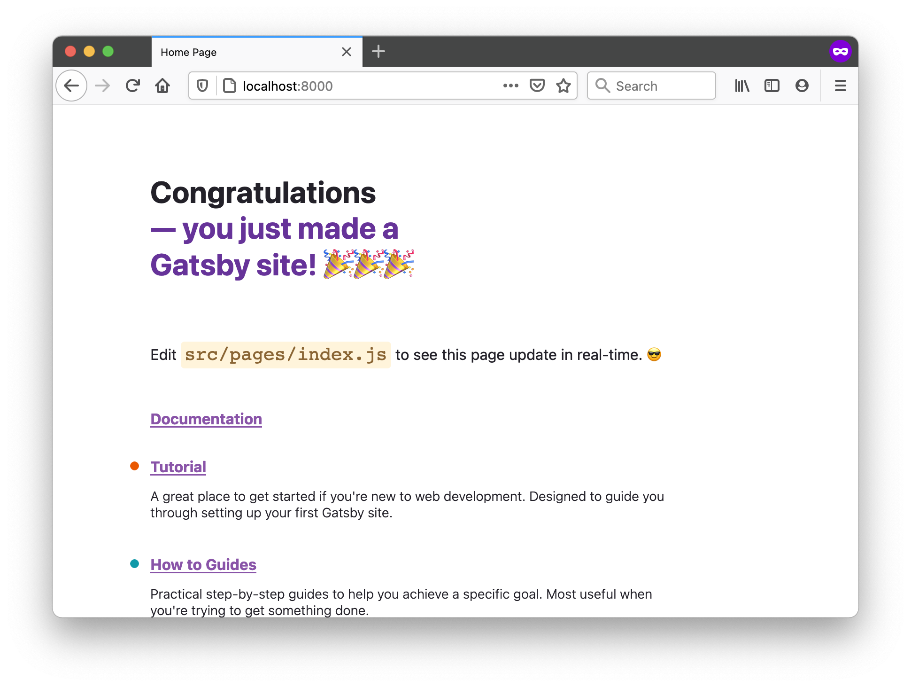

And there it is: your very first Gatsby site! 🎉

You’ll be able to visit the site locally at `http://localhost:8000/` for as long as your development server is running. (That’s the process you started by running the `gatsby develop` command.) To stop running that process (or to “stop running the development server”), go back to your terminal window, hold down the “control” key, and then hit “c” (`ctrl-c`). To start it again, run `gatsby develop` again!

<Announcement style={{marginBottom: "1.5rem"}}>

**Note:** If you are using VM setup like vagrant and/or would like to listen on your local IP address, run `gatsby develop --host=0.0.0.0`. Now, the development server listens on both `http://localhost` and your local IP.

</Announcement>

## Set up a GitHub repo for your site

GitHub is a website that many developers use to back up and share their code online. By uploading your code to GitHub, you'll be able to work on the same codebase from multiple computers. You'll also be able to use Gatsby Cloud to build and host your site.

1. Each codebase on GitHub is stored in its own **repository** (also called a "repo", for short). To create a new repository for your blog, click the plus icon in the top-right corner of the navigation bar. Select "New repository".

   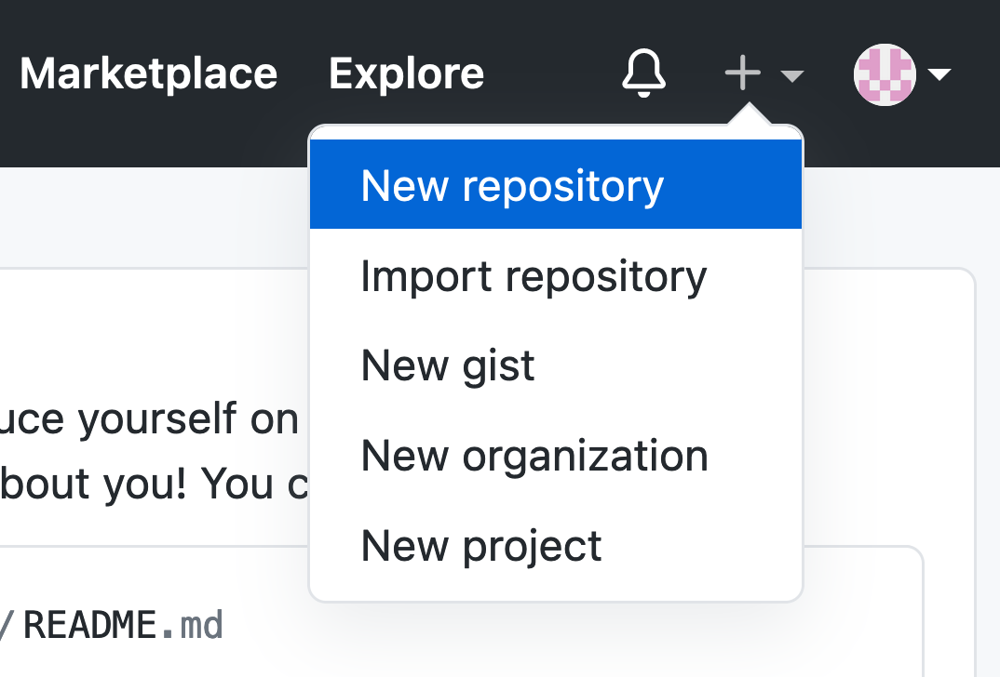

2. When filling out the form for your new repo, you can make it public or private. (This only affects the visibility of your code on GitHub. Your site will still be visible to everyone once you deploy it with Gatsby Cloud.) Leave the initialization option checkboxes unchecked.

    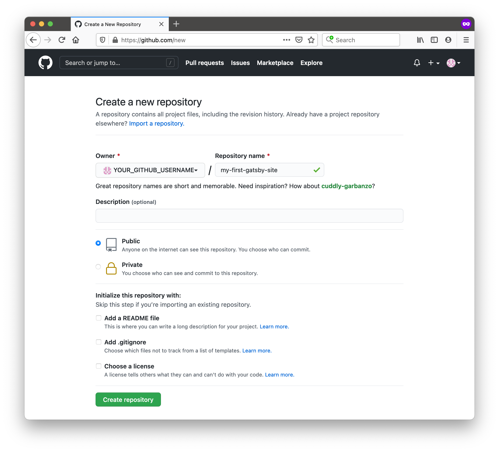

3. To push your existing code from your computer to your new GitHub repository, enter the commands below in the command line. Be sure to swap out `YOUR_GITHUB_USERNAME` for your actual username and `YOUR_GITHUB_REPO_NAME` with the name you gave your GitHub repo (like `my-first-gatsby-site`).

   ```
   git remote add origin https://github.com/YOUR_GITHUB_USERNAME/YOUR_GITHUB_REPO_NAME.git
   git branch -M main
   git push -u origin main
   ```

<Announcement style={{marginBottom: "1.5rem"}}>

**Using GitHub for the first time?**

If you get an error about permissions when you try to push your code to GitHub for the first time, you might need to set up an SSH key for your GitHub account. This lets GitHub know that your computer has permission to push code changes to your remote repos.

For instructions on how to set up an SSH key, follow GitHub's guide: [Connecting to GitHub with SSH](https://docs.github.com/en/github/authenticating-to-github/connecting-to-github-with-ssh).

</Announcement>

Now you have a copy of your code saved on GitHub's servers. In the next step, you'll connect your Gatsby Cloud account to the GitHub repo you just created.

## Build your site with Gatsby Cloud

Gatsby Cloud is an infrastructure platform that is specifically optimized for building, deploying, and hosting Gatsby sites. Once you connect your Gatsby Cloud account to your GitHub repository, Gatsby Cloud will build your site and make it available for others on the internet to see.

To connect your code on GitHub to your Gatsby Cloud account, do the following:

1. Go to your [Gatsby Cloud Dashboard](/dashboard/). Click on the **"Add a site"** button.

   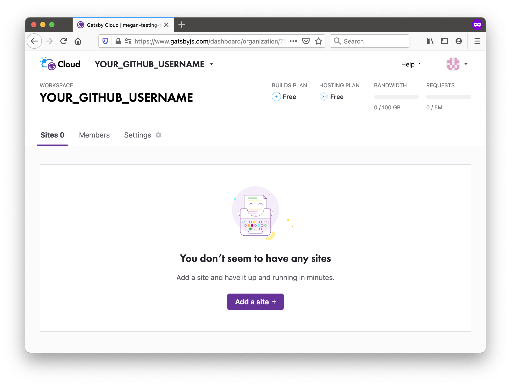

1. The next few steps will help you add your site to Gatsby Cloud. First, select **"Import from a Git repository"** and click the **"Next"** button at the bottom of the page.

   

1. Select **GitHub** as the Git provider.

   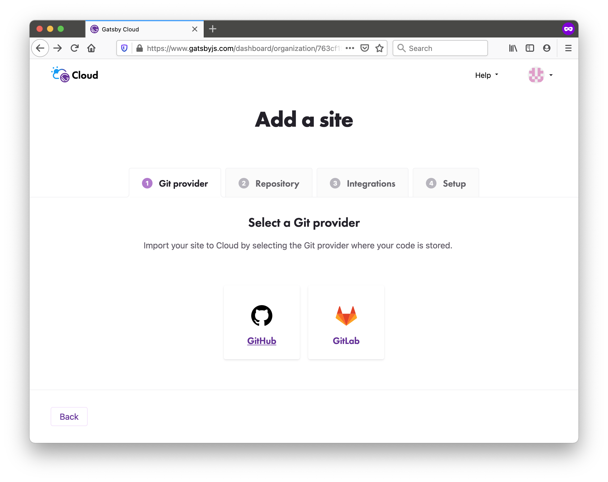

1. If this is your first time connecting GitHub to Gatsby Cloud, you'll need to give Gatsby Cloud permission to access your GitHub account. When asked, **"Where should we host this new project?"** click the **"Select destination"** button.

    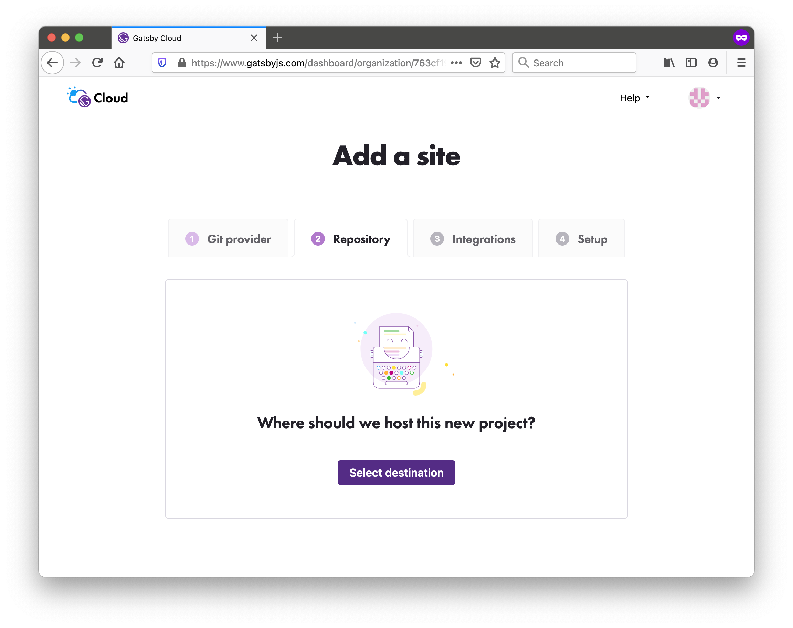

1. A new browser window should open, where GitHub will ask you whether you want to give Gatsby Cloud permission to your GitHub repositories. You can choose whether to give Gatsby Cloud access to all of your GitHub repositories or to only the repository you created (`my-first-gatsby-site`). Then click **"Install"**.

    

1. Now, when you go back to the Gatsby Cloud window, the **"Select a Repository"** dropdown should list your GitHub repository. Select it.

    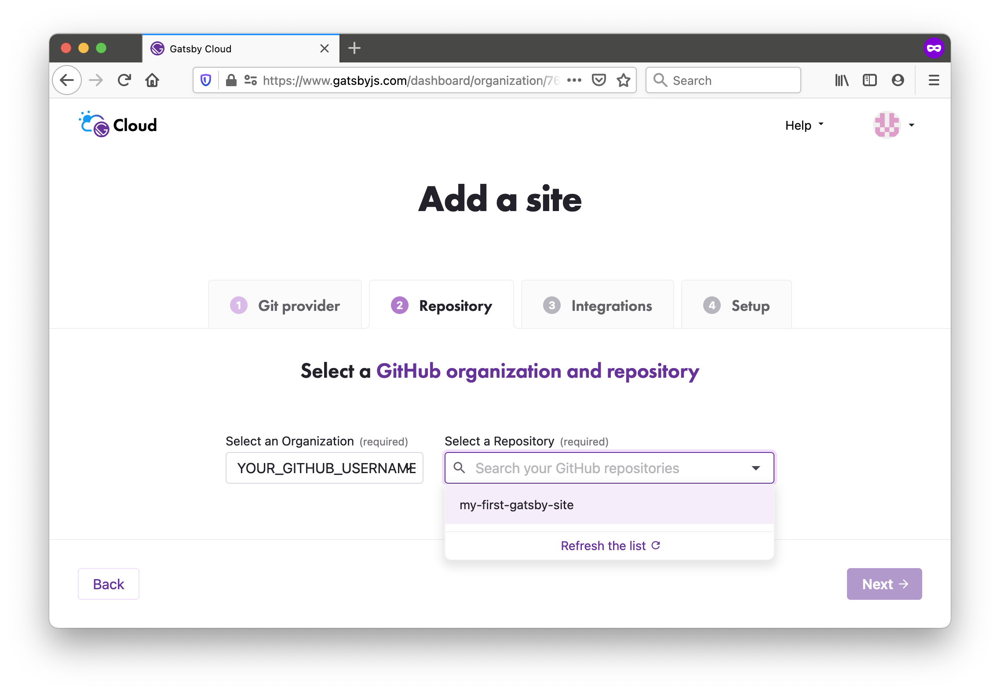

1. Once you select your repo, a few more input fields will show up. These let you tell Gatsby Cloud where to look in your GitHub repo for your Gatsby site. You can also change what Gatsby Cloud will name your site. **Leave the default settings** and click the **"Next"** button.

    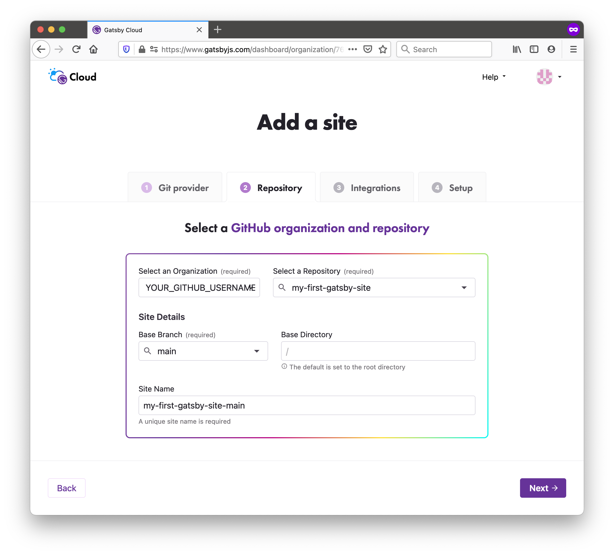

1. Gatsby Cloud will ask you if you want to add any optional integrations to your site. For future projects, this might be useful if you want to use a CMS. But for now, click the **"Skip this step"** button.

    

1. Gatsby Cloud will also ask if you want to add any environment variables. Skip this section, and click the **"Create site"** button.

    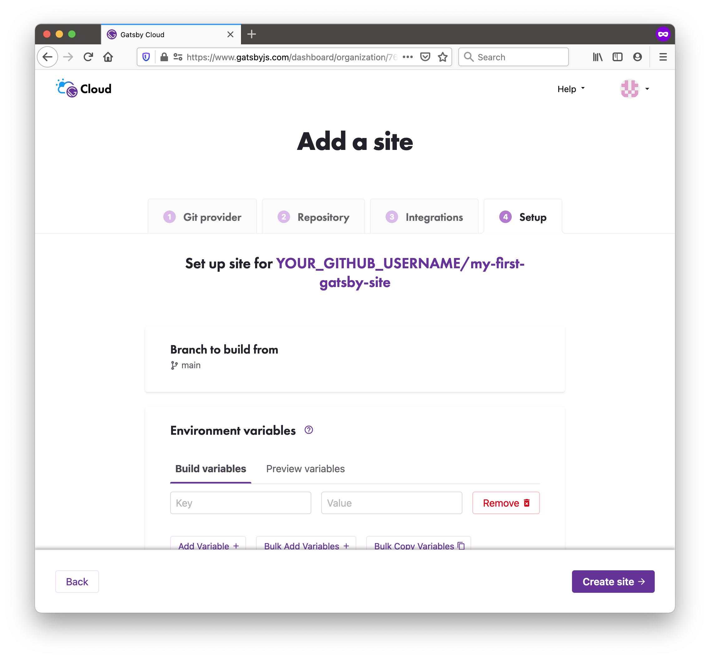

1. Now that your site has been created, you'll be taken to a site dashboard where you can see the status of your builds. Gatsby Cloud should start building your site automatically. You'll see a link to your new site, which is automatically hosted on Gatsby Cloud. You can share this link with anyone, and they'll be able to see your site online!

    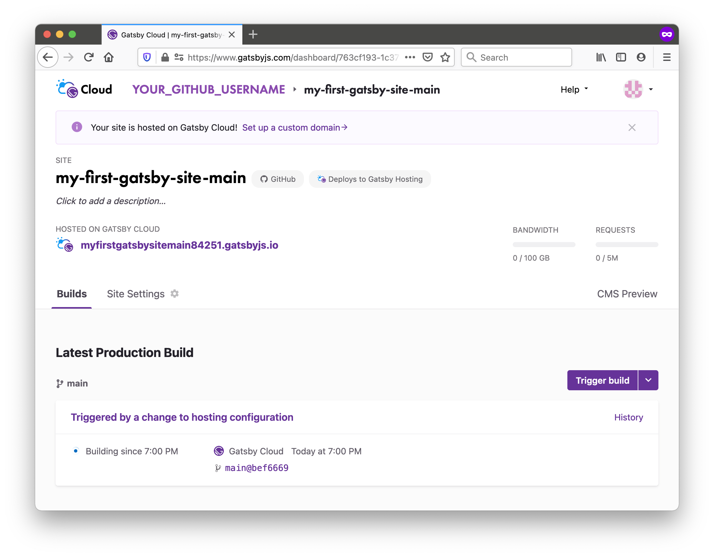

You did it! Your Gatsby site is now online! 👏

Every time you push a new change to the main branch of your GitHub repo, Gatsby Cloud will see the changes and automatically start a build for the new version of your site.

<Announcement style={{marginBottom: "1.5rem"}}>

**Tip:** There will be a unique URL for each build (like `https://build-49535320-b3ae-4761-bbeb-f8f7fa07e0fc.gtsb.io/`), and a URL that always has the latest build (like `my-first-gatsby-site-main.gatsbyjs.io`). You'll mostly want to share the human-readable URL, so that people can always see the most up-to-date version of your site. But in some cases (like when you're trying to debug a specific build of your site) it can be helpful to use the unique build URL.

</Announcement>

## Summary

In this section, you learned how to create a new Gatsby site and deploy it online using Gatsby Cloud. As a quick review, here's the diagram outlining the process:


<Collapsible
  summary={<em>Expand for detailed description</em>}
>

First, you write the code for your Gatsby site from your computer. When you're ready to make your changes live on the internet, you go through the following steps:

1. You push your changes from your computer to a remote repository on GitHub. GitHub is an online platform for storing code for your projects.
1. Gatsby Cloud watches your GitHub repository for changes. When it sees your new changes, Gatsby Cloud builds your site from your code on GitHub.
1. Gatsby Cloud hosts the finished version of your site at a unique URL, which users can use to access the latest version of your site.

</Collapsible>

<Announcement style={{marginBottom: "1.5rem"}}>

**Share Your Feedback!**

Our goal is for this Tutorial to be helpful and easy to follow. We'd love to hear your feedback about what you liked or didn't like about this part of the Tutorial.

Use the "Was this doc helpful to you?" form at the bottom of this page to let us know what worked well and what we can improve.

</Announcement>

### What's coming next?

Now that you have a default Gatsby site up and running, it's time to make it your own. In Part 2 of the Tutorial, you'll learn how to use React to customize the design and contents of your site.

<LinkButton
  to="/docs/tutorial/part-2/"
  rightIcon={<MdArrowForward />}
  variant="SECONDARY"
>
  Continue to Part 2
</LinkButton>
