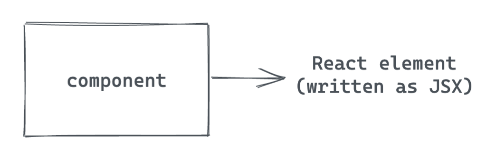
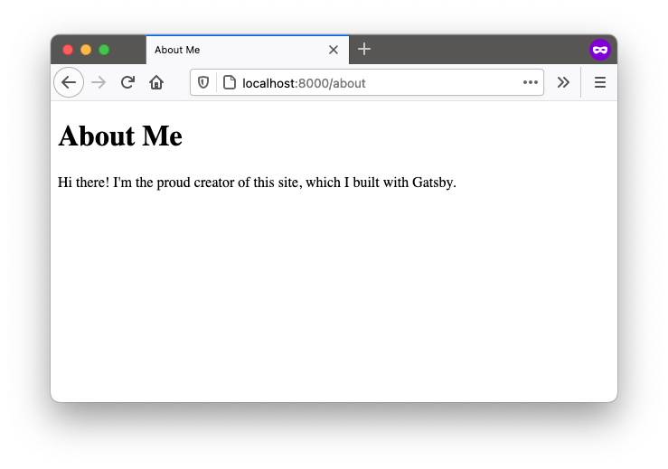
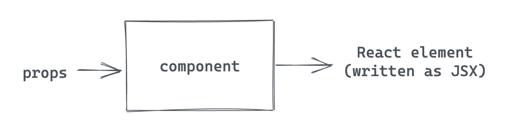
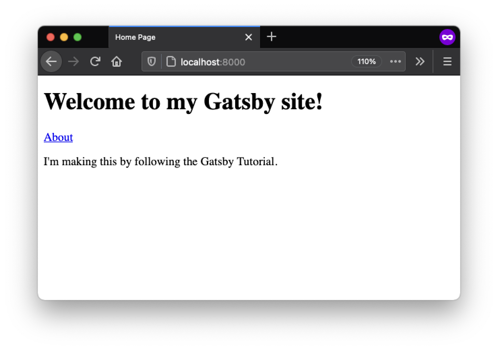
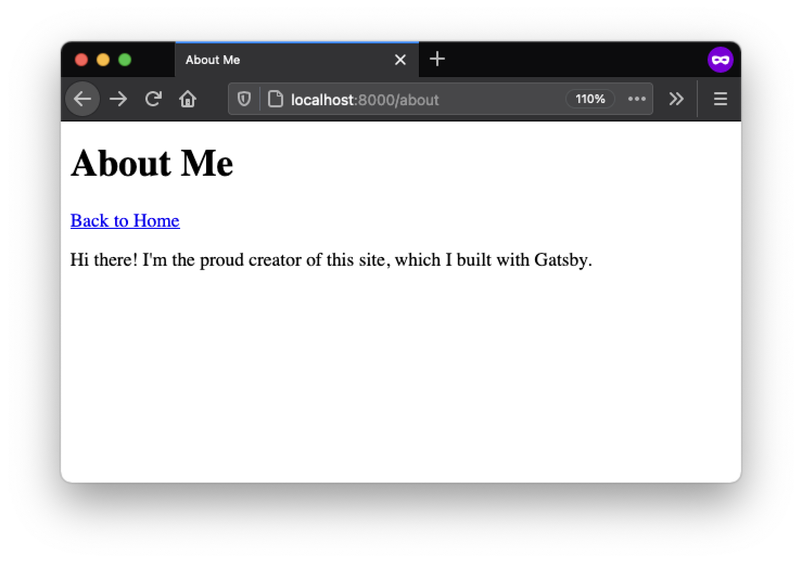
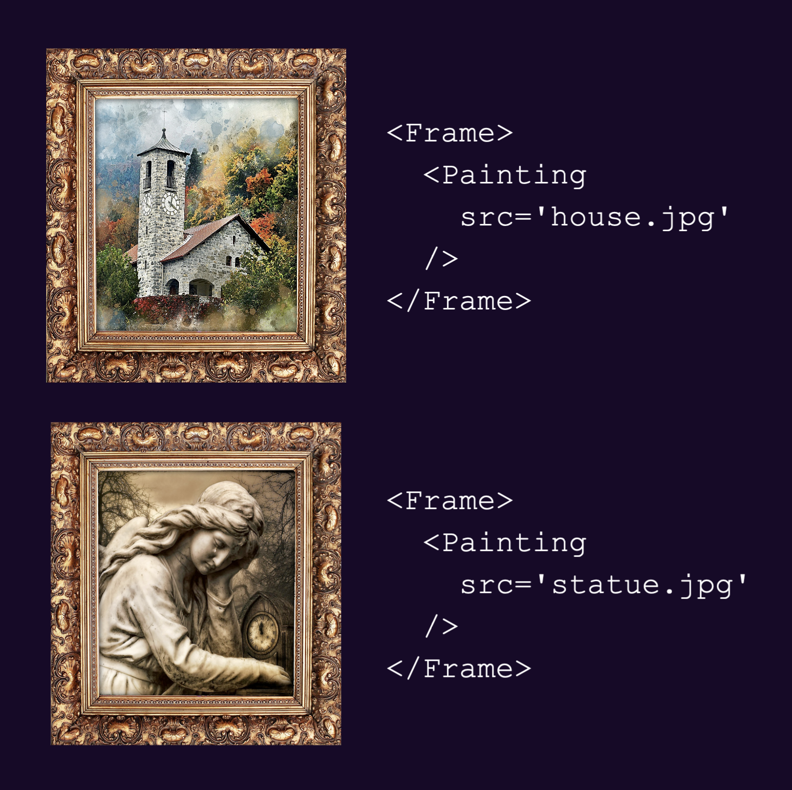
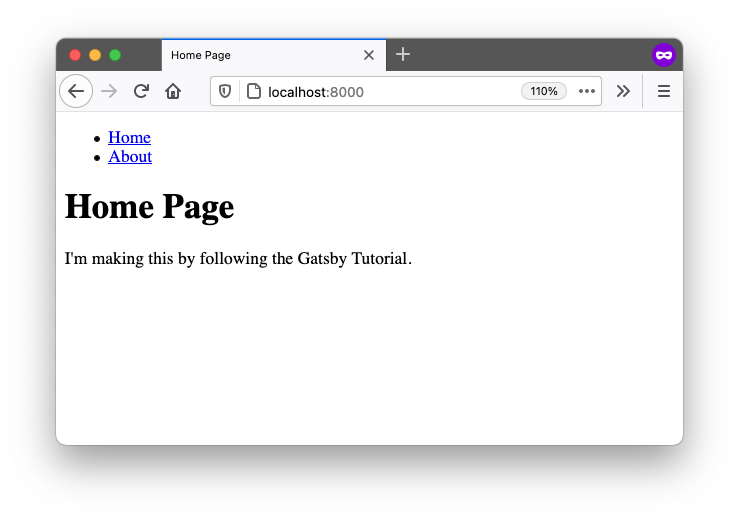
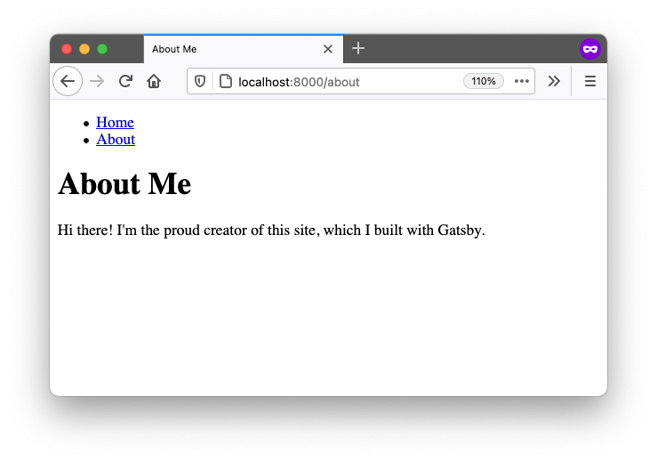
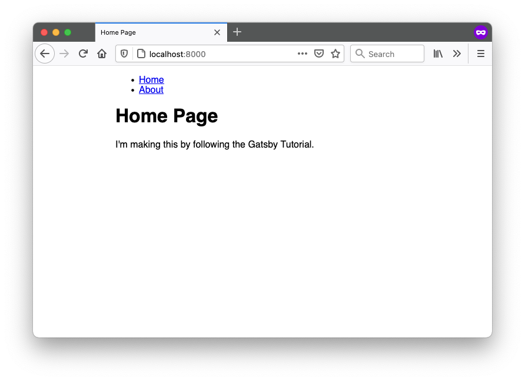
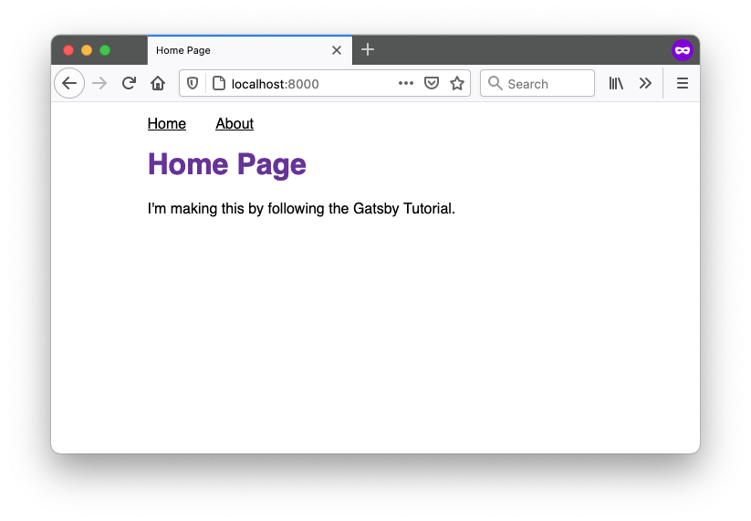

import { Announcement, Notification, LinkButton } from 'gatsby-interface'
import Collapsible from '@components/collapsible'
import { MdInfo, MdArrowForward } from 'react-icons/md'

<Notification
  Icon={MdInfo}
  tone="WARNING"
  variant="SECONDARY"
  content={
    <div>
      <p>
        <strong>Note:</strong> We{"'"}re still working on updating this Tutorial to use Gatsby v3.
        The first few parts of the new Tutorial have been released here, and subsequent parts
        will be added as we finish them.
      </p>
      <p style={{ marginBottom: 0 }}>
        If you{"'"}re looking for a full experience in the meantime, you can check out the (slightly outdated){" "}
        <a href="https://v2.gatsbyjs.com/docs/tutorial/">
          <strong>Gatsby v2 Tutorial</strong>
        </a>
        .
      </p>
    </div>
  }
/>

## Introduction

In the previous part of the Tutorial, you started your first Gatsby site and used Gatsby Cloud to deploy it to the internet. Now that you have everything all set up, it's time to make this site your own!

To build out the basic page structure for your blog site, you'll need to know about React components and how Gatsby uses them.

By the end of this part of the Tutorial, you will be able to:

* Create **page components** to add new pages to your site.
* Import and use a **pre-built component** from another package.
* Create your own **reusable "building block" component**.
* Use component **props** to change the way a component renders.
* Use the **`children`** prop to create a wrapper component.

## A quick intro to React

### What is React?

React is the JavaScript library that Gatsby uses under the hood to create user interfaces (UIs). With React, you can break down your UI into smaller, reusable pieces called **components**.

For example, imagine the UI for an online store's Products page:


To build this page in React, you might have a `<Navbar>` component for the navigation menu, a `<Sidebar>` component for extra information displayed to the side of the main content, and a `<ProductGrid>` component to display all of the products for sale.

You can also create components from other components. For example, you might decide to break down the `<ProductGrid>` component into a list of multiple `<ProductCard>` components, which each display the details about a single product. This pattern is called **composition**, since your larger `<ProductGrid>` component is *composed* of smaller `<ProductCard>` components.


<Announcement style={{marginBottom: "1.5rem"}}>

**Try it!**

Look back at the [finished example blog site](https://introworkshopexamplesitev3.gatsbyjs.io). How might you break down the pages into components?

Not sure where to start? Look for parts of the UI that repeat within a page or across multiple pages.

</Announcement>


### What is a React component?

Under the hood, a **React component** is a function that returns a React element. A **React element** is an object that React uses to render DOM elements.



The simplest way to write React elements is with **JSX**. JSX is a JavaScript syntax extension that describes the DOM structure for your component. It looks a bit like having HTML in your JavaScript files:

```javascript
const hello = <h1>Hello world!</h1>
```

So a simple React component might look something like this:

```javascript
const Greeting = () => {
  return (
    <h1>Hello world!</h1>
  )
}
```

You'll learn more about how to create React components in the next section.

## Create a page component

There are two main types of components in a Gatsby site. The first type you'll create are **page components**. A page component contains all the UI elements for a specific page of your site.

In this section, you'll create two new page components: one for the Home page and one for an About page.

(If you're new to writing React components, expand the content below for a quick overview.)

<Collapsible
  summary={<h3>Key React Concept: Writing a React component</h3>}
>

There are three main steps to writing a React component:

1. **Import React** from the `'react'` package, so that you can use JSX inside your `.js` file.
1. **Define your component.** It should be a function that returns a JSX element.
1. **Export your component**, so that it can be used by other parts of your site.

Here's an example of what that basic structure looks like in code:

```javascript:title=my-component.js
// Step 1: Import React. This lets you use JSX inside your .js file.
import * as React from 'react'

/* Step 2: Define your component. Note that your
component name should start with a capital letter. */
const MyComponent = () => {
  return (
    <h1>Hi, welcome to my site!</h1>
  )
}

/* Step 3: Export your component so it
can be used by other parts of your app. */
export default MyComponent
```

Your component must return a single React element, but you can put as many elements inside that top-level element as you want. The code snippet below shows an example of a valid component and an invalid component:

```javascript
import * as React from 'react'

const ValidComponent = () => {
  return (
    <div>
      <h1>A valid component!</h1>
      <p>This will work fine.</p>
      <p>
        Since there is only one top-level element: the div.
      </p>
    </div>
  )
}

const InvalidComponent = () => {
  return (
    <h1>This won't work.</h1>
    <p>Because there are two elements at the top level.</p>
  )
}
```

<Announcement style={{marginBottom: "1.5rem"}}>

If you try to build your site with the code above, you'll get an error for `<InvalidComponent>` like this:

```shell
Parsing error: Adjacent JSX elements must be
wrapped in an enclosing tag. Did you want a JSX fragment
<>...</>?
```

</Announcement>

</Collapsible>

### Task: Update the home page content

Now that you've gotten a high-level introduction to React, it's time to try your hands at writing some React components. To start, you'll update the content for the home page.

<Announcement style={{marginBottom: "1.5rem"}}>

If you haven't already, open your Gatsby site in Visual Studio Code, and start up your local development server in the command line:

1. Open your command line application.
1. Change directories into the folder for your Gatsby site.
1. Run `gatsby develop`.
1. Open `localhost:8000` in your web browser.

</Announcement>

1. Open your `src/pages/index.js` file. Replace its contents with the following. (Notice how the component's structure matches the three steps for writing React components?)

```js:title=src/pages/index.js
// Step 1: Import React
import * as React from 'react'

// Step 2: Define your component
const IndexPage = () => {
  return (
    <main>
      <title>Home Page</title>
      <h1>Welcome to my Gatsby site!</h1>
      <p>I'm making this by following the Gatsby Tutorial.</p>
    </main>
  )
}

// Step 3: Export your component
export default IndexPage
```

2. Go to `localhost:8000` in a web browser. (You might need to wait a moment while your development server rebuilds.) Once your page updates, it should look something like this:


<Announcement style={{marginBottom: "1.5rem"}}>

**Key Gatsby Concept** 💡

Gatsby automatically creates pages for React components that are the default export of files in the `src/pages` directory.

If a user tries to visit the URL for a page that doesn't actually exist, Gatsby will use the `src/pages/404.js` page component to display an error instead. Go ahead and give it a try! (If you're trying it on `localhost:8000` you'll need to click the "Preview custom 404 page" button on the development 404 page.)

</Announcement>

### Task: Create a new page component for an About page

Now that you've updated the existing Home page, try creating a new page from scratch. Make an About page, so that you can tell people a little about yourself.

1. Create a new file: `src/pages/about.js`. Use the code below as a starting point for your About page. (Feel free to switch up the content to make it more specific to you. Maybe share your favorite food or go-to vacation spot!)

```js:title=src/pages/about.js
// Step 1: Import your component
import * as React from 'react'

// Step 2: Define your component
const AboutPage = () => {
  return (
    <main>
      <title>About Me</title>
      <h1>About Me</h1>
      <p>Hi there! I'm the proud creator of this site, which I built with Gatsby.</p>
    </main>
  )
}

// Step 3: Export your component
export default AboutPage
```

2. In a web browser, visit `localhost:8000/about`. When your development server finishes rebuilding your site, the About page should look something like this:



<Announcement style={{marginBottom: "1.5rem"}}>

**Key Gatsby Concept** 💡

Pages created in the `src/pages` directory use the name of the file as the route for the page.

For example, if you had a file called `src/pages/garden-gnomes.js`, you could access that page at `localhost:8000/garden-gnomes`.

</Announcement>

## Use the `<Link>` component

Now that you've built a few page components, it's time to look at the other type of React components in a Gatsby site: **"building-block" components**.

<Announcement style={{marginBottom: "1.5rem"}}>

**Note:** The term building-block component isn't an official technical term. It's just the best name we could come up with to describe this kind of component.

</Announcement>

Building-block components are smaller components that represent just a part of a page's user interface (instead of an entire page). Think back to the store website example from the ["What is React?"](#what-is-react) section. The `Navbar`, `Sidebar`, `ProductGrid`, and `ProductCard` components are examples of building-block components. You can combine several smaller building-block components into a larger page component.


One of the powerful things about building-block components is that you can reuse the same component in multiple places across your site. This is especially useful for pieces of your UI that share a similar structure but render different values.

For example, each of the `ProductCard` components in the product grid above shows a photo of the product, the product name, a short description, the price, and a link to the product page. The exact values change for each product, but the general structure stays the same. By making the `ProductCard` component dynamic, you can reuse the same code for all the products in the grid!

React has a built-in feature to help you make your components dynamic: **properties** (or **props**, for short).

<Collapsible
  summary={<h3>Key React Concept: Components with props</h3>}
>

You can use component props to change the way a component renders. Props are essentially arguments that you pass into your component function.



The code snippets below show an example of how to pass a prop into a component when it's rendered and how to use the value of that prop within the component definition:

* When you define your component, it should take in a single argument: an object called `props`. The `props` object will have whatever properties you passed into your component when you rendered it.

    ```javascript:title=src/components/greeting.js
    // Defining the <Greeting> component
    const Greeting = (props) => { // highlight-line
      return (
        <p>Hi {props.name}!</p> // highlight-line
      )
    }
    ```

<Announcement style={{marginBottom: "1.5rem"}}>

**Syntax Hint:** In JSX, you can embed any JavaScript expression by wrapping it with `{}`. That's how you can access the value of the `name` prop from the `props` object.

</Announcement>

* When rendering the `Greeting` component, you pass in the `name` prop with a specific value, like `"Megan"`. You could swap in a different value string each time you render the `Greeting` component.

    ```javascript:title=src/pages/say-hello.js
    // Rendering the <Greeting> component
    const SayHello = () => {
      return (
        <div>
          {/* highlight-start */}
          <Greeting name="Megan" />
          <Greeting name="Obinna" />
          <Greeting name="Generosa" />
          {/* highlight-end */}
        </div>
      )
    }
    ```

You can name your props whatever you want. For example, if you passed in `iceCreamFlavor="mint chip"` when you rendered a component, that prop would be available to use inside your component at `props.iceCreamFlavor`.

</Collapsible>

So far, your blog site has two separate pages (Home and About), but the only way to get from one page to the other is to update the URL manually. It would be nice to add links to make it easier to switch between pages on your site.

The `Link` component is an example of a **pre-built** component that you can use in your site. In other words, the `Link` component is defined and maintained by another package (in this case, the Gatsby package). That means you can import it and use it in your own components without knowing too much about how it works under the hood.

The `Link` component lets you add a link to another page in your Gatsby site. It's similar to an HTML `<a>` tag, but with some extra performance benefits. The `Link` component takes a prop called `to`, which is similar to the `<a>` tag's `href` attribute. The value should be the URL path to the page on your site you want to link to.

<Announcement style={{marginBottom: "1.5rem"}}>

**Key Gatsby Concept** 💡

The Gatsby `Link` component provides a performance feature called **preloading**. This means that the resources for the linked page are requested when the link scrolls into view or when the mouse hovers on it. That way, when the user actually clicks on the link, the new page can load super quickly.

Use the `Link` component for linking between pages within your site. For external links to pages not created by your Gatsby site, use the regular HTML `<a>` tag.

</Announcement>

Follow the steps below to add `Link` components to your Home and About pages.

1. On the Home page, import the `Link` component from the Gatsby package and add a link to your About page.

```js:title=src/pages/index.js
import * as React from 'react'
// highlight-next-line
import { Link } from 'gatsby'

const IndexPage = () => {
  return (
    <main>
      <title>Home Page</title>
      <h1>Welcome to my Gatsby site!</h1>
      {/* highlight-next-line */}
      <Link to="/about">About</Link>
      <p>I'm making this by following the Gatsby Tutorial.</p>
    </main>
  )
}

export default IndexPage
```


2. On the About page, import the `Link` component from the Gatsby package and add a link to your Home page.

```js:title=src/pages/about.js
import * as React from 'react'
import { Link } from 'gatsby' // highlight-line

const AboutPage = () => {
  return (
    <main>
      <title>About Me</title>
      <h1>About Me</h1>
      {/* highlight-next-line */}
      <Link to="/">Back to Home</Link>
      <p>Hi there! I'm the proud creator of this site, which I built with Gatsby.</p>
    </main>
  )
}

export default AboutPage
```


3. In your web browser, click on each of the links to make sure they're working correctly.






## Create a reusable layout component

If you take another look at the [finished example blog](https://introworkshopexamplesitev3.gatsbyjs.io), you might notice that there are some repeated parts of the UI across each page, like the site title and the navigation menu.

You could copy those elements into each page of your site separately. But imagine your site had dozens (or even thousands) of pages. If you wanted to make a change to the structure of your navigation menu, you'd have to go and update every one of those files separately. Yuck.

Instead, it would be better to create one common `Layout` component that groups all the shared elements to reuse across multiple pages. That way, when you need to make updates to the layout, you can make the change in one place and it will automatically be applied to all the pages using that component.

In this section, you'll create your first **custom** building-block component: `Layout`. To do that, you'll need to use a special React prop called `children`.

<Collapsible
  summary={<h3>Key React Concept: Components with children</h3>}
>

In addition to the props that you can add to your components, React also creates certain props for your components automatically.

One such prop is called `children`. When you render a component, the `children` prop will automatically be passed whatever content comes between the opening and closing tags for that component. This is helpful when you want to create a component that wraps some generic content.

<Announcement style={{marginBottom: "1.5rem"}}>

The `Link` component you used in the last section also used the `children` prop. You used it to pass in the text to be hyperlinked.

```js
<Link to="/">
  This text is passed into the Link component's children prop!
</Link>
```

</Announcement>

Think of your wrapper component as a picture frame. A frame has its own shape and style, but you can swap out its contents with whatever you want. You could use the same picture frame around a photo of a house or a statue. You could even put in something besides a picture, like a painting or a piece of embroidery.



Here's an example of what the code for this scenario might look like. First, when the `<Frame>` component is rendered, it has contents passed in between the opening and closing tag:

```javascript:title=src/pages/gallery.js
import Frame from '../components/frame' // highlight-line

const GalleryPage = () => {
  return (
    {/* highlight-start */}
    <Frame>
      <p>This will be passed in as children</p>
    </Frame>
    {/* highlight-end */}
  )
}

export const GalleryPage
```

Then in the component definition, the `children` prop will get passed whatever elements came between the opening and closing tag. You can render the `children` prop in your JSX to insert the contents.

```javascript:title=src/components/frame.js
import React from 'react'

const Frame = ({ children }) => { // highlight-line
  return (
    <div>
      <h1>This is the page title</h1>
      {/* highlight-next-line */}
      { children }
    </div>
  )
}

export default Frame
```

In the browser, the actual DOM elements will look something like this:

```html
<div>
  <h1>This is the page title</h1>
  <p>This will be passed in as children</p>
</div>
```

</Collapsible>

Follow the steps below to create a `Layout` component and add it to your Home and About pages.

1. Create a new file called `src/components/layout.js`. Insert the following code to define your `Layout` component. This component will render a `<main>` element that includes a dynamic page title and heading (from the `pageTitle` prop), a list of navigation links, and the contents passed in with the `children` prop.

```js:title=src/components/layout.js
import * as React from 'react'
import { Link } from 'gatsby'

const Layout = ({ pageTitle, children }) => {
  return (
    <main>
      <title>{pageTitle}</title>
      <nav>
        <ul>
          <li><Link to="/">Home</Link></li>
          <li><Link to="/about">About</Link></li>
        </ul>
      </nav>
      <h1>{pageTitle}</h1>
      {children}
    </main>
  )
}

export default Layout
```

<Announcement style={{marginBottom: "1.5rem"}}>

**Syntax Hint**: You might have noticed that the `Layout` component is using a slightly different syntax for its props.

Now it looks like this:

```js
const Layout = ({ pageTitle, children }) => {
  ...
}
```

instead of this:

```js
const Layout = (props) => {
  ...
}
```

This is a JavaScript technique called **destructuring**. It's basically a shortcut for defining variables based on an object's properties. It's like saying, "Take the object that gets passed into this function, and unpack its `pageTitle` and `children` properties into their own variables."

It's a shorter way to do the following:

```javascript
const Layout = (props) => {
  const pageTitle = props.pageTitle
  const children = props.children
  ...
}
```

</Announcement>

2. Update your Home page component to use the Layout component instead of the hard-coded `Link` component you added in the previous section.

```js:title=src/pages/index.js
import * as React from 'react'
import Layout from '../components/layout' // highlight-line

const IndexPage = () => {
  return (
    // highlight-start
    <Layout pageTitle="Home Page">
      <p>I'm making this by following the Gatsby Tutorial.</p>
    </Layout>
    // highlight-end
  )
}

export default IndexPage
```

3. Update your About page component to use the Layout component as well.

```js:title=src/pages/about.js
import * as React from 'react'
import Layout from '../components/layout' // highlight-line

const AboutPage = () => {
  return (
    // highlight-start
    <Layout pageTitle="About Me">
      <p>Hi there! I'm the proud creator of this site, which I built with Gatsby.</p>
    </Layout>
    // highlight-end
  )
}

export default AboutPage
```

4. Check your Home and About pages in a web browser to make sure your new `Layout` component is working:





## Style components with CSS Modules

Now that you've got your page structure set up, it's time to add some style and make it cute!

Gatsby isn't strict about what styling approach you use. You can pick whatever system you're most comfortable with.

In this Tutorial, you'll use **CSS Modules** to style your components. This means that styles will be scoped to components, which helps avoid class naming collisions between components. Gatsby is automatically configured to handle CSS Modules - no extra setup necessary!

<Collapsible
  summary={<h3>Key Styling Concept: CSS Modules</h3>}
>

To define styles using CSS Modules, put your CSS in a file that ends with the file extension `.module.css`. This tells Gatsby that this CSS file should be processed as a CSS Module rather than plain CSS.

Within your CSS file, create separate CSS classes for each element you want to style. For example:

```css:title=src/components/my-component.module.css
.title {
  color: blue;
  font-size: 3rem;
}
```

Then, in your component `.js` file, import each class separately and apply it to the corresponding React element:

```javascript:title=src/components/my-component.js
import * as React from 'react'
import { title } from './my-component.module.css' // highlight-line

const MyComponent = () => {
  return (
    {/* highlight-next-line */}
    <h1 className={title}>
      Super Sweet Title Page
    </h1>
  )
}

export default MyComponent
```

If you open the developer console in your web browser and inspect the `<h1>` element, you'll see that it has a long classname like `my-component-module---title---2lRF7`. That's the class name generated by CSS Modules. It's guaranteed to be unique across your site, even if you have another component that also has a `.title` class in its `.module.css` file. That's one of the reasons CSS Modules are a popular styling approach: they let you write CSS that's scoped to your components, so you don't have to worry about selector name collisions between components.

</Collapsible>

Follow the steps below to style your `Layout` component using CSS Modules.

1. Create a new file: `src/components/layout.module.css`. (The `.module.css` part at the end is important! That's what tells Gatsby that these styles are using CSS Modules.)

2. Start by adding a single `.container` class:

```css:title=src/components/layout.module.css
.container {
  margin: auto;
  max-width: 500px;
  font-family: sans-serif;
}
```

3. Then import that class into your `Layout` component `.js` file, and use the `className` prop to assign it to the `<main>` element:

```js:title=src/components/layout.js
import * as React from 'react'
import { Link } from 'gatsby'
import { container } from './layout.module.css' // highlight-line

const Layout = ({ pageTitle, children }) => {
  return (
    <main className={container}> // highlight-line
      <title>{pageTitle}</title>
      <nav>
        <ul>
          <li><Link to="/">Home</Link></li>
          <li><Link to="/about">About</Link></li>
        </ul>
      </nav>
      <h1>{pageTitle}</h1>
      {children}
    </main>
  )
}

export default Layout
```

<Announcement style={{marginBottom: "1.5rem"}}>

**Syntax Hint:** To apply classes to React components, use the `className` prop. (This is another example of a built-in prop that React automatically knows how to handle.)

This might be confusing if you're used to using the `class` attribute on HTML elements. Do your best to not mix them up!

</Announcement>

4. When you open your local site in a web browser, you should now see the font has changed and the content is more centered on the page.



5. Now that you've seen how to style a single element for your component, add some more styles to apply to the other elements in your `Layout` component.

```css:title=src/components/layout.module.css
.container {
  margin: auto;
  max-width: 500px;
  font-family: sans-serif;
}

/* highlight-start */
.heading {
  color: rebeccapurple;
}

.nav-links {
  display: flex;
  list-style: none;
  padding-left: 0;
}

.nav-link-item {
  padding-right: 2rem;
}

.nav-link-text {
  color: black;
}
/* highlight-end */
```

6. Import the new classes into your `Layout` component, and apply each class to the corresponding element.

```js:title=src/components/layout.js
import * as React from 'react'
import { Link } from 'gatsby'
// highlight-start
import {
  container,
  heading,
  navLinks,
  navLinkItem,
  navLinkText
} from './layout.module.css'
// highlight-end

const Layout = ({ pageTitle, children }) => {
  return (
    <main className={container}>
      <title>{pageTitle}</title>
      <nav>
        <ul className={navLinks}> // highlight-line
          <li className={navLinkItem}> // highlight-line
            <Link to="/" className={navLinkText}> // highlight-line
              Home
            </Link>
          </li>
          <li className={navLinkItem}> // highlight-line
            <Link to="/about" className={navLinkText}> // highlight-line
              About
            </Link>
          </li>
        </ul>
      </nav>
      <h1 className={heading}>{pageTitle}</h1> // highlight-line
      {children}
    </main>
  )
}

export default Layout
```

<Announcement>

**Syntax Hint:** In CSS, the convention is to name classes using kebab case (like `.nav-links`). But in JavaScript, the convention is to name variables using camel case (like `navLinks`).

Luckily, when you use CSS Modules with Gatsby, you can have both! Your kebab-case class names in your `.modules.css` files will automatically be converted to camel-case variables that you can import in your `.js` files.

</Announcement>

7. Once your development server finishes rebuilding your site, you should see your new styles applied in your web browser:



## Summary

Congratulations, you've made it to the end of Part 2! 🥳 (That was a long one!)

Take a moment to think back on what you've learned so far. Challenge yourself to answer the following questions from memory:

* What's the difference between a page component and a building-block component?
* How do you add a new page to your Gatsby site?
* What are the three steps for writing a new React component?
* What are props and when might you use them?
* What is the `children` prop and why is it useful?

<Announcement style={{marginBottom: "1.5rem"}}>

**Ship It!** 🚀

Before you move on, deploy your changes to your live site on Gatsby Cloud so that you can share your progress!

First, run the following commands in a terminal to push your changes to your GitHub repository. (Make sure you're in the top-level directory for your Gatsby site!)

```shell
git add .
git commit -m "Finished Gatsby Tutorial Part 2"
git push
```

Once your changes have been pushed to GitHub, Gatsby Cloud should notice the update and rebuild and deploy the latest version of your site. (It may take a few minutes for your changes to be reflected on the live site. Watch your build's progress from your [Gatsby Cloud dashboard](/dashboard/?utm_campaign=tutorial).)

</Announcement>

### Key takeaways

* React is a library that helps you break down your UI into smaller pieces called components. A component is a function that returns a React element. React elements can be written in JSX.
* **Page components** contain all the UI elements for a specific page of your site. Gatsby automatically creates pages for components that are the default exports of files in the `src/pages` directory. The name of the file will be used as the route for the page.
* **Building-block components** are smaller reusable parts of your UI. They can be imported into page components or other building block components.
* You can import **pre-built** components (like `Link`) from other packages, or you can write your own **custom** components from scratch (like `Layout`).
* You can use **props** to change how a component renders. You can define your own props when you build a component. React also has some built-in props, like `children` and `className`.
* Gatsby isn't opinionated about what styling approach you want to use, but it works with **CSS Modules** by default.

<Announcement style={{marginBottom: "1.5rem"}}>

**Share Your Feedback!**

Our goal is for this Tutorial to be helpful and easy to follow. We'd love to hear your feedback about what you liked or didn't like about this part of the Tutorial.

Use the "Was this doc helpful to you?" form at the bottom of this page to let us know what worked well and what we can improve.

</Announcement>

### What's coming next?

In Part 3 of the Tutorial, you'll learn about how to use Gatsby plugins to add more pre-built functionality to your site.

<LinkButton
  to="/docs/tutorial/part-3/"
  rightIcon={<MdArrowForward />}
  variant="SECONDARY"
>
  Continue to Part 3
</LinkButton>