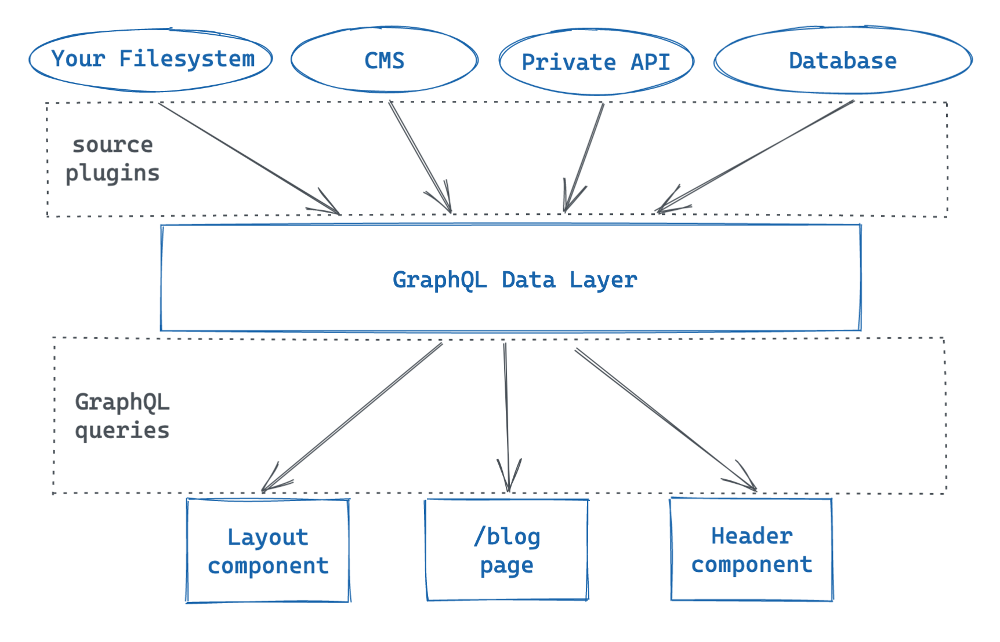
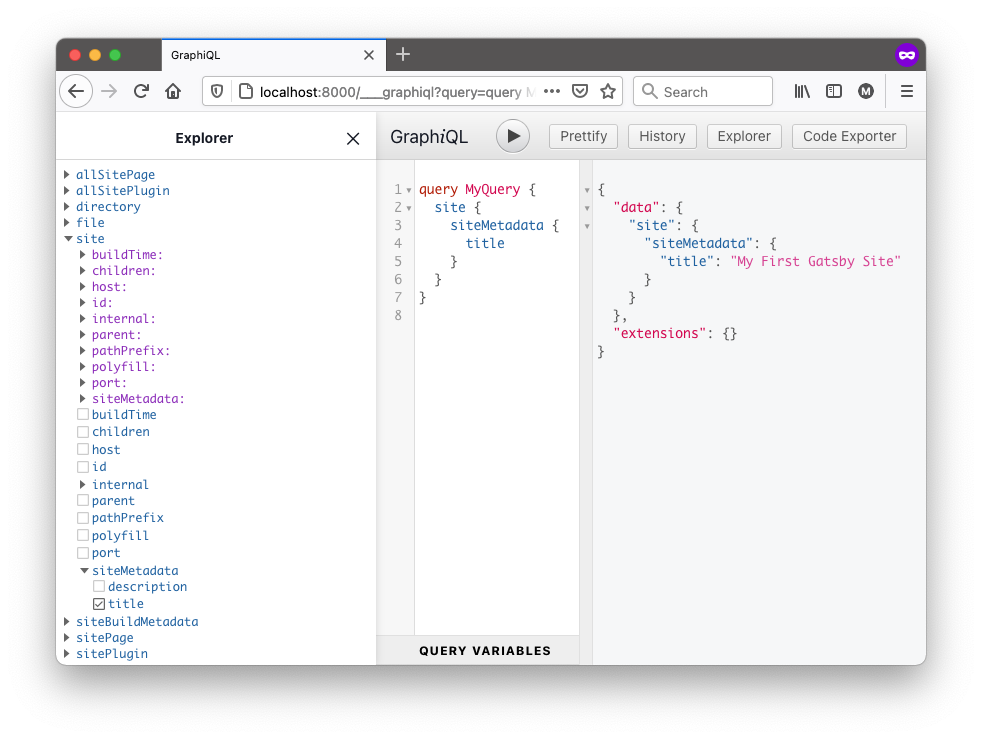
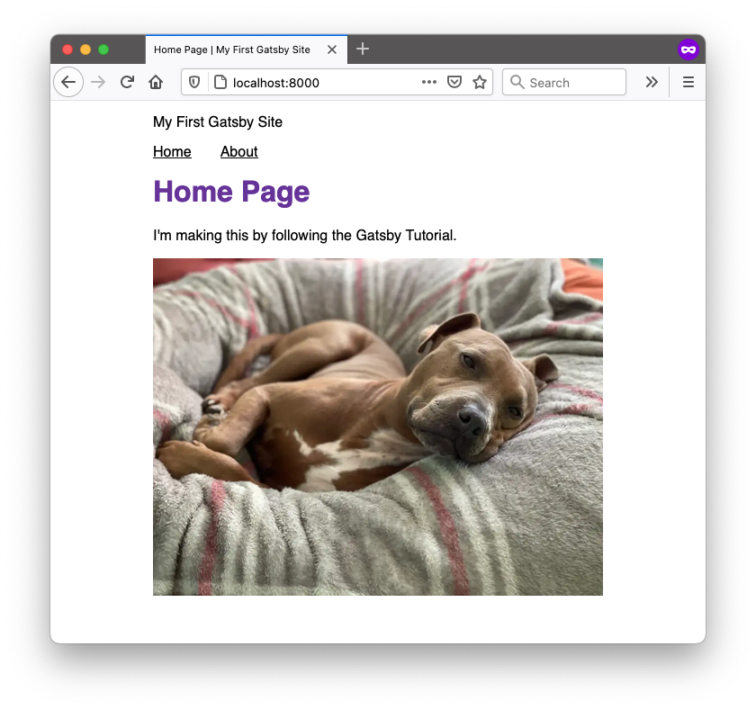
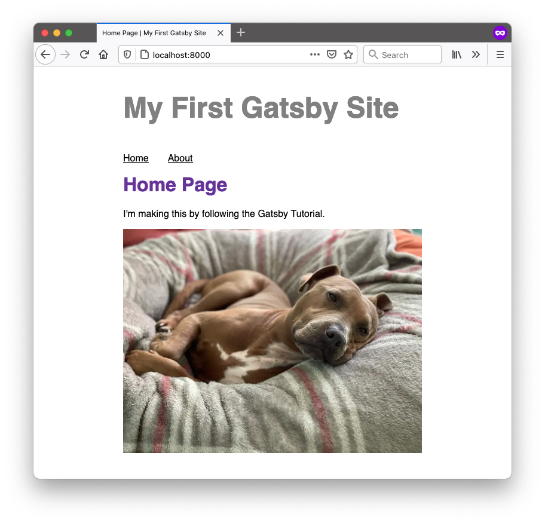
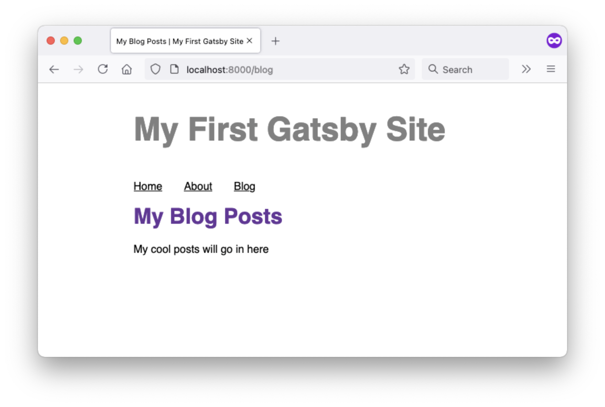
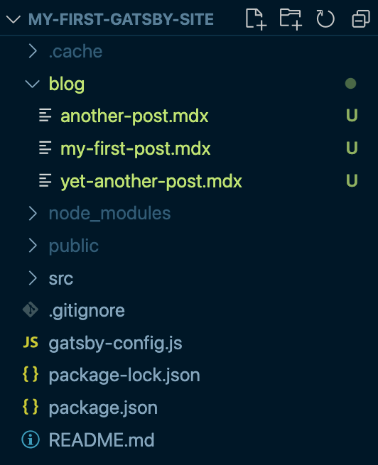

import { Announcement, Notification, LinkButton } from 'gatsby-interface'
import Collapsible from '@components/collapsible'
import { MdInfo } from 'react-icons/md'

<Notification
  Icon={MdInfo}
  tone="WARNING"
  variant="SECONDARY"
  content={
    <div>
      <p>
        <strong>Note:</strong> We{"'"}re still working on updating this Tutorial to use Gatsby v3.
        The first few parts of the new Tutorial have been released here, and subsequent parts
        will be added as we finish them.
      </p>
      <p style={{ marginBottom: 0 }}>
        If you{"'"}re looking for a full experience in the meantime, you can check out the (slightly outdated){" "}
        <a href="https://v2.gatsbyjs.com/docs/tutorial/">
          <strong>Gatsby v2 Tutorial</strong>
        </a>
        .
      </p>
    </div>
  }
/>

## Introduction

Parts 4 and 5 of this Tutorial are all about data!

So far, you've been writing text and adding images directly in your React components. That's an excellent way to build many websites! But often it's easier to create and maintain data somewhere else - like a folder of Markdown files or a content management system (CMS) - and then pull it into your components as needed. That way, you can make updates to your content without affecting the code for your site.

Conveniently, Gatsby has a powerful feature called the **data layer** that you can use to pull data into your site from anywhere. Want to keep your blog posts in WordPress, your store products in Shopify, and your user data in Airtable? No problem! With Gatsby's data layer, you can combine data from multiple sources, which lets you choose the best platform for each type of data.

<Announcement style={{marginBottom: "1.5rem"}}>

Gatsby's data layer is powered by a technology called **GraphQL**. GraphQL is a query language with a special syntax that lets you ask for the data you need inside a component.

In this Tutorial, we'll teach you all the GraphQL you'll need to know to build your first Gatsby site. Interested in learning more? [How To GraphQL](https://www.howtographql.com/) is a free tutorial that teaches you the fundamentals.

</Announcement>

In this part of the Tutorial, you'll learn about how to add data to Gatsby's data layer and how to pull that data into your React components.

By the end of this part of the Tutorial, you will be able to:

- Use **GraphiQL** to explore the data in the data layer and build your own GraphQL queries.
- Use the **`useStaticQuery`** hook to pull data into a "building-block" component.
- Use the **`gatsby-source-filesystem`** plugin to pull data into your site from your computer's filesystem.
- Create a **page query** to pull data into a page component.

## Meet Gatsby's GraphQL data layer

Gatsby has its own [GraphQL](https://graphql.org/) data layer where it keeps all the data for your site. But how does it work under the hood?

First, your data is stored in one or more **sources**. That source might be a folder on your computer's filesystem, a content management system (CMS) like WordPress, or a database. You might even have multiple data sources!

How do you get from its source into the data layer? By adding a type of plugin to your site called a **source plugin**. Each source plugin is designed to communicate with a specific source. When you build your site, each source plugin pulls data from its particular source and adds it to the GraphQL data layer for your site.

<Announcement style={{marginBottom: "1.5rem"}}>

**Tip:** Curious what source plugins are in the [Plugin Library](/plugins/)? You can identify source plugins by their name: they typically start with `gatsby-source-`.

For example, a few popular source plugins are `gatsby-source-filesystem` and `gatsby-source-contentful`.

</Announcement>

How do you get data back out of the data layer? You can write **GraphQL queries** inside of your components to pull out the data you want to use in your site. When you build your site, Gatsby will find all the GraphQL queries in your components, run them, and put the resulting data in your component.





## Use GraphiQL to explore the data layer and write GraphQL queries

How do you know what data is in your site's GraphQL data layer? When you start the local development server for your site, Gatsby automatically creates a special endpoint that lets you use an in-browser tool called **GraphiQL**. With GraphiQL, you can explore your site's data and build GraphQL queries.

Follow the steps below to open the GraphiQL interface:

1. Start up your local development server by running `gatsby develop`.
1. In a web browser, go to `http://localhost:8000/___graphql`. (That's three underscores in the URL.)



<Collapsible
  summary={<h3>A closer look at the GraphiQL interface</h3>}
>

There are three main sections of the GraphiQL interface:

* **Explorer:** This is the section on the left, which shows you all the different kinds of data you can request in a GraphQL query.
    * You can toggle the dropdowns to expand the different fields and see what kinds of data is available in the data layer.
    * The blue items correspond to the different data fields you can query for.
    * The purple items accept additional arguments that you can use to filter down the data returned in the response.
* **Query Editor:** This is the middle section, which you can use to write out a query to test.
    * You can add fields to your query by checking the boxes for different fields in the Explorer pane. Or, if you'd prefer, you can type the fields directly into the Query Editor. (You can press `Ctrl + Space` on your keyboard to bring up an autocompletion box that shows what fields are available to you.)
    * To execute the query in the Query Editor, click the "Execute Query" button (it looks like a "play" button triangle) at the top of the page.
* **Result Window:** This is the section on the right, which shows you the result of running the query in the Query Editor.

</Collapsible>

GraphiQL is a helpful tool for testing out your GraphQL queries before you add them to your code. That way, you can make sure your queries always respond with the data you expect.

Try creating and running a few queries by doing the following:

1. Check a few of the blue fields in the Explorer pane. Note how checking the box for a field adds it to the query in the Query Editor.

1. Click the button at the top of the page (that looks like a "play" button) to execute the query. Look at the data returned in the Result window.

In the next section, you'll learn more about how to use specific fields. For now, take a minute or two to explore the different fields. What kinds of data is already available to you in the data layer?

## Queries in building-block components: Pull the site title into the `Layout` component

Now that you've seen the general process for how data works in your Gatsby site, it's time to try it out yourself.

The process for using GraphQL queries in your components looks slightly different depending on whether it's a page component or a building-block component.

In this first section, you'll start by pulling data into a building-block component. To do that, you'll update your `Layout` component to pull in the title of your site.

### Task: Use GraphiQL to build the query

Look in your `gatsby-config.js` file. There's already some information there about your site, in the `siteMetadata` object.

```js:title=gatsby-config.js
module.exports = {
  // highlight-start
  siteMetadata: {
    title: "My First Gatsby Site",
  },
  // highlight-end
  plugins: [
    // ...
  ],
};
```

This data got added to your `gatsby-config.js` file automatically when you used the `gatsby new` command in Part 1. It also gets pulled into the GraphQL data layer automatically, so you don't need a source plugin for this first section.

Since you don't need to set up a source plugin, you can jump straight into GraphiQL to build your GraphQL query:

1. In your web browser, go to `localhost:8000/___graphiql` to see the GraphiQL interface.
2. In the Explorer pane, open the dropdown for the `site` field.
3. Within the `site` field, open the dropdown for the `siteMetadata` field. This corresponds to the `siteMetadata` object in your `gatsby-config.js` file.
4. Within `siteMetadata`, check the box next to the `title` field. The query in your query editor should look like this:
```graphql
query MyQuery {
  site {
    siteMetadata {
      title
    }
  }
}
```
5. Click the button to run the query. The response in the Result Window should look something like the object below. Notice how the structure of the response matches the structure of the fields in the query.
```json
{
  "data": {
    "site": {
      "siteMetadata": {
        "title": "My First Gatsby Site"
      }
    }
  },
  "extensions": {}
}
```

Try changing the value of the `title` property in your `gatsby-config.js` file. When you save the file, your site should rebuild, and when it's finished you can re-run the query in GraphiQL and see your updated data.

### Task: Use `useStaticQuery` to pull the site title into the `Layout` component

Now that you have a GraphQL query that returns the data you're looking for, how do you use that query in your React components?

To pull data into a building-block component, you'll use a pre-defined function from Gatsby called `useStaticQuery`.

<Collapsible
  summary={<h4>Key Gatsby Concept: Pulling data into building-block components with <code>useStaticQuery</code></h4>}
>

The Gatsby package has a special pre-defined hook that lets you add GraphQL queries to your building-block components: `useStaticQuery`.

`useStaticQuery` takes one parameter: a templated string of the GraphQL query you want to run. It returns the requested data, which you can store in a variable and then use throughout your component.

Here's a brief outline of the process for adding `useStaticQuery` to pull data into your building-block components:

1. Import the `useStaticQuery` hook and the `graphql` tag from the `gatsby` package.
    * The `graphql` tag is something called a [tagged template literal](https://developer.mozilla.org/en-US/docs/Web/JavaScript/Reference/Template_literals#tagged_templates). Basically, the `graphql` tag tells Gatsby that the string following it is a GraphQL query, so then Gatsby can parse and run it.
    ```js
    import { useStaticQuery, graphql } from 'gatsby'
    ```
2. Inside your component, call `useStaticQuery` using the `graphql` template tag and your query from GraphiQL. Store the results in a new variable so that you can use it later in your component.
    ```js
    const data = useStaticQuery(graphql`
      // Copy-paste your query from GraphiQL here, and delete the query name "MyQuery"
    `)
    ```
3. Use the data in your component by using the dot operator (`.`) to access the appropriate field off the response.

Here's a small example to show what this process looks like in practice:

```js:title=src/components/header.js
import * as React from 'react'

// highlight-start
// Step 1: Import the useStaticQuery hook and graphql tag
import { useStaticQuery, graphql } from 'gatsby'
// highlight-end

const Header = () => {
  // highlight-start
  /* Step 2: Use the useStaticQuery hook and
    graphql tag to query for data
    (The query gets run at build time) */
  const data = useStaticQuery(graphql`
    query {
      site {
        siteMetadata {
          title
        }
      }
    }
  `)
  // highlight-end

  return (
    <header>
      {/* highlight-start */}
      {/* Step 3: Use the data in your component */}
      <h1>{ data.site.siteMetadata.title }</h1>
      {/* highlight-end */}
    </header>
  )
}

export default Header
```

<Announcement style={{marginBottom: "1.5rem"}}>

**Note:** You can only call `useStaticQuery` once per file. If you need multiple fields, you can add them all into a single query.

For example, if you need data from both the `site` field and the `siteBuildMetadata` field, you could make the following call to `useStaticQuery`:

```js
const data = useStaticQuery(graphql`
  query HeaderQuery {
    site {
      siteMetadata {
        title
      }
    }
    siteBuildMetadata {
      buildTime
    }
  }
`)
```
</Announcement>

</Collapsible>

Follow the steps below to use `useStaticQuery` to pull in the site title from your site metadata into your `Layout` component.

1. Import the `useStaticQuery` function and the `graphql` tag from the Gatsby package.

```js:title=src/components/layout.js
import * as React from 'react'
import { Link, useStaticQuery, graphql } from 'gatsby' // highlight-line
import {
  container,
  heading,
  navLinks,
  navLinkItem,
  navLinkText
} from './layout.module.css'

const Layout = ({ pageTitle, children }) => {
  return (
    // ...
  )
}

export default Layout
```

2. Call `useStaticQuery` and pass it the query you created in GraphiQL. Be sure to use the `graphql` tag so Gatsby knows that the string you're passing in is a GraphQL query. Store the return value from `useStaticQuery` in a variable.

<Announcement style={{marginBottom: "1.5rem"}}>

**Note:** By default, the query you build in GraphiQL will have a query name, like `MyQuery`. You may see an error if you have more than one query with the same name, so after you copy your query over from GraphiQL to your component, delete the name (as in the code example below).

</Announcement>

```js:title=src/components/layout.js
import * as React from 'react'
import { Link, useStaticQuery, graphql } from 'gatsby'
import {
  container,
  heading,
  navLinks,
  navLinkItem,
  navLinkText
} from './layout.module.css'

const Layout = ({ pageTitle, children }) => {
  // highlight-start
  const data = useStaticQuery(graphql`
    query {
      site {
        siteMetadata {
          title
        }
      }
    }  
  `)
  // highlight-end
  
  return (
    // ...
  )
}

export default Layout
```

<Announcement style={{marginBottom: "1.5rem"}}>

**Note:** If you add a line to print out the value of `data` to the console, you'll see that the response has a slightly different structure from what it looked like in GraphiQL's Result Window. Specifically, `data` will only contain the object that matches the `data` field in the Result Window.

So if your GraphiQL Result Window showed this:

```json
{
  "data": {
    "site": {
      "siteMetadata": {
        "title": "My First Gatsby Site"
      }
    }
  },
  "extensions": {}
}
```

then your `data` variable will have the following structure:

```js
{
  "site": {
    "siteMetadata": {
      "title": "My First Gatsby Site"
    }
  }
}
```

</Announcement>

3. Now that you have a variable with the results of your query, you can render the title of your site in the JSX for your `Layout` component. To access the site title, use the JavaScript dot operator (`.`) to get the value of `data.site.siteMetadata.title`. Add it so it appears in both the browser tab and at the top of your page content.

```js:title=src/components/layout.js
import * as React from 'react'
import { Link, useStaticQuery, graphql } from 'gatsby'
import {
  container,
  heading,
  navLinks,
  navLinkItem,
  navLinkText
} from './layout.module.css'

const Layout = ({ pageTitle, children }) => {
  const data = useStaticQuery(graphql`
    query {
      site {
        siteMetadata {
          title
        }
      }
    }  
  `)
  
  return (
    <main className={container}>
      {/* highlight-start */}
      <title>{pageTitle} | {data.site.siteMetadata.title}</title>
      <p>{data.site.siteMetadata.title}</p>
      {/* highlight-end */}
      <nav>
        <ul className={navLinks}>
          <li className={navLinkItem}>
            <Link to="/" className={navLinkText}>
              Home
            </Link>
          </li>
          <li className={navLinkItem}>
            <Link to="/about" className={navLinkText}>
              About
            </Link>
          </li>
        </ul>
      </nav>
      <h1 className={heading}>{pageTitle}</h1>
      {children}
    </main>
  )
}

export default Layout
```



4. Now that the site title is showing up on the page, it's time to add some style! Define some styles for the site title below the existing styles in your `layout.module.css` file.

```css:title=src/components/layout.module.css
/* ... your existing styles */

.site-title {
  font-size: 3rem;
  color: gray;
  font-weight: 700;
}
```

5. Import your new styles into your `Layout` component and apply them to the site title paragraph you added.

```js:title=src/components/layout.js
import * as React from 'react'
import { Link, useStaticQuery, graphql } from 'gatsby'
import {
  container,
  heading,
  navLinks,
  navLinkItem,
  navLinkText,
  siteTitle, // highlight-line
} from './layout.module.css'

const Layout = ({ pageTitle, children }) => {
  const data = useStaticQuery(graphql`
    query {
      site {
        siteMetadata {
          title
        }
      }
    }  
  `)
  
  return (
    <main className={container}>
      <title>{pageTitle} | {data.site.siteMetadata.title}</title>
      {/* highlight-next-line */}
      <p className={siteTitle}>{data.site.siteMetadata.title}</p>
      <nav>
        <ul className={navLinks}>
          <li className={navLinkItem}>
            <Link to="/" className={navLinkText}>
              Home
            </Link>
          </li>
          <li className={navLinkItem}>
            <Link to="/about" className={navLinkText}>
              About
            </Link>
          </li>
        </ul>
      </nav>
      <h1 className={heading}>{pageTitle}</h1>
      {children}
    </main>
  )
}

export default Layout
```

When your browser reloads, you should see your new styles applied to your site title.



Congratulations, you've just used GraphQL to pull data into your site! Try changing the site title in your `gatsby-config.js` file and see your site update in the browser.

## Queries in page components: Create a blog page with a list of post filenames

So far, your site has a few static landing pages: the Home page and the About page. The next step is to build out the actual blog page!

Eventually, your blog page will link to separate pages for each of your posts. But there's a lot to learn to achieve that, so you'll be working up to that goal over the next few parts of the Tutorial (Parts 4, 5, and 6).

In this part, you'll create a blog page that lists the filenames for your posts.


### Task: Create a new blog page

Start by setting up the skeleton for your new blog page component.

1. Create a new file: `src/pages/blog.js`. Define and export a new page component for your blog page. Use your existing `Layout` component to add some basic structure.

```js:title=src/pages/blog.js
import * as React from 'react'
import Layout from '../components/layout'

const BlogPage = () => {
  return (
    <Layout pageTitle="My Blog Posts">
      <p>My cool posts will go in here</p>
    </Layout>
  )
}

export default BlogPage
```

2. Add a link to your new blog page to the navigation bar in your `Layout` component:

```js:title=src/components/layout.js
// ... import statements

const Layout = ({ pageTitle, children }) => {
  const data = useStaticQuery(graphql`
    query {
      site {
        siteMetadata {
          title
        }
      }
    }
  `)

  return (
    <main className={container}>
      <title>{pageTitle} | {data.site.siteMetadata.title}</title>
      <p className={siteTitle}>{data.site.siteMetadata.title}</p>
      <nav>
        <ul className={navLinks}>
          <li className={navLinkItem}>
            <Link to="/" className={navLinkText}>
              Home
            </Link>
          </li>
          <li className={navLinkItem}>
            <Link to="/about" className={navLinkText}>
              About
            </Link>
          </li>
          {/* highlight-start */}
          <li className={navLinkItem}>
            <Link to="/blog" className={navLinkText}>
              Blog
            </Link>
          </li>
          {/* highlight-end */}
        </ul>
      </nav>
      <h1 className={heading}>{pageTitle}</h1>
      {children}
    </main>
  )
}

export default Layout
```

3. Now, if you go to `localhost:8000/blog` in your web browser, you should see your new blog page skeleton, and there should be a link to the blog page in your navigation bar.



### Task: Create some MDX blog posts

Now that you have a blog page, it's time to create some blog posts! For your site, you'll store each blog post as a separate file inside of a folder in your project.

1. Create a new directory called `blog` at the top level of your project folder.

2. Create three new files in the `blog` directory: one for each post. It doesn't matter what you name them, as long as they end with the `.mdx` extension. (You'll learn more about the powers of MDX in Part 5.) You can leave the files empty for now.



### Task: Use GraphiQL to build the query

Now that you have some posts saved to your local filesystem, it's time to pull those files into the Gatsby data layer. To do that, you'll use a plugin called `gatsby-source-filesystem`.

<Announcement style={{marginBottom: "1.5rem"}}>

**Note:** Remember the process for adding a plugin to your site from [Part 3](/docs/tutorial/part-3)? The first step was to **install** the plugin.

If you've been following along from the beginning, you should already have installed `gatsby-source-filesystem` in Part 3 (because you needed it for adding static images with `gatsby-plugin-image`).

Otherwise, you can install the plugin by running the following command from the command line:

```shell
npm install gatsby-source-filesystem
```

</Announcement>

1. Configure `gatsby-source-filesystem` in your `gatsby-config.js` file. Since `gatsby-source-filesystem` requires some additional configuration options, you'll use a configuration object instead of a string.

```js:title=gatsby-config.js
module.exports = {
  siteMetadata: {
    title: "My First Gatsby Site",
  },
  plugins: [
    "gatsby-plugin-gatsby-cloud",
    "gatsby-plugin-image",
    "gatsby-plugin-sharp",
    // highlight-start
    {
      resolve: "gatsby-source-filesystem",
      options: {
        name: `blog`,
        path: `${__dirname}/blog`,
      }
    },
    // highlight-end
  ],
};
```

<Announcement style={{ marginBottom: "1.5rem" }}>

**A closer look at the configuration options:**

When your site builds, `gatsby-source-filesystem` adds all the files in folder specified by the `path` option to the data layer.

The `name` option in the configuration object gets set to the `sourceInstanceName` field for each file. This comes in handy when you want to source files from multiple folders. By giving each folder a different `name` option, you can build GraphQL queries that filter down to only a particular folder.

</Announcement>

2. Restart your local development server to make sure it picks up the configuration changes and adds your files to the data layer.

3. In GraphiQL, try exploring the different fields within `allFile` to see what sorts of data you get back. Then build a query using the `allFile` field to get the name of all the files in your blog folder:

```graphql
query MyQuery {
  allFile {
    nodes {
      name
    }
  }
}
```

4. Run the query in GraphiQL. Your response in the Result Window should look something like the object below:

```json
{
  "data": {
    "allFile": {
      "nodes": [
        {
          "name": "my-first-post"
        },
        {
          "name": "another-post"
        },
        {
          "name": "yet-another-post"
        }
      ]
    }
  },
  "extensions": {}
}
```

### Task: Use a page query to pull the list of post filenames into your blog page

Now that you've built a GraphQL query that returns a list of your post filenames, it's time to render that data in your blog page!

Using GraphQL queries in page components uses a slightly different syntax from queries in building-block components. In page components, you use **page queries**.

<Collapsible
  summary={<h4>Key Gatsby Concept: Pulling data into page components with page queries</h4>}
>

The process for making a query in a page component looks slightly different from `useStaticQuery`:

1. Import the `graphql` tag from the Gatsby package.
2. Export a variable that stores a templated string with the GraphQL query you want to run.
    * When your site gets built, Gatsby will run your page query and pass the resulting data into your page component as a prop called `data`.
    * Your page query needs to be defined outside of your page component. (With `useStaticQuery`, your query was defined inside your component.)
3. Use the `data` prop in your page component, as needed. You can use the JavaScript dot operator (`.`) to choose fields off of the `data` prop.

Here's a small example to show what this process looks like in practice:

```javascript
import * as React from 'react'

// Step 1: Import the graphql tag
import { graphql } from 'gatsby'

const HomePage = ({ data }) => {
  return (
    <p>
      { /* Step 3: Use the data in your component*/ }
      { data.site.siteMetadata.description }
    </p>
  )
}

// Step 2: Export a page query
export const query = graphql`
  query {
    site {
      siteMetadata {
        description
      }
    }
  }
`

export default HomePage
```

</Collapsible>

Follow the steps below to add a list of post filenames to your blog page.

1. Import the `graphql` tag from the Gatsby package.

```js:title=src/pages/blog.js
import * as React from 'react'
import { graphql } from 'gatsby' // highlight-line
import Layout from '../components/layout'

const BlogPage = () => {
  return (
    <Layout pageTitle="My Blog Posts">
      <p>My cool posts will go in here</p>
    </Layout>
  )
}

export default BlogPage
```

2. Define and export your page query. Copy over the query you built in GraphiQL.

<Announcement style={{marginBottom: "1.5rem"}}>

**Note:** By default, the query you build in GraphiQL will have a query name, like `MyQuery`. You may see an error if you have more than one query with the same name, so after you copy your query over from GraphiQL to your component, delete the name (as in the code example below).

</Announcement>

```js:title=src/pages/blog.js
import * as React from 'react'
import { graphql } from 'gatsby'
import Layout from '../components/layout'

const BlogPage = () => {
  return (
    <Layout pageTitle="My Blog Posts">
      <p>My cool posts will go in here</p>
    </Layout>
  )
}

// highlight-start
export const query = graphql`
  query {
    allFile {
      nodes {
        name
      }
    }
  }
`
// highlight-end

export default BlogPage
```

3. Add in `data` prop to the function definition. Then map over the `nodes` array and render the filename for each of your posts.

```js:title=src/pages/blog.js
import * as React from 'react'
import { graphql } from 'gatsby'
import Layout from '../components/layout'

const BlogPage = ({ data }) => { // highlight-line
  return (
    <Layout pageTitle="My Blog Posts">
      {/* highlight-start */}
      <ul>
      {
        data.allFile.nodes.map(node => (
          <li key={node.name}>
            {node.name}
          </li>
        ))
      }
      </ul>
      {/* highlight-end */}
    </Layout>
  )
}

export const query = graphql`
  query {
    allFile {
      nodes {
        name
      }
    }
  }
`

export default BlogPage
```

<Announcement style={{marginBottom: "1.5rem"}}>

**Syntax Hint:** In JavaScript, arrays have a built-in [`.map()` method](https://developer.mozilla.org/en-US/docs/Web/JavaScript/Reference/Global_Objects/Array/map), which you can use to iterate over the elements in the array.

`.map()` takes in a function, which it runs on each element in the array. In the code block above, you're using `.map()` to loop over each of the nodes in `data.allFile.nodes` and return a React element that wraps the node's `name` in an `<li>` element.

In React, when you use the `.map()` method to render a list of elements, you should give each element in the list a unique `key` prop. This helps React keep track of what values have changed and need to be rerendered. For more on rendering lists in React, check out the [React Docs: Lists and Keys](https://reactjs.org/docs/lists-and-keys.html).

</Announcement>

4. Now, when you look at your blog page in a web browser, you should see a list with the filenames for each of your posts:


Good job! You've finished the first step of your new blog page.

You won't be able to render the contents of your posts just yet, since your site doesn't know how to process MDX. You'll fix that in the next part of the Tutorial!

## Summary

Take a moment to think back on what you've learned so far. Challenge yourself to answer the following questions from memory:

* How do you get data into the data layer?
* How can you see what data is in the data layer?
* How do you get data out of the data layer?
* What are the differences between a page query and `useStaticQuery`? How would you decide which one to use?

<Announcement style={{marginBottom: "1.5rem"}}>

**Ship It!** 🚀

Before you move on, deploy your changes to your live site on Gatsby Cloud so that you can share your progress!

First, run the following commands in a terminal to push your changes to your GitHub repository. (Make sure you're in the top-level directory for your Gatsby site!)

```shell
git add .
git commit -m "Finished Gatsby Tutorial Part 4"
git push
```

Once your changes have been pushed to GitHub, Gatsby Cloud should notice the update and rebuild and deploy the latest version of your site. (It may take a few minutes for your changes to be reflected on the live site. Watch your build's progress from your [Gatsby Cloud dashboard](/dashboard/?utm_campaign=tutorial).)

</Announcement>

### Key takeaways

* Source plugins pull data from their original location into the Gatsby GraphQL data layer.
* You can use the GraphiQL endpoint (`localhost:8000/___graphql`) to explore the data in the data layer and design GraphQL queries.
* You can write GraphQL queries to pull data out of the data layer and into your React components.
    * To pull data into a "building block" component, use the `useStaticQuery` hook.
    * To pull data into a page component, use a page query.

<Collapsible
  summary={<h2>Key Gatsby Concept: General process for using data in your site</h2>}
>

1. Add a source plugin to add data into the GraphQL data layer.
1. Use GraphiQL to design a query that responds with the data you want from the data layer.
1. Add the query into your component.
    * Use page queries for page components.
    * Use `useStaticQuery` for "building block" components.
1. Use the data from the response in your component.

</Collapsible>

<Announcement style={{marginBottom: "1.5rem"}}>

**Share Your Feedback!**

Our goal is for this Tutorial to be helpful and easy to follow. We'd love to hear your feedback about what you liked or didn't like about this part of the Tutorial.

Use the "Was this doc helpful to you?" form at the bottom of this page to let us know what worked well and what we can improve.

</Announcement>

### What's coming next?

In Part 5, you'll add some content to your blog posts using a special format called MDX. You'll also learn about transformer plugins, which you can use to convert data in your data layer from one type to another.

<LinkButton
  to="/docs/tutorial/part-5/"
  rightIcon={<MdArrowForward />}
  variant="SECONDARY"
>
  Continue to Part 5
</LinkButton>
